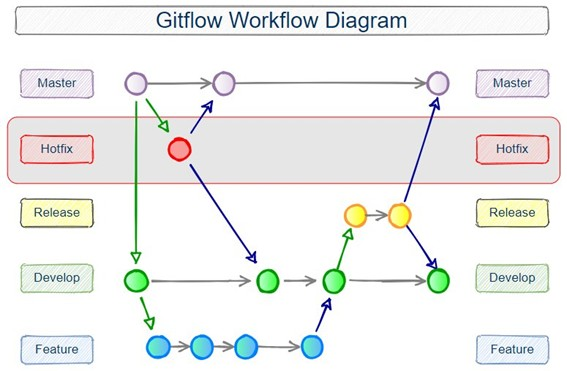
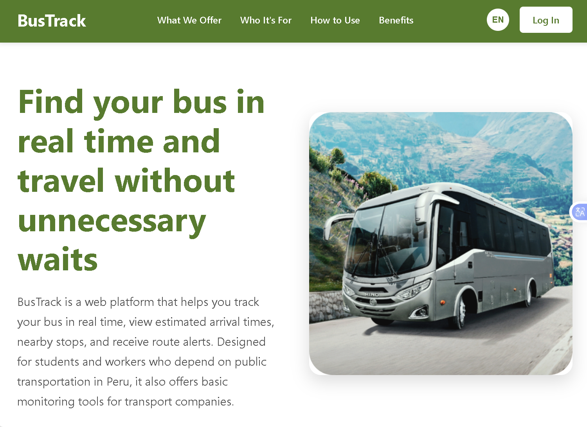
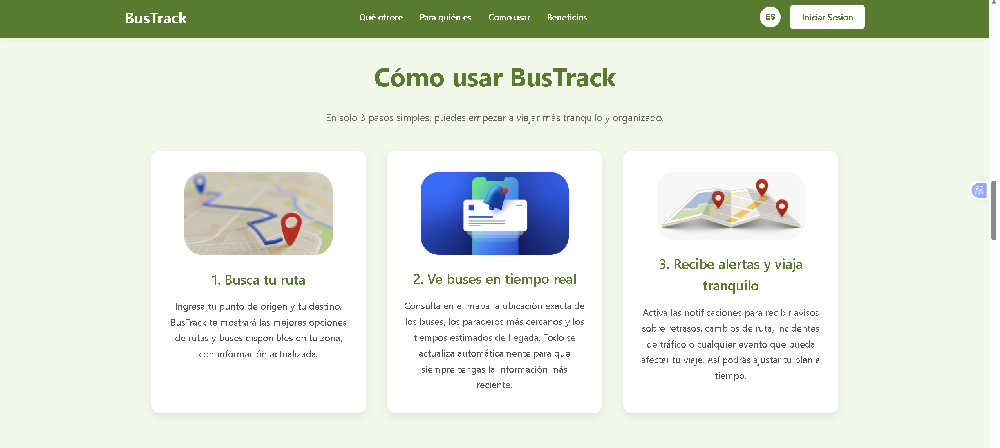
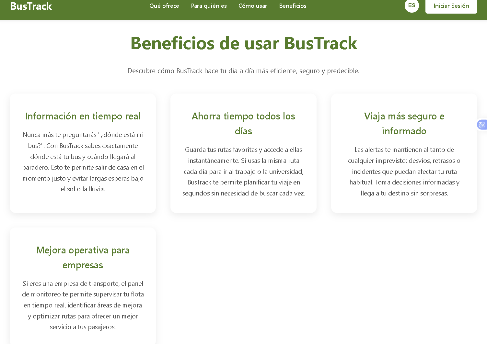
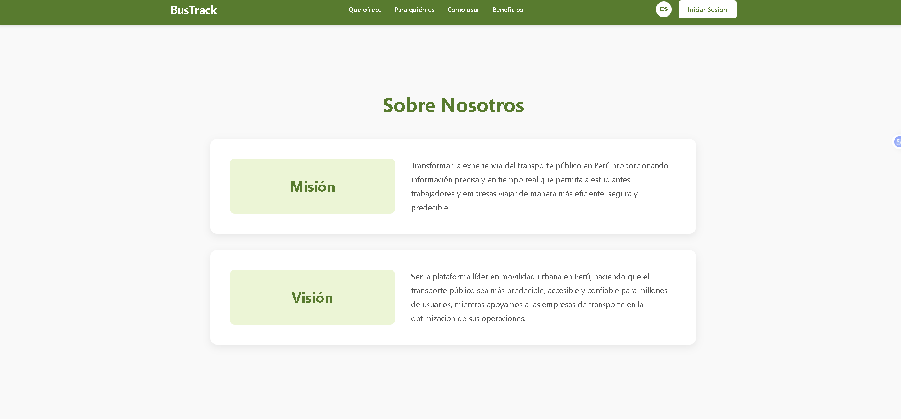
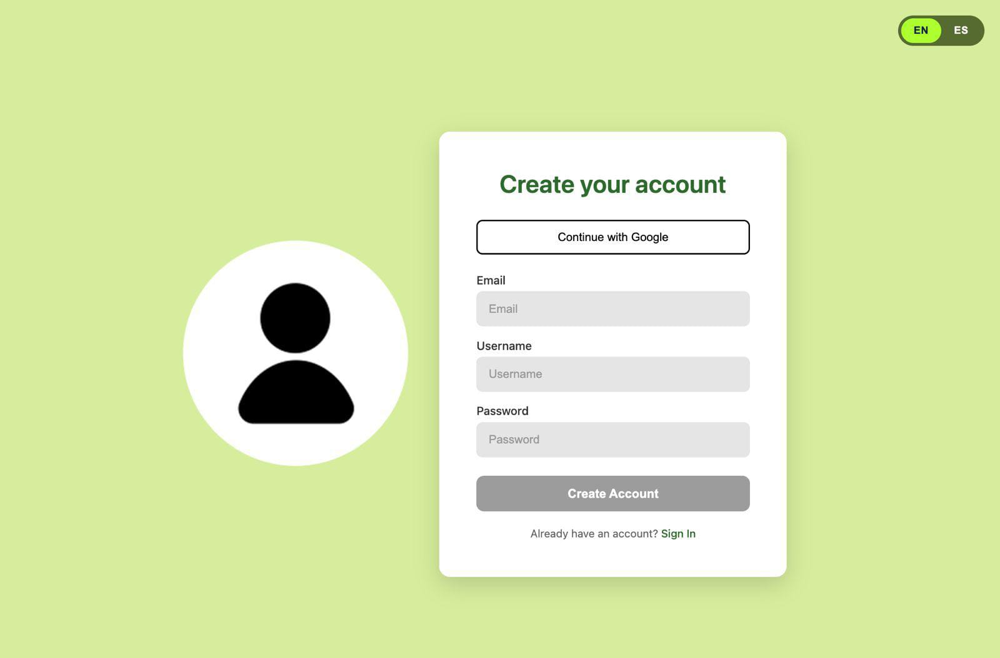
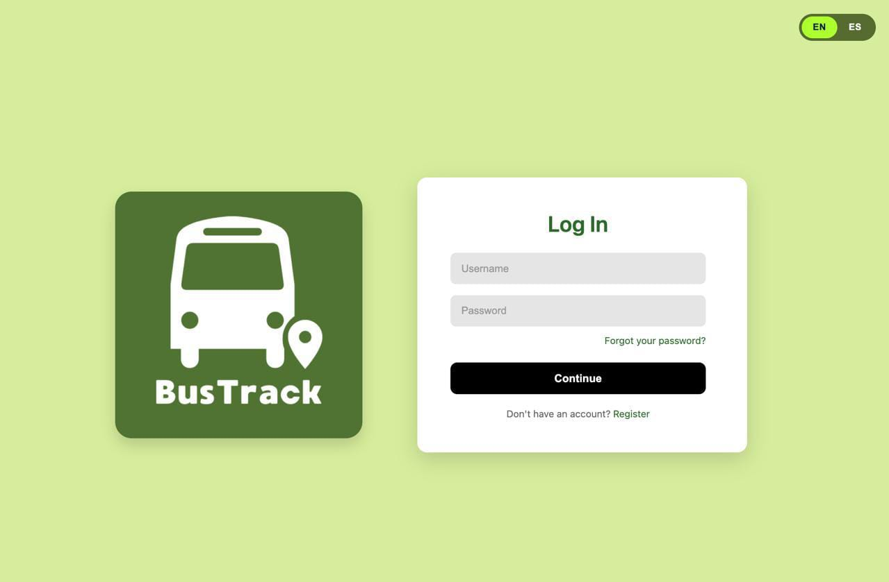
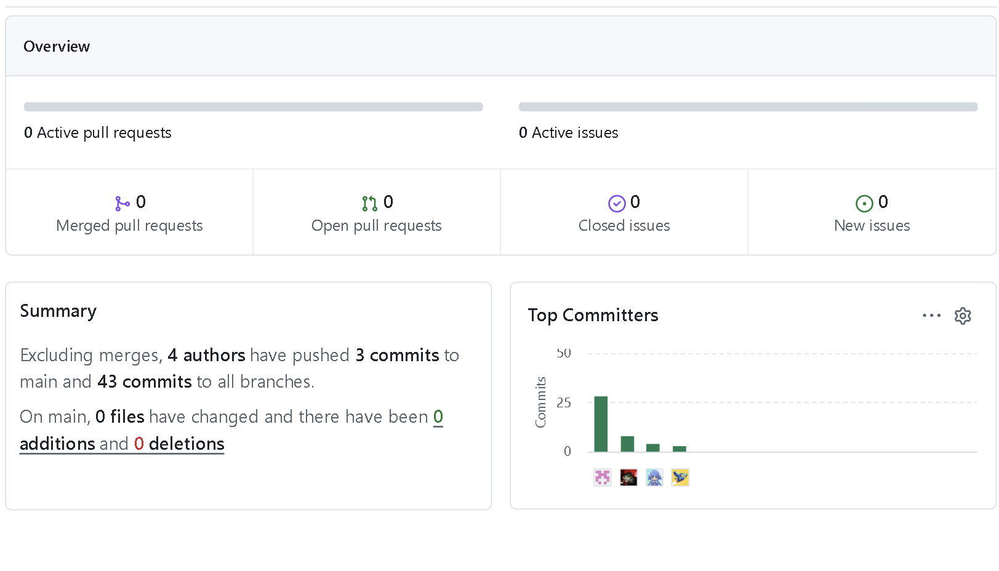

<div align="center">
  
 

</div>

<h1 align="center"> Universidad Peruana de Ciencias Aplicadas <h1 align="center">

<h1 align="center"> Carrera: Ingeniería de Software </h1>

<h1 align="center"> Periodo 2025 - 2 </h1>

<h1 align="center"> Código de curso: 1ASI0730</h1>

<h1 align="center"> Nombre del curso: Aplicaciones Web</h1>

<h1 align="center"> NRC: 7452  </h1>

<h1 align="center"> Docente: Mori Paiva, Hugo Allan </h1>

<h1 align="center"> Informe del Trabajo Final (TF) </h1>

<h3 align="center"> Startup: DaL Company </h3>

<h3 align="center"> Product: BusTrack </h3>

<h3 align="center"> Relación de integrantes: </h3>
<div align="center">

| Member                           |    Code    |
| :------------------------------- | :--------: |
| Fátima Belén Florez Shimabukuro | U202320610 |
| Mathias Andree Cardenas Huaman | U202316353 |
| Elizabeth Noelia Apaza Bocanegra | U20231c197 |
| Diego Andres Avalos Cordova | U202313922 |
| Joaquin Alberto Cuentas Peña | U20201f788 |

</div>

<h3 align="center">Diciembre, 2025</h3>

<br><br>

<h3 align="center">Registro de Versiones del Informe</h3>

<div align="center">

| Versión | Fecha | Autor | Descripción de modificación |
| :-----: | :---: | :---: | :-------------------------- |
|  |  |  |  |
| TF | 28/11 | Andree Cardenas | Sprint 4 | 
| TF | 28/11 | Andree Cardenas | Revision de los anterioires sprint |
| TF | 01/12 | Fátima Florez | Sprint 4 |
| TF | 01/12 | Fátima Florez | Mejorar en el front-end | 
| TF | 02/12 | Fátima Florez | Correción de sprint anterioires | 
| TF | 02/12 | Joaquin Cuentas | Mejorar del front-end |
| TF | 02/12 | Joaquin Cuentas | Mejorar del back-end | 
| TF | 02/12 | Diego Andres | Sprint 4 |
| TF | 04/12 | Diego Andres | Mejorar del front-end | 
| TF | 05/12 | Elizabeth Apaza | Sprint 4 |
| TF | 05/12 | Elizabeth Apaza | Mejorar de sprint anteriores | 
</div>


<br><br>

<div align="center">

# Project Report Collaboration Insights

</div>

| URL de la organización del proyecto |
| ----------------------------------- |
| <https://github.com/2025-2-AplicacionesWeb-DalComp> |

| URL del repositorio del reporte |
| ------------------------------- |
| <https://github.com/2025-2-AplicacionesWeb-DalComp/Project-report-BusTrack-> |

| URL del repositorio de la landing page |
| -------------------------------------- |
| <https://github.com/2025-2-AplicacionesWeb-DalComp/Landing-page> |

| URL del repositorio del Frontend |
| -------------------------------------- |
| <https://github.com/JoaCUPE/UltimoFront.git> |

| URL del repositorio del Backend |
| -------------------------------------- |
| <https://github.com/JoaCUPE/Ultimo-Back.git> |

| URL del figma wireframes |
| -------------------------------------- |
| <https://www.figma.com/design/gfihE4UEnoiFtzf54xXuL8/Untitled?node-id=0-1&t=drwWMkwR0WqztaeY-1>|


| URL del despliegue de la landing page |
| -------------------------------------- |
| <https://2025-2-aplicacionesweb-dalcomp.github.io/Landing-page/> |

| URL del despliegue de la página web |
| -------------------------------------- |
| <https://ultimo-front.vercel.app/>   |

| URL del despliegue del backend |
| -------------------------------------- |
| <https://ultimo-back-c3lo.onrender.com/>   |


<br><br>

# Contenido

## Tabla de Contenidos

### [Registro de versiones del informe](#registro-de-versiones-del-informe)

### [Project Report Collaboration Insights](#project-report-collaboration-insights)

### [Contenido](#contenido)

### [Student Outcome](#student-outcome-1)

### [Capítulo I: Introducción](#capítulo-i-introducción-1)

- [1.1. Startup Profile](#11-startup-profile)
  - [1.1.1. Descripción de la Startup](#111-description-de-la-startup)
  - [1.1.2. Perfiles de integrantes del equipo](#112-perfiles-de-integrantes-del-equipo)
- [1.2. Solution Profile](#12-solution-profile)
  - [1.2.1 Antecedentes y problemática](#121-antecedentes-y-problemática)
  - [1.2.2 Lean UX Process](#122-lean-ux-process)
    - [1.2.2.1. Lean UX Problem Statements](#1221-lean-ux-problem-statements)
    - [1.2.2.2. Lean UX Assumptions](#1222-lean-ux-assumptions)
    - [1.2.2.3. Lean UX Hypothesis Statements](#1223-lean-ux-hypothesis-statements)
    - [1.2.2.4. Lean UX Canvas](#1224-lean-ux-canvas)
- [1.3. Segmentos objetivo](#13-segmentos-objetivo)

### [Capítulo II: Requirements Elicitation & Analysis](#capítulo-ii-requirements-elicitation--analysis-1)

- [2.1. Competidores](#21-competidores)
  - [2.1.1. Análisis competitivo](#211-análisis-competitivo)
  - [2.1.2. Estrategias y tácticas frente a competidores](#212-estrategias-y-tácticas-frente-a-competidores)
- [2.2. Entrevistas](#22-entrevistas)
  - [2.2.1. Diseño de entrevistas](#221-diseño-de-entrevistas)
  - [2.2.2. Registro de entrevistas](#222-registro-de-entrevistas)
  - [2.2.3. Análisis de entrevistas](#223-análisis-de-entrevistas)
- [2.3. Needfinding](#23-needfinding)
  - [2.3.1. User Personas](#231-user-personas)
  - [2.3.2. User Task Matrix](#232-user-task-matrix)
  - [2.3.3. User Journey Mapping](#233-user-journey-mapping)
  - [2.3.4. Empathy Mapping](#234-empathy-mapping)
- [2.4. Big Picture Event Storning](#24-big-picture-event-storning)
- [2.5. Ubiquitous Language](#25-ubiquitous-language)
 
### [Capítulo III: Requirements Specification](#capítulo-iii-requirements-specification-1)

- [3.1. To-Be Scenario Mapping](#31-to-be-scenario-mapping)
- [3.1. User Stories](#32-user-stories)
- [3.2. Impact Mapping](#33-impact-mapping)
- [3.3. Product Backlog](#34-product-backlog)

### [Capítulo IV: Product Design](#capítulo-iv-product-design-1)

- [4.1. Style Guidelines](#41-style-guidelines)
  - [4.1.1. General Style Guidelines](#411-general-style-guidelines)
  - [4.1.2. Web Style Guidelines](#412-web-style-guidelines)
- [4.2. Information Architecture](#42-information-architecture)
  - [4.2.1. Organization Systems](#421-organization-systems)
  - [4.2.2. Labeling Systems](#422-labeling-systems)
  - [4.2.3. SEO Tags and Meta Tags](#423-seo-tags-and-meta-tags)
  - [4.2.4. Searching Systems](#424-searching-systems)
  - [4.2.5. Navigation Systems](#425-navigation-systems)
- [4.3. Landing Page UI Design](#43-landing-page-ui-design)
  - [4.3.1. Landing Page Wireframe](#431-landing-page-wireframe)
  - [4.3.2. Landing Page Mock-up](#432-landing-page-mock-up)
- [4.4. Web Applications UX/UI Design](#44-web-applications-uxui-design)
  - [4.4.1. Web Applications Wireframes](#441-web-applications-wireframes)
  - [4.4.2. Web Applications Wireflow Diagrams](#442-web-applications-wireflow-diagrams)
  - [4.4.3. Web Applications Mock-ups](#443-web-applications-mock-ups)
  - [4.4.4. Web Applications User Flow Diagrams](#444-web-applications-user-flow-diagrams)
- [4.5. Web Applications Prototyping](#45-web-applications-prototyping)
- [4.6. Domain-Driven Software Architecture](#46-domain-driven-software-architecture)
  - [4.6.1. Design-Level Event Storming](#461-design-level-event-storming)
  - [4.6.2. Software Architecture Context Diagram](#462-software-architecture-context-diagram)
  - [4.6.3. Software Architecture Container Diagrams](#463-software-architecture-container-diagrams)
  - [4.6.4. Software Architecture Components Diagrams](#464-software-architecture-components-diagrams)
- [4.7. Software Object-Oriented Design](#47-software-object-oriented-design)
  - [4.7.1. Class Diagrams](#471-class-diagrams)
- [4.8. Database Design](#48-database-design)
  - [4.8.1. Database Diagram](#481-database-diagram)

### [Capítulo V: Product Implementation, Validation & Deployment](#capítulo-v-product-implementation-validation--deployment-1)

- [5.1. Software Configuration Management](#51-software-configuration-management)
  - [5.1.1. Software Development Environment Configuration](#511-software-development-environment-configuration)
  - [5.1.2. Source Code Management](#512-source-code-management)
  - [5.1.3. Source Code Style Guide & Conventions](#513-source-code-style-guide--conventions)
  - [5.1.4. Software Deployment Configuration](#514-software-deployment-configuration)
- [5.2. Landing Page, Services & Applications Implementation](#52-landing-page-services--applications-implementation)
  - [5.2.1. Sprint 1](#521-sprint-1)
    - [5.2.1.1. Sprint Planning 1](#5211-sprint-planning-1)
    - [5.2.1.2. Aspect Leaders and Collaborators](#5212-aspect-leaders-and-collaborators)
    - [5.2.1.3. Sprint Backlog 1](#5213-sprint-backlog-1)
    - [5.2.1.4. Development Evidence for Sprint Review](#5214-development-evidence-for-sprint-review)
    - [5.2.1.5. Execution Evidence for Sprint Review](#5215-execution-evidence-for-sprint-review)
    - [5.2.1.6. Services Documentation Evidence for Sprint Review](#5216-services-documentation-evidence-for-sprint-review)
    - [5.2.1.7. Software Deployment Evidence for Sprint Review](#5217-software-deployment-evidence-for-sprint-review)
    - [5.2.1.8. Team Collaboration Insights during Sprint](#5218-team-collaboration-insights-during-sprint)
  - [5.2.2. Sprint 2](#522-sprint-2)
    - [5.2.2.1. Sprint Planning 2](#5221-sprint-planning-2)
    - [5.2.2.2. Aspect Leaders and Collaborators](#5212-aspect-leaders-and-collaborators)
    - [5.2.2.3. Sprint Backlog 2](#5223-sprint-backlog-2)
    - [5.2.2.4. Development Evidence for Sprint Review](#5224-development-evidence-for-sprint-review)
    - [5.2.2.5. Execution Evidence for Sprint Review](#5225-execution-evidence-for-sprint-review)
    - [5.2.2.6. Services Documentation Evidence for Sprint Review](#5226-services-documentation-evidence-for-sprint-review)
    - [5.2.2.7. Software Deployment Evidence for Sprint Review](#5227-software-deployment-evidence-for-sprint-review)
    - [5.2.2.8. Team Collaboration Insights during Sprint](#5228-team-collaboration-insights-during-sprint)
  - [5.2.3. Sprint 3](#523-sprint-3)
    - [5.2.3.1. Sprint Planning 3](#5231-sprint-planning-3)
    - [5.2.3.2. Aspect Leaders and Collaborators.](#5232-aspect-leaders-and-collaborators)
    - [5.2.3.3. Sprint Backlog 3](#5233-sprint-backlog-3)
    - [5.2.3.4. Development Evidence for Sprint Review](#5234-development-evidence-for-sprint-review)
    - [5.2.3.5. Execution Evidence for Sprint Review](#5235-execution-evidence-for-sprint-review)
    - [5.2.3.6. Services Documentation Evidence for Sprint Review](#5236-services-documentation-evidence-for-sprint-review)
    - [5.2.3.7. Software Deployment Evidence for Sprint Review](#5237-software-deployment-evidence-for-sprint-review)
    - [5.2.3.8. Team Collaboration Insights during Sprint](#5238-team-collaboration-insights-during-sprint)
  - [5.2.4. Sprint 4](#524-sprint-4)
    - [5.2.4.1. Sprint Planning 4](#5241-sprint-planning-4)
    - [5.2.4.2. Aspect Leaders and Collaborators.](#5242-aspect-leaders-and-collaborators)
    - [5.2.4.3. Sprint Backlog 4](#5243-sprint-backlog-3)
    - [5.2.4.4. Development Evidence for Sprint Review](#5244-development-evidence-for-sprint-review)
    - [5.2.4.5. Execution Evidence for Sprint Review](#5245-execution-evidence-for-sprint-review)
    - [5.2.4.6. Services Documentation Evidence for Sprint Review](#5246-services-documentation-evidence-for-sprint-review)
    - [5.2.4.7. Software Deployment Evidence for Sprint Review](#5247-software-deployment-evidence-for-sprint-review)
    - [5.2.4.8. Team Collaboration Insights during Sprint](#5248-team-collaboration-insights-during-sprint)
- [5.3. Validation Interviews](#53-validation-interviews)
  - [5.3.1. Diseño de entrevistas](#531-diseño-de-entrevistas)
  - [5.3.2. Registro de entrevistas](#532-registro-de-entrevistas)
  - [5.3.3. Evaluaciones según heurísticas](#533-evaluaciones-según-heurísticas)
- [5.4. Video About-The-Product](#54-video-about-the-product)
<br><br>

### *ABET – EAC - Student Outcome 5*

| Criterio específico | Acciones realizadas | Conclusiones |
| :--- | :--- | :--- |
| **Trabaja en equipo para proporcionar liderazgo en forma conjunta** |                                                                       **TB1**<br>                                                                                                                            <br>**Mathias Andree Cardenas Huaman**<br>                                                                                                      Tomé un rol activo en las discusiones del equipo, proponiendo ideas y organizando apartados como las User Stories, Impact Mapping y Product Backlog, que sirvieron como guía de avance. Brindé apoyo a mis compañeros cuando tenían dudas, asegurando que todos pudiéramos contribuir.<br>                                                                                                                                               <br>**Fátima Belén Florez Shimabukuro**<br>                                                                                                    Asumí un rol activo en la construcción de la documentación y diseño del proyecto, elaborando puntos clave como el Startup Profile, Solution Profile, wireframes, mock-ups y wireflows. Además, colaboré en la definición de la arquitectura del sistema mediante diagramas de contexto, contenedores y componentes.<br>                                                                                                                                                                                                                                                                 <br>**Diego Andres Avalos Cordova**<br>                                                                                                          Asumí un rol activo en el análisis del proyecto, desarrollando apartados clave como el estudio de competidores (con sus estrategias y SWOT), la síntesis de entrevistas con resultados porcentuales, y los entregables de la User Task Matrix y el User Journey Mapping. Además, compartí constantemente mis avances para orientar al grupo y facilitar la coordinación.<br>                                                                                                                                                                                                           <br>**Joaquin Alberto Cuentas Peña**<br>                                                                                                       Asumí el rol de líder al crear la organización de BusTrack y los repositorios de trabajo. Brindé indicaciones a mi equipo y viceversa acerca del proceso de gitflow para que todos podamos trabajar en github en equipo.<br>                                                                                                                                                                                                               <br>**Elizabeth Noelia Apaza Bocanegra**<br>                                                                                                Contribuí a la fase de análisis y diseño centrado en el usuario mediante el **Lean UX Process** (Problem Statements, Assumptions, Hypothesis, Lean UX Canvas), la definición de **segmentos objetivo** y el diseño y registro de **entrevistas**. Además, elaboré **User Personas** y **Empathy Maps**, que guiaron al equipo en la comprensión de los usuarios.<br>                                                                                                                                                                                                                              <br>**TP**<br>                                                                                                                                      <br>**Diego Andres Avalos Cordova**<br>                                                                                                       Durante TP1 participé activamente en la planificación y ejecución del Sprint 2. En Inicio de Sesión, apoyé la integración del login con los módulos posteriores, asegurando que la navegación hacia la primera interfaz fuera consistente y funcional. En Primera Interfaz luego del Inicio, colaboré en la interacción de la pantalla inicial con los módulos de rutas y paraderos, verificando que los datos se mostraran correctamente y la navegación fuera intuitiva.<br>                                                                                                                                                                                                                                                                           <br>**Mathias Andree Cardenas Huaman**<br>                                                                                                Implementé estándares de codificación en Vue.js y sistemas de routing e internacionalización que sirvieron como base para las contribuciones de mis compañeros. Promoví un ambiente donde cada miembro podía aportar desde su expertise, tomando decisiones técnicas de forma colaborativa y documentando procesos para asegurar cohesión en el desarrollo.<br>                                                                                                                                                                                                                             <br>**Fátima Belén Florez Shimabukuro**<br>                                                                                                  Demostré aprendizaje ágil implementando login, registro y homepage cumpliendo el backlog y los objetivos del sprint. También apliqué buenas prácticas y convenciones de código, dejando artefactos y documentación claros. Por último iteré con mejora continua corrigiendo errores a partir de observaciones y validaciones del equipo.<br>                                                                                                                                                                                                                                                 <br>**Elizabeth Noelia Apaza Bocanegra**<br>                                                                                               Participé activamente en la planificación y ejecución del Sprint 2, colaborando con mis compañeros para alinear objetivos y distribuir tareas de forma efectiva. En conjunto con Mathias Cárdenas desarrollé el **perfil de usuario**, implementando el **historial de rutas** y el **apartado de notificaciones**. Mantuvimos una comunicación constante para asegurar una integración fluida y cumplir con los objetivos del sprint.<br>                                                                                                                                                    <br>**Joaquin Alberto Cuentas Peña**<br>                                                                                                          Para el presente entregable trabajé de forma grupal y eficiente al ayudar a mi equipo en la creación del repositorio del frontend. Asímismo lo hice para la distribución de las ramas, lo que permitió un excelente resultado final del front.<br>                                                                                                                                                                                                   <br>**TB2**<br>                                                                                                                             <br>**Mathias Andree Cardenas Huaman**<br>                                                                                                        En el Sprint 3 trabajé en el backend junto a Elizabeth, especialmente en la funcionalidad de edición de perfil. Coordiné tareas, revisé la lógica del módulo y apoyé al equipo resolviendo dudas técnicas. También participé en decisiones sobre cómo estructurar e integrar correctamente los *endpoints*.<br>                                                                                                                                                                                                                                                                           <br>**Elizabeth Noelia Apaza Bocanegra**<br>                                                                                                      En el Sprint 3 trabajé en el backend, especialmente en la funcionalidad de edición de perfil junto a mi compañero. Definimos *endpoints*, revisamos la lógica y coordinamos la integración. Además, realicé las entrevistas correspondientes que apoyaron la toma de decisiones del equipo y resolví dudas técnicas para facilitar el avance del resto.<br>                                                                                                                                                                                                                                        <br>**Fátima Belén Florez Shimabukuro**<br>                                                                                                  Durante el desarrollo del Sprint 3 asumí un rol activo en la implementación del módulo de Notifications, coordinando mi avance con los demás integrantes para asegurar su correcta integración con el backend general. Implementé completamente la lógica de creación y consulta de notificaciones, incluyendo comandos, *queries*, repositorios y controladores siguiendo el patrón DDD utilizado por el equipo.<br>                                                                                                                                                             <br>**Joaquin Alberto Cuentas Peña**<br>                                                                                                       Durante el desarrollo del backend de mi proyecto, colaboré activamente con mis compañeros, coordinando tareas, compartiendo decisiones técnicas y asegurando que todos tuvieran la información necesaria para avanzar.<br>                                                                                                                                                                                                                     <br>**Diego Andres Avalos Cordova**<br>                                                                                                             En esta entrega ayudé con la creación del backend, especialmente el apartado de paradas. También actualicé las conclusiones y el Sprint 3.<br>                                                                                                                                                          **TF**<br>                                                                                                                                         <br>**Mathias Andree Cardenas Huaman**<br>                                                                                                        Durante el TF asumí liderazgo compartido en el desarrollo del backend, coordinando la integración final de endpoints y asegurando que las funcionalidades críticas se conectaran correctamente con el frontend. Apoyé al equipo resolviendo bloqueos técnicos y validando la estructura del API para que el despliegue final fuera consistente y mantenible.<br>                                                                                                                                                                                                                                                                                                 <br>**Elizabeth Noelia Apaza Bocanegra**<br>                                                                                                      En el TF participé activamente en la consolidación del backend, revisando endpoints, validaciones y la documentación en Swagger. Aporté en la integración con el frontend y brindé soporte técnico para asegurar que la aplicación funcionara de manera estable durante las pruebas finales del proyecto. <br>                                                                                                                                                                                                                                                                                               <br>**Fátima Belén Florez Shimabukuro**<br>                                                                                                  Durante el TF ejercí un liderazgo compartido en el desarrollo del frontend y la mejora final de la landing page. Implementé interfaces clave, solucioné errores de navegación y aseguré la coherencia visual entre módulos. Coordiné con backend para validar el consumo correcto de servicios y garantizar una experiencia final fluida.<br>                                                                                                                                                                                                                                                                                            <br>**Joaquin Alberto Cuentas Peña**<br>                                                                                                      Durante el TF lideré, junto con Fátima, la consolidación del frontend, organizando las rutas, optimizando la interfaz y corrigiendo inconsistencias visuales. Apoyé en el proceso de despliegue y mantuve comunicación constante con el equipo backend para asegurar compatibilidad entre módulos y una integración final exitosa. <br>                                                                                                                                                                                                                                                                                            <br>**Diego Andres Avalos Cordova**<br>                                                                                                            Mi participación en el TF se centró en apoyar al backend en la integración final de endpoints y en la verificación del funcionamiento de módulos críticos como paraderos y flota. Colaboré en pruebas de extremo a extremo y aporté mejoras que facilitaron la estabilidad de todo el sistema antes del cierre del proyecto.<br>                                                                                                             |                                                                                                                                                                                 **TB1**<br>                                                                                                                                         <br>**Mathias Andree Cardenas Huaman**<br>                                                                                                        Mi participación permitió ejercer un liderazgo compartido, en el que no solo coordiné, sino que también motivé y complementé el trabajo de los demás, fortaleciendo la unión del equipo.<br>                                                                                                                                                                                                                                                           <br>**Fátima Belén Florez Shimabukuro**<br>                                                                                                       Mi participación permitió definir con claridad la idea de la startup y aportar al diseño y arquitectura.<br>                                                                                                                                                                                  <br>**Diego Andres Avalos Cordova**<br>                                                                                                           Mi aporte permitió que el equipo contara con insumos claros y organizados para la toma de decisiones, ejerciendo un liderazgo colaborativo en el que apoyé y motivé a mis compañeros mientras impulsábamos el progreso conjunto.<br>                                                                                                                                                                                                        <br>**Joaquin Alberto Cuentas Peña**<br>                                                                                                          Mi participación permitió que todo el equipo presentara sus avances óptimamente. Además las secciones que yo avancé, como la *landing page*, permitieron que otros integrantes avanzaran oportunamente sus partes.<br>                                                                                                                                                                                                                 <br>**Elizabeth Noelia Apaza Bocanegra**<br>                                                                                                      Mi participación fortaleció el enfoque centrado en el usuario y facilitó la toma de decisiones dentro del equipo, ejerciendo un liderazgo compartido que contribuyó a orientar el proyecto.<br>                                                                                                                                                                                                                                                   <br>**TP**<br>                                                                                                                             <br>**Diego Andres Avalos Cordova**<br>                                                                                                           Mi participación permitió integrar estas funcionalidades de manera eficiente, fortaleciendo el trabajo colaborativo y asegurando que el flujo inicial de la aplicación fuera estable y coherente con el resto del sistema.<br>                                                                                                                                                                                                            <br>**Mathias Andree Cardenas Huaman**<br>                                                                                                 Establecí objetivos claros y planifiqué tareas desglosando *features* complejas en componentes manejables, permitiendo desarrollar simultáneamente el perfil, rutas favoritas y configuración de cuenta. Creé un entorno inclusivo mediante componentes base reutilizables y convenciones de código que aceleraron el desarrollo colectivo. La adaptación continua ante desafíos técnicos y el seguimiento constante de *milestones* nos permitió cumplir metas manteniendo calidad y consistencia en el producto final.<br>                                                                                                                                                                                                                    <br>**Fátima Belén Florez Shimabukuro**<br>Pude ejercer un liderazgo compartido al coordinar tareas y asegurar una distribución equitativa del trabajo. También motivé la participación de todos y mantuve una retroalimentación constante.<br>                                                                                                                                                                                            <br>**Elizabeth Noelia Apaza Bocanegra**<br>                                                                                                      Mi participación permitió integrar las funcionalidades desarrolladas de forma eficiente, fortaleciendo el trabajo colaborativo y aportando al cumplimiento de los objetivos del sprint.<br>                                                                                                                                                                                                                                               <br>**Joaquin Alberto Cuentas Peña**<br>                                                                                                          Mi participación permitió que el resto de integrantes del equipo desarrollaran sus tareas de manera óptima. Al explicar a mis compañeros el funcionamiento de las ramas de git se permitió tener un mejor flujo de trabajo.<br>                                                                                                                                                                                                             <br>**TB2**<br>                                                                                                                           <br>**Mathias Andree Cardenas Huaman**<br>                                                                                                      Este Sprint fortaleció mi liderazgo compartido, permitiéndome guiar y apoyar al equipo en momentos clave para mantener el progreso sin bloqueos.<br>                                                                                                                                                                                                                                                                                     <br>**Elizabeth Noelia Apaza Bocanegra**<br>                                                                                                    Este Sprint fortaleció mi liderazgo compartido, contribuyendo tanto en lo técnico como en la validación del proyecto mediante entrevistas, lo que permitió mantener un trabajo ordenado y alineado.<br>                                                                                                                                                                                                                                       <br>**Fátima Belén Florez Shimabukuro**<br>                                                                                                Contribuí de manera activa a la estructura del backend y aseguré que el módulo de notificaciones se integrara correctamente dentro de la arquitectura general.<br>                                                                                                                                                                                                                                                                  <br>**Joaquin Alberto Cuentas Peña**<br>                                                                                                  Trabajamos arduamente en equipo para completar una primera versión de nuestros *web services*. Todos propusimos ideas y fue gracias a ello que cumplimos con el objetivo.<br><br>**Diego Andres Avalos Cordova**<br>Mi participación permitió integrar estas funcionalidades de manera eficiente, fortaleciendo el trabajo colaborativo y asegurando que el flujo inicial de la aplicación fuera estable y coherente con el resto del sistema.<br>                                                                                                                                                        <br>**TF**<br>                                                                                                                                      <br>**Mathias Andree Cardenas Huaman**<br>                                                                                                      Ayudé a mantener un entorno colaborativo en el equipo al coordinar avances del backend y compartir documentación clara sobre endpoints y pruebas. Esto permitió que tanto frontend como backend se integraran sin fricciones y que todo el equipo trabajara alineado en la entrega final.<br>                                                                                                                                                                                                                                                                                               <br>**Elizabeth Noelia Apaza Bocanegra**<br>                                                                                                    En el TF participé activamente en la consolidación del backend, revisando endpoints, validaciones y la documentación en Swagger. Aporté en la integración con el frontend y brindé soporte técnico para asegurar que la aplicación funcionara de manera estable durante las pruebas finales del proyecto.<br>                                                                                                                                                                                                                                                                                               <br>**Fátima Belén Florez Shimabukuro**<br>                                                                                              Durante el TF ejercí un liderazgo compartido en el desarrollo del frontend y la mejora final de la landing page. Implementé interfaces clave, solucioné errores de navegación y aseguré la coherencia visual entre módulos. Coordiné con backend para validar el consumo correcto de servicios y garantizar una experiencia final fluida.<br>                                                                                                                                                                                                                                                                                          <br>**Joaquin Alberto Cuentas Peña**<br>                                                                                                  Durante el TF lideré, junto con Fátima, la consolidación del frontend, organizando las rutas, optimizando la interfaz y corrigiendo inconsistencias visuales. Apoyé en el proceso de despliegue y mantuve comunicación constante con el equipo backend para asegurar compatibilidad entre módulos y una integración final exitosa. <br>                                                                                                                                                                                                                                                                                         <br>**Diego Andres Avalos Cordova**<br>                                                                                                         Mi participación en el TF se centró en apoyar al backend en la integración final de endpoints y en la verificación del funcionamiento de módulos críticos como paraderos y flota. Colaboré en pruebas de extremo a extremo y aporté mejoras que facilitaron la estabilidad de todo el sistema antes del cierre del proyecto.<br>                                                                                 |
| **Crea un entorno colaborativo e inclusivo, establece metas, planifica tareas y cumple objetivos.** |                                        **TB1**<br>                                                                                                                                         <br>**Mathias Andree Cardenas Huaman**<br>                                                                                                          En conjunto con el grupo establecimos metas semanales, y yo avancé secciones clave como las Style Guidelines, la Information Architecture y el EventStorming con Lenguaje Ubicuo. Siempre compartí mis avances para que todos estuvieran informados y alineados.<br>                                                                                                                                                                                   <br>**Fátima Belén Florez Shimabukuro**<br>                                                                                                    Junto con el equipo, definimos objetivos y estructuramos las tareas para alcanzar las metas de cada entrega. Para mantener al equipo alineado y obtener un *feedback* continuo, compartí los progresos de las entrevistas, diagramas y diseños.<br>                                                                                                                                                                                                   <br>**Diego Andres Avalos Cordova**<br>                                                                                                           En las reuniones grupales participé en la definición de metas y me encargué de avanzar en secciones críticas como el análisis competitivo, la matriz de tareas de usuario y los mapas de experiencia (User Journey). Siempre socialicé la información procesada para que todos tuvieran una visión compartida y se mantuviera el ritmo de trabajo.<br>                                                                                                                                                                                                                                          <br>**Joaquin Alberto Cuentas Peña**<br>                                                                                                         Con mis avances en el capítulo 5, pude brindar recordatorios a mis compañeros para que sus aportaciones aparezcan en las evidencias. Esto permitió, que todo el equipo nos pongamos las pilas para concluir el entregable.<br>                                                                                                                                                                                                                              <br>**Elizabeth Noelia Apaza Bocanegra**<br>                                                                                                        Compartí los resultados del análisis de usuarios con mis compañeros y colaboré en el **Software Object-Oriented Design**, elaborando los **diagramas de clases (4.7.1)** y el **diccionario de clases (4.7.2)**. Estos aportes permitieron una mejor coordinación y base técnica para avanzar en conjunto.<br>                                                                                                                                                                                                                                                                                <br>**TP**<br>                                                                                                                            <br>**Diego Andres Avalos Cordova**<br>                                                                                                             Apoyé la integración del login con los módulos posteriores. Primera Interfaz luego del Inicio: Colaboré en la interacción de la pantalla inicial con los módulos de rutas y paraderos. Perfil de Usuario: Desarrollé la visualización del historial de rutas y la gestión de notificaciones. Paraderos Cercanos: Implementé la búsqueda y visualización de paraderos, integrando la información con las rutas disponibles.<br>                                                                                                                                                            <br>**Mathias Andree Cardenas Huaman**<br>                                                                                                          Creé un entorno inclusivo mediante componentes base reutilizables y convenciones de código que aceleraron el desarrollo colectivo. La adaptación continua ante desafíos técnicos y el seguimiento constante de *milestones* nos permitió cumplir metas manteniendo calidad y consistencia en el producto final.<br>                                                                                                                                                                                                                                                                                 <br>**Fátima Belén Florez Shimabukuro**<br>                                                                                                         Me integré de forma organizada y colaborativa. Además aporté en la implementación del *front end*. Finalmente, mantuve foco en los objetivos del Sprint 2 y la calidad del entregable.<br>                                                                                                                                                                                                                                                               <br>**Elizabeth Noelia Apaza Bocanegra**<br>                                                                                                        Mi participación favoreció la coordinación entre tareas y la alineación de avances, contribuyendo a un entorno colaborativo que aseguró el cumplimiento de objetivos y la calidad final del entregable.<br>                                                                                                                                                                                                                                        <br>**Joaquin Alberto Cuentas Peña**<br>                                                                                                   Considero que favorecí a un entorno colaborativo en mi equipo al brindar ayuda de manera cordial cuando un integrante lo requirió. Esto permitió tener mayor confianza entre todos nosotros.<br>                                                                                                                                                                                                                                               <br>**TB2**<br>                                                                                                                        <br>**Mathias Andree Cardenas Huaman**<br>                                                                                                 Contribuí a la planificación del Sprint 3 definiendo metas claras para el backend. Mantuvimos comunicación constante y colaboré en pruebas, documentación y organización de tareas para que todos puedan avanzar.<br>                                                                                                                                                                                                                               <br>**Elizabeth Noelia Apaza Bocanegra**<br>                                                                                               Participé activamente en la planificación del Sprint 3, ayudando a definir metas claras y organizando tareas del backend. Compartí avances, apoyé en pruebas e integración, y aporté información clave proveniente de las entrevistas realizadas.<br>                                                                                                                                                                                                   <br>**Fátima Belén Florez Shimabukuro**<br>                                                                                                       En el módulo de Notificaciones, participé en la planificación y definición de metas del equipo para asegurar que este *bounded context* se integrara correctamente con el resto del backend. Desarrollé la creación y consulta de notificaciones, implementando comandos, *queries*, repositorios y controladores siguiendo el estándar arquitectónico acordado.<br>                                                                                                                                                                                                                         <br>**Joaquin Alberto Cuentas Peña**<br>                                                                                                            Promoví un espacio de trabajo donde todos los integrantes del equipo podían aportar ideas y participar en las decisiones técnicas del backend.<br>                                                                                                                                                      <br>**Diego Andres Avalos Cordova**<br>                                                                                                             Apoyé la integración del login con los módulos posteriores. Primera Interfaz luego del Inicio: Colaboré en la interacción de la pantalla inicial con los módulos de rutas y paraderos. Perfil de Usuario: Desarrollé la visualización del historial de rutas y la gestión de notificaciones. Paraderos Cercanos: Implementé la búsqueda y visualización de paraderos, integrando la información con las rutas disponibles.<br>                                                                                                                                                                       <br>**TF**<br>                                                                                                                                      <br>**Mathias Andree Cardenas Huaman**<br>                                                                                                 Contribuí a organizar las tareas finales del proyecto definiendo prioridades claras para backend y coordinación con frontend. Participé en reuniones de seguimiento, revisé avances de mis compañeros y apoyé en la resolución de bloqueos técnicos para que todos pudiéramos cumplir los objetivos del TF de forma ordenada.<br>                                                                                                                                                                                                                                                                                           <br>**Elizabeth Noelia Apaza Bocanegra**<br>                                                                                           Participé en la planificación de las actividades finales del backend, dividiendo el trabajo en tareas manejables y comunicando mis avances de forma constante. Además, mantuve actualizada la documentación técnica y coordiné con el equipo de frontend para asegurar que todos trabajáramos alineados hacia la misma meta.<br>                                                                                                                                                                                                                                                                                           <br>**Fátima Belén Florez Shimabukuro**<br>                                                                                                     En el TF colaboré activamente en la organización del trabajo de frontend, especialmente en la mejora de la landing page y las vistas finales. Coordiné con mis compañeros para ajustar diseños, validar flujos y asegurar que los cambios se integraran sin conflictos, manteniendo siempre un ambiente respetuoso y colaborativo.<br>                                                                                                                                                                                                                                                                                                  <br>**Joaquin Alberto Cuentas Peña**<br>                                                                                                            Promoví la organización del equipo en la parte de frontend, gestionando ramas, apoyando en la integración de cambios y participando en la corrección de errores visuales y de navegación. Me mantuve disponible para resolver dudas y coordinar despliegues, favoreciendo un trabajo conjunto ordenado.<br>                                                                                                                                                                                                                                                                                             <br>**Diego Andres Avalos Cordova**<br>                                                                                                             Apoyé en la planificación de pruebas y en la validación de módulos clave, especialmente en las partes relacionadas con paraderos y flota. Realicé pruebas integrales, registré incidencias y comuniqué observaciones al equipo, ayudando a priorizar correcciones y a cerrar el TF con un sistema más estable y coherente.                                                              |                                                                       **TB1**<br>                                                                                                                            <br>**Mathias Andree Cardenas Huaman**<br>                                                                                                          Pude trabajar de forma colaborativa y organizada, cumpliendo con mis tareas en los tiempos previstos. Esto ayudó a que el equipo alcanzara los objetivos y mantuviera un ambiente de confianza e inclusión.<br>                                                                                                                                                                                                                                        <br>**Fátima Belén Florez Shimabukuro**<br>                                                                                                         He colaborado con el equipo en la planificación de tareas y compartido avances para mantenernos alineados. Mi participación permitió cumplir los objetivos de cada entrega y fomentar un entorno colaborativo e inclusivo que fortaleció el trabajo en equipo.<br>                                                                                                                                                                                 <br>**Diego Andres Avalos Cordova**<br>                                                                                                             Pude integrarme de manera efectiva con el equipo, aportando resultados en los plazos acordados y ayudando a mantener un ambiente de confianza y organización. Esto contribuyó al logro de los objetivos generales y al fortalecimiento del trabajo colaborativo.<br>                                                                                                                                                                                 <br>**Joaquin Alberto Cuentas Peña**<br>                                                                                                            Pude ejercer mi liderazgo colaborativo desde las tareas que me fueron asignadas y estas ayudaron a otros integrantes.<br>                                                                                                                                                                               <br>**Elizabeth Noelia Apaza Bocanegra**<br>                                                                                                        Pude integrarme de manera organizada y colaborativa, aportando tanto en la perspectiva de los usuarios como en el diseño técnico. Esto permitió cumplir las metas del equipo y mantener un entorno de trabajo inclusivo y alineado.<br>                                                                                                                                                                                                         <br>**TP**<br>                                                                                                                           <br>**Diego Andres Avalos Cordova**<br>                                                                                                             Mi participación permitió integrar las funcionalidades desarrolladas de forma eficiente, fortaleciendo el trabajo colaborativo y asegurando consistencia y funcionalidad.<br>                                                                                                                                                                                                                                                          <br>**Mathias Andree Cardenas Huaman**<br>                                                                                                          Comprobé que la planificación detallada y la organización son esenciales para el trabajo en equipo. Al dividir las tareas complejas en componentes más pequeños y establecer metas claras, facilité que pudiéramos avanzar de manera ordenada y complementaria. La experiencia me mostró que crear un ambiente donde todos nos sentimos incluidos y con claridad sobre nuestros objetivos es fundamental para lograr resultados consistentes y de calidad juntos.<br>                                                                                                                                                                                                                                                                                             <br>**Fátima Belén Florez Shimabukuro**<br>                                                                                                         Me integré de forma organizada y colaborativa. Además aporté en la implementación del *front end*. Finalmente, mantuve foco en los objetivos del Sprint 2 y la calidad del entregable.<br>                                                                                                                                                                                                                                                <br>**Elizabeth Noelia Apaza Bocanegra**<br>                                                                                                        Mi participación favoreció la coordinación entre tareas y la alineación de avances, contribuyendo a un entorno colaborativo que aseguró el cumplimiento de objetivos y la calidad final del entregable.<br>                                                                                                                                                                                                                                        <br>**Joaquin Alberto Cuentas Peña**<br>                                                                                                            La integración y confianza dentro del equipo fue óptima y permitió cumplir con los objetivos del trabajo, y ello se logró, en parte, por la empatía mostrada por mi persona.<br>                                                                                                                                                                                                                                                                  <br>**TB2**<br>                                                                                                                         <br>**Mathias Andree Cardenas Huaman**<br>                                                                                                          Ayudé a crear un ambiente colaborativo y ordenado, lo que permitió cumplir los objetivos del Sprint. Este proceso reforzó mis habilidades de trabajo en equipo, organización y apoyo técnico.<br>                                                                                                                                                                                                                                      <br>**Elizabeth Noelia Apaza Bocanegra**<br>                                                                                                        Contribuí a un ambiente colaborativo y bien organizado, lo que permitió cumplir los objetivos del Sprint. El trabajo me permitió fortalecer mis habilidades de comunicación, planificación y apoyo técnico al equipo.<br>                                                                                                                                                                                                                               <br>**Fátima Belén Florez Shimabukuro**<br>                                                                                                         Mi participación permitió que el módulo de notificaciones se completara de manera organizada y alineada con los objetivos del sprint.<br>                                                                                                                                                               <br>**Joaquin Alberto Cuentas Peña**<br>                                                                                                            Se cumplió el objetivo, dado que nos comunicamos eficazmente por nuestro grupo de WhatsApp y de manera anticipada, lo que favoreció el desarrollo del proyecto.<br>                                                                                                                                                                                                                                                                                       <br>**Diego Andres Avalos Cordova**<br>                                                                                                             Mi participación permitió integrar las funcionalidades desarrolladas de forma eficiente, fortaleciendo el trabajo colaborativo y asegurando consistencia y funcionalidad. <br>                                                                                                                                                                                                                                                                      <br>**TF**<br>                                                                                                                         <br>**Mathias Andree Cardenas Huaman**<br>                                                                                                          Ayudé a reforzar la importancia de una buena planificación y de la comunicación constante para cumplir objetivos comunes. Esta experiencia me mostró que un entorno colaborativo, donde todos conocen el estado del proyecto y sus responsabilidades, facilita terminar el trabajo a tiempo y con mejor calidad.<br>                                                                                                                                                                                                                                                                                               <br>**Elizabeth Noelia Apaza Bocanegra**<br>                                                                                                        Contribuí a consolidar un entorno ordenado y colaborativo, donde la claridad en las tareas y la documentación redujo dudas y retrabajos. Aprendí que compartir avances y mantener una comunicación abierta es clave para cumplir las metas del equipo y cerrar el proyecto de manera satisfactoria. <br>                                                                                                                                                                                                                                                                                         <br>**Fátima Belén Florez Shimabukuro**<br>                                                                                                     Mi participación permitió que el trabajo de frontend y landing page se integrara de forma organizada con el backend, manteniendo siempre la colaboración como eje central. Confirmé que la coordinación constante y la disposición para ayudar a otros son fundamentales para cumplir los objetivos del equipo.<br>                                                                                                                                                                                                                                                                                                  <br>**Joaquin Alberto Cuentas Peña**<br>                                                                                                           Se evidenció que un entorno basado en apoyo mutuo, comunicación anticipada y buena gestión de ramas facilita el avance del equipo. Mi participación fortaleció la confianza entre los integrantes y contribuyó a que el frontend llegara a una versión final consistente y alineada con lo planificado.                                                                                                                                                                                                                                                                                                     <br>**Diego Andres Avalos Cordova**<br>                                                                                                            Mi participación permitió apoyar al equipo desde las pruebas y la integración, demostrando que incluso las tareas de validación son esenciales para cumplir los objetivos. Aprendí que colaborar activamente, reportar problemas con claridad y proponer mejoras contribuye de forma directa al éxito del proyecto en conjunto.                       |

# Capítulo I: Introducción
## 1.1. Startup Profile
### 1.1.1. Descripción de la Startup
### 1.1.2. Perfiles de integrantes del equipo
## 1.2. Solution Profile
### 1.2.1. Antecedentes y problemática
### 1.2.2. Lean UX Process.
#### 1.2.2.1. Lean UX Problem Statements.
#### 1.2.2.2. Lean UX Assumptions.
#### 1.2.2.3. Lean UX Hypothesis Statements.
#### 1.2.2.4. Lean UX Canvas.
## 1.3. Segmentos objetivo.

# Capítulo II: Requirements Elicitation & Analysis
## 2.1. Competidores.
### 2.1.1. Análisis competitivo.
### 2.1.2. Estrategias y tácticas frente a competidores.
## 2.2. Entrevistas.
### 2.2.1. Diseño de entrevistas.
### 2.2.2. Registro de entrevistas.
### 2.2.3. Análisis de entrevistas.
## 2.3. Needfinding.
### 2.3.1. User Personas.
### 2.3.2. User Task Matrix.
### 2.3.3. User Journey Mapping.
### 2.3.4. Empathy Mapping.
### 2.3.5. As-is Scenario Mapping.
## 2.4. Ubiquitous Language.

# Capítulo III: Requirements Specification
## 3.1. To-Be Scenario Mapping.
## 3.2. User Stories.
## 3.3. Product Backlog.
## 3.4. Impact Mapping.

# Capítulo IV: Product Design
## 4.1. Style Guidelines.
### 4.1.1. General Style Guidelines.
### 4.1.2. Web Style Guidelines.
### 4.1.3. Mobile Style Guidelines.
#### 4.1.3.1. iOS Mobile Style Guidelines.
#### 4.1.3.2. Android Mobile Style Guidelines.
## 4.2. Information Architecture.
### 4.2.1. Organization Systems.
### 4.2.2. Labeling Systems.
### 4.2.3. SEO Tags and Meta Tags
### 4.2.4. Searching Systems.
### 4.2.5. Navigation Systems.
## 4.3. Landing Page UI Design.
### 4.3.1. Landing Page Wireframe.
### 4.3.2. Landing Page Mock-up.
## 4.4. Mobile Applications UX/UI Design.
### 4.4.1. Mobile Applications Wireframes.
### 4.4.2. Mobile Applications Wireflow Diagrams.
### 4.4.3. Mobile Applications Mock-ups.
### 4.4.4. Mobile Applications User Flow Diagrams.
## 4.5. Mobile Applications Prototyping.
### 4.5.1. Android Mobile Applications Prototyping.
### 4.5.2. iOS Mobile Applications Prototyping.
## 4.6. Web Applications UX/UI Design.
### 4.6.1. Web Applications Wireframes.
### 4.6.2. Web Applications Wireflow Diagrams.
### 4.6.3. Web Applications Mock-ups.
### 4.6.4. Web Applications User Flow Diagrams.
## 4.7. Web Applications Prototyping.
## 4.8. Domain-Driven Software Architecture.
### 4.8.1. Software Architecture Context Diagram.
### 4.8.2. Software Architecture Container Diagrams.
### 4.8.3. Software Architecture Components Diagrams.
## 4.9. Software Object-Oriented Design.
### 4.9.1. Class Diagrams.
### 4.9.2. Class Dictionary.
## 4.10. Database Design.
### 4.10.1. Relational/Non-Relational Database Diagram.

# Capítulo V: Product Implementation

## 5.1. Software Configuration Management.
A continuación, se describe el proceso mediante el cual organizamos, gestionamos y controlamos los cambios realizados en el desarrollo de BusTrack.

### 5.1.1. Software Development Environment Configuration.
En esta sección se describen las herramientas utilizadas en el desarrollo del proyecto BusTrack y su propósito dentro del ciclo de vida del software.

Para el desarrollo del sistema, se utiliza Vue.js con Vite en el frontend, .NET 8 con C# para la API REST, y HTML, CSS y JavaScript para la landing page. Además, se emplea JSON Server como Fake API para simular la comunicación con la base de datos durante las primeras etapas del desarrollo.

#### Gestión de las necesidades

| Plataforma | Descripción | Enlace |
|------------|-------------|--------|
| Trello | Plataforma de gestión de proyectos que permite realizar el seguimiento detallado del progreso (user stories) | <https://trello.com> |
| Uxpressia | Herramienta en línea para la elaboración de artefactos de UX, como User Personas y Journey Maps. | <https://uxpressia.com> |
| Canva | Aplicación web de diseño y comunicación visual utilizada para crear piezas gráficas del proyecto. | <https://www.canva.com> |
| Lucidchart | Herramienta visual para representar información estructurada, diagramas y procesos del sistema. | <https://www.lucidchart.com> |

___

#### Diseño UX/UI

| Plataforma | Descripción | Enlace |
|------------|-------------|--------|
| Figma | Herramienta para el diseño colaborativo de interfaces digitales, permitiendo prototipado y trabajo en equipo. | <https://www.figma.com> |

___

#### Desarrollo de software

| Plataforma           | Descripción                                                                                              | Link |
|----------------------|----------------------------------------------------------------------------------------------------------|------|
| HTML                 | Define la estructura y contenido de las páginas web.                                       | <https://www.w3schools.com/html/> |
| CSS                  | Se encarga del estilo y presentación visual de las interfaces.                                       | <https://www.w3schools.com/css/> |
| JS                   | Añade interactividad y dinamismo a la aplicación web.                                                        | <https://www.w3schools.com/js/> |
| Visual Studio Code   | Entorno de desarrollo para la edición, depuración y gestión de código. | <https://code.visualstudio.com/> |

____

#### Implementación de software

| Plataforma | Descripción                                                                 | Link |
|------------|-----------------------------------------------------------------------------|------|
| GitHub     | Plataforma para la gestión de repositorios y control de versiones del código del proyecto.    | <https://github.com> |
| Markdown   | Lenguaje de marcado utilizado para la documentación del informe.            | [<https://markdown.es/> |
| Git        |Sistema de control de versiones para registrar, gestionar y colaborar en el desarrollo del software. | <https://git-scm.com/> |

<br>

### 5.1.2. Source Code Management.
Usuarios de Github
<br>

<table border="1">
  <thead>
    <tr>
      <th>Integrante</th>
      <th>Usuario de GitHub</th>
    </tr>
  </thead>
  <tbody>
    <tr>
      <td>Cuentas Peña, Joaquin Alberto</td>
      <td>JoaCUPE</td>
    </tr>
    <tr>
      <td>Meza Camayo, Lynn Jeeferzon</td>
      <td>LynnJeefer</td>
    </tr>
    <tr>
      <td>Fajardo Monroy, Walter Luis</td>
      <td>WalterFajardo</td>
    </tr>
    <tr>
      <td>Santur Tello, Andrea Elizabeth</td>
      <td>andreli-star</td>
    </tr>
  </tbody>
</table>


**GitFlow Workflow y Convenciones de Commits**
Para la gestión del código fuente, el equipo implementó el modelo GitFlow, basado en la propuesta de Vincent Driessen en “A successful Git branching model”. Este enfoque permite organizar el desarrollo de manera estructurada, facilitando la colaboración y el control de versiones.

#### Flujo de trabajo y control de versiones

El proyecto sigue el flujo de trabajo GitFlow para el control de versiones, utilizando GitHub como plataforma de alojamiento y gestión del código. A continuación, se detalla la implementación de este modelo.

---

## Organización en GitHub
Se creó una organización para el equipo de trabajo:  
🔗 <https://github.com/2025-2-AplicacionesWeb-DalComp/Project-report-BusTrack->

---

## Repositorios
- **Repositorio para el informe del trabajo**:  
  🔗 <https://github.com/2025-2-AplicacionesWeb-DalComp/Project-report-BusTrack->  
- **Repositorio para la landing page**:  
  🔗 <https://github.com/2025-2-AplicacionesWeb-DalComp/Landing-page>

---

## Ramas principales

- **main (principal):**  

Contiene el código estable y listo para producción, correspondiente a las versiones oficiales de BusTrack. Cada release se marca con etiquetas semánticas (p. ej., v1.0.0) o con etiquetas referentes a cada entregable (p. ej., TB1, TP, TB2, TF), facilitando el rastreo y control de versiones.

- **develop (rama de desarrollo):**  

Contiene la versión más reciente en estado de preproducción, donde se integran todas las funcionalidades completadas. Funciona además como base para pruebas internas antes de fusionarse con la rama main.

---

## Ramas de soporte

- **feature/** → ramas para el desarrollo de nuevas funcionalidades.
- **release/** → ramas temporales para preparar una nueva versión estable.
- **hotfix/** → ramas destinadas a la corrección rápida de errores en producción.

---

## Convención de mensajes de commits

El equipo utiliza la convención Conventional Commits, para mantener claridad y trazabilidad.

### Ejemplos:
- `feat: agregar nuevo sistema de login`  
- `fix: corregir validación en formulario de registro`  
- `docs: actualizar README con instrucciones de despliegue`

Descripción: La imagen muestra el flujo de trabajo GitFlow, utilizado para organizar el proceso de desarrollo de BusTrack. En el diagrama se observan las ramas principales (main y develop), así como las ramas de soporte (feature, release, hotfix) y la forma en que interactúan entre sí para gestionar versiones y actualizaciones del proyecto.



_**Figura 119.** Flujo de trabajo GitFlow utilizado para la gestión del código fuente._ <br> _**Fuente:** elaboración propia._

<br>

### 5.1.3. Source Code Style Guide & Conventions.

#### Guía de Estilo de Desarrollo

El equipo adoptará nomenclatura en inglés para variables, funciones, clases y archivos del proyecto, con el fin de mantener coherencia, escalabilidad y buenas prácticas.

Para HTML y CSS, se sigue la guía Google HTML/CSS Style Guide. Se emplean etiquetas semánticas y nombres descriptivos para mejorar accesibilidad y mantenibilidad.

---

## Normas de Estilo

## 1. HTML - Estructura básica

```html
<!DOCTYPE html>
<html lang="es">
``` 


# Reglas de Estilo

## 1. Reglas Generales

- Todos los elementos deben estar correctamente cerrados (ej: ``, `<div></div>`).  
- Usar comillas dobles (`" "`) en atributos que contengan espacios.  
- Incluir atributos esenciales en imágenes.  

---

## 2. CSS - Formato

- Sangría: 2 espacios (sin pestañas).  
- Minúsculas en selectores, propiedades y valores.  
- Evitar espacios en blanco innecesarios y líneas vacías redundantes.  

---

## 3. Frontend en Vue.js

## Reglas clave:
- **Nombres de componentes**: `PascalCase` (Ejemplo: `UserProfile.vue`).  
- **Props**: Definir tipos y valores por defecto.  

<br>

### 5.1.4. Software Deployment Configuration.
En esta sección se presenta la implementación práctica del proyecto BusTrack, abarcando la construcción de la landing page, los servicios principales y las funcionalidades desarrolladas durante los sprints. Se detalla cómo cada entrega evoluciona desde los prototipos hasta el código final ejecutable, evidenciando el cumplimiento de los requisitos y flujos definidos previamente.
# Despliegue en GitHub Pages

Hemos seleccionado **GitHub Pages** como plataforma para alojar nuestro sitio web estático.  
A continuación, se detalla el proceso realizado:

---

## Paso 1. Creación de un repositorio
- Crear un nuevo repositorio y subir la **landing page** en él.  
- Asegurarse de que el repositorio sea **público**.  

---

## Paso 2. Actualización de archivos
- Subir todos los archivos del proyecto (HTML, CSS, JavaScript, etc.).  
- Verificar que se encuentren en la **última versión de desarrollo**.  

---

## Paso 3. Configuración de GitHub Pages
1. Dirigirse a la **configuración** del repositorio en GitHub.  
2. Ir a la sección **Settings**.  
3. Desplazarse hasta la sección **Pages**.  
4. En el menú desplegable **Source**, seleccionar la rama `gh-pages` y la carpeta raíz (`/root`) o `docs/` si los archivos están organizados en esa carpeta.  

> Una vez seleccionado, GitHub Pages generará una **URL pública** para acceder al sitio web.  

---

## Paso 4. Verificación del despliegue
Se muestra a continuación la landing page desplegada en su primera versión:  

🔗 <https://2025-2-aplicacionesweb-dalcomp.github.io/Landing-page/>

<br>

## 5.2. Product Implementation & Deployment.
### 5.2.1. Sprint Backlog 1

### Sprint Backlog 1

En esta sección se presenta el **Sprint Backlog 1**, que corresponde al primer ciclo de desarrollo del proyecto.  

Este backlog contiene las **tareas priorizadas y estimadas** que el equipo debe ejecutar para alcanzar el **objetivo principal del sprint**.  

El objetivo principal de este sprint es el **diseño y desarrollo de la landing page de BusTrack**, cuyo propósito es:

- Comunicar de manera clara y atractiva el valor de la web.  
- Generar confianza en los visitantes.  
- Explicar el funcionamiento del servicio.  
- Motivar a los usuarios a registrarse o explorar la plataforma.  

### Sprint Backlog - User Stories y Tareas

| **User Story** | **Title**                    | **Task ID** | **Task Title**                                       | **Description**                                                         | **Estimation (hours)** | **Assigned to**                         | **Status** |
|----------------|------------------------------|-------------|------------------------------------------------------|-------------------------------------------------------------------------|-------------------------|------------------------------------------|-----------|
| US01 | Buscar rutas | T09 | Diseñar interfaz de búsqueda de rutas | Crear la pantalla con los campos “Origen” y “Destino”, botón “Buscar ruta” y mensajes de ayuda para el usuario. | 3 | Joaquin Alberto Cuentas Peña | done |
| US01 | Buscar rutas | T10 | Implementar resultado de búsqueda | Simular la lista de rutas disponibles (mock) mostrando nombre y tiempo estimado. | 3 | Walter Luis Fajardo Monroy | done |
| US01 | Buscar rutas | T11 | Validar campos vacíos y deshabilitar botón | Deshabilitar botón si los campos están vacíos. | 1 | Lynn Jeeferzon Meza Camayo | done |
| US02 | Ver paraderos cercanos | T12 | Diseñar pantalla de paraderos cercanos | Lista de paraderos cercanos con datos simulados. | 3 | Andrea Elizabeth Santur Tello | done |
| US02 | Ver paraderos cercanos | T13 | Simular ubicación por defecto | Usar ubicación por defecto si no hay GPS. | 1 | Walter Luis Fajardo Monroy | done |
| US03 | Guardar rutas frecuentes | T14 | Añadir botón “Guardar como favorita” | Simular guardado de rutas favoritas. | 2 | Lynn Jeeferzon Meza Camayo | done |
| US03 | Guardar rutas frecuentes | T15 | Simular validación de ruta duplicada | Mostrar mensaje si la ruta ya existe. | 1 | Joaquin Alberto Cuentas Peña | done |
| US04 | Ver ruta en Google Maps | T16 | Agregar botón “Ver en Google Maps” | Botón en resultados de búsqueda. | 2 | Walter Luis Fajardo Monroy | done |
| US04 | Ver ruta en Google Maps | T17 | Construir URL y apertura en nueva pestaña | Abrir ruta en Google Maps. | 1 | Lynn Jeeferzon Meza Camayo | done |
| US05 | Notificaciones de retraso | T18 | Diseñar pantalla de notificaciones | Lista de notificaciones con tarjetas. | 2 | Andrea Elizabeth Santur Tello | done |
| US05 | Notificaciones de retraso | T19 | Implementar toast y estado vacío | Toast y mensaje “sin notificaciones”. | 1 | Joaquin Alberto Cuentas Peña | done |
| US06 | Alertas de desvío | T20 | Maquetar UI para alertas | Reutilizar UI con iconos diferenciados. | 2 | Lynn Jeeferzon Meza Camayo | done |
| US06 | Alertas de desvío | T21 | Eliminar alertas | Botón para eliminar alertas. | 1 | Andrea Elizabeth Santur Tello | done |
| US11 | Información de la solución | T01 | Contenido de buscar ruta | Explicación de búsqueda de rutas. | 1 | Andrea Elizabeth Santur Tello | done |
| US11 | Información de la solución | T02 | Contenido de recibir alertas | Explicación de alertas. | 1 | Lynn Jeeferzon Meza Camayo | done |
| US11 | Información de la solución | T03 | Contenido de viajar más seguro | Explicación de seguridad. | 1 | Walter Luis Fajardo Monroy | done |
| US12 | Beneficios de la aplicación | T04 | Información en tiempo real | Explicación de datos en tiempo real. | 1 | Joaquin Alberto Cuentas Peña | done |
| US12 | Beneficios de la aplicación | T05 | Guardar rutas favoritas | Explicación de favoritos. | 1 | Andrea Elizabeth Santur Tello | done |
| US12 | Beneficios de la aplicación | T06 | Alertas y notificaciones | Explicación de notificaciones. | 1 | Lynn Jeeferzon Meza Camayo | done |
| US13 | Misión y visión | T07 | Desarrollar misión | Definición de misión. | 1 | Joaquin Alberto Cuentas Peña | done |
| US13 | Misión y visión | T08 | Desarrollar visión | Definición de visión. | 1 | Walter Luis Fajardo Monroy | done |


### 5.2.2. Implemented Landing Page Evidence

En esta sección se presenta la evidencia de ejecución del Sprint 1 mediante capturas de la **landing page** de BusTrack desplegada.  
Las imágenes muestran el estado real del producto al cierre del sprint y permiten validar que las historias de usuario priorizadas se reflejan en la interfaz implementada.

### Avances en los Productos Desarrollados  

**Producto desarrollado:** Landing Page (versión estática)  

**Tecnologías utilizadas:** HTML, CSS  

- Se implementó una estructura básica de navegación con menú fijo y enlaces a las secciones: **NavBar, Hero, Cómo usar, Beneficios y Sobre nosotros**.  
- Se desarrolló una sección de **“Cómo usar”**, estructurada por pasos visuales.  
- Se diseñó la **sección introductoria**, donde se explica brevemente la finalidad de la plataforma.  
- Se creó una sección **“Beneficios de BusTrack”**, que presenta los beneficios diferenciales mediante listas e íconos decorativos.  
- Se añadió una **sección “Sobre nosotros”**, en la que se expone la misión y visión de nuestra empresa y solución.  
- Se construyó un **footer simple**, que cumple con los créditos del autor.  
- Se aplicaron **estilos CSS** para lograr un diseño limpio, responsivo en pantallas móviles y legible.  

La landing page **no incluye funcionalidades dinámicas**, ni conexión con base de datos o servicios web, ya que se trata de un desarrollo inicial con **HTML y CSS puro**, orientado a validar la estructura visual y de contenido.  

---

### Vista 1: Hero y mensaje principal  
Esta imagen muestra la sección inicial de la landing page, donde se presenta la propuesta de valor y el mensaje introductorio para el usuario.



_**Figura 120.** Sección principal (hero) de la landing page de BusTrack._  
_**Fuente:** elaboración propia._

---

### Vista 2: Sección “Cómo usar”  
Aquí se visualizan los pasos que guía a los usuarios sobre cómo utilizar la plataforma BusTrack.



_**Figura 121.** Sección “Cómo usar” con los pasos explicativos del funcionamiento de la aplicación._  
_**Fuente:** elaboración propia._

---

### Vista 3: Sección de beneficios  
Esta captura presenta los beneficios clave ofrecidos por BusTrack, acompañados de texto descriptivo e íconos.



_**Figura 122.** Sección de beneficios que describe las ventajas principales de BusTrack._  
_**Fuente:** elaboración propia._

---

### Vista 4: Sobre nosotros y footer  
La imagen muestra la sección “About Us”, donde se comunica la misión y visión, junto con el pie de página del sitio.



_**Figura 123.** Sección “Sobre nosotros” y footer de la landing page de BusTrack._  
_**Fuente:** elaboración propia._

<br>

### 5.2.1.6. Services Documentation Evidence for Sprint Review

Durante este sprint, el equipo se enfocó exclusivamente en el desarrollo de la **Landing Page de BusTrack**, por lo tanto, **no se ha implementado ni documentado ningún Web Service** hasta el momento.

La **documentación e implementación de endpoints REST** está planificada para los siguientes sprints, en los cuales se abordará la creación de los servicios **frontend y backend** necesarios para funcionalidades como:

- Login  
- Registro de pasajeros y empresas  
- Gestión de usuarios  
- Gestión de rutas y buses  
- Notificaciones y monitoreo en tiempo real  

---

### 5.2.3. Implemented Frontend-Web Application Evidence

Durante este Sprint, nos enfocamos en el desarrollo del frontend del sistema web **BusTrack** utilizando **WebStorm** y siguiendo los principios de **Domain-Driven Design (DDD)** para organizar la estructura y responsabilidades del sistema. El objetivo principal fue implementar vistas funcionales que brinden a los usuarios una experiencia clara y amigable.

---

**Crear Cuenta**



_**Figura 132.** Pantalla de creación de cuenta en BusTrack, donde el usuario registra sus datos para acceder al sistema._  
_**Fuente:** elaboración propia._  

---

**Log In**



_**Figura 133.** Pantalla de inicio de sesión de BusTrack, que permite a los usuarios autenticarse con sus credenciales._  
_**Fuente:** elaboración propia._  

---

**Buscar Ruta**


_**Figura 134.** Vista de búsqueda de ruta en BusTrack, con campos de origen y destino y resultados simulados de rutas disponibles._  
_**Fuente:** elaboración propia._  

---

**Notificaciones**


_**Figura 135.** Pantalla de notificaciones de BusTrack, donde se muestran mensajes de alerta y estados relevantes para el pasajero._  
_**Fuente:** elaboración propia._  


_**Figura 136.** Segunda vista de notificaciones en BusTrack, que muestra diferentes tipos de mensajes y su organización en la interfaz._  
_**Fuente:** elaboración propia._  

---

**Paraderos Cercanos**


_**Figura 137.** Pantalla de paraderos cercanos en BusTrack, donde se listan paraderos con nombre, dirección, distancia y rutas asociadas._  
_**Fuente:** elaboración propia._  

---

**Perfil de Usuario**


_**Figura 138.** Vista del perfil de usuario en BusTrack, donde se muestran los datos principales del pasajero._  
_**Fuente:** elaboración propia._  


_**Figura 139.** Pantalla de edición de perfil de BusTrack, que permite actualizar la información personal del usuario._  
_**Fuente:** elaboración propia._  


_**Figura 140.** Vista adicional de la sección de perfil en BusTrack, donde se gestionan datos y preferencias del usuario._  
_**Fuente:** elaboración propia._  

### 5.2.4. Acuerdo de Servicio - SaaS
<br>

El Acuerdo de Servicio SaaS define las condiciones bajo las cuales los usuarios acceden y utilizan la plataforma BusTrack, asegurando transparencia, seguridad y cumplimiento normativo.

a) Objetivo del acuerdo

Establecer un marco de uso claro para los usuarios de la plataforma BusTrack, garantizando un servicio confiable, seguro y alineado a las normativas de protección de datos.

b) Alcance

El acuerdo aplica a todos los componentes del sistema:

Landing Page: Difusión del servicio y captación de usuarios.
Frontend Web Application: Interacción del usuario con el sistema y visualización de la información.
Backend (API REST): Procesamiento de datos y lógica del sistema.

c) Principales disposiciones

Licencia de uso: El usuario accede a una licencia limitada, no exclusiva y revocable del servicio.
Propiedad intelectual: Todo el sistema pertenece al equipo desarrollador de BusTrack.
Protección de datos: Se garantiza la confidencialidad de la información conforme a la normativa vigente (Ley N.º 29733 – Perú).
Responsabilidad del usuario: El usuario debe proporcionar información verídica y proteger sus credenciales.
Disponibilidad del servicio: El sistema puede ser suspendido temporalmente por mantenimiento.
Limitación de responsabilidad: No se garantiza disponibilidad absoluta ante fallas externas.

d) Publicación

El acuerdo será publicado dentro de la landing page en la sección “Términos y Condiciones”, accesible para todos los usuarios.

### 5.2.5. Implemented RESTful API and/or Serverless Backend Evidence
### 5.2.6. RESTful API documentation

| Endpoint           | Acciones                        | Método HTTP | Sintaxis / URL                                   | Parámetros                               | Ejemplo de respuesta                                               | Documentación OpenAPI          |
|--------------------|---------------------------------|------------|--------------------------------------------------|-------------------------------------------|---------------------------------------------------------------------|--------------------------------|
| `/routes`          | Listar todas las rutas          | GET        | `/routes`                                        | Ninguno                                   | `{ "routes": [ { "id": 1, "name": "Ruta A" } ] }`                  | Sección de rutas en OpenAPI    |
| `/routes/{id}`     | Obtener detalles de una ruta    | GET        | `/routes/{id}`                                   | `id` (ID de la ruta)                      | `{ "id": 1, "name": "Ruta A", "stops": [ ... ] }`                  | Sección de rutas en OpenAPI    |
| `/notifications`   | Listar notificaciones de usuario| GET        | `/notifications?userId=1`                        | `userId` (obligatorio)                    | `[ { "id": 1, "message": "Retraso en Ruta A" } ]`                  | Sección de notificaciones      |
| `/notifications`   | Crear notificación              | POST       | `/notifications`                                 | `userId`, `message`                       | `{ "id": 2, "message": "Nueva alerta" }`                           | Sección de notificaciones      |
| `/stops/nearby`    | Obtener paraderos cercanos      | GET        | `/stops/nearby?lat=-12.0464&lng=-77.0428`        | `lat`, `lng`                              | `[ { "id": 1, "name": "Paradero A", "distance": 120 } ]`           | Sección de paraderos cercanos  |
| `/users/{id}`      | Obtener perfil de usuario       | GET        | `/users/{id}`                                    | `id` (ID del usuario)                     | `{ "id": 1, "name": "Juan Pérez", "preferences": { ... } }`        | Sección de usuarios            |
| `/users/{id}`      | Actualizar perfil de usuario    | PUT        | `/users/{id}`                                    | `id` (ID del usuario), body con campos    | `{ "id": 1, "name": "Juan Pérez Actualizado" }`                    | Sección de usuarios            |

### Evidencia visual


_**Figura 141.** Ejemplo de interacción con la API de notificaciones de BusTrack, mostrando datos de prueba y estructura de respuesta._  
_**Fuente:** elaboración propia._  


_**Figura 142.** Ejemplo de consulta al endpoint de rutas en BusTrack, donde se visualiza la lista de rutas disponibles._  
_**Fuente:** elaboración propia._  


_**Figura 143.** Ejemplo de respuesta del endpoint de usuarios en BusTrack, mostrando los datos principales de un usuario._  
_**Fuente:** elaboración propia._  

La documentación de la API se estructuró siguiendo el estándar OpenAPI 3.0 y se integró con Swagger.
Esto permite a los desarrolladores consultar y probar de forma interactiva los endpoints implementados en el backend.

##### Notifications Endpoint

###### GET `/api/v1/notifications`
Esta captura muestra la interfaz del endpoint encargado de listar las notificaciones de un usuario, permitiendo ingresar el parámetro `userId` y visualizar la estructura de la respuesta.


_**Figura 148.** Vista del endpoint GET `/api/v1/notifications`, mostrando los parámetros requeridos y el ejemplo de respuesta estructurada._  
_**Fuente:** elaboración propia._

---

###### POST `/api/v1/notifications/delays`
La imagen evidencia el formulario del endpoint para registrar notificaciones de retraso, donde se ingresan los valores `userId`, `routeId`, `delayMinutes` y `message` antes de ejecutar la solicitud.


_**Figura 149.** Endpoint POST `/api/v1/notifications/delays`, mostrando el esquema del cuerpo de la solicitud para registrar una notificación de retraso._  
_**Fuente:** elaboración propia._

---

###### PUT `/api/v1/notifications/{id}/read`
Esta captura muestra la sección del endpoint que permite marcar una notificación como leída mediante el envío del parámetro `id` en la ruta.


_**Figura 150.** Endpoint PUT `/api/v1/notifications/{id}/read`, que permite actualizar el estado de lectura de una notificación específica._  
_**Fuente:** elaboración propia._

---

###### POST `/api/v1/notifications/delays` (ejecución)
La imagen presenta la ejecución real del registro de una notificación, mostrando el cuerpo enviado y la respuesta procesada correctamente por el servidor.


_**Figura 151.** Ejecución del endpoint POST `/api/v1/notifications/delays`, evidenciando el registro exitoso de una notificación de retraso._  
_**Fuente:** elaboración propia._

---

###### GET `/api/v1/notifications` (ejecución)
La captura refleja la ejecución del listado de notificaciones filtradas por usuario, mostrando el cuerpo JSON retornado por el servidor con datos persistidos.


_**Figura 152.** Ejecución del endpoint GET `/api/v1/notifications`, mostrando la respuesta con notificaciones almacenadas en el sistema._  
_**Fuente:** elaboración propia._

---

###### PUT `/api/v1/notifications/{id}/read` (ejecución)
Finalmente, esta captura muestra la ejecución del proceso para marcar una notificación como leída, con el código de respuesta del servidor que confirma la actualización.


_**Figura 153.** Ejecución del endpoint PUT `/api/v1/notifications/{id}/read`, confirmando la actualización del estado de lectura._  
_**Fuente:** elaboración propia._

### **GET `/api/v1/notifications` – Listar notificaciones**

La siguiente captura muestra la estructura del endpoint encargado de obtener todas las notificaciones asociadas a un usuario, permitiendo ingresar el parámetro `userId` mediante query string.


_**Figura 154.** Documentación del endpoint GET `/api/v1/notifications`, mostrando los parámetros requeridos y un ejemplo de respuesta JSON._  
_**Fuente:** elaboración propia._

---

### **POST `/api/v1/notifications/delays` – Registrar notificación de retraso**

En esta evidencia se observa el formulario del cuerpo de la solicitud, donde se envían los campos necesarios para registrar una nueva notificación de retraso: `userId`, `routeId`, `delayMinutes` y `message`.


_**Figura 155.** Documentación del endpoint POST `/api/v1/notifications/delays`, mostrando el esquema del request body requerido._  
_**Fuente:** elaboración propia._

---

### **Ejecución real de POST `/api/v1/notifications/delays`**

La siguiente captura muestra la ejecución del endpoint, incluyendo el JSON enviado y la respuesta generada por el servidor, que retorna la notificación registrada correctamente.


_**Figura 156.** Ejecución del endpoint POST `/api/v1/notifications/delays`, registrando exitosamente una nueva notificación de retraso._  
_**Fuente:** elaboración propia._

---

### **Ejecución real de GET `/api/v1/notifications`**

Esta evidencia muestra la consulta real al endpoint, retornando una lista de notificaciones efectivamente almacenadas para el usuario especificado.


_**Figura 157.** Ejecución del endpoint GET `/api/v1/notifications`, mostrando la respuesta con las notificaciones persistidas para el usuario._  
_**Fuente:** elaboración propia._

---

### **PUT `/api/v1/notifications/{id}/read` – Marcar notificación como leída**

El siguiente endpoint permite actualizar el estado de lectura de una notificación específica enviando su identificador mediante la ruta.


_**Figura 158.** Documentación del endpoint PUT `/api/v1/notifications/{id}/read`, mostrando el parámetro de ruta y el código de respuesta esperado._  
_**Fuente:** elaboración propia._

---

### **Ejecución real de PUT `/api/v1/notifications/{id}/read`**

Finalmente, se presenta la ejecución real del endpoint, donde el servidor confirma la actualización del estado de la notificación mediante el código HTTP **204 – No Content**.


_**Figura 159.** Ejecución del endpoint PUT `/api/v1/notifications/{id}/read`, confirmando el cambio de estado de la notificación._  
_**Fuente:** elaboración propia._

---

### **Documentación del endpoint de empresas (POST / GET)**


_**Figura 167.** Documentación del endpoint `POST /api/v1/companies`, utilizado para registrar empresas de transporte público._  
_**Fuente:** elaboración propia._


_**Figura 168.** Documentación del endpoint `GET /api/v1/companies`, que devuelve la lista de empresas registradas en el sistema._  
_**Fuente:** elaboración propia._

---

### **Documentación del endpoint de rutas (GET)**


_**Figura 169.** Vista en Swagger del endpoint `GET /api/v1/routes`, que devuelve las rutas disponibles junto con sus paraderos asociados._  
_**Fuente:** elaboración propia._

---

### 5.2.7. Team Collaboration Insights



## 5.3. Video About-the-Product.
[Ver Landing Page](https://2025-2-aplicacionesweb-dalcomp.github.io/Landing-page/)

# Part II: Verification, Validation & Pipeline
# Capítulo VI: Product Verification & Validation
## 6.1. Testing Suites & Validation
### 6.1.1. Core Entities Unit Tests.
### 6.1.2. Core Integration Tests.
### 6.1.3. Core Behavior-Driven Development
### 6.1.4. Core System Tests.
## 6.2. Static testing & Verification
### 6.2.1. Static Code Analysis
#### 6.2.1.1. Coding standard & Code conventions.
#### 6.2.1.2. Code Quality & Code Security.
### 6.2.2. Reviews
## 6.3. Validation Interviews.
### 6.3.1. Diseño de Entrevistas.
### 6.3.2. Registro de Entrevistas.
### 6.3.3. Evaluaciones según heurísticas.
## 6.4. Auditoría de Experiencias de Usuario
### 6.4.1. Auditoría realizada.
#### 6.4.1.1. Información del grupo auditado.
#### 6.4.1.2. Cronograma de auditoría realizada.
#### 6.4.1.3. Contenido de auditoría realizada.
### 6.4.2. Auditoría recibida.
#### 6.4.2.1. Información del grupo auditor.
#### 6.4.2.2. Cronograma de auditoría recibida.
#### 6.4.2.3. Contenido de auditoría recibida.
#### 6.4.2.4. Resumen de modificaciones para subsanar hallazgos.

# Capítulo VII: DevOps Practices
## 7.1. Continuous Integration
### 7.1.1. Tools and Practices.
### 7.1.2. Build & Test Suite Pipeline Components.
## 7.2. Continuous Delivery
### 7.2.1. Tools and Practices.
### 7.2.2. Stages Deployment Pipeline Components.
## 7.3. Continuous deployment
### 7.3.1. Tools and Practices.
### 7.3.2. Production Deployment Pipeline Components.
## 7.4. Continuous Monitoring
### 7.4.1. Tools and Practices
### 7.4.2. Monitoring Pipeline Components
### 7.4.3. Alerting Pipeline Components
### 7.4.4. Notification Pipeline Components.

# Part III: Experiment-Driven Lifecycle
# Capítulo VIII: Experiment-Driven Development
## 8.1. Experiment Planning
### 8.1.1. As-Is Summary.
### 8.1.2. Raw Material: Assumptions, Knowledge Gaps, Ideas, Claims.
### 8.1.3. Experiment-Ready Questions.
### 8.1.4. Question Backlog.
### 8.1.5. Experiment Cards.
## 8.2. Experiment Design
### 8.2.1. Hypotheses.
### 8.2.2. Domain Business Metrics
### 8.2.3. Measures.
### 8.2.4. Conditions.
### 8.2.5. Scale Calculations and Decisions.
### 8.2.6. Methods Selection.
### 8.2.7. Data Analytics: Goals, KPIs and Metrics Selection.
### 8.2.8. Web and Mobile Tracking Plan.
## 8.3. Experimentation
### 8.3.1. To-Be User Stories.
### 8.3.2. To-Be Product Backlog
### 8.3.3. Pipeline-supported, Experiment-Driven To-Be Software Platform Lifecycle
#### 8.3.3.1. To-Be Sprint Backlogs
#### 8.3.3.2. Implemented To-Be Landing Page Evidence
#### 8.3.3.3. Implemented To-Be Frontend-Web Application Evidence
#### 8.3.3.4. Implemented To-Be Native-Mobile Application Evidence
#### 8.3.3.5. Implemented To-Be RESTful API and/or Serverless Backend Evidence
#### 8.3.3.6. Team Collaboration Insights
### 8.3.4. To-Be Validation Interviews
#### 8.3.4.1. Diseño de Entrevistas.
#### 8.3.4.2. Registro de Entrevistas.
## 8.4. Experiment Aftermath & Analysis
### 8.4.1. Analysis and Interpretation of Results
### 8.4.2. Re-scored and Re-prioritized Question Backlog
## 8.5. Continuous Learning
### 8.5.1. Shareback Session Artifacts: Learning Workflow
## 8.6. To-Be Software Platform Pre-launch
### 8.6.1. About-the-Product Intro Video
