

  
 

<h1 align="center"> Universidad Peruana de Ciencias Aplicadas <h1 align="center">

<h1 align="center"> Carrera: Ingeniería de Software </h1>

<h1 align="center"> Periodo 2026 - 1 </h1>

<h1 align="center"> Código de curso: 1ASI0730</h1>

<h1 align="center"> Nombre del curso: Diseño de Experimentos de Ingeniería de Software</h1>

<h1 align="center"> NRC: 12316  </h1>

<h1 align="center"> Docente: Noriega Melendez, Julio Manuel </h1>

<h1 align="center"> Informe del Trabajo Final (TP) </h1>

<h3 align="center"> Product: BusTrack </h3>

<h3 align="center"> Relación de integrantes: </h3>

| Member                           |    Code    |
| :------------------------------- | :--------: |
| Lynn Jeeferzon Meza Camayo | U20201C320 |
| Walter Luis Fajardo Monrroy | U202221632 |
| Andrea Elizabeth Santur Tello | U202310988  |
| Joaquin Alberto Cuentas Peña | U20201F788 |

<h3 align="center">Marzo, 2026</h3>

  

<h3 align="center">Registro de Versiones del Informe</h3>

| Versión | Fecha | Autor | Descripción de modificación |
| :-----: | :---: | :---: | :-------------------------- |
|  |  |  |  |
| TB1 | 28/04 | Lynn Meza - Walter Fajardo  - Joaquin Cuentas - Andrea Santur | Desarrollo del capitulo 1 - 5 | 

  

# Project Report Collaboration Insights

| URL de la organización del proyecto |
| ----------------------------------- |
| <https://github.com/2025-2-AplicacionesWeb-DalComp> |

| URL del repositorio del reporte |
| ------------------------------- |
| <https://github.com/2025-2-AplicacionesWeb-DalComp/Project-report-BusTrack-> |

| URL del repositorio de la landing page |
| -------------------------------------- |
| <https://github.com/2025-2-AplicacionesWeb-DalComp/Landing-page> |

| URL del repositorio del Frontend |
| -------------------------------------- |
| <https://github.com/JoaCUPE/UltimoFront.git> |

| URL del repositorio del Backend |
| -------------------------------------- |
| <https://github.com/JoaCUPE/Ultimo-Back.git> |

| URL del figma wireframes |
| -------------------------------------- |
| <https://www.figma.com/design/gfihE4UEnoiFtzf54xXuL8/Untitled?node-id=0-1&t=drwWMkwR0WqztaeY-1>|

| URL del despliegue de la landing page |
| -------------------------------------- |
| <https://2025-2-aplicacionesweb-dalcomp.github.io/Landing-page/> |

| URL del despliegue de la página web |
| -------------------------------------- |
| <https://ultimo-front.vercel.app/>   |

| URL del despliegue del backend |
| -------------------------------------- |
| <https://ultimo-back-c3lo.onrender.com/>   |

--TB1--

|Integrante| Desarrollo|
|--------|----|
|Walter Fajardo| Chapter 1 -2 |
|Joaquin Cuentas | Chapter 3|
|Lynn Meza| Chapter 4 |
|Andrea Santur | Chapter 5|

  

# Contenido

## Tabla de Contenidos

### [Registro de versiones del informe](#registro-de-versiones-del-informe)

### [Project Report Collaboration Insights](#project-report-collaboration-insights)

### [Contenido](#contenido)

### [Student Outcome](#student-outcome-1)

### [Capítulo I: Introducción](#capítulo-i-introducción-1)

- [1.1. Startup Profile](#11-startup-profile)
  - [1.1.1. Descripción de la Startup](#111-description-de-la-startup)
  - [1.1.2. Perfiles de integrantes del equipo](#112-perfiles-de-integrantes-del-equipo)
- [1.2. Solution Profile](#12-solution-profile)
  - [1.2.1 Antecedentes y problemática](#121-antecedentes-y-problemática)
  - [1.2.2 Lean UX Process](#122-lean-ux-process)
    - [1.2.2.1. Lean UX Problem Statements](#1221-lean-ux-problem-statements)
    - [1.2.2.2. Lean UX Assumptions](#1222-lean-ux-assumptions)
    - [1.2.2.3. Lean UX Hypothesis Statements](#1223-lean-ux-hypothesis-statements)
    - [1.2.2.4. Lean UX Canvas](#1224-lean-ux-canvas)
- [1.3. Segmentos objetivo](#13-segmentos-objetivo)

### [Capítulo II: Requirements Elicitation & Analysis](#capítulo-ii-requirements-elicitation--analysis-1)

- [2.1. Competidores](#21-competidores)
  - [2.1.1. Análisis competitivo](#211-análisis-competitivo)
  - [2.1.2. Estrategias y tácticas frente a competidores](#212-estrategias-y-tácticas-frente-a-competidores)
- [2.2. Entrevistas](#22-entrevistas)
  - [2.2.1. Diseño de entrevistas](#221-diseño-de-entrevistas)
  - [2.2.2. Registro de entrevistas](#222-registro-de-entrevistas)
  - [2.2.3. Análisis de entrevistas](#223-análisis-de-entrevistas)
- [2.3. Needfinding](#23-needfinding)
  - [2.3.1. User Personas](#231-user-personas)
  - [2.3.2. User Task Matrix](#232-user-task-matrix)
  - [2.3.3. User Journey Mapping](#233-user-journey-mapping)
  - [2.3.4. Empathy Mapping](#234-empathy-mapping)
- [2.4. Big Picture Event Storning](#24-big-picture-event-storning)
- [2.5. Ubiquitous Language](#25-ubiquitous-language)
 
### [Capítulo III: Requirements Specification](#capítulo-iii-requirements-specification-1)

- [3.1. To-Be Scenario Mapping](#31-to-be-scenario-mapping)
- [3.1. User Stories](#32-user-stories)
- [3.2. Impact Mapping](#33-impact-mapping)
- [3.3. Product Backlog](#34-product-backlog)

### [Capítulo IV: Product Design](#capítulo-iv-product-design-1)

- [4.1. Style Guidelines](#41-style-guidelines)
  - [4.1.1. General Style Guidelines](#411-general-style-guidelines)
  - [4.1.2. Web Style Guidelines](#412-web-style-guidelines)
- [4.2. Information Architecture](#42-information-architecture)
  - [4.2.1. Organization Systems](#421-organization-systems)
  - [4.2.2. Labeling Systems](#422-labeling-systems)
  - [4.2.3. SEO Tags and Meta Tags](#423-seo-tags-and-meta-tags)
  - [4.2.4. Searching Systems](#424-searching-systems)
  - [4.2.5. Navigation Systems](#425-navigation-systems)
- [4.3. Landing Page UI Design](#43-landing-page-ui-design)
  - [4.3.1. Landing Page Wireframe](#431-landing-page-wireframe)
  - [4.3.2. Landing Page Mock-up](#432-landing-page-mock-up)
- [4.4. Web Applications UX/UI Design](#44-web-applications-uxui-design)
  - [4.4.1. Web Applications Wireframes](#441-web-applications-wireframes)
  - [4.4.2. Web Applications Wireflow Diagrams](#442-web-applications-wireflow-diagrams)
  - [4.4.3. Web Applications Mock-ups](#443-web-applications-mock-ups)
  - [4.4.4. Web Applications User Flow Diagrams](#444-web-applications-user-flow-diagrams)
- [4.5. Web Applications Prototyping](#45-web-applications-prototyping)
- [4.6. Domain-Driven Software Architecture](#46-domain-driven-software-architecture)
  - [4.6.1. Design-Level Event Storming](#461-design-level-event-storming)
  - [4.6.2. Software Architecture Context Diagram](#462-software-architecture-context-diagram)
  - [4.6.3. Software Architecture Container Diagrams](#463-software-architecture-container-diagrams)
  - [4.6.4. Software Architecture Components Diagrams](#464-software-architecture-components-diagrams)
- [4.7. Software Object-Oriented Design](#47-software-object-oriented-design)
  - [4.7.1. Class Diagrams](#471-class-diagrams)
- [4.8. Database Design](#48-database-design)
  - [4.8.1. Database Diagram](#481-database-diagram)

### [Capítulo V: Product Implementation, Validation & Deployment](#capítulo-v-product-implementation-validation--deployment-1)

- [5.1. Software Configuration Management](#51-software-configuration-management)
  - [5.1.1. Software Development Environment Configuration](#511-software-development-environment-configuration)
  - [5.1.2. Source Code Management](#512-source-code-management)
  - [5.1.3. Source Code Style Guide & Conventions](#513-source-code-style-guide--conventions)
  - [5.1.4. Software Deployment Configuration](#514-software-deployment-configuration)
- [5.2. Landing Page, Services & Applications Implementation](#52-landing-page-services--applications-implementation)
  - [5.2.1. Sprint 1](#521-sprint-1)
    - [5.2.1.1. Sprint Planning 1](#5211-sprint-planning-1)
    - [5.2.1.2. Aspect Leaders and Collaborators](#5212-aspect-leaders-and-collaborators)
    - [5.2.1.3. Sprint Backlog 1](#5213-sprint-backlog-1)
    - [5.2.1.4. Development Evidence for Sprint Review](#5214-development-evidence-for-sprint-review)
    - [5.2.1.5. Execution Evidence for Sprint Review](#5215-execution-evidence-for-sprint-review)
    - [5.2.1.6. Services Documentation Evidence for Sprint Review](#5216-services-documentation-evidence-for-sprint-review)
    - [5.2.1.7. Software Deployment Evidence for Sprint Review](#5217-software-deployment-evidence-for-sprint-review)
    - [5.2.1.8. Team Collaboration Insights during Sprint](#5218-team-collaboration-insights-during-sprint)
  - [5.2.2. Sprint 2](#522-sprint-2)
    - [5.2.2.1. Sprint Planning 2](#5221-sprint-planning-2)
    - [5.2.2.2. Aspect Leaders and Collaborators](#5212-aspect-leaders-and-collaborators)
    - [5.2.2.3. Sprint Backlog 2](#5223-sprint-backlog-2)
    - [5.2.2.4. Development Evidence for Sprint Review](#5224-development-evidence-for-sprint-review)
    - [5.2.2.5. Execution Evidence for Sprint Review](#5225-execution-evidence-for-sprint-review)
    - [5.2.2.6. Services Documentation Evidence for Sprint Review](#5226-services-documentation-evidence-for-sprint-review)
    - [5.2.2.7. Software Deployment Evidence for Sprint Review](#5227-software-deployment-evidence-for-sprint-review)
    - [5.2.2.8. Team Collaboration Insights during Sprint](#5228-team-collaboration-insights-during-sprint)
  - [5.2.3. Sprint 3](#523-sprint-3)
    - [5.2.3.1. Sprint Planning 3](#5231-sprint-planning-3)
    - [5.2.3.2. Aspect Leaders and Collaborators.](#5232-aspect-leaders-and-collaborators)
    - [5.2.3.3. Sprint Backlog 3](#5233-sprint-backlog-3)
    - [5.2.3.4. Development Evidence for Sprint Review](#5234-development-evidence-for-sprint-review)
    - [5.2.3.5. Execution Evidence for Sprint Review](#5235-execution-evidence-for-sprint-review)
    - [5.2.3.6. Services Documentation Evidence for Sprint Review](#5236-services-documentation-evidence-for-sprint-review)
    - [5.2.3.7. Software Deployment Evidence for Sprint Review](#5237-software-deployment-evidence-for-sprint-review)
    - [5.2.3.8. Team Collaboration Insights during Sprint](#5238-team-collaboration-insights-during-sprint)
  - [5.2.4. Sprint 4](#524-sprint-4)
    - [5.2.4.1. Sprint Planning 4](#5241-sprint-planning-4)
    - [5.2.4.2. Aspect Leaders and Collaborators.](#5242-aspect-leaders-and-collaborators)
    - [5.2.4.3. Sprint Backlog 4](#5243-sprint-backlog-3)
    - [5.2.4.4. Development Evidence for Sprint Review](#5244-development-evidence-for-sprint-review)
    - [5.2.4.5. Execution Evidence for Sprint Review](#5245-execution-evidence-for-sprint-review)
    - [5.2.4.6. Services Documentation Evidence for Sprint Review](#5246-services-documentation-evidence-for-sprint-review)
    - [5.2.4.7. Software Deployment Evidence for Sprint Review](#5247-software-deployment-evidence-for-sprint-review)
    - [5.2.4.8. Team Collaboration Insights during Sprint](#5248-team-collaboration-insights-during-sprint)
- [5.3. Validation Interviews](#53-validation-interviews)
  - [5.3.1. Diseño de entrevistas](#531-diseño-de-entrevistas)
  - [5.3.2. Registro de entrevistas](#532-registro-de-entrevistas)
  - [5.3.3. Evaluaciones según heurísticas](#533-evaluaciones-según-heurísticas)
- [5.4. Video About-The-Product](#54-video-about-the-product)
  

### *ABET – EAC - Student Outcome 5*

| Criterio específico | Acciones realizadas | Conclusiones |
| :--- | :--- | :--- |
| **Reconoce responsabilidad ética y profesional en situaciones de ingeniería desoftware** |   **TB1**   **Walter Fajardo**   Durante el trabajo realiza el planteamiento del problema junto con el resto de apartados del capitulo 1 que permiten contextualizar el como abordaremos grupalmente el proyecto     **Andrea Santur**     Demostré aprendizaje ágil aplicando buenas prácticas, generando documentación clara. Participé en el Capítulo 5, abordando la gestión del software, despliegue y evidencias del producto (landing, frontend, backend y API). Finalmente, trabajé con mejora continua, corrigiendo errores.   **Lynn Meza**   En el Capítulo IV, diseñé BusTrack asegurando accesibilidad, claridad y coherencia en la interfaz. Organicé la estructura de información y desarrollé wireframes, mock-ups y flujos para una experiencia de usuario intuitiva. También participé en el diseño técnico, garantizando una solución ordenada y centrada en las necesidades de los usuarios.   **Joaquin Cuentas**   Demostré aprendizaje ágil aplicando buenas prácticas, describiendo un buen entendimiento sobre el usuario. Participé en el Capítulo 3, definiendo los user stories y tecnhical stories así como planteando su orden de prioridad en  un product backlog | **TB1**   Como equipo, trabajamos con responsabilidad ética y profesional al diseñar BusTrack, asegurando que la solución fuera accesible, intuitiva y respetuosa con los usuarios. Aplicamos buenas prácticas de ingeniería de software, manteniendo un enfoque en la calidad, la seguridad y la facilidad de mantenimiento del sistema. Además, nos aseguramos de cumplir con los estándares profesionales en cada etapa del proyecto, promoviendo la transparencia, la equidad y la inclusión. |
| **Emite juicios informados considerando el impacto de las soluciones de ingeniería de software en contextos globales, económicos, ambientales y sociales** | **TB1**   **Walter Fajardo**   Se realizo la recolección de entrevistas junto con  su análisis y demás partes del capitulo 2 con el fin de llegar al objetivo del proyecto    **Andrea Santur**   Analicé las decisiones de despliegue, priorizando la estabilidad y accesibilidad del sistema, evaluando su impacto en los usuarios finales y en el entorno de uso real.   **Lynn Meza**     En el Capítulo IV, diseñé BusTrack considerando su impacto en contextos globales y sociales, buscando una solución accesible y sostenible para usuarios y empresas de transporte. Evalué cómo el diseño de la interfaz podría mejorar la eficiencia operativa y reducir la huella ambiental, fomentando el uso de transporte público y contribuyendo al bienestar social.   **Joaquin Cuentas**    Analicé las funcionalidades necesarias para la aplicación bus track y definí su alcance | **TB1**    Al desarrollar BusTrack, emitimos juicios informados considerando no solo la viabilidad técnica del sistema, sino también su impacto global, económico, ambiental y social. Buscamos crear una solución que no solo fuera eficiente desde el punto de vista económico, sino también sostenible, favoreciendo el uso del transporte público y contribuyendo a la reducción de la huella de carbono. Además, evaluamos cómo el sistema podría mejorar la calidad de vida de los usuarios y apoyar la transición hacia ciudades más sostenibles y conectadas. |
# Capítulo I: Introducción

## 1.1. Startup Profile

### 1.1.1. Descripción de la Startup

Descripción del producto: BusTrack es una plataforma web que ofrece información confiable y actualizada sobre rutas, horarios y tiempos de llegada de buses y transporte público en áreas urbanas de Lima Metropolitana. Los usuarios pueden buscar rutas, guardar trayectos frecuentes y recibir notificaciones en tiempo real sobre la llegada de los buses. Además, la aplicación incorpora servicios de mapas y APIs externas para brindar estimaciones más precisas de los tiempos de viaje, mejorando la planificación diaria de movilidad. Está especialmente diseñada para estudiantes y trabajadores que dependen del transporte público en zonas urbanas, facilitando sus viajes diarios y ofreciéndoles una experiencia más eficiente y agradable.

- Misión: Nuestra misión es desarrollar una plataforma web que optimice la experiencia del transporte público urbano, ofreciendo información precisa, en tiempo real y adaptada a las necesidades de estudiantes y trabajadores.

- Visión: Nuestra visión es contribuir a que el transporte público en el Perú sea más eficaz, seguro y accesible, reduciendo los tiempos de espera en zonas urbanas y mejorando la calidad de vida de los ciudadanos que dependen de este servicio.

### 1.1.2. Perfiles de integrantes del equipo

| Perfil | Alumno |
|--------|-------------|
|     _**Figura 1.** Fotografía del integrante Walter Luis Fajardo Monrroy.   _**Fuente:** elaboración propia._ |  **Nombre:** Walter Luis Fajardo Monrroy    **Código:** U202221632    **Descripción:** Soy un estudiante de la carrera de Ingeniería de Software. Considero que mis habilidades de trabajo en equipo y mi puntualidad serán importantes para el desarrollo del trabajo. Asimismo, cuento con conocimientos en C++, Python, HTML y SQL. |
|     _**Figura 2.** Fotografía de la integrante Lynn Meza._   _**Fuente:** elaboración propia._ | **Nombre:** Lynn Meza    **Código:** u20201c320    **Descripción:** Soy estudiante de la carrera de Ingeniería de Software, tengo 19 años y me defino como una persona responsable, organizada y con facilidad para colaborar con los demás. Disfruto mucho del trabajo en equipo porque me permite intercambiar ideas y seguir aprendiendo de mi carrera. Me interesa desarrollar constantemente nuevas habilidades y busco aportar siempre con una comunicación clara y efectiva en cada proyecto. Mi objetivo es fortalecer mi formación académica y aprovechar cada experiencia para crecer tanto en lo profesional como en lo personal. |
|     _**Figura 3.** Fotografía de la integrante Andrea Santur._    _**Fuente:** elaboración propia._| **Nombre:** Andrea Santur     **Código:** u202310988    **Descripción:** Soy estudiante de la carrera de Ingeniería de Software en la UPC y actualmente curso el sexto ciclo. Me apasiona el campo de la ciberseguridad y mi objetivo es especializarme en esta área para convertirme en un profesional capaz de aportar soluciones innovadoras en la protección de la información. Tengo conocimientos en C++, JavaScript, HTML y Python, y me encuentro en constante aprendizaje de nuevos lenguajes y tecnologías que fortalezcan mis habilidades técnicas. Además, me interesa participar en proyectos que me permitan crecer tanto a nivel académico como profesional, desarrollando experiencia práctica y aportando valor en el ámbito tecnológico.|
|     _**Figura 4.** Fotografía del integrante Joaquín Alberto Cuentas Peña._    _**Fuente:** elaboración propia._| **Nombre:** Joaquin Alberto Cuentas Peña    **Código:** U20201f788    **Descripción:** Soy estudiante de la UPC de la carrera de Ingeniería de Software y me encuentro cursando el sexto ciclo. Cuento con habilidades de programación en C++ y Python, así como aptitudes para el desarrollo en UX y UI. Asimismo, en cuanto a habilidades extracurriculares, he contribuido en proyectos con edición de video y fomentando una actitud colaborativa en el equipo. |

## 1.2. Solution Profile

La solución propuesta busca responder de manera directa y efectiva a la problemática identificada en el transporte urbano. Este apartado presenta una visión general del enfoque de la solución, partiendo del análisis de los antecedentes y de las necesidades reales de los segmentos objetivo. Además, establece las bases conceptuales que guiarán la construcción del producto digital.

### 1.2.1. Antecedentes y problemática

El transporte urbano en Lima Metropolitana se ha convertido, en los últimos años, en uno de los problemas más críticos de la ciudad, evidenciando deficiencias tanto en seguridad vial como en eficiencia del servicio. En 2023 se registraron 41 627 accidentes de tránsito, lo que representó un aumento del 10,2% respecto al año anterior (ComexPerú, 2024). Además, Lima se ubica en el puesto 7 a nivel mundial en el ranking de congestión vehicular, según el TomTom Traffic Index 2024, un estudio internacional que analiza las condiciones del tráfico en más de 500 ciudades del mundo. Esta situación tiene un impacto significativo en la calidad de vida de los limeños, que en su mayoría dependen de un transporte poco confiable: el 34,4% se moviliza en coasters o combis y el 42,2% de los usuarios se siente insatisfecho con el servicio (ComexPerú, 2024).

Por otro lado, la magnitud del sistema de transporte en la capital evidencia la complejidad del problema. Según la ATU, en Lima y Callao se realizan diariamente 24 millones de viajes, de los cuales el 87% es cubierto por el transporte público convencional, que opera mediante 507 rutas y una flota de 22 000 vehículos. En contraste, solo el 12,1% corresponde a sistemas formales como los corredores complementarios, el Metro de Lima y el Metropolitano (Gob.pe, 2024). Para afrontar esta situación, la ATU ha iniciado un proceso de reorganización de rutas y renovación gradual de la flota, promoviendo el uso de buses híbridos, eléctricos y a gas natural. Sin embargo, estos avances resultan insuficientes frente a la creciente demanda y el predominio del transporte informal, lo que mantiene el descontento ciudadano y refuerza la urgencia de implementar soluciones tecnológicas innovadoras que permitan mejorar la movilidad urbana. 

En este contexto, surge BusTrack como una propuesta tecnológica orientada a optimizar la planificación y la experiencia de viaje de los usuarios, respondiendo a la urgencia de contar con soluciones innovadoras y confiables.

Para la elaboración de la descripción de los antecedentes y la problemática, hemos aplicado la técnica **5W+2H (Who, What, Where, When, Why, How & How Much)**: 

- **What (Qué):** El problema principal es la ineficiencia del sistema de transporte urbano en Lima Metropolitana, reflejada en altos índices de accidentes de tránsito, congestión vehicular e insatisfacción ciudadana. La mayoría de los viajes se realizan en sistemas convencionales con baja regulación, lo que genera inseguridad, informalidad y demoras constantes.

- **When (Cuándo):** El problema se presenta a diario, especialmente en horas punta, cuando la congestión vehicular alcanza niveles críticos y los limeños enfrentan largas esperas para llegar a sus destinos.

- **Where (Dónde):** La problemática se concentra en Lima Metropolitana y el Callao, zonas con alta densidad poblacional y más de 507 rutas de transporte convencional. La infraestructura vial es insuficiente y los sistemas formales, como el Metropolitano, los corredores complementarios y el Metro, solo cubren el 12,1% de la demanda.

- **Who (Quién):** El problema afecta principalmente a estudiantes y trabajadores que dependen de combis, coasters y buses convencionales, así como a la ciudadanía en general, que sufre las consecuencias en términos de tiempo perdido, inseguridad y menor productividad.

- **Why (Por qué):** Este problema ocurre debido a la dependencia excesiva del transporte convencional, la superposición de rutas y la incapacidad de los sistemas formales de cubrir la demanda existente.

- **How (Cómo):** Los usuarios enfrentan largas esperas, vehículos inseguros y viajes en condiciones de exceso de pasajeros, donde los buses circulan sobrecargados y sin garantizar comodidad ni seguridad. La congestión incrementa los tiempos de desplazamiento y provoca un mayor número de accidentes. La falta de fiscalización permite que colectivos y unidades informales circulen sin controles técnicos ni seguros, elevando el riesgo para los pasajeros.

- **How Much (¿Cuánto impacta?):** El impacto es considerable, debido a que cada limeño pierde en promedio 157 horas al año en congestión vehicular y la ciudad registra más de 41 000 accidentes de tránsito anuales. Además, estos problemas generan costos económicos, sociales y ambientales que afectan directamente la calidad de vida de los ciudadanos.

### 1.2.2. Lean UX Process.

Los pasajeros de transporte público en Lima enfrentan incertidumbre diaria: no saben con precisión cuánto demorará en llegar un bus ni cuánto tiempo tomará el viaje. Esta falta de información genera estrés, pérdida de productividad y, en muchos casos, el uso de alternativas más costosas o inseguras.

Asimismo, las empresas de transporte carecen de herramientas para monitorear sus unidades en tiempo real, lo que impide mejorar el servicio y reduce la confianza de los usuarios.

BusTrack propone una solución que centraliza información en tiempo real sobre la ubicación de los buses, estimaciones precisas de llegada, rutas actualizadas y notificaciones de seguridad. A diferencia de las redes sociales o aplicaciones genéricas de mapas, nuestra plataforma está diseñada específicamente para las condiciones del transporte urbano local, generando confianza y seguridad en los usuarios.

**Pregunta clave de diseño:**

¿Cómo podemos desarrollar una plataforma que no solo brinde datos en tiempo real sobre el transporte público, sino que también aumente la confianza y reduzca la incertidumbre en los desplazamientos diarios?

#### 1.2.2.1. Lean UX Problem Statements.

Los pasajeros que viajan con frecuencia en Lima, especialmente estudiantes y trabajadores, enfrentan una constante incertidumbre al no saber con exactitud cuándo llegará su autobús ni cuánto tiempo tomará el trayecto. Esta falta de información genera estrés, pérdida de tiempo y exposición a paraderos inseguros.

Por otro lado, los administradores y supervisores de flota carecen de herramientas digitales eficaces para supervisar unidades, coordinar incidentes y prever demoras, lo que afecta la puntualidad del servicio y el nivel de satisfacción de los pasajeros.

BusTrack tiene como objetivo conectar a ambos grupos a través de una plataforma que proporcione información en tiempo real, paneles de gestión y notificaciones inteligentes, promoviendo así viajes más seguros, eficientes y puntuales.

#### 1.2.2.2. Lean UX Assumptions.

#### Supuestos principales para BusTrack

- Creemos que los pasajeros usarán la app de manera recurrente si la información de tiempos y rutas es precisa y confiable.

- Creemos que los operadores de transporte adoptarán la plataforma si esta les permite monitorear flotas y mejorar la satisfacción del cliente.

- Creemos que la confianza de los usuarios se fortalecerá mediante transparencia en los datos y notificaciones claras sobre retrasos o cambios de ruta.

- Suponemos que la falta de información confiable es la principal causa de insatisfacción con el transporte público.

- Asumimos que la implementación de herramientas tecnológicas puede contribuir a reducir la percepción de inseguridad al brindar alternativas claras y ordenadas de movilidad.

---

#### ¿Quién es el usuario?

**Primarios:**  
Pasajeros frecuentes (estudiantes, trabajadores).  

**Secundarios:**  
Empresas de transporte que necesitan gestionar sus unidades.

---

#### Business Outcomes esperados

- Conseguir **50 000 usuarios activos** en el primer año.

- Reducir en un **30% la percepción de incertidumbre** en los tiempos de espera.

- Lograr que el **70% de las rutas principales** estén integradas en la app.

- Aumentar en un **20% la satisfacción general de los pasajeros** en encuestas de movilidad urbana.

---

#### User Outcomes esperados

- Los pasajeros planifican sus viajes con mayor confianza y menos estrés.

- Los operadores optimizan el control de sus flotas y mejoran su reputación.

#### 1.2.2.3. Lean UX Hypothesis Statements.

#### Hipótesis y criterios de validación para BusTrack

#### 1. Geolocalización en tiempo real
- **Hipótesis:** Creemos que implementar un sistema de geolocalización en tiempo real de las unidades de transporte aumentará la confianza de los usuarios (estudiantes y trabajadores) al reducir la incertidumbre en los tiempos de espera.
- **Validación:** Sabremos que esto es cierto cuando observemos un incremento en el uso recurrente de la aplicación dentro del primer mes de lanzamiento.

---

#### 2. Notificaciones de llegada
- **Hipótesis:** Creemos que ofrecer notificaciones sobre la llegada de los buses reducirá el tiempo de espera percibido por los pasajeros y disminuirá su frustración.
- **Validación:** Sabremos que esto es cierto cuando al menos el 60% de los usuarios reporten una disminución en su frustración relacionada con los tiempos de espera.  

---

#### 3. Interfaz intuitiva y accesible
- **Hipótesis:** Creemos que una interfaz intuitiva, simple y accesible facilitará la adopción tecnológica en distintos grupos de edad y niveles de experiencia digital.
- **Validación:** Sabremos que esto es cierto cuando el 70% de los usuarios, independientemente de su rango etario, puedan completar las funciones principales sin necesidad de soporte.

---

#### 4. Calificaciones de rutas y unidades
- **Hipótesis:** Creemos que permitir a los usuarios calificar rutas y unidades fomentará la mejora del servicio por parte de las empresas de transporte.
- **Validación:** Sabremos que esto es cierto cuando se registren al menos 200 calificaciones en el primer trimestre y las empresas implementen mejoras a partir de esos datos.  

---

#### 5. Historial de rutas frecuentes
- **Hipótesis:** Creemos que integrar un sistema de historial de rutas frecuentes aumentará la retención de usuarios, especialmente pasajeros frecuentes que repiten trayectos.
- **Validación:** Sabremos que esto es cierto cuando el 50% de los usuarios registrados utilicen esta funcionalidad al menos una vez por semana.

---

#### 6. Panel de monitoreo en tiempo real
- **Hipótesis:** Creemos que si los supervisores tienen acceso a un panel de monitoreo en tiempo real, se reducirá el número de incidentes no atendidos y aumentará la puntualidad de las unidades.
- **Validación:** Sabremos que esto es cierto cuando el 70% de los supervisores reporten una disminución en los tiempos de respuesta ante retrasos o fallas.

---

#### 7. Información operativa básica
- **Hipótesis:** Creemos que proporcionar información operativa básica (como la ubicación del bus en tiempo real) ayudará a mejorar la toma de decisiones de los administradores.
- **Validación:** Sabremos que esto es cierto cuando al menos el 60% de supervisores y administradores utilicen de forma recurrente el módulo básico de monitoreo.

---

#### 1.2.2.4. Lean UX Canvas.

| **Sección** | **Contenido** |
|-------------|---------------|
| **Business Problem** | Los usuarios del transporte público en Lima Metropolitana enfrentan largos tiempos de espera, desinformación sobre los horarios y baja confianza en la puntualidad de las unidades. Esto genera frustración, pérdida de tiempo y afecta la percepción de seguridad en el servicio. Al mismo tiempo, las empresas de transporte carecen de herramientas digitales básicas para visualizar la posición de sus unidades y coordinar incidencias de manera eficiente. |
| **Business Outcomes** | - Conseguir **50 000 usuarios activos** en el primer año. - Reducir en un **30% la percepción de incertidumbre** en los tiempos de espera. - Lograr que el **70% de las rutas principales** estén integradas en la app. - Aumentar en un **20% la satisfacción general** de los pasajeros en encuestas de movilidad urbana. |
| **Users and Customers** | **Primarios:** Estudiantes y trabajadores que dependen del transporte público para asistir a clases o llegar puntualmente al trabajo.  **Secundarios:** Supervisores y administradores de flota que necesitan controlar y optimizar la operación en tiempo real. |
| **User Benefits** | - **Estudiantes y trabajadores:** Obtienen certeza en los horarios, reducen tiempos de espera, planifican mejor sus viajes y se sienten más seguros gracias a notificaciones inteligentes en tiempo real.  - **Supervisores y administradores:** Visualizan la ubicación de sus unidades y reciben alertas simples que permiten reaccionar con mayor rapidez ante incidencias habituales.|
| **Solution Ideas** | - Geolocalización en tiempo real de buses. - Estimaciones precisas de llegada. - Mapas interactivos.  - Notificaciones sobre retrasos y cambios. - Panel básico de monitoreo para empresas. |
| **Hypotheses** | - Creemos que mostrar buses en tiempo real aumentará la confianza de los pasajeros. - Creemos que enviar notificaciones sobre retrasos mejorará la satisfacción de los usuarios. - Creemos que un panel básico de monitoreo permitirá a supervisores y administradores tomar decisiones operativas con mayor rapidez. |
| **What's the most important thing we need to learn first?** | ¿Los pasajeros confían y usan de forma recurrente la información en tiempo real para planificar sus viajes? |
| **What’s the least amount of work we need to do to learn the next most important thing?** | MVP: Una app funcional con mapa de rutas principales, localización en tiempo real en una zona piloto y sistema básico de notificaciones. Validar si los usuarios utilizan la app en sus trayectos diarios. |

## 1.3. Segmentos objetivo.

### Segmento objetivo Nº 1: Pasajeros de transporte público (estudiantes y trabajadores)

### Aspectos demográficos
- Sexo: masculino y femenino.  
- Edad: jóvenes y adultos entre 18 y 50 años.  

### Aspectos geográficos
- Nacionalidad: peruana.  
- Zona geográfica: principalmente Lima Metropolitana y Callao, donde se concentra el 87% de los viajes en transporte convencional.  
- También tienen potencial en ciudades intermedias como Arequipa, Trujillo y Chiclayo.  

### Aspectos psicográficos
- Personas que dependen del transporte público como su principal medio de movilidad.  
- Buscan reducir la incertidumbre, los tiempos de espera y la inseguridad en sus trayectos diarios.  
- Valoran aplicaciones fáciles de usar, con información confiable y en tiempo real.  
- Su motivación principal es la puntualidad y la eficiencia para llegar a sus destinos, ya sea a clases o a centros laborales.  

---

### Segmento objetivo Nº 2: Empresas de transporte urbano (operadores y administradores de flota)

### Aspectos demográficos
- Tipo de entidad: empresas medianas y grandes que operan buses, coasters o combis.  
- Personal involucrado: administradores de rutas, supervisores y propietarios de líneas.  

### Aspectos geográficos
- Ubicación: Lima Metropolitana y Callao, con posibilidad de expansión a otras ciudades de alta demanda.  

### Aspectos psicográficos
- Buscan herramientas tecnológicas que permitan optimizar la gestión de flotas y mejorar la eficiencia operativa.  
- Necesitan fortalecer la confianza de los pasajeros mediante transparencia en horarios, puntualidad y seguridad.  
- Están interesados en soluciones que integren datos de movilidad y faciliten la toma de decisiones.  
- Su motivación principal es mejorar la reputación, competitividad y rentabilidad en un mercado dominado por el transporte informal.  

# Capítulo II: Requirements Elicitation & Analysis
## 2.1. Competidores.

El mercado de aplicaciones de transporte en Lima Metropolitana está en proceso de crecimiento, con actores internacionales y locales que buscan resolver los problemas de movilidad de los ciudadanos. Algunos priorizan la geolocalización, otros la venta de pasajes o la planificación de rutas, pero en conjunto conforman un ecosistema en el que **BusTrack** debe posicionarse con un enfoque diferencial en buses y transporte urbano en tiempo real.

## Principales Competidores

#### Moovit (Internacional)

Moovit es una de las aplicaciones de movilidad urbana más reconocidas a nivel mundial. En Lima ofrece información sobre rutas de buses, trenes, corredores y otros medios de transporte público. Es una aplicación con presencia global y disponible en la ciudad, que permite planificar viajes en transporte público y muestra opciones intermodales (bus, tren, bicicleta, etc.). Además, usa datos compartidos por la comunidad para estimar tiempos de llegada.

- **Fortaleza:** escala internacional e integración con múltiples ciudades.

#### Google Maps (Internacional)

Google Maps es un servicio masivo y gratuito utilizado en todo el mundo. Ofrece mapas, rutas y tráfico en tiempo real. Integra opciones de transporte público, aunque en Lima su nivel de detalle en buses y colectivos es limitado.

- **Fortaleza:** precisión cartográfica.  
- **Debilidad:** falta de especialización en transporte urbano limeño.

#### TuRuta (Perú)

TuRuta es una aplicación peruana creada para ayudar a los limeños a encontrar rutas de transporte público. Es un competidor directo al enfocarse en la experiencia de buses y colectivos. Se trata de un proyecto local pensado específicamente para Lima Metropolitana, que se alimenta en gran medida de la colaboración de la comunidad.

- **Fortaleza:** cercanía al público limeño.  
- **Debilidad:** dificultad para mantener datos actualizados y confiables.

#### RedBus (Perú – Interprovincial)

RedBus está enfocado principalmente en la venta de pasajes interprovinciales. Es un competidor indirecto, ya que digitaliza el acceso a información y reservas de transporte. No compite en transporte urbano, pero es un referente en movilidad digitalizada en el país.

- **Fortalezas:** confianza en métodos de pago y amplia cobertura en el país.  
- **Debilidad:** orientado a viajes de larga distancia, no a transporte urbano.

### 2.1.1. Análisis competitivo.

El análisis competitivo permite comparar a **BusTrack** con los principales actores del mercado de movilidad urbana en Lima Metropolitana. Esta comparación facilita identificar ventajas diferenciales, brechas del mercado y oportunidades para fortalecer la propuesta de valor.

<table>
<thead>
  <tr>
    <th colspan="6">Competitive Analysis Landscape</th>
  </tr>
</thead>
<tbody>
  <tr>
    <td colspan="2"><strong>¿Por qué realizar este análisis?</strong></td>
    <td colspan="4">
      Este análisis permite investigar, evaluar y comparar el comportamiento de los competidores directos e indirectos en el mercado de movilidad urbana, con el fin de identificar oportunidades estratégicas para el posicionamiento de BusTrack
    </td>
  </tr>
  <tr>
    <td colspan="2">
<strong>Nombre</strong>
</td>
    <td align="center"><strong>Moovit</strong></td>
    <td align="center"><strong>Google Maps</strong></td>
    <td align="center"><strong>TuRuta</strong></td>
    <td align="center"><strong>RedBus</strong></td>
  </tr>
  <tr>
    <td colspan="2">
<strong>Logo</strong>
</td>
    <td align="center"></td>
    <td align="center"></td>
    <td align="center">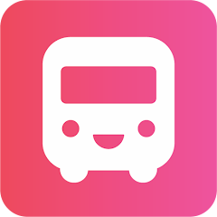</td>
    <td align="center">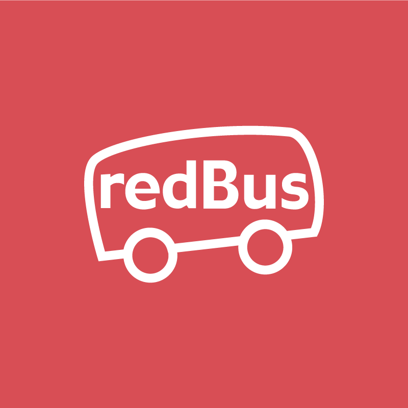</td>
  </tr>
  <tr>
    <td rowspan="2"><strong>Perfil</strong></td>
    <td><strong>Overview</strong></td>
    <td>
      Aplicación internacional de movilidad urbana con cobertura global. Ofrece rutas, horarios y planificación multimodal (bus, tren, bicicleta). Opera en Lima con datos colaborativos
    </td>
    <td>
      Servicio global de mapas y tráfico en tiempo real. Incluye opciones de transporte público, aunque con detalle limitado para buses limeños
    </td>
    <td>
      App peruana enfocada en transporte público limeño, basada en información colaborativa sobre rutas de buses y colectivos
    </td>
    <td>
      Plataforma especializada en venta de pasajes interprovinciales. No opera rutas urbanas, pero es referente en digitalización del transporte
    </td>
  </tr>
  <tr>
    <td><strong>Ventaja Competitiva ¿Qué valor ofrece?</strong></td>
    <td>
      Precisión global, experiencia en movilidad urbana y amplia integración multimodal
    </td>
    <td>
      Cartografía precisa, navegación confiable y datos de tráfico actualizados
    </td>
    <td>
      Conocimiento local del transporte limeño y fácil uso para usuarios cotidianos
    </td>
    <td>
      Compra segura de pasajes, métodos de pago confiables y reputación consolidada
    </td>
  </tr>
  <tr>
    <td rowspan="2"><strong>Perfiles de Marketing</strong></td>
    <td><strong>Mercado objetivo</strong></td>
    <td>Usuarios urbanos que buscan planificar rutas multimodales</td>
    <td>Usuarios globales que necesitan mapas, navegación y tráfico</td>
    <td>Pasajeros limeños frecuentes que usan buses o colectivos</td>
    <td>Viajeros que realizan desplazamientos interprovinciales</td>
  </tr>
  <tr>
    <td><strong>Estrategias de marketing</strong></td>
    <td>Publicidad global, alianzas con gobiernos y operadores</td>
    <td>Integración con Android y ecosistema Google; marketing masivo</td>
    <td>Redes sociales, enfoque local y participación comunitaria</td>
    <td>Marketing digital, alianzas con empresas de transporte</td>
  </tr>
  <tr>
    <td rowspan="3"><strong>Perfil de Producto</strong></td>
    <td><strong>Productos y Servicios</strong></td>
    <td>Rutas, horarios, planificación multimodal, notificaciones básicas</td>
    <td>Mapas, tráfico, transporte público, navegación y GPS</td>
    <td>Rutas de buses y colectivos en Lima; colaboración ciudadana</td>
    <td>Venta de pasajes, reservas y métodos de pago seguros</td>
  </tr>
  <tr>
    <td><strong>Precios y Costos</strong></td>
    <td>Gratuito</td>
    <td>Gratuito</td>
    <td>Gratuito</td>
    <td>Comisiones y precios de pasajes</td>
  </tr>
  <tr>
    <td><strong>Canales de Distribución</strong> (Web y/o Móvil)</td>
    <td>Web y móvil</td>
    <td>Web y móvil</td>
    <td>Móvil</td>
    <td>Web y móvil</td>
  </tr>
  <tr>
    <td rowspan="4"><strong>Análisis SWOT</strong></td>
    <td><strong>Fortalezas</strong></td>
    <td>- Amplia cobertura global    - Integración multimodal    - Datos colaborativos amplios</td>
    <td>- Cartografía precisa    - Tráfico en tiempo real    - Ecosistema digital fuerte</td>
    <td>- Conocimiento local    - Interfaz sencilla    - Enfoque en transporte limeño</td>
    <td>- Confianza en pagos    - Amplia cobertura interprovincial    -Marca consolidada</td>
  </tr>
  <tr>
    <td><strong>Debilidades</strong></td>
    <td>- Datos poco precisos en Lima    -Baja personalización local</td>
    <td>- No especializado en transporte urbano limeño</td>
    <td>- Datos desactualizados    - Dependencia de la comunidad    -Sin tiempo real</td>
    <td>- No cubre transporte urbano    - Funcionalidad limitada para rutas limeñas</td>
  </tr>
  <tr>
    <td><strong>Oportunidades</strong></td>
    <td>Integrarse con operadores locales y mejorar datos en tiempo real</td>
    <td>Expandir detalle de transporte urbano en ciudades emergentes</td>
    <td>Incorporar APIs oficiales y mayor precisión en rutas y horarios</td>
    <td>Ampliar servicios hacia transporte urbano</td>
  </tr>
  <tr>
    <td><strong>Amenazas</strong></td>
    <td>Mejoras locales podrían desplazar a apps especializadas</td>
    <td>Regulaciones de datos y competencia global</td>
    <td>Competidores con información más precisa y tiempo real</td>
    <td>Competidores con ecosistemas más robustos</td>
  </tr>
</tbody>
</table>

_**Figura 6.** Logotipos de los principales competidores analizados: Moovit, Google Maps, TuRuta y RedBus._   _**Fuente:** elaboración propia a partir de material público de cada marca._

 

BusTrack puede diferenciarse mediante información confiable en tiempo real, un enfoque exclusivamente local y la integración de APIs oficiales para ofrecer datos verificados sobre buses y rutas urbanas. Esto cubre vacíos que los competidores actuales aún no resuelven completamente.

 

### 2.1.2. Estrategias y tácticas frente a competidores.

Para destacar frente a las aplicaciones presentes en el mercado, **BusTrack** aplicará una estrategia basada en la personalización local y la diferenciación tecnológica, con un enfoque progresivo en innovación y calidad de datos.

### 1. Enfoque en la realidad limeña
- Integrar información de buses y paraderos tanto formales como informales.  
- Incorporar APIs y datos oficiales de municipalidades para aumentar la confiabilidad del servicio.  

### 2. Alianzas estratégicas
- Establecer colaboración con operadores de transporte urbano y universidades para captar usuarios frecuentes.  
- Explorar acuerdos con entidades públicas de transporte para mejorar la base de datos y validar rutas en tiempo real.  

### 3. Valor agregado para el usuario
- Ofrecer notificaciones en tiempo real sobre la llegada de buses.  
- Permitir guardar rutas frecuentes y mostrar estimaciones basadas en el tráfico local.  
- Incluir alertas de seguridad, como sugerencias de paraderos recomendados o zonas de riesgo.  

### 4. Campañas de posicionamiento digital
- Mantener una presencia activa en redes sociales para atraer principalmente a estudiantes y trabajadores.  
- Desarrollar estrategias de marketing enfocadas en el ahorro de tiempo, la seguridad y la eficiencia del transporte urbano.  
- Fomentar la construcción de una comunidad de usuarios que compartan información dentro de la plataforma.  

### 5. Innovación tecnológica gradual
- Desarrollar una futura aplicación móvil con geolocalización más precisa.  
- Implementar funciones predictivas que estimen tiempos de llegada basados en patrones históricos de tráfico.  

Con estas estrategias, **BusTrack** busca convertirse en una opción confiable y útil para los ciudadanos de Lima Metropolitana, apostando por la innovación tecnológica y por brindar información clara y en tiempo real que facilite la movilidad diaria de estudiantes, trabajadores y usuarios frecuentes del transporte público.

## 2.2. Entrevistas.

Como parte del proceso de validación del modelo de negocio de BusTrack, se plantean entrevistas semiestructuradas dirigidas a los dos segmentos objetivos: pasajeros de transporte público y empresas de transporte urbano. El propósito es identificar sus motivaciones, comportamientos, expectativas y principales frustraciones en relación con la movilidad urbana, así como validar la propuesta de valor de la plataforma.

### 2.2.1. Diseño de entrevistas.

## Segmento 1: Pasajeros de Transporte Público

**Objetivo:** Entender las frustraciones en el uso del transporte diario

### Datos generales
- Nombre  
- Edad  
- Distrito de residencia  
- Ocupación (estudiante, trabajador, etc.)  
- Frecuencia de uso del transporte público (diaria, varias veces por semana, esporádica)  

### Motivaciones y comportamientos
- ¿Qué medio de transporte público usas con más frecuencia (bus, coaster, combi, Metropolitano, Metro)?  
- ¿Qué situaciones específicas te generan más preocupación al viajar?
- ¿Qué pasos sigues normalmente antes de salir de casa para tomar el bus?
- ¿Has usado alguna aplicación para movilizarte en la ciudad (Waze, Google Maps, Moovit, etc.)? ¿Cómo fue tu experiencia?  
- ¿Qué importancia le das a recibir información en tiempo real sobre la llegada de buses?  

### Miedos, expectativas y canales
- ¿Qué problemas enfrentas con mayor frecuencia en tus traslados (tiempo de espera, congestión, inseguridad, falta de información)?  
- ¿Qué haría que confíes en una aplicación como BusTrack para planificar tus viajes?  
- ¿Te gustaría recibir notificaciones sobre la llegada del bus, retrasos o desvíos de ruta? 
- ¿Qué redes sociales o aplicaciones móviles usas más para informarte en tu día a día?  
- ¿Cómo medirías que una aplicación realmente mejora tu experiencia de viaje?  

---

## Segmento 2: Empresas de Transporte Urbano

**Objetivo:** Comprender los procesos operativos de las empresas de transporte urbano

### Datos generales
- Nombre del entrevistado  
- Cargo (administrador, supervisor de rutas, propietario)  
- Empresa / línea de transporte  
- Número de unidades en operación  
- Zonas o rutas que cubren  

### Operaciones y herramientas
- ¿Cómo gestionan actualmente la ubicación y monitoreo de sus buses?  
- ¿Qué herramientas usan para controlar sus buses y qué limitaciones encuentran en ellas?
- ¿Qué información reciben de los conductores y cómo la gestionan?  
- ¿Han utilizado aplicaciones para comunicarse con pasajeros? Si ese es el caso, ¿les fue útil? y qué problemas encontraron?
- ¿Cuáles son los mayores retos para mantener la puntualidad y la seguridad de los viajes?  

### Expectativas y valor esperado
- ¿Qué tipo de datos o reportes serían más valiosos para su gestión diaria (tiempos de llegada, cantidad de pasajeros, retrasos)?  
- ¿Qué funcionalidades de una aplicación como BusTrack les motivarían a adoptarla?  
- ¿Cómo creen que una plataforma de información en tiempo real podría mejorar la confianza de los pasajeros?  
- ¿Qué beneficios esperan obtener al implementar una solución tecnológica (mayor satisfacción, competitividad, reducción de costos)?  
- ¿Qué barreras internas o externas ven para adoptar una aplicación digital de gestión de transporte?

### 2.2.2. Registro de entrevistas.

### Segmento 1: Pasajeros de Transporte Público (Estudiantes y Trabajadores)  

| **Entrevista 1** |
|--------|
| **Entrevistado:** Mariana Rafael |
| **Sexo:** Femenino |
| **Edad:** 20 |
| **Ocupación:** Estudiante universitario |
| **Medio utilizado:** Zoom |
| **Evidencia:**     _**Figura 7.** Evidencia de entrevista 1 - Segmento 1._   _**Fuente:** elaboración propia._|
| **Link de entrevista:** <https://youtu.be/fcO25GbbaRY> |
| **Resumen de entrevista:** La entrevistada utiliza principalmente corredores de la ATU y el Metropolitano para ir a la universidad o salir con amigos. Sus principales preocupaciones son la inseguridad, los desvíos inesperados y los costos del transporte. Considera esencial contar con información en tiempo real y notificaciones confiables para optimizar su tiempo y aumentar la confianza en el transporte público. |

| **Entrevista 2** |
|-----------|
| **Entrevistado:** Alessandro Bravo |
| **Sexo:** Masculino |
| **Edad:** 20 |
| **Ocupación:** Estudiante universitario |
| **Medio utilizado:** Zoom |
| **Evidencia:**     _**Figura 8.** Evidencia de entrevista 2 - Segmento 1._   _**Fuente:** elaboración propia._|
| **Link de entrevista:** <https://www.youtube.com/watch?v=5rFwJUM-JS4> | 
| **Resumen de entrevista:** El entrevistado viaja diariamente en buses y combis, tomando hasta tres por día desde San Martín de Porres. Sus principales preocupaciones son el tiempo de espera, la inseguridad y la falta de información confiable. Usa aplicaciones como Moovit, aunque señala que no siempre están actualizadas. Valora recibir notificaciones en tiempo real sobre ubicación, desvíos y precios para llegar a tiempo a clases y optimizar sus traslados. |

| **Entrevista 3** |
|-----------|
| **Entrevistado:**  Melisa Sulca  |
| **Sexo:** Femenino |
| **Edad:** 23 |
| **Ocupación:** Estudiante universitario |
| **Medio utilizado:** Zoom |
| **Evidencia:**  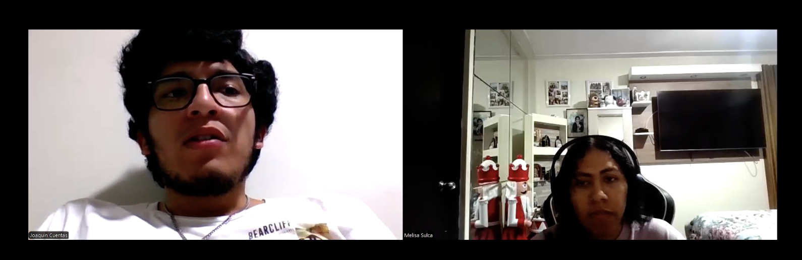   _**Figura 9.** Evidencia de entrevista 3 - Segmento 1._   _**Fuente:** elaboración propia._|
| **Link de entrevista:** <https://upcedupe-my.sharepoint.com/:v:/g/personal/u20201f788_upc_edu_pe/IQAizEwhwgVIRoDGZdlA-3UtAZTDcAPxf_lPHyIuvhfMD2w?e=b4WJu9> | 
| **Resumen de entrevista:** La entrevistada suele tomar buses de transporte público rutinariamente para movilizarse a la universidad o a algún otro punto de la ciudad. Ella explica que no tiene mucho conocimiento acerca de rutas de transporte, por lo que siempre suele consultar con su mamá que está más informada del tema. Este es motivo por el cual una aplicación como BusTrack sería de gran ayuda para ella, por la información en tiempo real de los buses que toma que podrían estar al alcance de su mano.  |
 
 

### Segmento 2: Empresas de Transporte Urbano

| **Entrevista 4** |
|-----------|
| **Entrevistado:** Octavio |
| **Sexo:** Masculino |
| **Edad:** 35 |
| **Ocupación:** Supervisor de rutas |
| **Medio utilizado:** Zoom |
| **Evidencia:**     _**Figura 10.** Evidencia de entrevista 4 - Segmento 2._   _**Fuente:** elaboración propia._|
| **Link de entrevista:** <https://youtu.be/MOjHcLv6YDY> |
| **Resumen de entrevista:** El entrevistado gestiona la flota mediante llamadas a los choferes y el uso de Excel y hojas de ruta, recibiendo solo información básica sobre tráfico y fallas mecánicas. Considera valiosos los reportes automáticos y la ubicación exacta de buses para mejorar la operación. Reconoce que una plataforma como BusTrack podría incrementar la confianza de los pasajeros, aunque identifica barreras como el costo y la resistencia de algunos conductores a adoptar tecnología. |

| **Entrevista 5** |
|-----------|
| **Entrevistado:** Jean Paul Condori |
| **Sexo:** Masculino |
| **Edad:** 40 |
| **Ocupación:** Administrador de flota |
| **Medio utilizado:** Zoom |
| **Evidencia:**     _**Figura 11.** Evidencia de entrevista 5 - Segmento 2._   _**Fuente:** elaboración propia._|
| **Link de entrevista:** <https://youtu.be/JAEwGB9mBGk> |
| **Resumen de entrevista:** El entrevistado gestiona las unidades mediante grupos de WhatsApp y cuadernos físicos, recibiendo información de los conductores sobre retrasos, cambios de ruta y controles policiales. Identifica retos como tráfico, bloqueos y falta de procesos modernos. Considera útil contar con reportes sobre rutas, horarios y cantidad de pasajeros. Percibe a BusTrack como una oportunidad para implementar monitoreo en tiempo real, aunque también identifica barreras relacionadas con la confianza y la adaptación tecnológica de los conductores. |

| **Entrevista 6** |
|-----------|
| **Entrevistado:** Walter Fajardo |
| **Sexo:** Masculino |
| **Edad:** 30 |
| **Ocupación:** Gerente de empresa de transportes |
| **Medio utilizado:** Zoom |
| **Evidencia:**  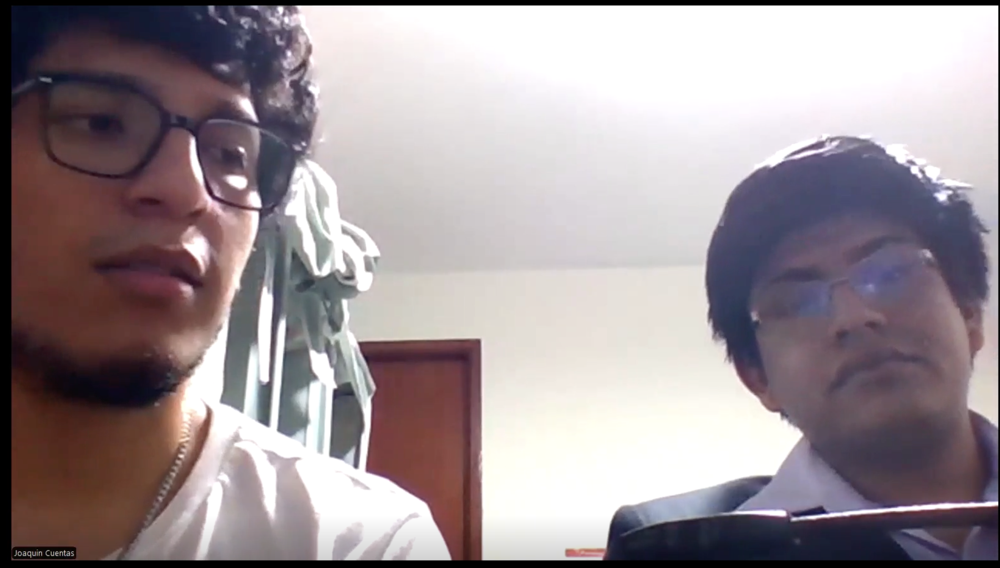   _**Figura 12.** Evidencia de entrevista 6 - Segmento 2._   _**Fuente:** elaboración propia._|
| **Link de entrevista:** <https://upcedupe-my.sharepoint.com/personal/u20201f788_upc_edu_pe/_layouts/15/stream.aspx?id=%2Fpersonal%2Fu20201f788%5Fupc%5Fedu%5Fpe%2FDocuments%2FSegemento%20objetivo%202%20%2D%20Walter%2Emp4&nav=eyJyZWZlcnJhbEluZm8iOnsicmVmZXJyYWxBcHAiOiJPbmVEcml2ZUZvckJ1c2luZXNzIiwicmVmZXJyYWxBcHBQbGF0Zm9ybSI6IldlYiIsInJlZmVycmFsTW9kZSI6InZpZXciLCJyZWZlcnJhbFZpZXciOiJNeUZpbGVzTGlua0NvcHkifX0&ga=1&referrer=StreamWebApp%2EWeb&referrerScenario=AddressBarCopied%2Eview%2E271d57e2%2D0088%2D4def%2Da3c3%2D2723d93114b8> | 
| **Resumen de entrevista:**  El entrevistado muestra atracción por una aplicación que ayude a mejorar la supervisición sobre los conductores de la empresa, ya que por el momento, solo tienen un control al incio y final de iniciada una ruta. Considera que una supervisión en tiempo real podría mejorar la confianza generada en los pasajeros y muestra su interes porque BusTrack sea una aplicación sencialla de uso para agilizar tiempos. |

 

### 2.2.3. Análisis de entrevistas.

A partir de las entrevistas realizadas, se agruparon las respuestas más representativas de cada segmento para identificar patrones comunes, necesidades y oportunidades de mejora.

### Segmento 1: Pasajeros de Transporte Público (Estudiantes y Trabajadores)  

| **Preguntas** | **Respuestas Generales** |
|---|---|
| ¿Qué medio de transporte público usas con más frecuencia (bus, coaster, combi, Metropolitano, Metro)? | Los más utilizados son buses y combis para recorridos diarios, además de corredores de la ATU y el Metropolitano para trayectos largos o frecuentes. |
| ¿Qué situaciones específicas te generan más preocupación al viajar? | Principalmente la inseguridad (robos durante los trayectos) y la incertidumbre por desvíos de ruta o cambios inesperados. |
| ¿Qué pasos sigues normalmente antes de salir de casa para tomar el bus? | Consultan previamente rutas y paraderos en el celular, investigan precios y tiempos estimados. Algunos usan apps como “TuRuta” o Moovit, aunque no siempre confían en su precisión. |
| ¿Has usado alguna aplicación para movilizarte en la ciudad (Waze, Google Maps, Moovit, etc.)? ¿Cómo fue tu experiencia? | Sí, principalmente Moovit. Sin embargo, señalan que no siempre está actualizada, lo que genera retrasos y confusión en la planificación de viajes. |
| ¿Qué importancia le das a recibir información en tiempo real sobre la llegada de buses? | Se considera muy importante, ya que permite organizar mejor el tiempo y evitar esperas innecesarias. |
| ¿Qué problemas enfrentas con mayor frecuencia en tus traslados (tiempo de espera, congestión, inseguridad, falta de información)? | Las largas esperas sin información, congestión en horas punta e inseguridad dentro de buses y paraderos. |
| ¿Qué haría que confíes en una aplicación como BusTrack para planificar tus viajes? | Que muestre información actualizada y verificada sobre ubicación de buses, precios y posibles desvíos. También que garantice seguridad validando a los conductores. |
| ¿Te gustaría recibir notificaciones sobre la llegada del bus, retrasos o desvíos de ruta? | Sí, especialmente sobre retrasos y desvíos, ya que afectan la puntualidad en clases y el trabajo. |
| ¿Qué redes sociales o aplicaciones móviles usas más para informarte en tu día a día? | Principalmente TikTok, Instagram, X (Twitter) y canales de noticias digitales. |
| ¿Cómo medirías que una aplicación realmente mejora tu experiencia de viaje? | En la práctica, comprobando que reduce tiempos de espera, brinda información confiable y hace el viaje más seguro y eficiente. |

**Insights:**

Se identificó una fuerte necesidad de control en los pasajeros, quienes experimentan ansiedad e inseguridad ante la falta de información sobre los tiempos de llegada de los buses. La inmediatez es un valor clave, ya que los usuarios prefieren aplicaciones que proporcionen datos actualizados en tiempo real sobre rutas y horarios.

La confianza está estrechamente relacionada con la seguridad, por lo que esperan validación de conductores, monitoreo de unidades y rutas verificadas. Finalmente, su motivación principal es de carácter práctico, pues buscan optimizar el tiempo de viaje y reducir la incertidumbre más que explorar aplicaciones por simple novedad. 

 

### Segmento 2: Empresas de Transporte Urbano
| **Preguntas** | **Respuestas Generales** |
|---|---|
| ¿Cómo gestionan actualmente la ubicación y monitoreo de sus buses? | No cuentan con un sistema especializado, dependen de llamadas rápidas a los choferes y grupos de WhatsApp para reportar ubicación en ruta. |
| ¿Qué herramientas usan para controlar sus buses y qué limitaciones encuentran en ellas? | Usan cuadernos, hojas de ruta y, en algunos casos, Excel para registrar salidas, llegadas y control básico de operaciones. |
| ¿Qué información reciben de los conductores y cómo la gestionan? | Se reportan retrasos, tráfico, problemas mecánicos e incidentes en ruta (como policías o semáforos dañados) mediante mensajes o llamadas, y se gestionan manualmente. |
| ⁠¿Han utilizado aplicaciones para comunicarse con pasajeros? Si ese es el caso, ¿les fue útil y qué problemas encontraron? | No cuentan con un canal digital para pasajeros; algunos han considerado apps, pero aún no las aplican. |
| ¿Cuáles son los mayores retos para mantener la puntualidad y la seguridad de los viajes? | El tráfico, bloqueos, obras en las vías y la falta de información en tiempo real. Además, la limpieza de buses y la coordinación con choferes a distancia dificultan la operación. |
| ¿Qué tipo de datos o reportes serían más valiosos para su gestión diaria (tiempos de llegada, cantidad de pasajeros, retrasos)? | Horarios exactos de salida y llegada, ubicación en tiempo real, retrasos por incidentes y cantidad de pasajeros transportados por vuelta. |
| ¿Qué funcionalidades de una aplicación como BusTrack les motivarían a adoptarla? | Monitoreo en tiempo real de las unidades, reportes automáticos y alertas inmediatas de incidencias o desvíos. |
| ¿Cómo creen que una plataforma de información en tiempo real podría mejorar la confianza de los pasajeros? | Brindando horarios verificados de salida y llegada para que los pasajeros planifiquen mejor su tiempo y perciban mayor confiabilidad. |
| ¿Qué beneficios esperan obtener al implementar una solución tecnológica (mayor satisfacción, competitividad, reducción de costos)? | Mayor satisfacción de los pasajeros, incremento de usuarios, reducción de quejas y mayor control interno de la operación. |
| ¿Qué barreras internas o externas ven para adoptar una aplicación digital de gestión de transporte? | Los costos de implementación, la resistencia de los choferes a adaptarse y la desconfianza inicial hacia nuevas tecnologías. |

**Insights:**

Las empresas de transporte urbano presentan una gestión operativa manual y poco eficiente, sustentada en llamadas telefónicas, registros en papel o en hojas de cálculo, lo que limita la trazabilidad y control de la flota. La falta de visibilidad en tiempo real impide tomar decisiones oportunas y afecta la puntualidad de los servicios.

Se observó además una resistencia cultural hacia la adopción tecnológica, especialmente entre conductores con menor experiencia digital. Aun así, los entrevistados expresaron alto interés en obtener reportes automáticos y datos analíticos para mejorar la gestión. Las barreras económicas y de capacitación continúan siendo los principales obstáculos para la implementación de soluciones tecnológicas como BusTrack.

 

## 2.3. Needfinding.

En esta etapa se identifican y analizan las necesidades reales de los usuarios para asegurar que BusTrack responda a las expectativas y problemas detectados durante la investigación. Para ello, se desarrollan los User Personas, el User Task Matrix, los User Journey Maps y los Empathy Maps, permitiendo comprender profundamente los comportamientos, motivaciones y frustraciones de cada segmento objetivo.

### 2.3.1. User Personas.

### Segmento Objetivo 1: Pasajeros de Transporte Público

### Estudiante universitario

| **Atributo**     | **Valor** |
|------------------|-----------|
| **Name**         | Manuel Suarez |
| **Age**          | 24 años |
| **Occupation**   | Estudiante universitario |
| **Status**       | Soltero |
| **Location**     | Lima, Perú |
| **Tier**         | Pasajero frecuente |
| **Archetype**    | Usuario Pragmático |
| **Image**        |     _**Figura 13.** Imagen representativa del User Persona “Manuel Suárez”, estudiante universitario usuario frecuente de transporte público._   _**Fuente:** elaboración propia._ |
| **Quote**        | "Lo que más necesito es saber con certeza cuándo llegará el bus para no perder tiempo ni arriesgarme en el paradero." |
| **Motivations**  | Incentive: 80/100 Fear: 75/100 Achievement: 80/100 Growth: 65/100 Power: 40/100 Social: 85/100 |
| **Goals**        | - Llegar puntual a clases sin depender de información incierta. - Optimizar su tiempo para estudiar y evitar esperas innecesarias. - Sentirse seguro en trayectos diarios, especialmente en paraderos con poca iluminación o vigilancia. |
| **Frustrations** | - No saber con exactitud cuándo pasará el bus. - Perder tiempo en paraderos inseguros o llenos. - Apps como Moovit no siempre muestran retrasos reales ni desvíos de ruta.  - Estrés cuando llega tarde por demoras inesperadas.|
| **Biography**    | Manuel estudia en una universidad en el centro de Lima y vive en un distrito alejado. Sale temprano todos los días y realiza entre dos y tres transbordos para llegar a clases. Antes de salir, revisa aplicaciones como Moovit o Google Maps para planificar su ruta, pero muchas veces la información no es confiable, ya que los buses se retrasan, no aparecen en el mapa o toman desvíos sin aviso. Esto lo obliga a esperar largos minutos en paraderos inseguros, lo que le genera ansiedad y pérdida de tiempo valioso. En días de evaluación, su principal preocupación es llegar puntual. Usa activamente redes sociales y confía en aplicaciones cuando le brindan datos claros y en tiempo real.|
| **Personality**  | Extrovert: 60/100 Thinking: 80/100 Judging: 70/100 |
| **Technology**   | IT and Internet: 85/100 Software: 70/100 Mobile Apps: 90/100 Social Networks: 95/100 |
| **Brands**       | WhatsApp, Google Maps, TikTok, Moovit, TuRuta |

 

## Trabajador

| **Atributo**     | **Valor** |
|------------------|-----------|
| **Name**         | Alejandro Medina |
| **Age**          | 32 años |
| **Occupation**   | Empleado administrativo |
| **Status**       | Soltero |
| **Location**     | Lima, Perú |
| **Tier**         | Pasajero frecuente |
| **Archetype**    | Viajero Organizado |
| **Image**        |     _**Figura 14.** Imagen representativa del User Persona “Alejandro Medina”, trabajador administrativo que usa transporte público a diario._    _**Fuente:** elaboración propia._ |
| **Quote**        | "Necesito que el transporte sea puntual porque llegar tarde al trabajo no es una opción." |
| **Motivations**  | Incentive: 80/100 Fear: 75/100 Achievement: 85/100 Growth: 65/100 Power: 50/100 Social: 70/100 |
| **Goals**        | - Llegar puntual al trabajo evitando esperas innecesarias. - Optimizar su tiempo de traslado para tener más tiempo libre al final del día. - Usar una app confiable que proporcione información precisa sobre buses y tráfico en tiempo real.  - Reducir el estrés diario asociado al transporte público. |
| **Frustrations** | - Largas esperas sin información clara sobre la llegada del bus. - Aplicaciones desactualizadas que no muestran desvíos o retrasos reales. - Perder tiempo en trayectos mal planificados.  - Inseguridad en paraderos, sobre todo en horarios nocturnos. |
| **Biography**    | Alejandro trabaja en una oficina en el centro de Lima y vive en un distrito periférico. Sale muy temprano todos los días para evitar el tráfico, pero aun así pasa más de dos horas en transporte público entre ida y vuelta. Usa Moovit para revisar rutas antes de salir, aunque con frecuencia se frustra cuando los buses no llegan a la hora estimada o toman desvíos sin aviso. La puntualidad es crucial en su trabajo, por lo que la falta de información confiable le genera ansiedad. Una aplicación que le brinde datos en tiempo real y alertas claras significaría más control sobre su tiempo y menos estrés.|
| **Personality**  | Extrovert: 55/100 Thinking: 85/100 Judging: 70/100 |
| **Technology**   | IT and Internet: 85/100 Software: 65/100 Mobile Apps: 80/100 Social Networks: 85/100 |
| **Brands**       | WhatsApp, Moovit, Facebook, TikTok |

 

## Segmento Objetivo 2: Empresas de Transporte Urbano

##  Administrador de flota

| **Atributo**     | **Valor** |
|------------------|-----------|
| **Name**         | Luis Palacios |
| **Age**          | 38 años |
| **Occupation**   | Administrador de flota en empresa de transporte urbano |
| **Status**       | Soltero |
| **Location**     | Lima, Perú |
| **Tier**         | Empresa de transporte urbano |
| **Archetype**    | Gestor Eficiente |
| **Image**        |     _**Figura 15.** Imagen representativa del User Persona “Luis Palacios”, administrador de flota en una empresa de transporte urbano._    _**Fuente:** elaboración propia._|
| **Quote**        | "Si puedo monitorear mis buses en tiempo real, puedo ofrecer un mejor servicio y ganar más pasajeros." |
| **Motivations**  | Incentive: 85/100 Fear: 65/100 Achievement: 90/100 Growth: 70/100 Power: 75/100 Social: 70/100 |
| **Goals**        | - Monitorear en tiempo real la ubicación y estado de todas las unidades. - Detectar y resolver incidencias operativas rápidamente. - Mejorar la puntualidad general y reducir reclamos de usuarios. - Digitalizar procesos manuales para optimizar tiempos y costos. - Usar herramientas que faciliten decisiones estratégicas. |
| **Frustrations** | - Depender de llamadas, WhatsApp y cuadernos para coordinar. - No tener visibilidad clara del estado de las rutas en tiempo real. - Dificultad para anticipar retrasos o desvíos. - Perder tiempo consolidando datos manualmente en Excel. |
| **Biography**    | Luis es administrador en una empresa de transporte urbano que opera 18 buses en Lima Metropolitana. Su día comienza muy temprano revisando reportes manuales y coordinando con supervisores mediante llamadas y mensajes. Debe responder rápidamente a incidencias como desvíos o congestión, pero la falta de información centralizada dificulta la toma de decisiones oportunas. Además, debe presentar reportes detallados a la gerencia, lo que implica un gran esfuerzo manual. Busca una plataforma que brinde control total en tiempo real, reduzca errores y modernice la gestión de flota para competir con el transporte informal. |
| **Personality**  | Extrovert: 65/100 Thinking: 85/100 Judging: 70/100 |
| **Technology**   | IT and Internet: 75/100 Software: 60/100 Mobile Apps: 65/100 Social Networks: 60/100 |
| **Brands**       | WhatsApp, Excel, Facebook |

 

##  Supervisor de Rutas

| **Atributo**     | **Valor** |
|------------------|-----------|
| **Name**         | José Ramírez |
| **Age**          | 40 años |
| **Occupation**   | Supervisor de rutas en empresa de transporte urbano |
| **Status**       | Soltero |
| **Location**     | Lima, Perú |
| **Tier**         | Empresa de transporte urbano |
| **Archetype**    | Supervisor Operativo |
| **Image**        |     _**Figura 16.** Imagen representativa del User Persona “José Ramírez”, supervisor de rutas en una empresa de transporte urbano._    _**Fuente:** elaboración propia._ |
| **Quote**        | "Lo más difícil es coordinar con los choferes en medio del tráfico y asegurar que los buses lleguen a tiempo." |
| **Motivations**  | Incentive: 70/100 Fear: 60/100 Achievement: 80/100 Growth: 60/100 Power: 65/100 Social: 70/100 |
| **Goals**        | - Coordinar eficientemente la operación diaria de múltiples rutas. - Anticipar problemas de tráfico o desvíos antes de que afecten a los pasajeros. - Reducir reclamos por incumplimiento de horarios. - Estandarizar reportes e incidencias. - Recibir alertas automáticas para actuar más rápido. |
| **Frustrations** | - Depender de WhatsApp y llamadas individuales. - No contar con un panel centralizado para incidencias en tiempo real. - Perder tiempo obteniendo información fragmentada. - No poder anticipar bloqueos o retrasos. - Dificultad para demostrar su desempeño ante la administración. |
| **Biography**    | José supervisa varias rutas de transporte urbano en Lima Metropolitana. Su jornada comienza antes de las seis de la mañana y consiste en coordinar con conductores, verificar operaciones y reaccionar rápidamente a incidencias en el tránsito. Su principal herramienta son grupos de WhatsApp, llamadas y cuadernos físicos, lo que ocasiona retrasos y decisiones tardías. A menudo se entera tarde de bloqueos o accidentes, generando retrasos acumulados. Además, debe entregar reportes diarios elaborados manualmente. Una plataforma que centralice la información, envíe alertas automáticas y permita monitoreo en tiempo real transformaría su trabajo y reduciría la presión operativa. |
| **Personality**  | Extrovert: 65/100 Thinking: 75/100 Judging: 80/100 |
| **Technology**   | IT and Internet: 65/100 Software: 50/100 Mobile Apps: 75/100 Social Networks: 60/100 |
| **Brands**       | WhatsApp, Excel, Facebook |

 

### 2.3.2. User Task Matrix.

### Segmento Objetivo 1
      
| Tarea / Funcionalidad                | Manuel Suarez (Estudiante Universitario) | Alejandro Medina (Trabajador) | Adulto mayor | Turista |
|--------------------------------------|------------|------------|--------------|---------|
| Consultar rutas y horarios           | Alta       | Alta       | Alta         | Alta    |
| Recibir notificaciones en tiempo real| Alta       | Alta       | Media        | Media   |
| Guardar trayectos frecuentes         | Alta       | Alta       | Media        | Baja    |
| Revisar estimaciones según tráfico   | Media      | Alta       | Baja         | Media   |
| Identificar paraderos cercanos       | Media      | Media      | Alta         | Alta    |
| Alertas de seguridad en paraderos    | Media      | Media      | Alta         | Media   |
| Consultar rutas hacia puntos turísticos | Baja    | Baja       | Baja         | Alta    |
| Administración de datos (rol admin)  | Baja       | Baja       | Baja         | Baja    |

En el User Task Matrix del Segmento 1 se observa que cada grupo de usuarios tiene prioridades distintas: los estudiantes y trabajadores buscan principalmente rapidez e información en tiempo real; los adultos mayores se enfocan en la seguridad y en identificar paraderos cercanos; y los turistas necesitan rutas claras hacia lugares de interés. Aunque las tareas administrativas no se perciben directamente, son clave para mantener la información confiable. En general, BusTrack debe centrarse en ofrecer datos precisos, opciones personalizadas y una experiencia segura para todos.

 

### Segmento Objetivo 2

| Tarea / Funcionalidad                | Luis Palacios (Administrador de Flota) | José Ramírez (Supervisor de Rutas) | Propietario |
|--------------------------------------|------------|------------|--------------|
| Monitorear buses en tiempo real      | Alta       | Alta       | Media        |
| Generar reportes automáticos         | Alta       | Media      | Alta         |
| Gestionar incidencias y alertas en ruta  | Alta       | Alta       | Media        |
| Comunicar cambios de ruta a choferes | Alta       | Alta       | Baja         |
| Analizar costos operativos y optimizarlos | Media    | Baja      | Alta         |
| Mejorar puntualidad y satisfacción del pasajero | Alta | Alta | Alta |
| Planificar mantenimiento preventivo de buses | Media | Alta | Media |
| Decidir adopción de nuevas tecnologías | Media | Baja | Alta |
| Administrar permisos y accesos en la plataforma | Alta | Media | Baja |

En el User Task Matrix del Segmento 2 se observa que el supervisor de rutas y el administrador de flota priorizan tareas operativas como el monitoreo en tiempo real, la generación de reportes y la gestión de incidencias, mientras que los propietarios se enfocan en aspectos estratégicos como la reducción de costos y la adopción de nuevas tecnologías. Esto evidencia que las empresas necesitan una solución que combine eficiencia operativa y capacidad estratégica, garantizando puntualidad, satisfacción del pasajero y modernización de procesos.

 

### 2.3.3. User Journey Mapping.

A continuación se presentan los User Journey Maps desarrollados para los dos segmentos objetivo de BusTrack: Pasajeros y Empresas de transporte. Cada mapa describe el flujo actual del usuario, destacando acciones, emociones, problemas y oportunidades de mejora que BusTrack busca resolver.

### Segmento 1: Pasajeros

#### User Persona 1 – Manuel Suárez (Estudiante Universitario)

**Descripción breve:** Este mapa muestra cómo un estudiante organiza su viaje diario utilizando BusTrack, centrado en la precisión del tiempo estimado de llegada, la ansiedad por retrasos y la necesidad de información confiable en tiempo real.

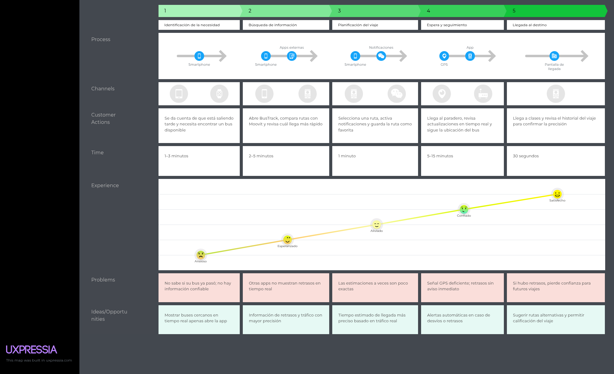

 

_**Figura 17.** User Journey Map de Manuel Suárez (estudiante universitario), que muestra su flujo de viaje diario y las oportunidades de mejora que aborda BusTrack._    _**Fuente:** elaboración propia._

___

#### User Persona 2 – Alejandro Medina (Trabajador)

**Descripción breve:** Este mapa visualiza cómo un trabajador depende de la aplicación para adaptarse a condiciones de tráfico variables y evitar retrasos, destacando su necesidad de alertas inmediatas y estimaciones precisas.

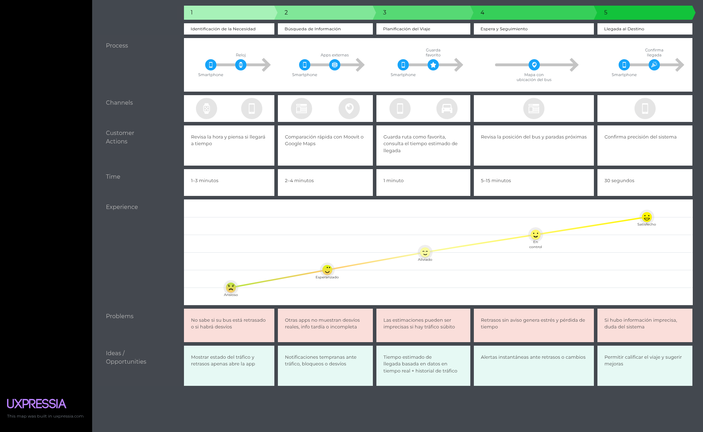

  _**Figura 18.** User Journey Map de Alejandro Medina (trabajador administrativo), ilustrando sus interacciones con el transporte público y el uso de BusTrack para reducir retrasos._   _**Fuente:** elaboración propia._

 

___

 

### Segmento 2: Empresas de transporte

#### User Persona 3 – Luis Palacios (Administrador de Flota)

**Descripción breve:** El mapa muestra cómo el administrador enfrenta procesos manuales, comunicación dispersa y falta de datos centralizados para la toma de decisiones, resaltando la oportunidad de automatización y monitoreo en tiempo real que ofrece BusTrack.

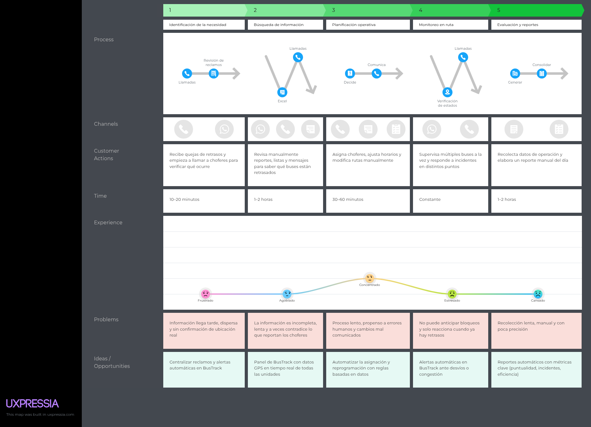

  _**Figura 19.** User Journey Map de Luis Palacios (administrador de flota), que detalla sus tareas operativas y cómo BusTrack mejora el monitoreo de buses._    _**Fuente:** elaboración propia._

___

#### User Persona 4 – José Ramírez (Supervisor de Rutas)

**Descripción breve:** Este Journey Map refleja la complejidad del monitoreo de múltiples unidades en tiempo real, la presión operativa y los errores causados por la comunicación manual, destacando la necesidad de alertas automáticas y paneles centralizados.

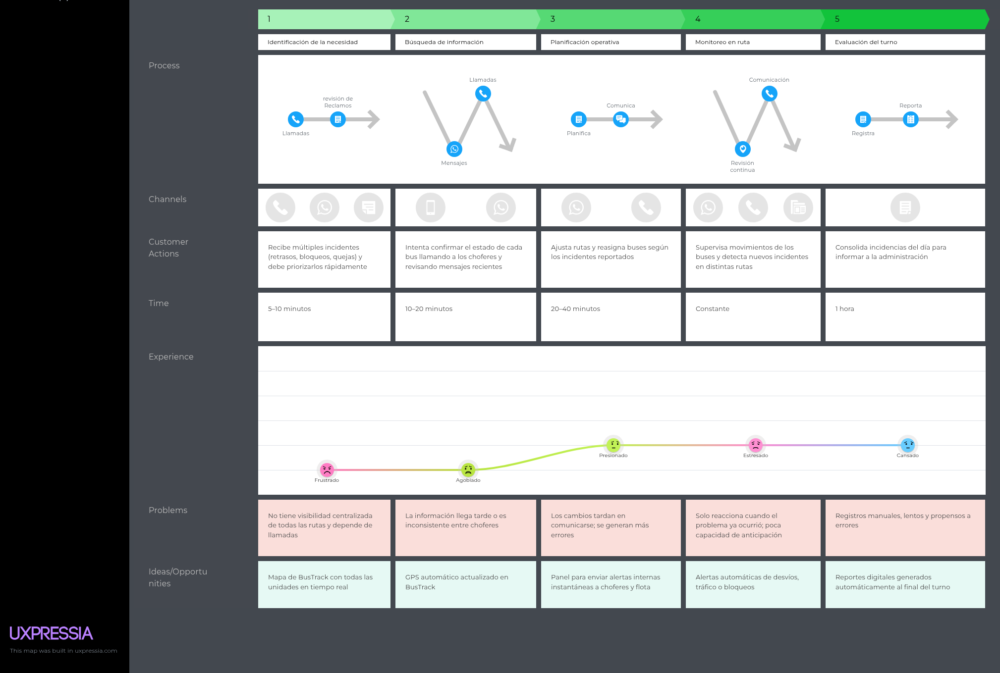

  _**Figura 20.** User Journey Map de José Ramírez (supervisor de rutas), representando la coordinación de unidades y la necesidad de alertas en tiempo real._    _**Fuente:** elaboración propia._

 

### 2.3.4. Empathy Mapping.

A continuación se presentan los mapas de empatía elaborados para cada uno de los perfiles de usuario identificados. Cada imagen incluye su respectiva descripción, tal como fue solicitado.

 

**Segmento 1: Estudiante universitario (Ejemplo: Manuel Suárez)**

**Descripción:** Mapa de empatía del estudiante universitario Manuel Suárez, donde se detallan sus emociones, pensamientos, dolores, motivaciones y percepciones relacionadas con su experiencia usando el transporte público en Lima.

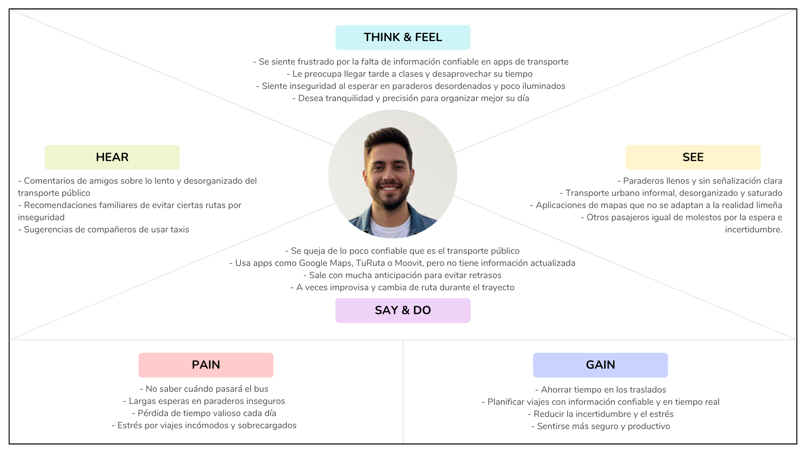

  _**Figura 21.** Mapa de empatía del estudiante universitario Manuel Suárez, donde se resumen lo que ve, piensa, siente y hace en relación con su experiencia usando el transporte público en Lima._    _**Fuente:** elaboración propia._

---

**Segmento 1: Empleado administrativo (Ejemplo: Alejandro Medina)**

**Descripción:** Mapa de empatía del trabajador administrativo Alejandro Medina, mostrando su comportamiento, frustraciones, expectativas y necesidades al movilizarse diariamente hacia su centro laboral.

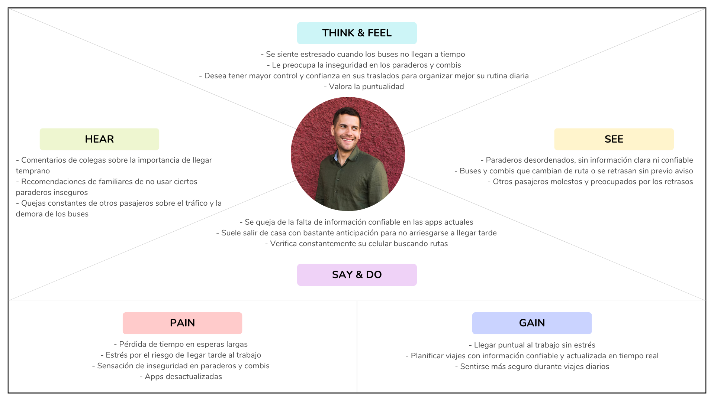

  _**Figura 22.** Mapa de empatía de Alejandro Medina, trabajador administrativo, que refleja sus frustraciones, expectativas y necesidades frente a los retrasos y la inseguridad en el transporte urbano._   _**Fuente:** elaboración propia._

---

**Segmento 2: Administrador de flota en empresa de transporte urbano (Ejemplo: Luis Palacios)**

**Descripción:** Mapa de empatía del administrador de flota Luis Palacios, donde se analizan sus preocupaciones, necesidades operativas, puntos de dolor y objetivos relacionados con la gestión de buses y supervisión de rutas.

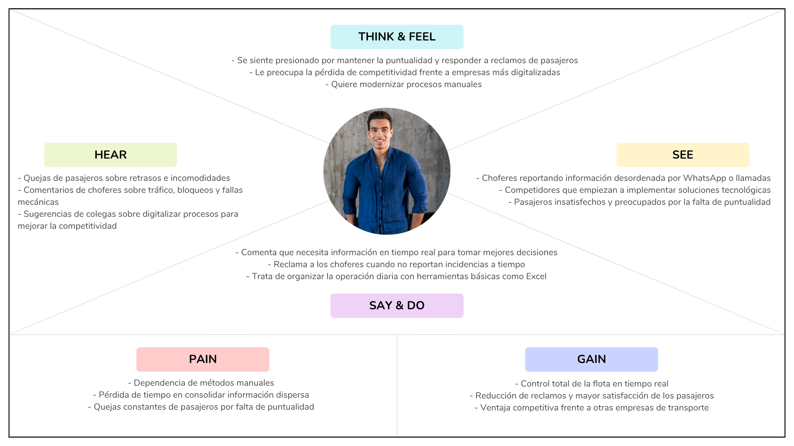

  _**Figura 23.** Mapa de empatía de Luis Palacios, administrador de flota, donde se analizan sus preocupaciones operativas, puntos de dolor y objetivos de gestión de buses._    _**Fuente:** elaboración propia._

---

**Segmento 2: Supervisor de rutas en empresa de transporte urbano (Ejemplo: José Ramírez)**

**Descripción:** Mapa de empatía del supervisor de rutas José Ramírez, que refleja sus dificultades diarias, retos operativos, motivaciones y oportunidades de mejora en la coordinación del transporte urbano.

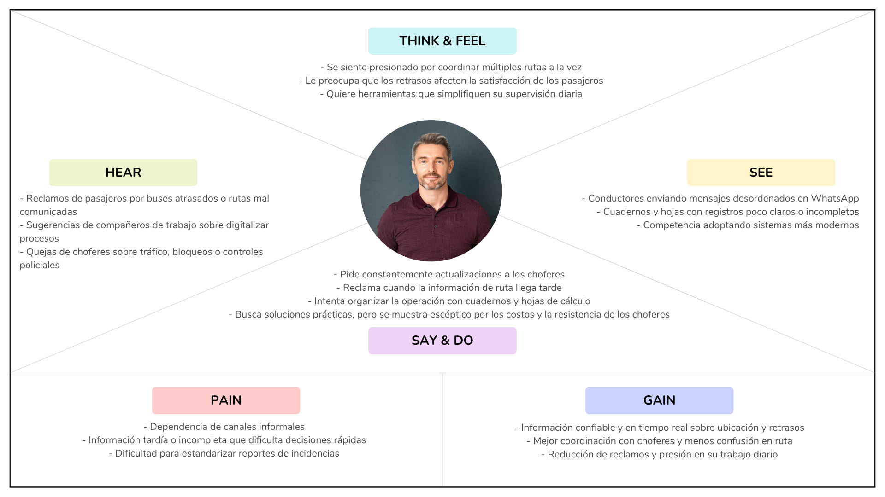

  _**Figura 24.** Mapa de empatía de José Ramírez, supervisor de rutas, que muestra sus retos diarios en la coordinación de unidades y su percepción sobre soluciones tecnológicas como BusTrack._    _**Fuente:** elaboración propia._

 

### 2.3.5. As-is Scenario Mapping.

El As-Is Scenario Mapping nos permite visualizar el flujo de trabajo y la experiencia actual de nuestros usuarios antes de la implementación de BusTrack. A partir del análisis de las entrevistas y los Journey Maps previos, se han mapeado los escenarios actuales para ambos segmentos objetivo, evidenciando los puntos críticos donde la experiencia se degrada.

#### Segmento 1: Pasajeros de Transporte Público (Estudiante / Trabajador)
Escenario: El usuario necesita viajar desde su casa hacia la universidad o el trabajo en hora punta, utilizando rutas de buses urbanos.

#### Segmento 2: Empresas de Transporte Urbano (Administrador / Supervisor)
Escenario: El supervisor necesita monitorear que todas las unidades cumplan con su ruta y horario establecido durante la jornada operativa.

## 2.4. Ubiquitous Language.

| **Término**                          | **Definición**                                                                                       |
| ------------------------------------ | ---------------------------------------------------------------------------------------------------- |
| **Pasajero**                         | Usuario final de BusTrack que consulta rutas, horarios y viaja en transporte público.                |
| **Empresa de transporte**            | Entidad que gestiona los buses, rutas y horarios registrados en la aplicación.                       |
| **Ruta**                             | Trayecto definido entre un origen y un destino que sigue un bus.                                     |
| **Horario**                          | Horas establecidas para salidas y llegadas de buses en una ruta.                                     |
| **Bus**                              | Vehículo de transporte público registrado en BusTrack con identificación y ubicación GPS.            |
| **Notificación**                     | Alerta enviada al pasajero sobre retrasos, desvíos o llegada próxima del bus.                        |
| **Reporte**                          | Resumen básico de alertas o estados operativos visibles en el panel web, limitado a la información disponible en el monitoreo de buses y en la gestión simple de alertas. En la versión actual del proyecto, no incluye reportes automáticos ni análisis avanzados; dichos elementos corresponden a funcionalidades previstas como trabajo futuro. |
| **Favoritos**                        | Rutas que el pasajero guarda para consultarlas rápidamente en futuros viajes.                        |
| **Panel de control**                 | Interfaz usada por la empresa de transporte para monitorear la flota y generar reportes.             |
| **Tiempo estimado de llegada (ETA)** | Predicción calculada por el sistema sobre el tiempo que falta para que un bus llegue a la parada.    |

  

# Capítulo III: Requirements Specification
## 3.1. To-Be Scenario Mapping.

### To-Be Scenario Map – Pasajeros

**Descripción:**  
El mapa muestra la experiencia futura del pasajero al utilizar BusTrack. Se observa cómo, en cada fase (abrir la app, buscar ruta, revisar ubicación, monitorear el viaje), el usuario realiza acciones guiadas por la información en tiempo real, reduciendo incertidumbre y mejorando su percepción de control. A nivel emocional, el usuario pasa de la ansiedad típica del transporte público a la tranquilidad, confianza y satisfacción gracias a las funcionalidades de la aplicación.

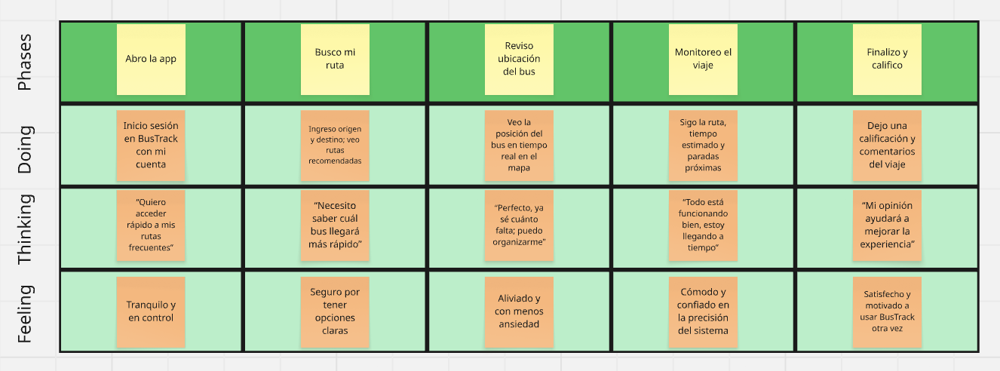

  _**Figura 26.** To-Be Scenario Map del pasajero de BusTrack, que muestra la experiencia futura deseada desde la planificación del viaje hasta la calificación del servicio, reduciendo la ansiedad y aumentando la confianza gracias a la información en tiempo real._    _**Fuente:** elaboración propia._

---

### To-Be Scenario Map – Empresa de Transporte

**Descripción:**  
El mapa presenta la experiencia futura de una empresa de transporte utilizando el panel web de BusTrack. A lo largo de las fases (ingreso al panel, revisión de buses y gestión de alertas), se observa un flujo operativo más eficiente, basado en datos en tiempo real y reportes automáticos. Emocionalmente, el usuario empresarial pasa de la incertidumbre operativa a una sensación de control, seguridad y optimización continua.

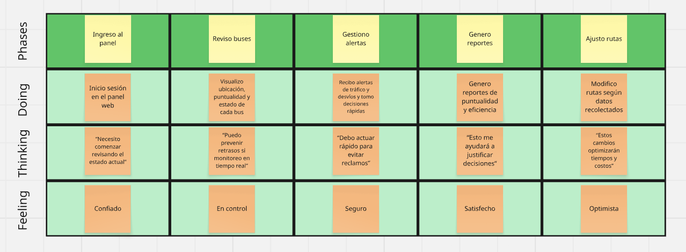

  _**Figura 27.** To-Be Scenario Map de la empresa de transporte, donde se representa el uso del panel web de BusTrack._    _**Fuente:** elaboración propia._

 

Enlace de miro: https://miro.com/app/board/uXjVJhIqCHk=/?share_link_id=990352521858

## 3.2. User Stories.

Para el caso de BusTrack, se han definido un total de cinco épicas, las cuales representan los bloques funcionales principales de la solución: gestión de rutas y horarios, monitoreo en tiempo real, administración de flota, experiencia del usuario en la aplicación y desarrollo de la Landing Page. 

A partir de estas épicas se han identificado un conjunto de **15 User Stories funcionales**, asociadas a los usuarios principales del sistema. Estas historias describen las interacciones clave que los usuarios deberán realizar dentro de la aplicación y permiten establecer el alcance funcional del producto.

Adicionalmente, se han incluido **Technical Stories** orientadas al desarrollo del backend y del RESTful API. Dichas historias están definidas desde el rol de *Developer* y permiten garantizar la integración entre el frontend, la Landing Page y los servicios internos de la plataforma.

### Épicas del Sistema

Las siguientes épicas representan los bloques funcionales principales del producto BusTrack. Cada épica agrupa un conjunto de User Stories que definen las funcionalidades asociadas tanto al pasajero como a las empresas de transporte, así como los componentes de interfaz y backend necesarios para soportar dichas capacidades.

| Código | Nombre de la Épica | Descripción |
|--------|---------------------|-------------|
| **E01** | **Gestión de rutas y horarios** | Incluye todas las funcionalidades que permiten a los pasajeros buscar rutas, visualizar horarios, consultar alternativas y guardar rutas frecuentes para optimizar su planificación diaria. |
| **E02** | **Monitoreo en tiempo real** | Agrupa las capacidades relacionadas con la visualización de ubicación del bus, seguimiento del trayecto, notificaciones de retrasos y alertas por desvíos. Estas funcionalidades reducen la incertidumbre del usuario durante el viaje. |
| **E03** | **Administración de flota** | Reúne las herramientas dirigidas a las empresas de transporte: monitoreo del estado de los buses, gestión de alertas, generación de reportes automáticos y toma de decisiones basadas en datos. |
| **E04** | **Experiencia del usuario en la app** | Contiene funcionalidades orientadas al pasajero final: registro, login, edición de perfil, calificación del servicio y personalización de rutas. |
| **E05** | **Landing Page y presencia digital** | Incluye los elementos informativos de la plataforma: presentación de la solución, beneficios, misión y visión del proyecto, y acceso a los módulos principales. |

 

### Historias de Usuario
| ID   | Epic ID | Épica                        | Nombre | Historia                                                                                                                         | Criterios de Aceptación |
|------|---------|------------------------------|--------|----------------------------------------------------------------------------------------------------------------------------------|--------------------------|
| US01 | E01     | Gestión de rutas y horarios  | Guardar rutas frecuentes | Como pasajero, quiero guardar mis rutas frecuentes para acceder a ellas rápidamente.                                             | **Positivo:** Dado que selecciono una ruta, cuando presiono “Guardar como favorita”, entonces la ruta se guarda.   **Negativo:** Dado que la ruta ya está guardada, cuando intento guardarla otra vez, entonces aparece “Esta ruta ya está guardada”. |
| US02 | E02     | Monitoreo en tiempo real     | Ver ruta en Google Maps | Como pasajero, quiero abrir la ruta en Google Maps para visualizar el recorrido y las opciones de transporte disponibles.        | **Positivo:** Dado que ingreso un origen y un destino válidos, cuando presiono el botón “Ver en Google Maps”, entonces se abre Google Maps mostrando la ruta correspondiente.   **Negativo:** Dado que ingreso un origen o destino que no corresponde a una dirección real, cuando presiono el botón “Ver en Google Maps”, entonces la aplicación igual abre Google Maps y muestra sugerencias para el origen y destino. |
| US03 | E03     | Administración de flota      | Configurar alertas internas | Como administrador, quiero configurar alertas para incidentes de tráfico.                                                        | **Positivo:** Dado que completo los campos del formulario de “Agregar bus”, cuando presiono el botón “Guardar”, entonces el nuevo bus se agrega a la tabla de flota con un ID generado automáticamente.     **Negativo:** Dado que estoy editando la información de un bus, cuando cierro el modal o presiono “Cancelar” sin guardar, entonces los cambios no se aplican y la información del bus se mantiene igual en la tabla. |
| US04 | E04     | Experiencia del usuario      | Registro de pasajero | Como nuevo pasajero, quiero registrarme para personalizar mis rutas.                                                             | **Positivo:** Dado que completo los campos, cuando presiono “Registrarse”, entonces se crea la cuenta.   **Negativo:** Dado campos vacíos, cuando intento registrarme, entonces aparece “Complete todos los campos”. |
| US05 | E04     | Experiencia del usuario      | Editar perfil | Como pasajero, quiero editar mis datos personales.                                                                               | **Positivo:** Dado datos válidos, cuando guardo cambios, entonces el perfil se actualiza.   **Negativo:** Dado correo inválido, cuando guardo, entonces aparece “Correo no válido”. |
| US06 | E05     | Landing Page                 | Información de la solución | Como visitante, quiero ver información de la solución para entender su utilidad.                                                 | **Positivo:** Dado que ingreso al home, cuando reviso el bloque principal y la sección “What Does BusTrack Offer?”, entonces veo un resumen claro de qué es BusTrack y qué funcionalidades ofrece.   **Negativo:** Dado que la página no carga correctamente (por ejemplo, fallo de internet), cuando ingreso al home, entonces no puedo ver el texto que describe la solución. |
| US07 | E05     | Landing Page                 | Beneficios | Como visitante, quiero conocer los beneficios de la aplicación.                                                                  | **Positivo:** Dado que accedo a la sección “Benefits of Using BusTrack”, cuando la reviso, entonces veo al menos tres beneficios explicados.   **Negativo:** Dado que por un problema de carga la sección de beneficios no se muestra, cuando navego por la landing, entonces no logro ver los beneficios de la aplicación. |
| US08 | E05     | Landing Page                 | Misión y visión | Como visitante, quiero conocer la misión y visión de la empresa.                                                                 | **Positivo:** Dado que ingreso a la sección “About Us”, cuando la reviso, entonces veo claramente la misión y la visión de BusTrack.   **Negativo:** Dado que la sección “About Us” no carga correctamente, cuando intento verla, entonces no puedo ver la misión ni la visión. |
| US09 | E04     | Experiencia del usuario      | Acceso diferenciado | Como usuario, quiero elegir si ingreso como pasajero o empresa.                                                                  | **Positivo:** Dado selección del tipo de usuario, cuando continúo, entonces accedo al módulo correspondiente.   **Negativo:** Dado que no selecciono ningún tipo de usuario, cuando intento continuar, entonces el botón “Continuar” permanece deshabilitado. |
| US10 | E03     | Administración de flota      | Acceso para empresas | Como empresa, quiero acceder al módulo de monitoreo de flota para ver el estado de mis buses y gestionar alertas.                | **Positivo:** Dado que inicio sesión como empresa y el módulo de monitoreo carga correctamente, cuando abro “Monitoreo”, entonces veo el mapa y la lista de buses con su estado (a tiempo, con retraso o fuera de servicio).   **Negativo:** Dado un error de conexión con el servidor, cuando abro “Monitoreo”, entonces se muestra un aviso de “Error de conexión” con la opción de “Reintentar”. |

 

### Technical Stories (RESTful API)

Las siguientes Technical Stories describen los endpoints mínimos del RESTful API necesarios para soportar los flujos implementados en BusTrack para pasajeros y empresas de transporte, sin incluir funcionalidades de dashboard ni reportes.

| ID   | Epic ID | Nombre                                      | Historia (Technical Story)                                                                                                                                                                 | Criterios de Aceptación |
|------|---------|---------------------------------------------|--------------------------------------------------------------------------------------------------------------------------------------------------------------------------------------------|--------------------------|
| TS01 | E01     | Endpoint: Rutas favoritas del pasajero      | Como **Developer**, quiero implementar los endpoints `GET /api/users/{userId}/favorites` y `POST /api/users/{userId}/favorites` para que la vista de “Rutas favoritas” pueda listar y guardar rutas frecuentes. | **Positivo (listar):** Dado que el usuario tiene rutas favoritas guardadas, cuando el frontend realiza un `GET /api/users/{userId}/favorites`, entonces la API retorna código **200** y un JSON con la lista de rutas.    **Positivo (agregar):** Dado que se envía una ruta que aún no está en favoritos, cuando el frontend ejecuta un `POST` con los datos de la ruta, entonces la API retorna código **201** y la ruta queda registrada.    **Negativo (duplicado):** Dado que la ruta ya existe en favoritos, cuando se intenta registrar nuevamente con `POST`, entonces la API retorna código **409** y el mensaje `"Ruta ya registrada en favoritos"`. |
| TS02 | E03     | Endpoint: Alertas internas de la empresa    | Como **Developer**, quiero implementar los endpoints `GET /api/companies/{companyId}/alerts` y `POST /api/companies/{companyId}/alerts` para que la vista de “Alertas internas” pueda listar y registrar incidentes. | **Positivo (listar):** Dado que existen alertas registradas, cuando el frontend ejecuta `GET /api/companies/{companyId}/alerts`, entonces la API retorna código **200** y un JSON con la lista de alertas (tipo, hora, estado).    **Positivo (registrar):** Dado que se envía una alerta válida, cuando el frontend realiza un `POST` con los datos de la alerta, entonces la API retorna código **201** y la alerta queda registrada.    **Negativo (datos inválidos):** Dado que el cuerpo del `POST` está incompleto, cuando se intenta registrar la alerta, entonces la API retorna código **400** con el mensaje `"Datos de alerta inválidos"`. |

 

## 3.3. Product Backlog.

| # Orden | ID   | Título                                      | Descripción                                                                                                                                                                                | Story Points |
| ------- | ---- | ------------------------------------------- | ------------------------------------------------------------------------------------------------------------------------------------------------------------------------------------------ | ------------ |
| 1       | US01 | Guardar rutas frecuentes                    | Como pasajero, quiero guardar mis rutas frecuentes para acceder más rápido a ellas.                                                                                                        | 3            |
| 2       | US02 | Ver ubicación del bus                       | Como pasajero, quiero ver la ubicación del bus en el mapa para saber cuánto tardará en llegar.                                                                                             | 5            |
| 3       | US03 | Configurar alertas internas                 | Como administrador, quiero configurar alertas para incidentes de tráfico y gestionar mejor las incidencias.                                                                                | 5            |
| 4       | US04 | Registro de pasajero                        | Como nuevo pasajero, quiero registrarme en la aplicación para personalizar mis rutas.                                                                                                      | 3            |
| 5       | US05 | Editar perfil                               | Como pasajero, quiero editar mis datos personales para mantener mi información actualizada.                                                                                                | 3            |
| 6       | US06 | Información de la solución                  | Como visitante de la web, quiero ver información concisa de la solución para entender su utilidad.                                                                                         | 2            |
| 7       | US07 | Beneficios de la aplicación                 | Como visitante de la web, quiero conocer los beneficios de la aplicación para entender cómo puede ayudarme.                                                                                | 2            |
| 8       | US08 | Misión y visión                             | Como visitante, quiero conocer la misión y visión de la empresa para entender su propósito y enfoque.                                                                                      | 1            |
| 9       | US09 | Acceso diferenciado                         | Como usuario, quiero elegir si ingreso como pasajero o empresa para ver solo las opciones que me corresponden.                                                                             | 3            |
| 10      | US10 | Acceso para empresas                        | Como empresa, quiero acceder a un módulo exclusivo con las funciones disponibles para la gestión de flota.                                                                                 | 5            |
| 11      | TS01 | Endpoint: Rutas favoritas del pasajero      | Como **Developer**, quiero implementar los endpoints `GET /api/users/{userId}/favorites` y `POST /api/users/{userId}/favorites` para que la vista de “Rutas favoritas” pueda listar y guardar rutas frecuentes. | 3            |
| 12      | TS02 | Endpoint: Alertas internas de la empresa    | Como **Developer**, quiero implementar los endpoints `GET /api/companies/{companyId}/alerts` y `POST /api/companies/{companyId}/alerts` para que la vista de “Alertas internas” pueda listar y registrar incidentes. | 5            |

La imagen muestra el tablero de Trello utilizado para la planificación y seguimiento del Sprint 4 del proyecto BusTrack. En este tablero se organizaron las User Stories (US) y Technical Stories (TS) según las buenas prácticas de Scrum, distribuyéndolas en listas de Backlog, Technical Stories, Sprint Backlog y Done. Durante el sprint, las tareas fueron monitoreadas y actualizadas continuamente, moviéndose a la columna Done una vez completadas según la Definición de Terminado. Este tablero permitió mantener una visión clara del progreso del equipo, facilitando la priorización, asignación y control del avance de cada historia.

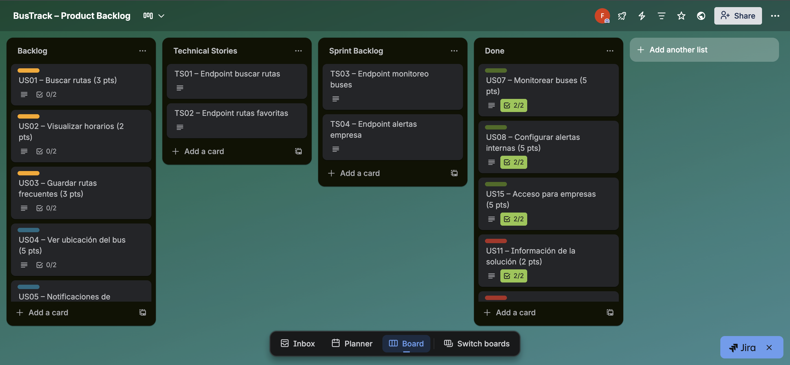

_**Figura 30.** Product Backlog y Sprint Backlog gestionados en Trello_    _**Fuente:** elaboración propia._

Enlace de Trello: <https://trello.com/b/MhxlfsAK>
  

## 3.4. Impact Mapping.

El Impact Mapping permite conectar los objetivos del negocio con los actores principales, los cambios esperados en su comportamiento y los entregables del sistema que harán posible esos impactos. A continuación, se presentan los mapas desarrollados para los dos segmentos principales: pasajeros y empresas de transporte.

### Segmento Pasajeros

**Descripción:** Este mapa muestra cómo los objetivos de negocio orientados a reducir el tiempo de espera y aumentar el uso activo de la aplicación se conectan con los dos principales perfiles de pasajeros. El impacto esperado es que los usuarios consulten BusTrack antes de salir de casa para elegir su ruta y horario. Para lograrlo, los deliverables clave son el *buscador de rutas* y el *gestor de rutas favoritas*, de los cuales se derivan las User Stories asociadas a la búsqueda de rutas, visualización de horarios y guardado de rutas frecuentes.

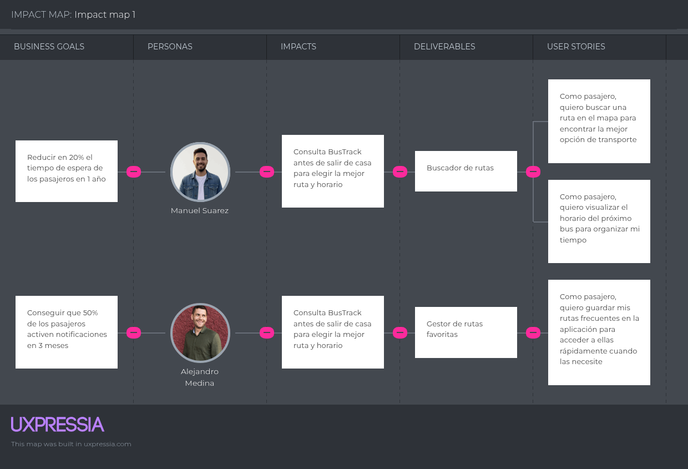

  _**Figura 28.** Impact Map del segmento de pasajeros, que conecta los objetivos de negocio de BusTrack con los cambios de comportamiento esperados en estudiantes y trabajadores, y los deliverables asociados (buscador de rutas, rutas favoritas)._    _**Fuente:** elaboración propia._

___

### Segmento Empresas de transporte

**Descripción:** Este mapa relaciona los objetivos de negocio orientados a la adopción del sistema por empresas de transporte y la reducción de quejas operativas. Los actores principales son el administrador de flota y el supervisor de rutas, cuyo impacto deseado es que monitoreen buses en tiempo real y ajusten rutas usando datos de operación. 

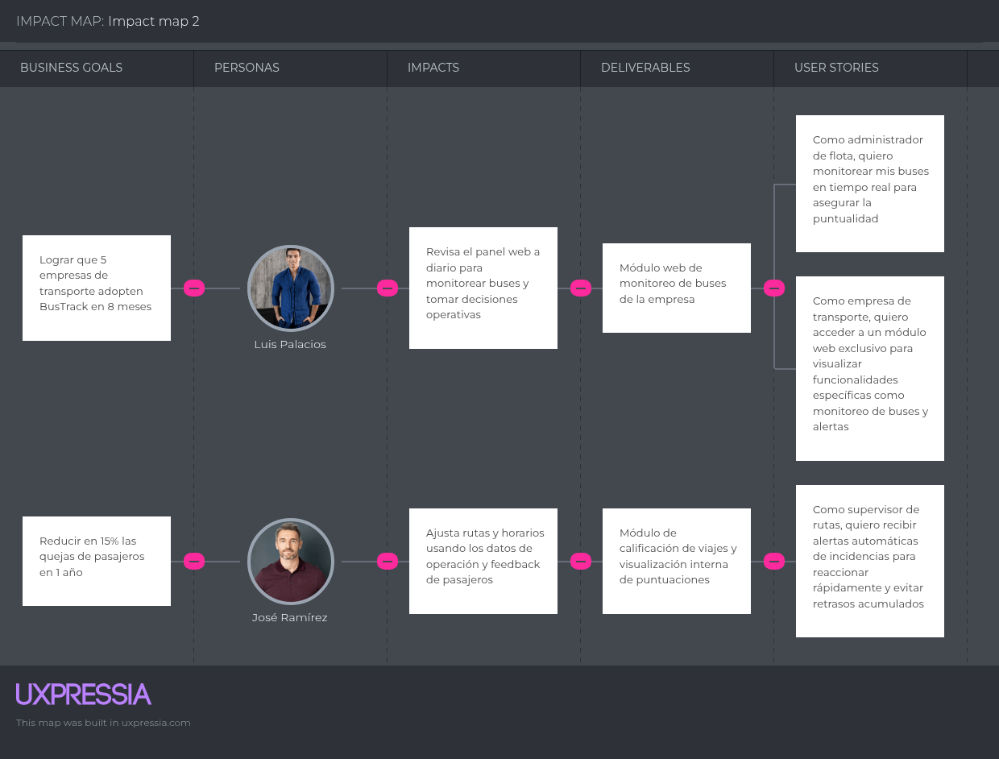

  _**Figura 29.** Impact Map del segmento de empresas de transporte, que relaciona los objetivos de adopción del sistema con los impactos deseados en administradores y supervisores de flota._  _**Fuente:** elaboración propia._

# Capítulo IV: Product Design
## 4.1. Style Guidelines.

La presente sección define las pautas visuales y de identidad gráfica empleadas en BusTrack. Su objetivo es garantizar coherencia, claridad y accesibilidad en todos los elementos de la interfaz, alineando la experiencia del usuario con la propuesta de valor y el enfoque profesional de la plataforma web.

### 4.1.1. General Style Guidelines.

- **Branding**  
  Las directrices generales de estilo de BusTrack se definen a partir de la identidad visual reflejada en la landing page desarrollada. El objetivo es asegurar coherencia, legibilidad y accesibilidad en todas las plataformas. La marca está representada por un logo que combina un ícono de bus y un marcador de ubicación, acompañado por el nombre de la startup en tipografía sans-serif bold. Este diseño transmite movilidad, confianza y simplicidad.

  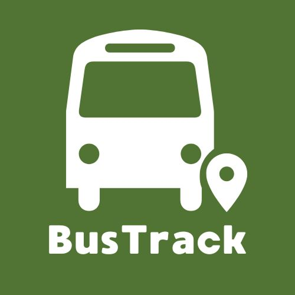

 -**Figura 31.** Logo de BusTrack, que combina un ícono de bus y un marcador de ubicación para representar el transporte urbano geolocalizado._  
 
 _**Fuente:** elaboración propia._

 

- **Paleta de colores**  
  La paleta refuerza valores de sostenibilidad, frescura y accesibilidad.    
  * **Verde principal** (#4D7B2D aprox.): utilizado en encabezados, títulos, botones y barra de navegación. Representa sostenibilidad, confianza y movilidad.  
    
    
  * **Verde claro** (#EAF4E0 aprox.): empleado en fondos de secciones secundarias (Beneficios, Misión, Visión). Aporta frescura y ligereza.   
    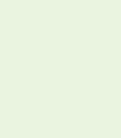
    
  * **Blanco** (#FFFFFF): color de fondo predominante para dar limpieza y contraste.   
  
    
    
  * **Gris oscuro / Negro** (#212121 aprox.): utilizado en textos secundarios y párrafos para la legibilidad. 
    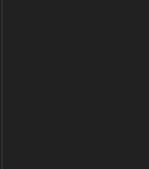

  * **Rojo de alerta** `#D90000`: reservado para acciones destructivas o críticas, como botones de “Cerrar sesión” en la página de empresas y “Borrar historial” en la página de pasajeros. 
  

  * **Amarillo de advertencia** `#F9FAB6`: se usa en la página de empresa para resaltar buses en **mantenimiento**, buses con **retraso de X minutos**, alertas de **gravedad media** y problemas **pendientes** aún no resueltos. 
  

  * **Rojo suave de error** `#FFC9C9`: empleado para indicar estados críticos en la página de empresa, como buses **inactivos** o **fuera de servicio**, así como alertas de **gravedad alta**. 
  

  * **Verde de estado OK** `#EBFAB6`: se utiliza para señalar buses **activos** y **en horario**, así como alertas de **gravedad baja** en la página de empresa. 
  

  * **Azul de acción para pasajeros** `#2479E8`: color principal de botones en las pantallas de pasajeros (por ejemplo, “Buscar ruta” o “Guardar ruta”), asociado a acciones de exploración y planificación del viaje. 
  

  * **Verde corporativo oscuro** `#255000`: aplicado a botones y elementos de acción en la página de empresas, otorgando un tono más serio y profesional para operaciones de gestión de flota. 
  

- **Tipografía**  
  Se utiliza una tipografía sans-serif, principalmente **Montserrat** en sus variantes regular y bold. La combinación busca transmitir modernidad, claridad y confianza, manteniendo legibilidad en distintos tamaños y dispositivos.

  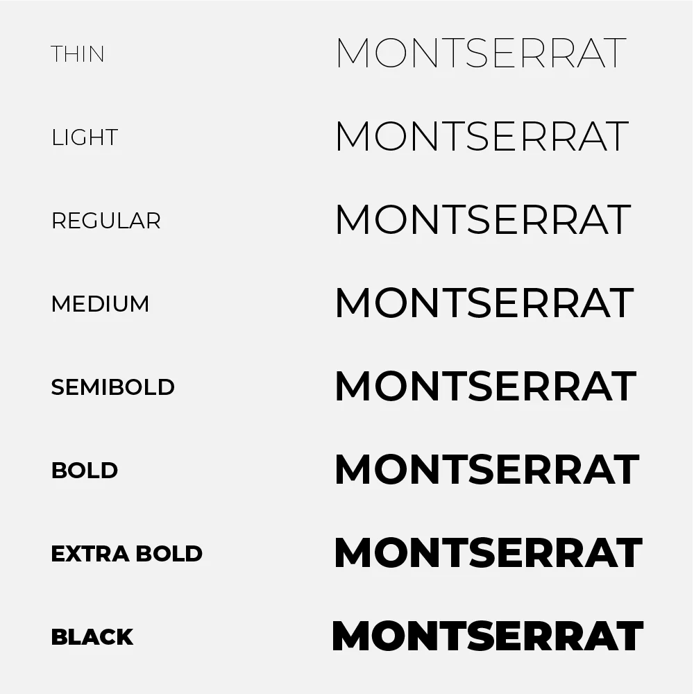

_**Figura 32.** Muestra de la tipografía Montserrat utilizada como base para los textos de BusTrack._    _**Fuente:** elaboración propia._

- **Spacing**  
  * Alrededor del logo: dejar un margen libre equivalente al alto de la letra **B** de “BusTrack”.  
  * Botones: padding interno mínimo de 12–16 px para asegurar comodidad en la interacción.  
  * Textos: interlineado de 1.5 para mejorar la lectura en pantallas.  
  * Secciones web: separar bloques de contenido con márgenes verticales de 48–64 px para evitar saturación visual y garantizar orden.

### 4.1.2. Web Style Guidelines.

Las directrices específicas para la versión web de BusTrack buscan garantizar consistencia visual, accesibilidad y adaptabilidad en distintos dispositivos.

* **Diseño responsive**
  - Estructura modular con secciones claramente diferenciadas (Hero, Cómo usar, Beneficios, Sobre Nosotros).  
  - Uso de grillas en desktop (por ejemplo, tres columnas en Beneficios y Cómo usar) y reordenamiento en formato vertical en mobile.

* **Botones y elementos interactivos**
  - Botón primario (ejemplo: “Iniciar Sesión”) en fondo blanco con borde verde, que se rellena en verde al pasar el cursor (*hover*).  
  - Tamaño mínimo de 44 px para accesibilidad en pantallas táctiles.  
  - Estados definidos: normal, hover, activo y deshabilitado.

* **Jerarquía de textos**
  - Encabezados en tipografía sans-serif (Montserrat) en negrita (H1 y H2) para lograr impacto visual.  
  - Párrafos y descripciones en sans-serif regular para asegurar legibilidad en pantalla.  
  - Colores de texto adaptados al fondo: verde sobre blanco y negro/gris sobre verde claro.

* **Imágenes y multimedia**
  - Iconografía simple en formato SVG para garantizar escalabilidad.  
  - Imágenes optimizadas con bordes redondeados para mantener coherencia visual.

 

### 4.1.3. Mobile Style Guidelines.

Las directrices de estilo móvil de BusTrack buscan asegurar una experiencia clara, rápida y accesible desde smartphones, enfocándose en usuarios que necesitan consultar rutas, ubicación de buses, paraderos cercanos y recibir notificaciones relevantes.

El diseño móvil debe mantener la identidad visual de la marca. Esto incluye el uso del verde principal como color representativo, el verde claro para fondos suaves, el blanco para mantener limpieza visual, y el azul de acción para botones dirigidos a los pasajeros. La tipografía utilizada será Montserrat, garantizando legibilidad en pantallas pequeñas. Además, la estructura debe organizarse en una sola columna, con tarjetas verticales, botones amplios y navegación simple para evitar saturación visual.

**Características generales del diseño móvil:**
- **Tamaño mínimo adecuado para elementos interactivos**: especialmente botones como “Buscar ruta”, “Guardar ruta”, “Ver en Google Maps”, “Notificar llegada” y “Guardar cambios”.
- **Estados de alerta**: deben diferenciarse por color (verde para correcto, amarillo para advertencias y rojo para situaciones críticas).

#### 4.1.3.1. iOS Mobile Style Guidelines.

Para la versión iOS, el objetivo es mantener una interfaz limpia, ordenada y visualmente ligera, respetando la navegación natural del sistema operativo.

- Las pantallas deben **priorizar el contenido principal** en la parte superior, utilizando un **desplazamiento vertical fluido** para revisar rutas, paraderos y notificaciones.
- **Botones principales** deben ubicarse en zonas de fácil alcance, preferentemente en la parte inferior o central de la pantalla. Estos botones deben tener **alto contraste** y un **tamaño adecuado** para facilitar la interacción táctil, como “Buscar ruta” o “Guardar cambios”.
- La navegación debe ser **sencilla y directa**. Es recomendable usar un **botón de retorno visible** para secciones como perfil, historial, rutas favoritas o configuración.

En cuanto al **diseño visual**, la estética debe ser **minimalista**, con **fondos claros**, **tarjetas suaves** y **textos breves**. La jerarquía tipográfica debe ser clara, usando **tipografía sans-serif** en negrita para los títulos y un estilo regular para las descripciones.

#### 4.1.3.2. Android Mobile Style Guidelines.

La versión de Android se enfoca en una **estructura visual práctica y funcional**.

- Se pueden utilizar **tarjetas**, **botones flotantes** y **barras de navegación simples** para proporcionar una experiencia de usuario fluida.
- La **navegación debe ser sencilla**, con opciones como **barra inferior** o **menú hamburguesa** para acceder a secciones como Inicio, Rutas, Paraderos, Notificaciones y Perfil.
- Los **botones** deben tener **alto contraste** y sus estados (normal, presionado, deshabilitado, activo) deben ser visualmente diferenciados para mayor claridad.

Las **tarjetas** deben mostrar información **resumida** y **organizada**. Por ejemplo, una tarjeta de paradero puede incluir el nombre, la dirección, la distancia y las rutas disponibles. Las tarjetas de notificación deben mostrar el tipo de alerta, el mensaje y la hora.

En cuanto al **diseño visual**, la versión Android debe seguir la misma **identidad visual** de BusTrack, respetando los colores, la tipografía Montserrat y el diseño responsive.

## 4.2. Information Architecture.

Esta sección describe la arquitectura de información de BusTrack, detallando la organización, etiquetado, navegación y sistemas de búsqueda utilizados. Su propósito es asegurar que los usuarios puedan acceder de manera rápida e intuitiva a las funcionalidades principales de la plataforma.

### 4.2.1. Organization Systems.

La información en BusTrack se organiza en una estructura jerárquica y modular que facilita la navegación del usuario, tanto en la landing page como en la aplicación web.

El siguiente organigrama de contenidos representa visualmente la estructura jerárquica del sitio. El diagrama inicia con la sección principal **Hero Section**, que agrupa el mensaje introductorio y el botón de acceso. Luego se despliega en tres bloques informativos: **“Cómo usar BusTrack”**, **“Beneficios”** y **“Sobre Nosotros”**. Cada bloque se descompone en subapartados que detallan las funciones básicas del sistema, tales como buscar rutas, recibir alertas, consultar información en tiempo real, guardar rutas favoritas y acceder a la misión y visión de la startup.

  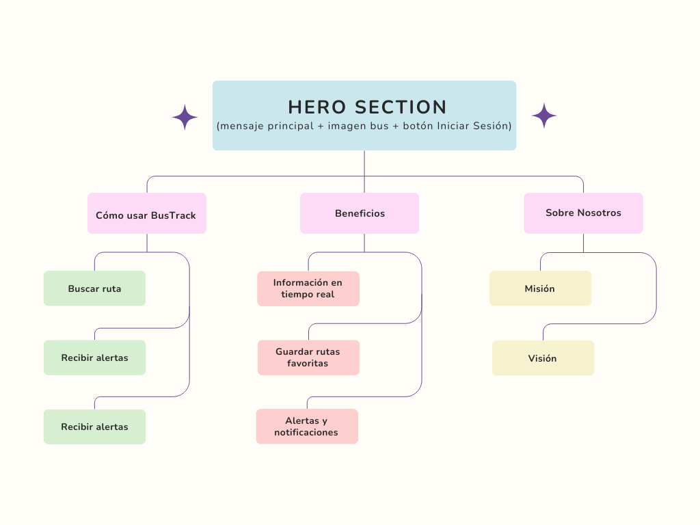

_**Figura 33.** Árbol de contenidos de BusTrack utilizado para representar la organización jerárquica de la información en la landing page._     _**Fuente:** elaboración propia._

### 4.2.2. Labeling Systems.

Los sistemas de etiquetado emplean un lenguaje claro, breve y orientado a la acción:

* Menú de navegación: “Cómo usar”, “Beneficios”, “Sobre Nosotros”.  
* Botón principal: “Iniciar Sesión”.  
* Secciones informativas: “Misión”, “Visión”.  
* Mensajes claros que transmiten utilidad inmediata, evitando tecnicismos.

### 4.2.3. SEO Tags and Meta Tags

Se emplearán etiquetas optimizadas para mejorar el posicionamiento en buscadores:

* **Meta Title:** *BusTrack – Encuentra tu bus en tiempo real*.  
* **Meta Description:** Aplicación web que muestra ubicación de buses, horarios en vivo y alertas para viajar más seguro y sin esperas innecesarias.  
* **Keywords:** transporte público, buses en tiempo real, rutas de bus, movilidad urbana, BusTrack Perú.  
* **Etiquetas alt en imágenes:** descripciones breves y precisas que indiquen el contenido visual y su propósito.

### 4.2.4. Searching Systems.

BusTrack incorporará un sistema de búsqueda interno enfocado en la funcionalidad clave:

* **Búsqueda de rutas:** el usuario podrá ingresar su punto de origen y destino para obtener información de buses disponibles.  
* **Acceso a rutas favoritas:** opción para guardar y consultar rápidamente rutas frecuentes.  
* **Resultados en tiempo real:** tiempos estimados de llegada (ETA) y alertas sobre tráfico o desvíos en las rutas seleccionadas.

### 4.2.5. Navigation Systems.

El sistema de navegación busca ser intuitivo y accesible:

* **Navegación principal (top bar):** Inicio, Cómo usar, Beneficios, Sobre Nosotros, Iniciar Sesión.  
* **Navegación secundaria:** botones de acción dentro de cada sección (por ejemplo, “Guardar rutas favoritas”).  
* **Estructura responsive:** en dispositivos móviles, el menú se transforma en un ícono de hamburguesa para ahorrar espacio.  
* **Flujo del usuario:** el recorrido esperado es Inicio → Conocer cómo funciona → Revisar beneficios → Iniciar sesión → Usar BusTrack.

## 4.3. Landing Page UI Design.

En esta sección se presentan los wireframes y mockups de la landing page de BusTrack. El diseño visual propuesto busca comunicar de forma clara el valor de la solución, facilitando que los visitantes comprendan sus beneficios y accedan a las principales funcionalidades del sistema.

### 4.3.1. Landing Page Wireframe.

Las siguientes imágenes presentan los wireframes de alta fidelidad de la landing page de BusTrack en su versión para navegador web. Cada wireframe ilustra la organización preliminar de los elementos visuales y de contenido para comunicar de forma clara qué ofrece la plataforma, a quién está dirigida y cómo se utiliza.

**Desktop Web Browser**

**Wireframe 1**

_Descripción:_ Este wireframe corresponde a la sección inicial de la landing page. Presenta el menú de navegación superior con enlaces a “Qué ofrece”, “Para quién es”, “Cómo usar” y “Beneficios”, además del selector de idioma y el botón de “Iniciar Sesión”. En el cuerpo principal se incluye un encabezado destacado acompañado de texto introductorio y una imagen representativa del uso de la plataforma, buscando captar la atención del usuario desde el primer momento.

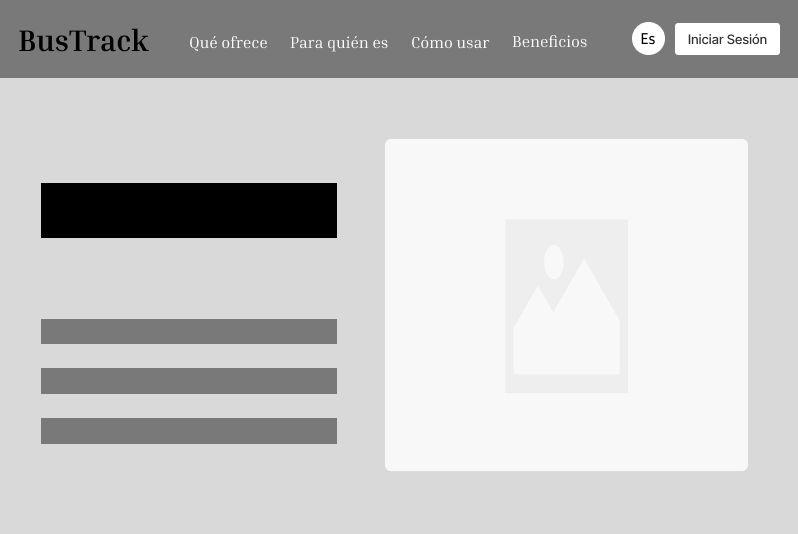

 

_**Figura 34.** Wireframe de la sección principal (Hero Section) de la landing page de BusTrack._   _**Fuente:** elaboración propia._

**Wireframe 2**

_Descripción:_ Este wireframe muestra la sección donde se describen las funcionalidades clave de BusTrack. Incluye un título central y un conjunto de tarjetas con texto descriptivo que representan los principales servicios del sistema, tales como búsqueda de rutas, visualización de buses en tiempo real y alertas. Cada tarjeta se presenta como un bloque compacto para facilitar la lectura y la comparación entre características.

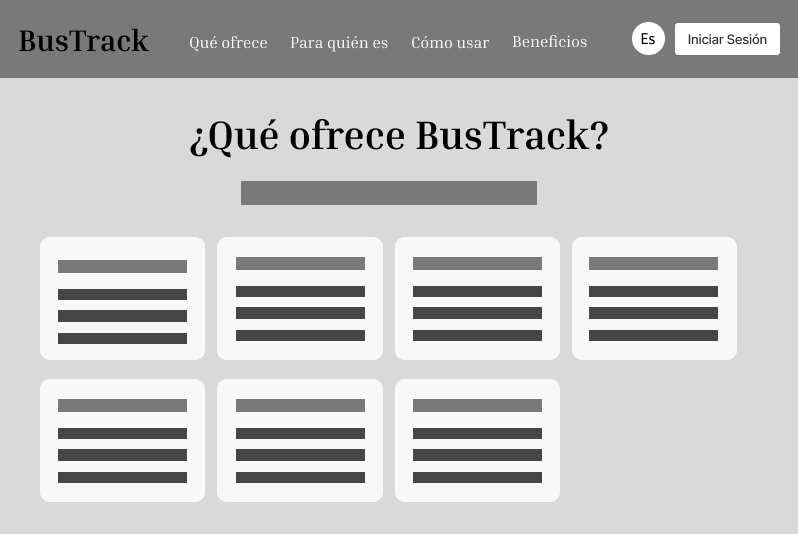

 

_**Figura 35.** Wireframe de la sección “Qué ofrece BusTrack”, con tarjetas que organizan las funciones principales del sistema._   _**Fuente:** elaboración propia._

**Wireframe 3**

_Descripción:_ Este wireframe presenta los segmentos objetivo de BusTrack. La sección destaca con un título claro y tarjetas individuales que representan a los públicos principales: estudiantes, trabajadores y empresas de transporte. Cada tarjeta está diseñada para incluir íconos o imágenes representativas y un breve resumen del problema que cada grupo enfrenta y cómo BusTrack puede ayudarle.

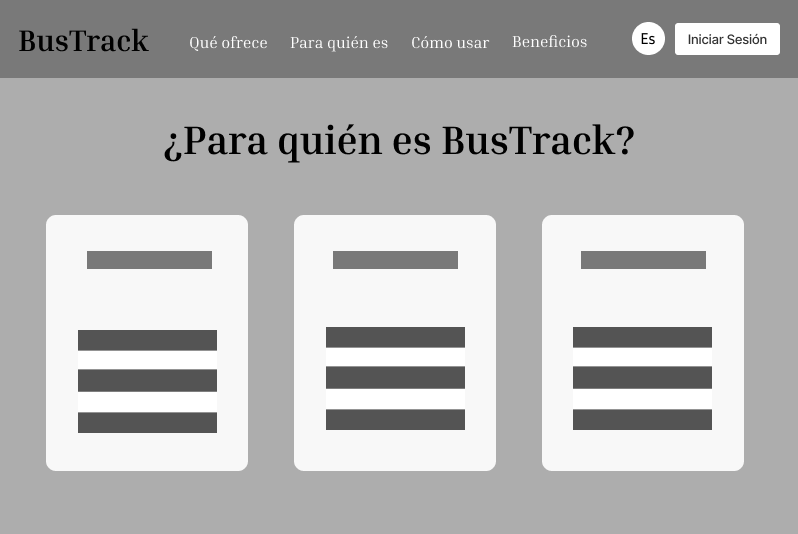

 

_**Figura 36.** Wireframe de la sección “Para quién es BusTrack”, orientada a describir los segmentos de usuario._   _**Fuente:** elaboración propia._

**Wireframe 4**

_Descripción:_ Este wireframe muestra la guía visual de cómo funciona BusTrack en tres pasos. Cada tarjeta incluye un área para una imagen representativa, un título de paso y una breve descripción. El diseño está centrado en ofrecer una explicación simple, visual y secuencial, ideal para captar la atención de nuevos usuarios que desean entender cómo utilizar la plataforma rápidamente.

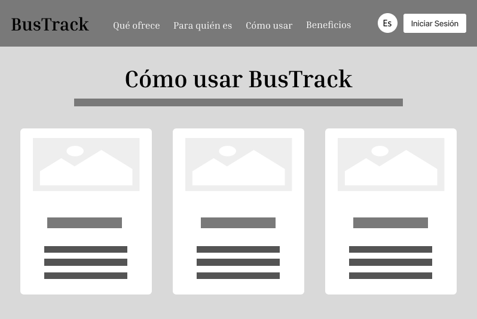

 

_**Figura 37.** Wireframe de la sección “Cómo usar BusTrack”, estructurada en tres pasos ilustrativos._   _**Fuente:** elaboración propia._

**Wireframe 5**

_Descripción:_ Este wireframe representa el apartado donde se comunican los beneficios más importantes de la plataforma. Cada tarjeta resume un beneficio clave, como la información en tiempo real, la reducción de tiempos de espera o la posibilidad de recibir alertas sobre cambios en la ruta. Se emplea una estructura de tres columnas para presentar la información de forma concisa y ordenada.

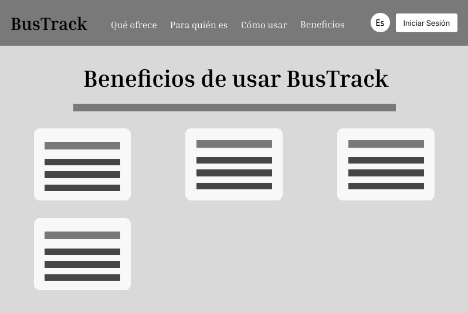

 

_**Figura 38.** Wireframe de la sección “Beneficios de usar BusTrack”, que resume las ventajas principales para el usuario._   _**Fuente:** elaboración propia._

**Wireframe 6**

_Descripción:_ Este wireframe corresponde a la sección institucional que presenta la misión y visión de BusTrack. Cada recuadro contiene el espacio destinado a describir los principios y objetivos de la startup. El diseño busca transmitir profesionalismo y claridad mediante bloques bien definidos y de fácil lectura. 

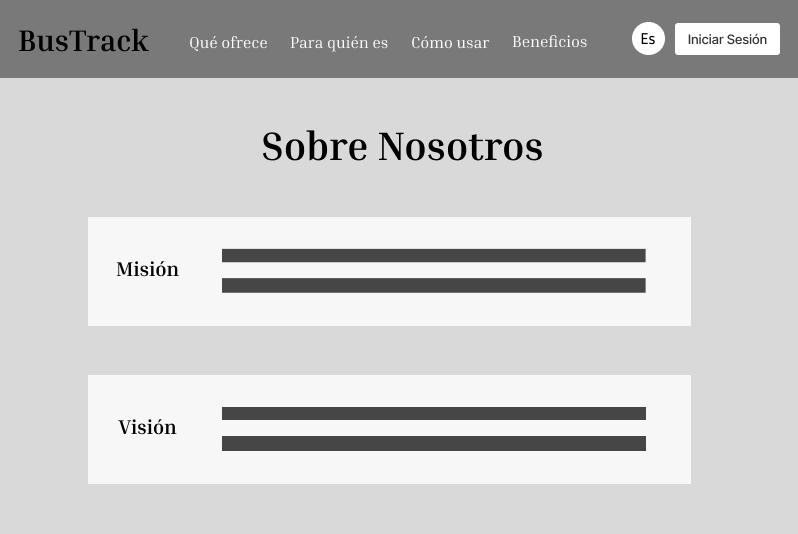

 

_**Figura 39.** Wireframe de la sección “Sobre Nosotros”, con énfasis en misión y visión de BusTrack._   _**Fuente:** elaboración propia._

**Wireframe 7**

_Descripción:_ Este wireframe muestra la última sección de la landing page, destinada a presentar contenido audiovisual. Incluye dos tarjetas amplias diseñadas para alojar videos informativos: uno sobre el producto BusTrack y otro relacionado al tiempo o funcionamiento general. Cada tarjeta dispone de un área de imagen superior para miniaturas y un espacio inferior para descripciones complementarias.

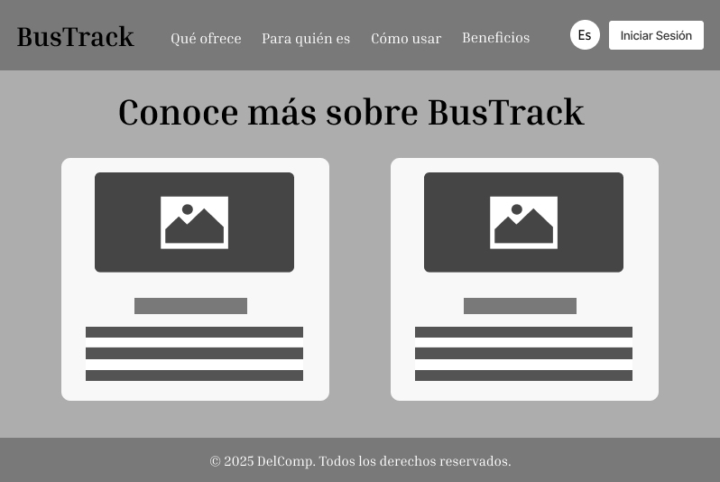

 

_**Figura 40.** Wireframe de la sección “Conoce más sobre BusTrack”, compuesta por dos tarjetas para la presentación de videos informativos._   _**Fuente:** elaboración propia._

___

**Mobile Web Browser**

Para la versión móvil, los wireframes muestran cómo la landing page de BusTrack se adapta mediante un diseño responsivo. Los elementos se reorganizan en un formato vertical, priorizando la legibilidad, la jerarquía visual y la accesibilidad en pantallas pequeñas. Las secciones mantienen su estructura conceptual, pero se presentan de manera simplificada para facilitar la navegación desde dispositivos móviles.

**Wireframe 1**

_Descripción:_ Este wireframe muestra la versión móvil de la sección principal. Incluye el encabezado superior con el nombre de BusTrack, selector de idioma y botón de “Iniciar Sesión”. A continuación, se dispone un bloque de título destacado, texto introductorio y un espacio para una imagen representativa. La distribución vertical permite que el contenido principal sea visible inmediatamente al ingresar al sitio.

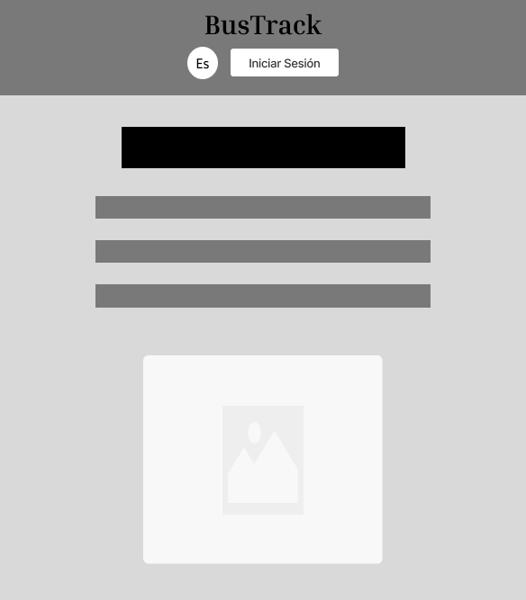
 

_**Figura 41.** Wireframe móvil de la sección principal (Hero Section) de BusTrack._   _**Fuente:** elaboración propia._

**Wireframe 2**

_Descripción:_ Este wireframe presenta la sección donde se describen las funcionalidades principales de BusTrack en formato móvil. Las tarjetas informativas se apilan verticalmente, permitiendo una lectura fluida y evitando desplazamientos laterales. Cada tarjeta incluye espacio para título, descripción y posible iconografía.

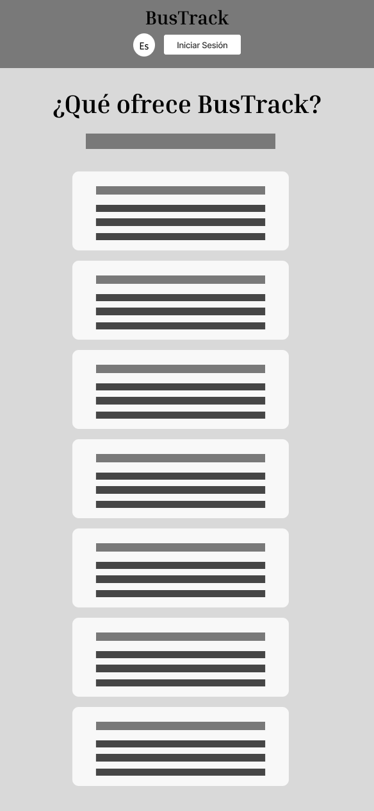
 

_**Figura 42.** Wireframe móvil de la sección “Qué ofrece BusTrack”, con tarjetas organizadas en formato vertical._   _**Fuente:** elaboración propia._

**Wireframe 3**

_Descripción:_ Este wireframe se enfoca en los segmentos objetivo. En la versión móvil, cada categoría (estudiantes, trabajadores y empresas de transporte) se presenta como tarjetas independientes que se muestran una debajo de la otra. Esto facilita que el usuario identifique rápidamente el grupo al que pertenece y cómo la plataforma puede ayudarlo.

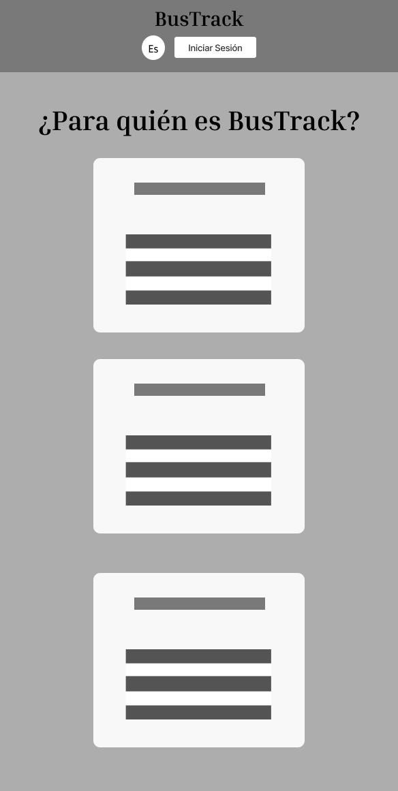
 

_**Figura 43.** Wireframe móvil de la sección “Para quién es BusTrack”, con tarjetas segmentadas individualmente._   _**Fuente:** elaboración propia._

**Wireframe 4**

_Descripción:_ Este wireframe describe el flujo de uso de BusTrack en tres pasos. Cada paso se representa con una imagen, un título y texto explicativo. El diseño vertical permite una presentación secuencial clara y adecuada para pantallas pequeñas, facilitando que los usuarios entiendan rápidamente cómo interactuar con la plataforma.

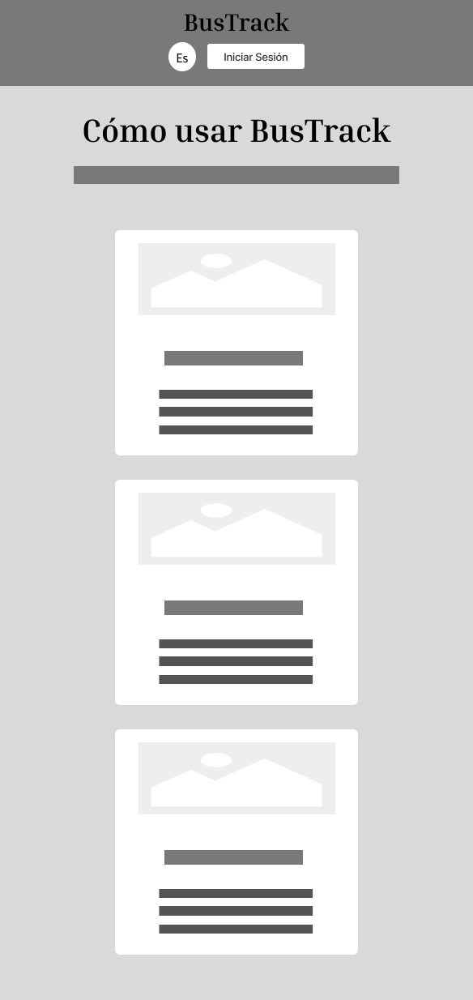
 

_**Figura 44.** Wireframe móvil de la sección “Cómo usar BusTrack”, estructurada en tres pasos explicativos._   _**Fuente:** elaboración propia._

**Wireframe 5**

_Descripción:_ Este wireframe muestra una serie de tarjetas que explican los principales beneficios de la plataforma. En su formato móvil, cada beneficio ocupa un bloque independiente, con título y texto informativo. La distribución busca asegurar una lectura cómoda y una jerarquía adecuada de contenido.

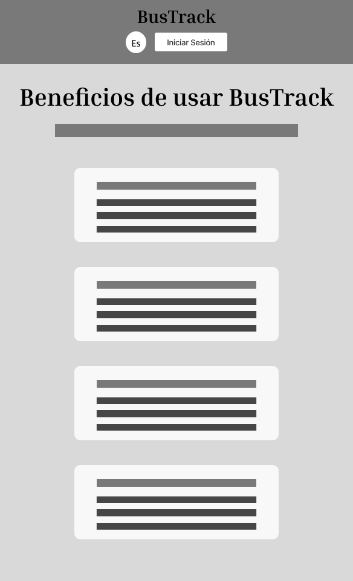
 

_**Figura 45.** Wireframe móvil de la sección “Beneficios de usar BusTrack”, con tarjetas apiladas para facilitar la lectura._   _**Fuente:** elaboración propia._

**Wireframe 6**

_Descripción:_ Este wireframe representa la versión móvil de la sección institucional que presenta la misión y visión de la startup. Cada bloque está claramente delimitado, con encabezados y espacio para texto explicativo. El diseño asegura una lectura clara y ordenada en dispositivos móviles.

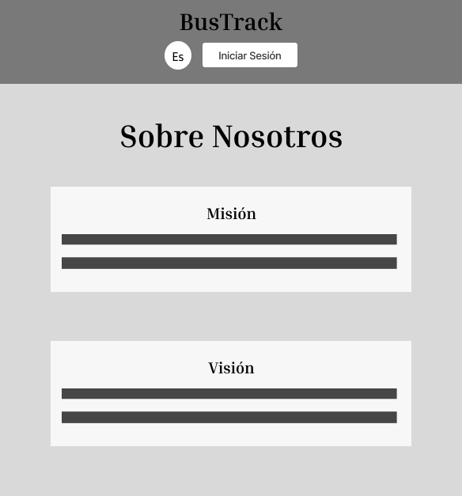
 

_**Figura 46.** Wireframe móvil de la sección “Sobre Nosotros”, con presentación vertical de misión y visión._   _**Fuente:** elaboración propia._

**Wireframe 7**

_Descripción:_ Este wireframe corresponde a la última sección de la landing page, destinada a mostrar contenido audiovisual. Incluye dos tarjetas amplias donde se colocarán videos informativos. Cada tarjeta cuenta con un espacio para miniatura, título y texto complementario, adaptados completamente al formato vertical móvil. 

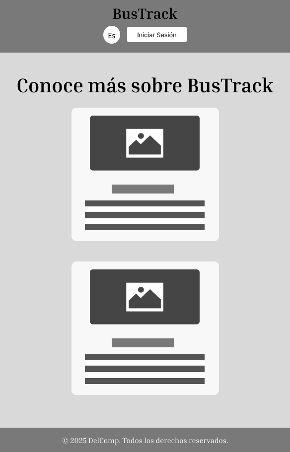
 

_**Figura 47.** Wireframe móvil de la sección “Conoce más sobre BusTrack”, con dos tarjetas para videos informativos._   _**Fuente:** elaboración propia._

### 4.3.2. Landing Page Mock-up.

En esta sección se presentan los mockups finales del Landing Page de BusTrack, desarrollados a partir de los wireframes previos. Estos mockups reflejan el diseño visual completo, incluyendo paleta de colores, tipografías, distribución de contenido y elementos de interacción tanto para usuarios pasajeros como para empresas. 

### Desktop Web Browser

**Mock-up 1**

_Descripción:_ Este mock-up corresponde al Hero Section de la landing page. Presenta el título principal y un mensaje introductorio que explica que BusTrack permite encontrar buses en tiempo real y viajar sin esperas innecesarias. A la izquierda se ubica el texto explicativo sobre la plataforma y su propósito; a la derecha, una imagen representativa de un bus en ruta. También se observa la barra de navegación superior con las secciones principales y el selector de idioma.

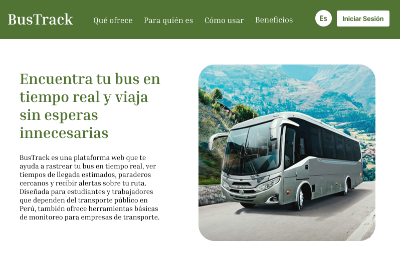

 

_**Figura 48.** Hero Section del landing page de BusTrack._   _**Fuente:** elaboración propia._

**Mock-up 2**

_Descripción:_ Este mock-up muestra la sección “¿Qué ofrece BusTrack?”, donde se detallan las funcionalidades principales del MVP. Incluye módulos con iconos y descripciones breves: búsqueda de rutas, ubicación en tiempo real, tiempos estimados de llegada (ETA), paraderos cercanos, alertas, rutas favoritas y un panel básico de monitoreo para empresas. Esta sección resume claramente el valor de la plataforma.

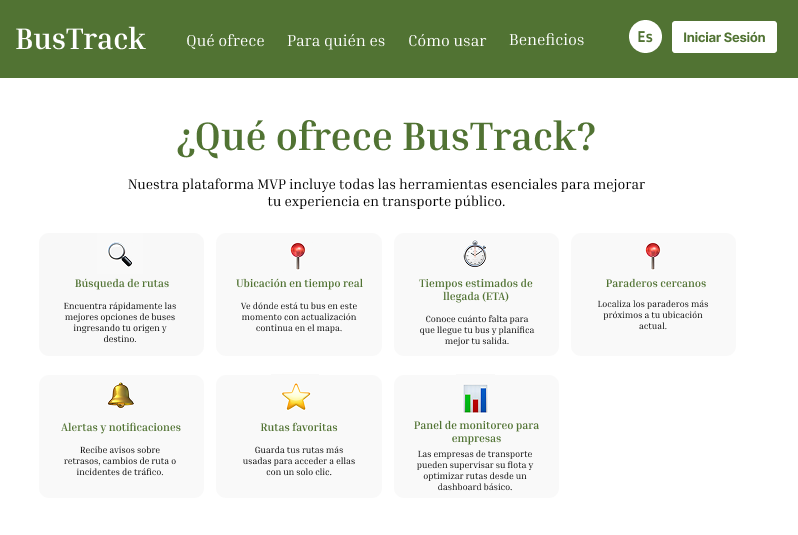

 

_**Figura 49.** Funcionalidades principales del MVP de BusTrack._   _**Fuente:** elaboración propia._

**Mock-up 3**

_Descripción:_ En este mock-up se presenta la sección “¿Para quién es BusTrack?”, compuesta por tres bloques dirigidos a los distintos públicos objetivo: estudiantes, trabajadores y empresas de transporte. Cada tarjeta incluye un icono representativo y un texto explicando los beneficios específicos para cada tipo de usuario.

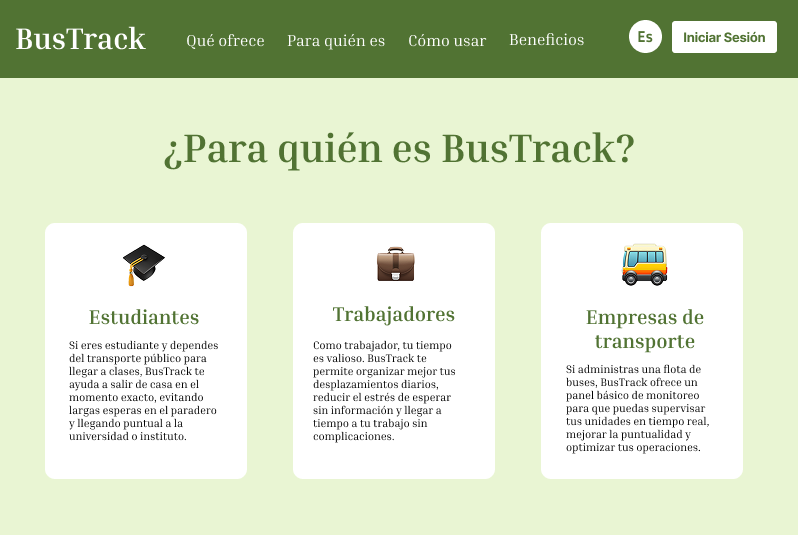

 

_**Figura 50.** Públicos objetivo de BusTrack._   _**Fuente:** elaboración propia._

**Mock-up 4**

_Descripción:_ Este mock-up desarrolla la sección “Cómo usar BusTrack”, explicada en tres pasos: buscar la ruta, ver buses en tiempo real y recibir alertas. Cada paso incluye una imagen ilustrativa, un título numerado y una descripción breve que orienta al usuario en el uso básico de la plataforma.

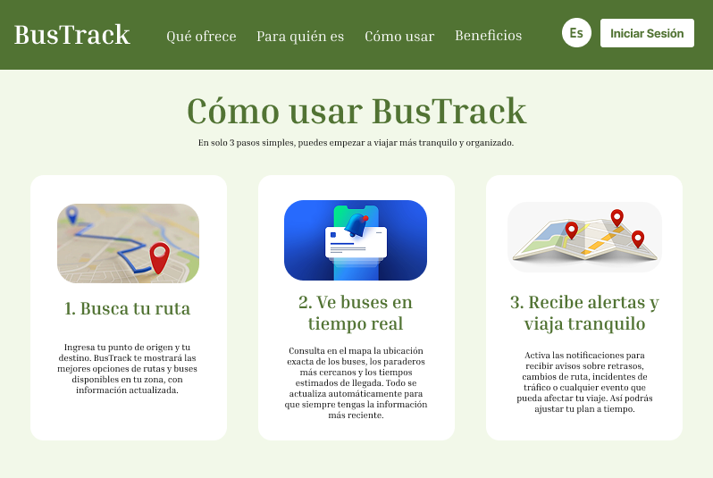

 

_**Figura 51.** Pasos para utilizar BusTrack._   _**Fuente:** elaboración propia._

**Mock-up 5**

_Descripción:_ En este mock-up se muestra la sección “Beneficios de usar BusTrack”. Incluye tarjetas explicativas sobre cómo la plataforma mejora la experiencia del usuario: información en tiempo real, ahorro de tiempo, mayor seguridad al viajar y mejora operativa para empresas. Esta sección destaca el impacto positivo del servicio.

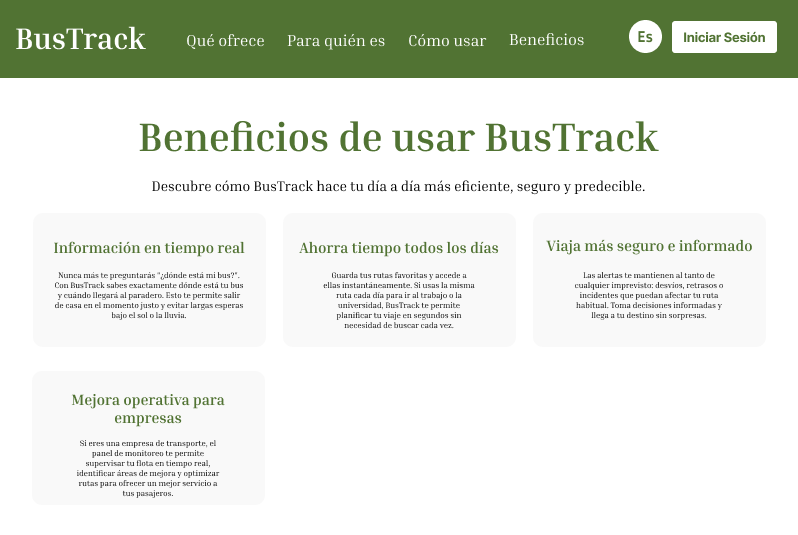

 

_**Figura 52.** Beneficios principales para usuarios y empresas._   _**Fuente:** elaboración propia._

**Mock-up 6**

_Descripción:_ Este mock-up corresponde a la sección “Sobre Nosotros”, donde se presenta la misión y visión de BusTrack. Cada elemento está organizado en tarjetas horizontales con títulos destacados y descripciones que explican el propósito y aspiración de la plataforma en el contexto del transporte público peruano.

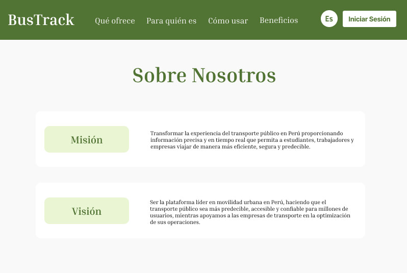

 

_**Figura 53.** Misión y visión de BusTrack._   _**Fuente:** elaboración propia._

**Mock-up 7**

_Descripción:_ El mock-up final muestra la sección “Conoce más sobre BusTrack”, la cual incorpora dos videos: uno sobre el funcionamiento del producto y otro presentando al equipo detrás del proyecto. Cada video cuenta con un título y un breve texto descriptivo que permiten comprender el contenido antes de reproducirlo. También se observa el footer corporativo de la página.

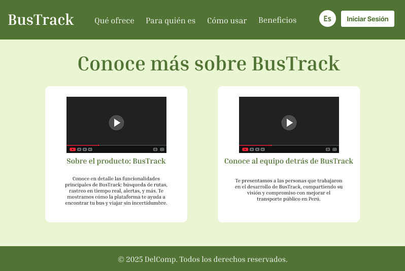

 

_**Figura 54.** ección informativa con videos sobre el producto y el equipo._   _**Fuente:** elaboración propia._

___

## Mobile Web Browser

**Mock-up 1**

_Descripción:_ Este mockup corresponde a la sección Hero en su versión móvil. Incluye el título principal de la landing page, un texto descriptivo breve sobre BusTrack y una imagen ilustrativa central. El diseño prioriza el contenido textual en la parte superior y coloca la imagen del bus más abajo, siguiendo la lógica de desplazamiento natural en dispositivos móviles.

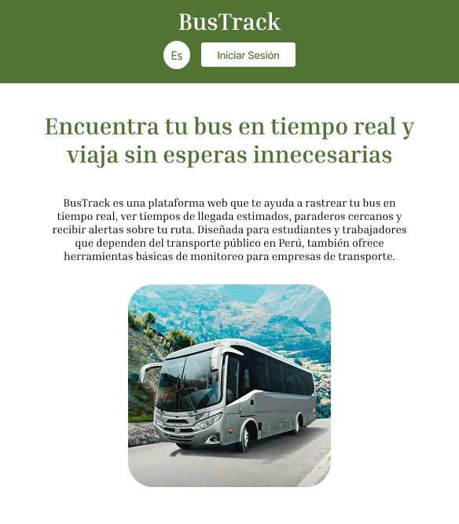

 

_**Figura 55.** Mockup móvil de la sección Hero de BusTrack._   _**Fuente:** elaboración propia._

**Mock-up 2**

_Descripción:_ Este mockup muestra la sección ¿Qué ofrece BusTrack?, adaptada al formato vertical. Cada funcionalidad se presenta como una tarjeta independiente apilada una debajo de otra, con su icono correspondiente, título y descripción. Este formato garantiza una lectura clara y fluida desde el móvil.

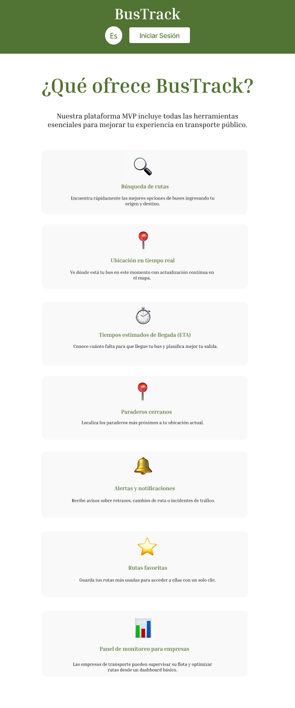

 

_**Figura 56.** Mockup móvil de la sección de funcionalidades de BusTrack._   _**Fuente:** elaboración propia._

**Mock-up 3**

_Descripción:_ Este mockup presenta la sección ¿Para quién es BusTrack? en vista móvil. Cada perfil de usuario (estudiantes, trabajadores y empresas de transporte) se muestra en una tarjeta individual, en formato vertical, con su respectivo ícono y descripción detallada.

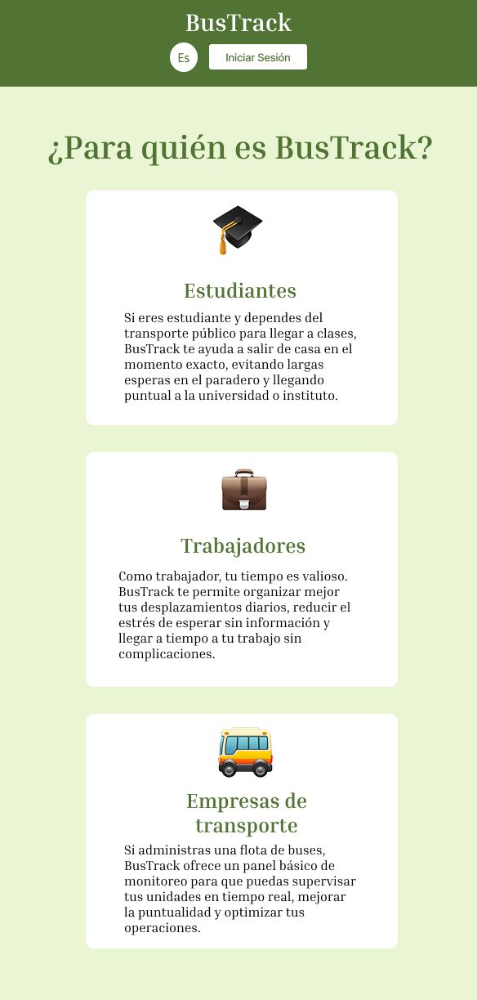

 

_**Figura 57.** Mockup móvil de los segmentos de usuarios de BusTrack._   _**Fuente:** elaboración propia._

**Mock-up 4**

_Descripción:_ Este mockup muestra la sección Cómo usar BusTrack, que en versión móvil organiza los tres pasos del proceso en bloques verticales claramente diferenciados. Cada paso incluye una imagen, un título y un texto explicativo para guiar al usuario.

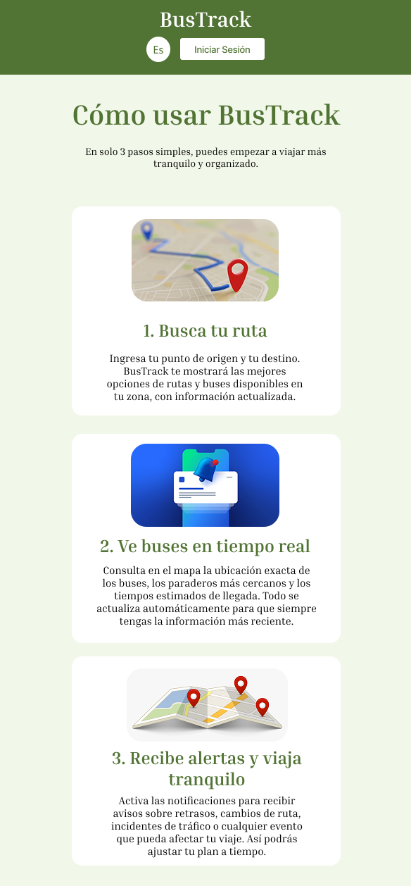

 

_**Figura 58.** Mockup móvil del apartado “Cómo usar BusTrack”._   _**Fuente:** elaboración propia._

**Mock-up 5**

_Descripción:_ Este mockup corresponde a la sección Beneficios de usar BusTrack, diseñada para móviles. Las tarjetas de beneficios se apilan verticalmente, cada una con un título destacado y un texto explicativo detallado que mejora la comprensión de las ventajas ofrecidas.

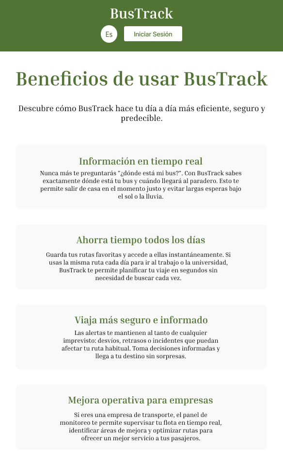

 

_**Figura 59.** Mockup móvil de la sección de beneficios de BusTrack._   _**Fuente:** elaboración propia._

**Mock-up 6**

_Descripción:_ Este mockup presenta la sección Sobre Nosotros en formato móvil. Incluye la misión y visión de BusTrack dentro de tarjetas amplias y centradas, priorizando la lectura cómoda y la jerarquía del contenido institucional.

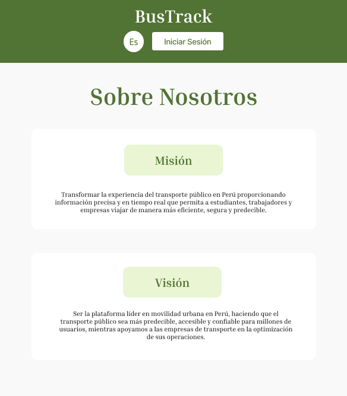

 

_**Figura 60.** Mockup móvil de la sección institucional “Sobre Nosotros”._   _**Fuente:** elaboración propia._

**Mock-up 7**

_Descripción:_ Este mockup corresponde a la sección final Conoce más sobre BusTrack, donde se presentan los videos informativos del producto y del equipo. En la versión móvil, cada video se organiza en tarjetas verticales independientes con su título y descripción, manteniendo una estructura clara y accesible.

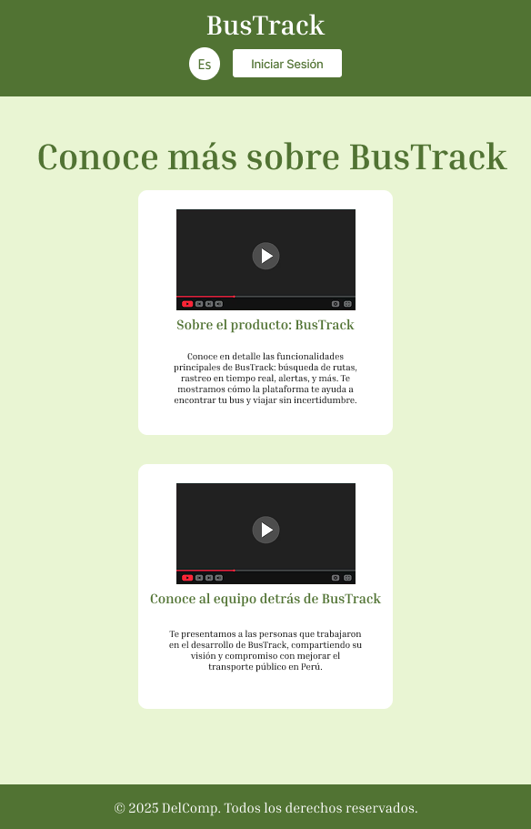

 

_**Figura 61.** Mockup móvil de la sección con videos informativos de BusTrack._   _**Fuente:** elaboración propia._

Link del figma: https://www.figma.com/design/gfihE4UEnoiFtzf54xXuL8/BusTrack-wireframes-y-mockups?node-id=0-1&t=vbZPvREtMGxi30PI-1 

## 4.4. Mobile Applications UX/UI Design.
### 4.4.1. Mobile Applications Wireframes.
### 4.4.2. Mobile Applications Wireflow Diagrams.
### 4.4.3. Mobile Applications Mock-ups.
### 4.4.4. Mobile Applications User Flow Diagrams.
## 4.5. Mobile Applications Prototyping.
### 4.5.1. Android Mobile Applications Prototyping.
### 4.5.2. iOS Mobile Applications Prototyping.
## 4.6. Web Applications UX/UI Design.

Los wireframes y mockups aquí presentados muestran la estructura inicial de las vistas principales, priorizando la jerarquía visual, la simplicidad de navegación, la accesibilidad, la escalabilidad futura y la claridad en la presentación de información crítica como rutas, paraderos, notificaciones y configuraciones del usuario.

### 4.6.1. Web Applications Wireframes.

En esta sección se presentan los wireframes de la aplicación web.

**Wireframe 1**

_Descripción:_ Este wireframe corresponde a la pantalla inicial de selección de tipo de usuario. La interfaz presenta dos rutas principales: Pasajero y Empresa, cada una representada mediante botones con alto contraste para facilitar su identificación. En la parte superior derecha se incorpora el selector de idioma, alineado con la estrategia de internacionalización (i18n). El diseño mantiene una estructura centrada, con una tarjeta principal que agrupa el contenido, asegurando un primer contacto claro y simple.

 

_**Figura 62.** Wireframe de pantalla inicial de selección de tipo de usuario._   _**Fuente:** elaboración propia._

**Wireframe 2**

_Descripción:_ La segunda pantalla está orientada al inicio de sesión para pasajeros. El diseño divide el espacio en dos secciones: una ilustración a la izquierda que sirve como componente visual de apoyo y un módulo de autenticación a la derecha. El formulario de Log In incorpora campos básicos junto con un botón de acción primaria. Se mantiene el selector de idioma visible, reforzando la accesibilidad lingüística. La jerarquía tipográfica resalta la sección PASAJEROS como título principal.

 

_**Figura 63.** Wireframe de pantalla de inicio de sesión para pasajeros._   _**Fuente:** elaboración propia._

**Wireframe 3**

_Descripción:_ Este wireframe representa la vista de creación de cuenta para pasajeros. Similar al wireframe previo, se emplea una estructura de dos columnas: imagen ilustrativa y formulario de registro. El diseño incluye opción de inicio con Google, campo destacado por su accesibilidad y rapidez. Debajo, se organizan los campos requeridos para el registro tradicional. El botón principal “Crear cuenta” se sitúa al final para reforzar el flujo natural de arriba hacia abajo.

 

_**Figura 64.** Wireframe de pantalla de creación de cuenta para pasajeros._   _**Fuente:** elaboración propia._

**Wireframe 4**

_Descripción:_ El cuarto wireframe presenta la vista principal de la web app para pasajeros, donde se accede a funciones clave como buscar rutas, revisar notificaciones o ver paraderos. La navegación superior agrupa las opciones principales mediante una barra horizontal mantenida fija. En el área central se destaca una sección de búsqueda rápida y un panel con el mapa principal, permitiendo al usuario comenzar la interacción de manera directa e intuitiva.

 

_**Figura 65.** Wireframe de pantalla principal del pasajero con barra de navegación._   _**Fuente:** elaboración propia._

**Wireframe 5**

_Descripción:_ Este wireframe muestra los resultados de búsqueda de rutas. El mapa central continúa siendo el elemento visual predominante, mientras que al lado derecho se presenta un panel con información detallada del viaje: ruta encontrada, tiempos estimados y opciones de acción como “Guardar ruta” o “Ver rutas en Google Maps”. En la parte inferior se agrega el botón “Nueva búsqueda” facilitando la repetición del proceso.

 

_**Figura 66.** Wireframe de pantalla de resultados de búsqueda de rutas._   _**Fuente:** elaboración propia._

**Wireframe 6**

_Descripción:_ El wireframe de la sección de Notificaciones presenta una vista simplificada donde las alertas del sistema o de rutas favoritas se muestran en tarjetas organizadas verticalmente. La jerarquía visual prioriza el título y luego la lista de alertas. Esta vista fue diseñada bajo principios de legibilidad, permitiendo identificar rápidamente actualizaciones relevantes sin elementos distractores.

 

_**Figura 67.** Wireframe de pantalla de notificaciones para el pasajero._   _**Fuente:** elaboración propia._

**Wireframe 7**

_Descripción:_ Este diseño corresponde a la sección de Paraderos Cercanos, donde los usuarios pueden visualizar su ubicación y los paraderos más próximos. A la izquierda se muestran tarjetas con información de cada paradero, incluyendo distancia aproximada y botones de interacción (como “Cómo llegar” o “Notificar llegada”). A la derecha se presenta un mapa ampliado que funciona como referencia espacial principal.

 

_**Figura 68.** Wireframe de pantalla de paraderos cercanos con mapa y tarjetas informativas._   _**Fuente:** elaboración propia._

**Wireframe 8**

_Descripción:_ Este wireframe corresponde a la pantalla de Perfil del usuario pasajero. A la izquierda se ubica la tarjeta del perfil, que incluye imagen del usuario, información básica y accesos a configuraciones personalizadas. A la derecha, se presenta una lista de rutas guardadas o funciones adicionales, cada una con un botón “Detalles” que permite acceder a información ampliada. El diseño refuerza la separación lógica entre identidad y actividades.

 

_**Figura 69.** Wireframe de pantalla de perfil del pasajero._   _**Fuente:** elaboración propia._

**Wireframe 9**

_Descripción:_ Aquí se presenta la vista de Rutas Favoritas, accesible desde el perfil del usuario. En la parte superior izquierda se incluye un botón “Volver” para facilitar la navegación. En el área central se ubica el panel principal con los campos de búsqueda de rutas guardadas y el botón “Buscar rutas”. Esta vista mantiene un diseño minimalista, destacando únicamente los elementos necesarios para la acción correspondiente.

 

_**Figura 70.** Wireframe de pantalla de rutas favoritas del usuario._   _**Fuente:** elaboración propia._

**Wireframe 10**

_Descripción:_ Este wireframe corresponde al Historial de viajes, donde el usuario puede visualizar viajes pasados en un formato de tarjetas grandes. A la izquierda se incorpora un botón “Volver” y a la derecha un botón para borrar el historial, permitiendo gestionar los registros de forma clara. La disposición en dos columnas mejora el aprovechamiento del espacio y contribuye a un escaneo visual rápido.

 

_**Figura 71.** Wireframe de pantalla del historial de viajes del usuario._   _**Fuente:** elaboración propia._

**Wireframe 11**

_Descripción:_ Este wireframe presenta la sección de Gestión de Notificaciones del usuario pasajero. En la parte superior izquierda se incorpora el botón “Volver”, facilitando la navegación hacia la vista previa. El módulo central contiene un bloque amplio destinado a la visualización y edición de las preferencias de notificaciones, como alertas de llegada, cambios de ruta o interrupciones del servicio. En la esquina inferior derecha se ubica el botón de acción primaria “Guardar cambios”, asegurando que las modificaciones realizadas se confirmen de forma explícita. El diseño mantiene la coherencia visual con la línea minimalista de la Web App.

 

_**Figura 72.** Wireframe de la pantalla de configuración de notificaciones del pasajero._   _**Fuente:** elaboración propia._

**Wireframe 12**

_Descripción:_ Este wireframe corresponde a la vista de Configuración de la cuenta del pasajero. El diseño organiza los elementos dentro de una tarjeta principal que contiene: una foto de perfil, el botón “Cambiar foto”, y tres campos para modificar información personal (como correo, nombre o número de contacto). En la parte inferior se ubica el botón “Guardar cambios”, reforzando el flujo lógico de edición. El diseño prioriza la simplicidad y la accesibilidad para que el usuario gestione su información sin fricción.

 

_**Figura 73.** Wireframe de configuración de cuenta del pasajero._   _**Fuente:** elaboración propia._

**Wireframe 13**

_Descripción:_ El wireframe 13 muestra la pantalla de inicio de sesión para empresas. Al igual que en la versión para pasajeros, se utiliza un diseño en dos columnas: una imagen descriptiva a la izquierda y un formulario de Log In a la derecha. La sección está titulada como EMPRESAS, resaltando la diferenciación del flujo empresarial. El formulario incluye campos de correo y contraseña, además de un botón “Continuar”. El selector de idioma se mantiene en la esquina superior derecha.

 

_**Figura 74.** Wireframe de la pantalla de inicio de sesión para empresas._   _**Fuente:** elaboración propia._

**Wireframe 14**

_Descripción:_ Este wireframe representa la pantalla de creación de cuenta para empresas. Incluye una estructura detallada con múltiples campos necesarios para el registro empresarial, como razón social, RUC, representante, correo corporativo, entre otros. También se incorpora la opción “Continúa con Google” en la parte superior, alineada con prácticas modernas de autenticación rápida. El formulario se extiende verticalmente para incluir toda la información necesaria, culminando en el botón de acción “Crear Cuenta”.

 

_**Figura 75.** Wireframe de la pantalla de registro de cuenta empresarial._   _**Fuente:** elaboración propia._

**Wireframe 15**

_Descripción:_ Este wireframe corresponde a la vista principal de Monitoreo en Tiempo Real para empresas. A la izquierda se presenta un mapa de gran tamaño donde los administradores pueden visualizar la ubicación de toda la flota en tiempo real. A la derecha se muestran tarjetas con información resumida de cada bus, incluyendo estado y ruta. En la parte superior se incorporan dos botones clave: “+ Agregar bus” y “Actualizar datos”, permitiendo gestionar la flota de manera rápida y eficiente. Esta pantalla constituye uno de los módulos críticos del panel empresarial.

 

_**Figura 76.** Wireframe de la pantalla de monitoreo en tiempo real para empresas._   _**Fuente:** elaboración propia._

**Wireframe 16**

_Descripción:_ Este wireframe corresponde a la sección de Alertas Internas dentro del panel empresarial. En la parte superior se muestra un menú horizontal para filtrar las alertas según categorías (ej. mantenimiento, incidencias, retrasos). A la derecha se incorpora el botón “+ Nueva alerta”, permitiendo a la empresa registrar incidencias operativas. En el área inferior se despliega un contenedor amplio para la visualización o edición de detalles de cada alerta. El diseño prioriza la claridad y la gestión centralizada de información crítica.

 

_**Figura 77.** Wireframe de la pantalla de alertas internas del panel empresarial._   _**Fuente:** elaboración propia._

**Wireframe 17**

_Descripción:_ Este wireframe presenta la vista de Administración de Flota. En la parte superior se muestra una barra de búsqueda para localizar buses específicos. A la derecha se encuentra el botón “+ Agregar Bus”, que permite registrar nuevas unidades en la plataforma. Debajo, se organiza una tabla amplia donde cada fila representa un bus e incluye información como placa, ruta asignada, estado y opciones de gestión. Esta vista optimiza las tareas administrativas mediante una estructura clara y ordenable.

 

_**Figura 78.** Wireframe de la pantalla de administración de flota._   _**Fuente:** elaboración propia._

**Wireframe 18**

_Descripción:_ Este wireframe corresponde a la pantalla de Configuración Empresarial, donde la empresa puede modificar información administrativa, activar o desactivar permisos internos y gestionar configuraciones de seguridad. La pantalla se organiza en tres bloques principales:

- Información general de la empresa con botón “Guardar Cambios”.

- Gestión de permisos internos, representada en una tabla con interruptores para habilitar funciones específicas.

- Cambiar contraseña, para reforzar la seguridad de la cuenta corporativa.
Al final se incorpora un botón destacado de “Cerrar Sesión”. El diseño mantiene simetría y modularidad para facilitar la edición independiente por secciones.

 

_**Figura 79.** Wireframe de la pantalla de configuración empresarial._   _**Fuente:** elaboración propia._

### 4.6.2. Web Applications Wireflow Diagrams.

Los Wireflow Diagrams integran la estructura de los wireframes con los flujos de navegación del usuario, permitiendo visualizar de forma clara y secuencial cómo se desarrollan las diferentes interacciones dentro de la aplicación web de BusTrack.
A diferencia de los wireframes aislados, los wireflows muestran no solo la arquitectura visual de cada pantalla, sino también las transiciones que conectan los distintos estados de la interfaz, facilitando la comprensión del comportamiento del sistema desde una perspectiva holística.

Para este proyecto, los wireflows se organizaron en dos grandes recorridos principales:

- Flujo de Pasajero, donde se representan acciones como iniciar sesión, buscar rutas, acceder a notificaciones, visualizar paraderos cercanos, gestionar el perfil y consultar rutas favoritas o historial de viajes.

- Flujo de Empresa, que incluye procesos de autenticación empresarial, monitoreo en tiempo real, gestión de alertas internas, administración de flota y edición de configuraciones corporativas.

Cada conjunto de flechas de navegación señala la interacción esperada del usuario, mientras que los bloques visuales representan pantallas clave previamente desarrolladas en los wireframes.

_**Figura 80.** Wireflow general de las aplicaciones web de BusTrack, que integra los flujos de navegación de usuarios pasajeros y empresariales._   _**Fuente:** elaboración propia._

### 4.6.3. Web Applications Mock-ups.

En esta sección se presentan los primeros mock-ups desarrollados para el flujo del usuario pasajero, mostrando pantallas clave como el acceso, creación de cuenta, búsqueda de rutas, paraderos cercanos y visualización del perfil.

**Mock-up 1**

_Descripción:_ Este mock-up corresponde a la pantalla de bienvenida de BusTrack en su versión web. Presenta el logotipo oficial al centro como elemento principal de identidad visual, acompañado de dos botones que permiten seleccionar el tipo de usuario: Pasajero o Empresa. El diseño utiliza un fondo verde suave que comunica frescura y movilidad, manteniendo una propuesta visual amigable y accesible. La composición se centra en la simplicidad y claridad para reducir fricción en la primera interacción del usuario.

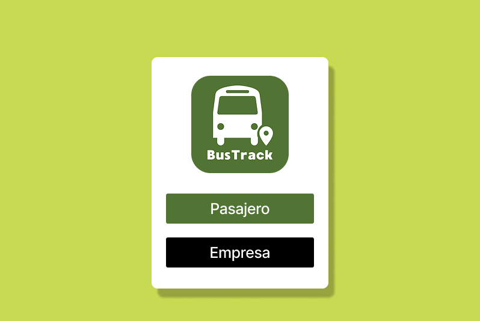

 

_**Figura 81.** Mock-up de la pantalla inicial de selección de tipo de usuario._   _**Fuente:** elaboración propia._

**Mock-up 2**

_Descripción:_ Este mock-up muestra la pantalla de inicio de sesión para usuarios pasajeros. El diseño integra una ilustración juvenil y dinámica, reforzando la orientación del servicio a estudiantes y usuarios urbanos. Al lado derecho se presenta el formulario de acceso con campos para correo y contraseña, junto con accesos a recuperación de credenciales y registro. La composición visual asegura equilibrio entre ilustración y funcionalidad, resaltando el formulario con un fondo blanco y sombra suave.

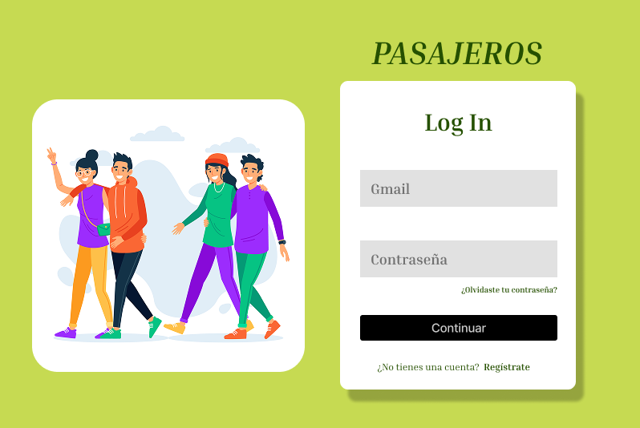

 

_**Figura 82.** Mock-up de la pantalla de Log In para pasajeros._   _**Fuente:** elaboración propia._

**Mock-up 3**

_Descripción:_ Este mock-up corresponde al formulario de creación de cuenta para pasajeros. El diseño mantiene coherencia visual con la interfaz de Log In, incorporando elementos como el fondo verde pastel y sombras suaves. El formulario incluye opción de registro rápido mediante Google y campos tradicionales (correo, usuario y contraseña). A la izquierda, un ícono genérico de perfil funciona como elemento ilustrativo y refuerza la idea de creación de identidad digital dentro del sistema.

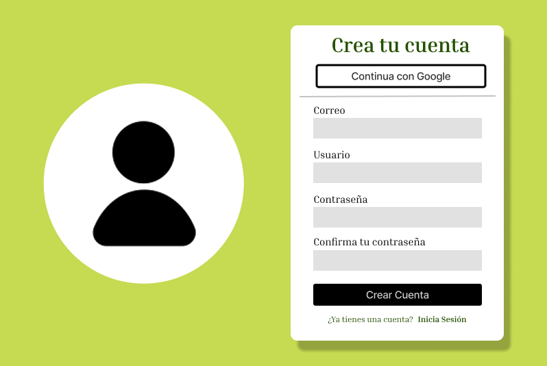

 

_**Figura 83.** Mock-up de la pantalla de registro de nuevos pasajeros._   _**Fuente:** elaboración propia._

**Mock-up 4**

_Descripción:_ Este mock-up presenta la pantalla principal para el flujo de búsqueda de rutas del pasajero. La sección superior incorpora el header institucional con el nombre BusTrack y la barra de navegación. En el centro se muestra un mapa incrustado de Google Maps, destacando la ubicación actual del usuario. A la derecha se incluye un módulo de búsqueda con campos para origen y destino, así como un botón de acción claramente identificado. La composición busca favorecer la rapidez de interacción y la claridad en el flujo de búsqueda.

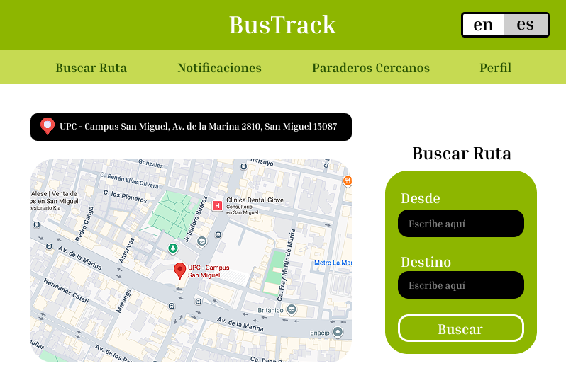

 

_**Figura 84.** Mock-up de búsqueda de rutas para pasajeros._   _**Fuente:** elaboración propia._

**Mock-up 5**

_Descripción:_ Este mock-up muestra la pantalla donde se visualiza la ruta seleccionada, integrando un panel lateral con información del viaje. Dicho panel destaca los puntos de origen y destino mediante etiquetas de colores (A y B) que refuerzan la comprensión espacial del usuario. Además, incluye opciones adicionales como guardar la ruta o visualizarla directamente en Google Maps. En la parte inferior se incorpora un botón de “Nueva búsqueda”, permitiendo al usuario reiniciar el proceso con facilidad.

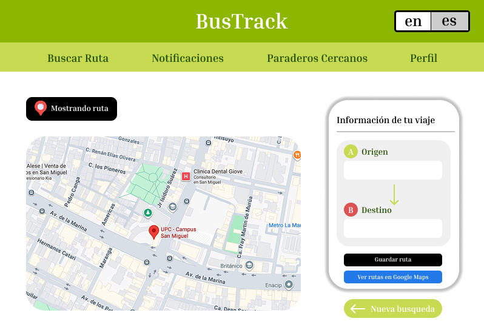

 

_**Figura 85.** Mock-up de la pantalla de visualización de ruta._   _**Fuente:** elaboración propia._

**Mock-up 6**

_Descripción:_ Este mock-up corresponde a la sección de Notificaciones del pasajero. La pantalla utiliza un diseño minimalista con fondo verde muy claro para transmitir tranquilidad. El centro de la pantalla presenta una tarjeta que informa que no existen notificaciones disponibles, reforzando claridad y transparencia hacia el usuario. El diseño prioriza lectura rápida, accesibilidad y consistencia visual con la paleta oficial.

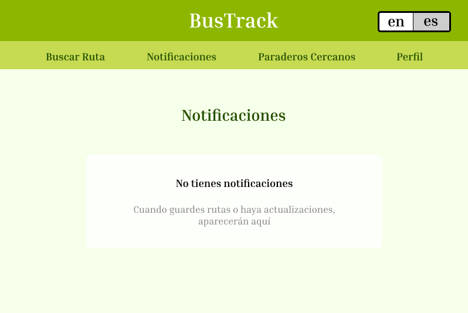

 

_**Figura 86.** Mock-up de la pantalla de notificaciones del pasajero._   _**Fuente:** elaboración propia._

**Mock-up 7**

_Descripción:_ Este mock-up representa la pantalla de Paraderos Cercanos, donde el usuario visualiza información relevante de los paraderos próximos a su ubicación. Cada tarjeta incluye nombre del paradero, dirección, buses que pasan y distancia estimada. A la derecha, un mapa detallado apoya la localización espacial. Botones de acción como “Cómo llegar” y “Notificar llegada” permiten ampliar la interacción. El diseño combina información textual, visual y geográfica para una experiencia sólida y contextual.

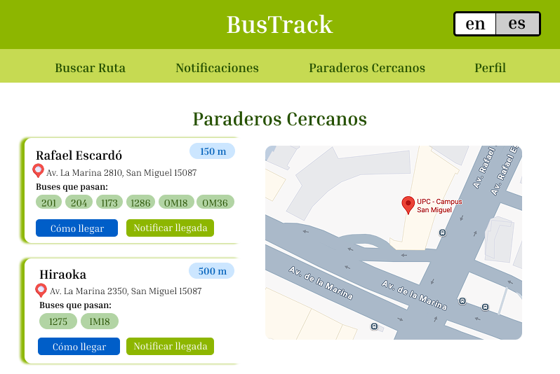

 

_**Figura 87.** Mock-up de la pantalla de paraderos cercanos._   _**Fuente:** elaboración propia._

**Mock-up 8**

_Descripción:_ Este mock-up muestra la interfaz de Perfil del usuario pasajero. A la izquierda se ubica la tarjeta de información personal editable, incluyendo nombre, correo y contraseña, con íconos de visibilidad. A la derecha se despliegan las distintas secciones del perfil: rutas favoritas, historial de viajes, notificaciones y configuración. Cada sección incluye el botón “Detalles”, facilitando el acceso a funciones específicas. La pantalla mantiene una estructura equilibrada entre edición y navegación interna.

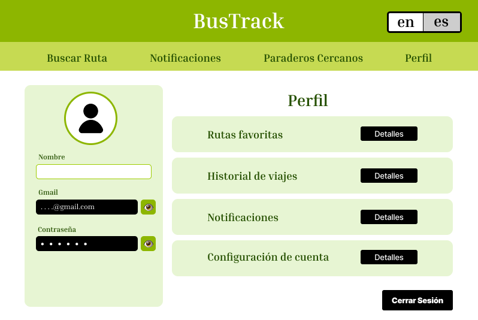

 

_**Figura 88.** Mock-up de la pantalla de perfil del pasajero._   _**Fuente:** elaboración propia._

**Mock-up 9**

_Descripción:_ Este mock-up presenta la sección de Rutas favoritas del pasajero. En caso de no existir rutas guardadas, la pantalla muestra un mensaje informativo acompañado de un ícono de pin, reforzando la metáfora visual del mapa. Un botón central “Buscar rutas” dirige nuevamente al usuario al flujo principal. El diseño busca mantener coherencia con otras pantallas de estado vacío del sistema.

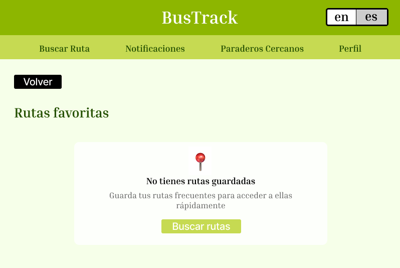

 

_**Figura 89.** Mock-up de la pantalla de rutas favoritas (estado vacío)._   _**Fuente:** elaboración propia._

**Mock-up 10**

_Descripción:_ Este mock-up corresponde a la sección de Historial de viajes, donde se muestran registros de rutas pasadas con información detallada: fecha, duración, distancia total y paraderos intermedios. Cada tarjeta usa un diseño oscuro para resaltar la jerarquía y diferenciarla del resto de la interfaz. En la parte superior derecha se incluye la opción “Borrar historial de usuario”, brindando control total al pasajero sobre sus datos.

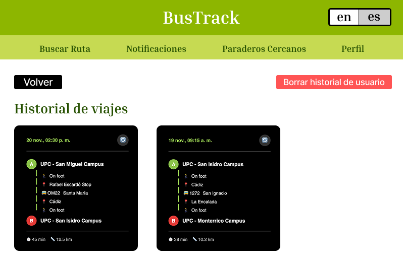

 

_**Figura 90.** Mock-up del historial de viajes del pasajero._   _**Fuente:** elaboración propia._

**Mock-up 11**

_Descripción:_ Este mock-up representa la pantalla de configuración de notificaciones para pasajeros. En esta vista, el usuario puede activar o desactivar distintos tipos de alertas relacionadas con su experiencia de viaje, como llegada del bus, retrasos, paraderos cercanos o inicio del recorrido. Cada opción se presenta con un interruptor visual (toggle) que indica claramente su estado. La interfaz utiliza un contenedor central en tono verde pastel que distingue la sección interactiva del resto del contenido, manteniendo una jerarquía clara y una experiencia accesible.

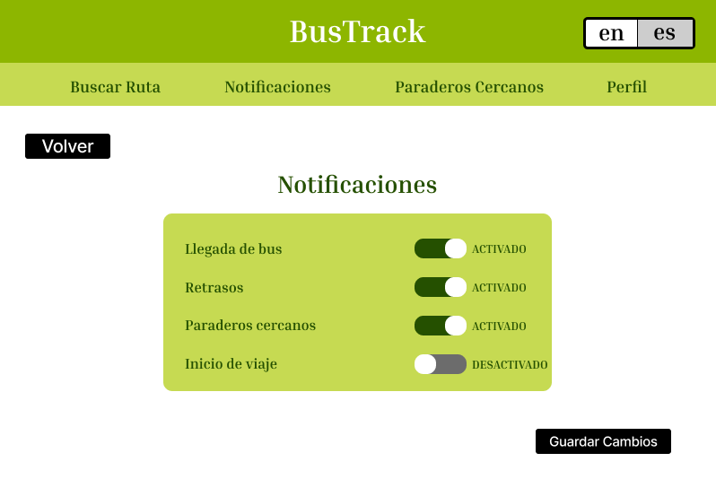

 

_**Figura 91.** Mock-up de configuración de notificaciones para pasajeros._   _**Fuente:** elaboración propia._

**Mock-up 12**

_Descripción:_ Este mock-up muestra la sección de configuración de cuenta del pasajero, donde el usuario puede editar información personal como nombre, correo electrónico y contraseña. La tarjeta central presenta un diseño ordenado y jerárquico, con un ícono de perfil que permite gestionar la foto de usuario. El enfoque visual prioriza la claridad del formulario y la facilidad para realizar cambios. El botón “Guardar cambios” se ubica al final del módulo, siguiendo principios de diseño centrados en la acción principal.

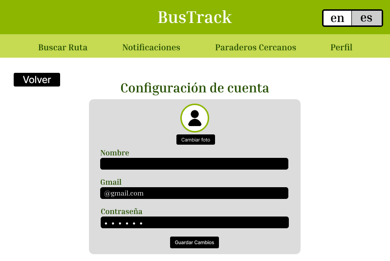

 

_**Figura 92.** Mock-up de configuración de cuenta del pasajero._   _**Fuente:** elaboración propia._

**Mock-up 13**

_Descripción:_ Este mock-up corresponde a la pantalla de inicio de sesión para empresas. El diseño incorpora una fotografía de un bus en operación, reforzando la identidad visual corporativa y diferenciando este flujo del del pasajero. Al lado derecho, se ubica el formulario de Log In con campos para correo y contraseña, así como opciones complementarias como recuperación de contraseña y acceso a registro. La composición busca transmitir profesionalismo y generar confianza en usuarios empresariales.

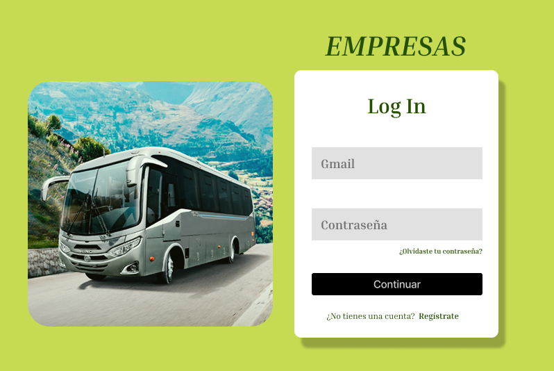

 

_**Figura 93.** Mock-up de Log In para empresas._   _**Fuente:** elaboración propia._

**Mock-up 14**

_Descripción:_ Este mock-up presenta la pantalla de creación de cuenta empresarial, diseñada específicamente para organizaciones de transporte. El formulario incluye campos propios del modelo de negocio: nombre de la empresa, RUC, correo corporativo, dirección física, contraseña y tamaño de flota. El diseño mantiene coherencia con el flujo de registro del pasajero, pero incorpora un enfoque más institucional que responde a las necesidades de la gestión empresarial.

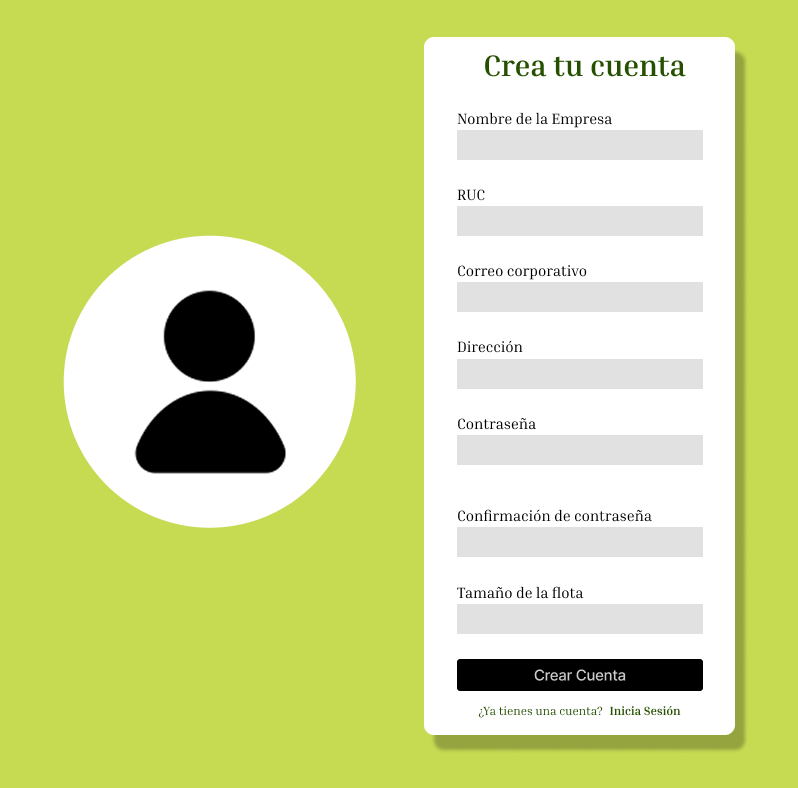

 

_**Figura 94.** Mock-up de registro de nuevas empresas._   _**Fuente:** elaboración propia._

**Mock-up 15**

_Descripción:_ Este mock-up corresponde a la interfaz de Monitoreo en Tiempo Real para empresas. En esta pantalla, los administradores visualizan un mapa interactivo junto a un panel de estado de buses, donde se indican detalles como ruta, conductor, última actualización y estado actual (en horario, retraso, fuera de servicio, etc.). Los estados están codificados por colores siguiendo la paleta de eventos del sistema (verde, amarillo y rojo). Esta vista se convierte en el núcleo operacional para la supervisión de flota.

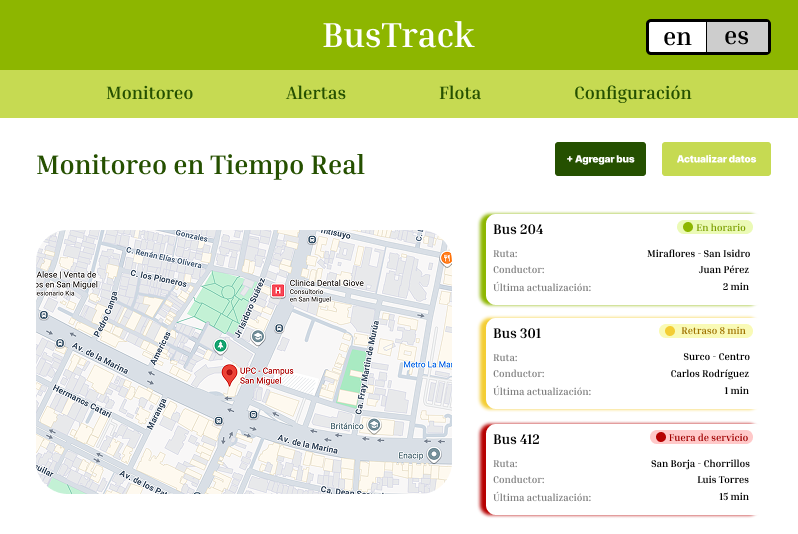

 

_**Figura 95.** Mock-up de monitoreo en tiempo real de flota empresarial._   _**Fuente:** elaboración propia._

**Mock-up 16**

_Descripción:_ Este mock-up muestra la sección de Alertas Internas, donde la empresa puede revisar incidentes y notificaciones críticas ocurridas durante las operaciones. La interfaz incluye herramientas de filtrado por tipo, gravedad y estado, permitiendo priorizar la resolución de eventos. Cada alerta se presenta como una tarjeta con indicadores de gravedad mediante etiquetas codificadas por color. Además, se incorpora un botón “Marcar Resuelta” para gestionar estados operativos.

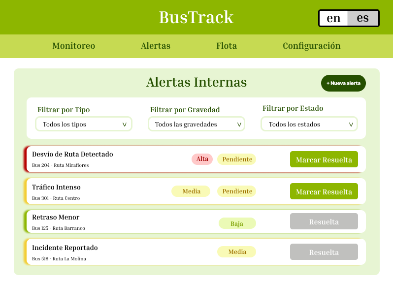

 

_**Figura 96.** Mock-up de gestión de alertas internas._   _**Fuente:** elaboración propia._

**Mock-up 17**

_Descripción:_ Este mock-up representa la pantalla de Administración de Flota, donde la empresa puede visualizar y gestionar todos los buses registrados. El módulo superior resume las estadísticas clave: total de buses, activos, en mantenimiento e inactivos. Debajo, una tabla estructurada muestra los datos principales de cada unidad (ID, placa, ruta asignada, estado y conductor). Acciones rápidas como “Editar” y “Detalles” permiten una administración eficiente y accesible.

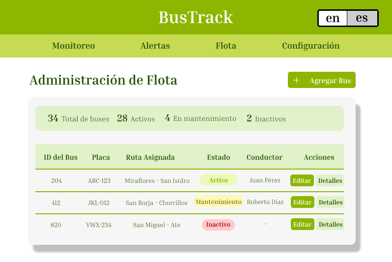

 

_**Figura 97.** Mock-up de administración de flota para empresas._   _**Fuente:** elaboración propia._

**Mock-up 18**

_Descripción:_ Este mock-up corresponde a la sección de Configuración Empresarial, que centraliza la edición de información institucional, preferencias de alertas y parámetros de seguridad. La pantalla está organizada en tres bloques principales:

- Información de la Empresa (datos generales como nombre, RUC y dirección).

- Preferencias de Alertas (tipo de alertas y tiempos de tolerancia).

- Seguridad (cambio de contraseña).

Cada sección se presenta en tarjetas diferenciadas para favorecer la claridad visual y la navegación interna. Al final se incluye un botón destacado de “Cerrar Sesión”.

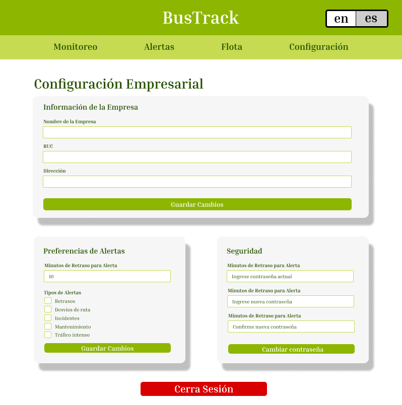

 

_**Figura 98.** Mock-up de configuración empresarial._   _**Fuente:** elaboración propia._

Link del figma: https://www.figma.com/design/gfihE4UEnoiFtzf54xXuL8/BusTrack-wireframes-y-mockups?node-id=0-1&t=vbZPvREtMGxi30PI-1

### 4.6.4. Web Applications User Flow Diagrams.

Para el caso de BusTrack se desarrollaron dos flujos principales:

- Flujo del usuario pasajero, que incluye etapas como selección de tipo de usuario, autenticación, registro, búsqueda de rutas, visualización de paraderos cercanos, uso del perfil, acceso a rutas favoritas, historial de viajes y configuración de notificaciones.

- Flujo del usuario empresa, que considera procesos como autenticación empresarial, registro corporativo, monitoreo en tiempo real, gestión de alertas internas, administración de flota y edición de configuración institucional.

El diagrama permite visualizar la complejidad lógica del sistema y valida que cada pantalla cuente con una ruta clara, evitando callejones sin salida y asegurando una navegación eficiente y coherente. Asimismo, facilita la comunicación entre equipos de diseño, desarrollo y stakeholders, garantizando que la experiencia de usuario cumpla con los objetivos funcionales definidos en el proyecto.

_**Figura 99.** Diagrama general de User Flows para los usuarios Pasajero y Empresa en la aplicación web BusTrack._   _**Fuente:** elaboración propia._

## 4.7. Web Applications Prototyping.

La imagen muestra una captura del prototipo navegable desarrollado para la plataforma web de BusTrack, correspondiente a la sección de Ubicación Actual dentro del flujo de búsqueda de rutas. Este prototipo permite simular la interacción real del usuario, incluyendo navegación por el menú principal, visualización de la ubicación en el mapa y respuesta del sistema según los flujos definidos previamente. La evidencia confirma la implementación funcional de los diseños de alta fidelidad elaborados en la etapa anterior.

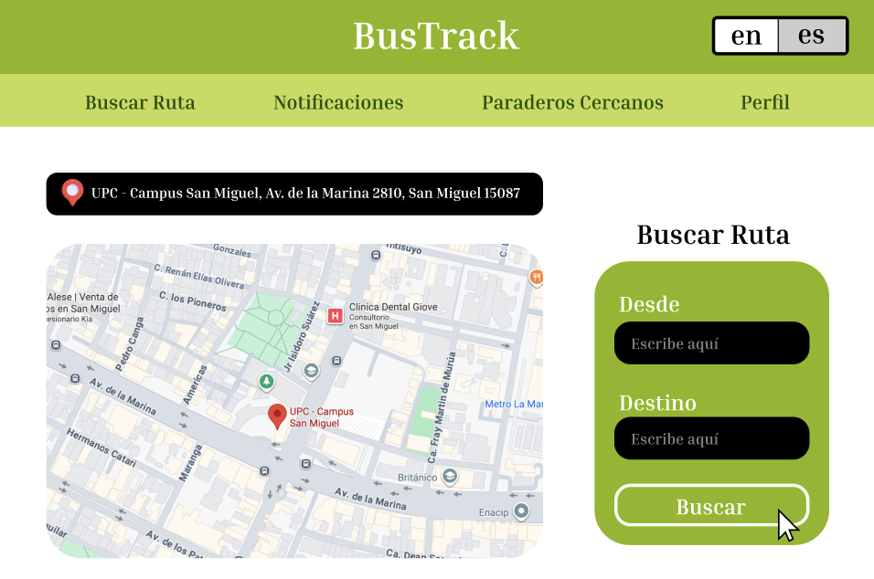

_**Figura 100.** Vista del prototipo navegable de la aplicación web BusTrack_   _**Fuente:** elaboración propia._

link del video: https://upcedupe-my.sharepoint.com/:v:/g/personal/u20201c320_upc_edu_pe/IQDEh4kh9m4GTYvmkBirzUVHAWfUxDtmc2BYFpkju5ztdkI?nav=eyJyZWZlcnJhbEluZm8iOnsicmVmZXJyYWxBcHAiOiJTdHJlYW1XZWJBcHAiLCJyZWZlcnJhbFZpZXciOiJTaGFyZURpYWxvZy1MaW5rIiwicmVmZXJyYWxBcHBQbGF0Zm9ybSI6IldlYiIsInJlZmVycmFsTW9kZSI6InZpZXcifX0%3D&e=kYehgP

## 4.8. Domain-Driven Software Architecture.

La arquitectura de software orientada al dominio (Domain-Driven Design, DDD) permite estructurar el sistema en función de los conceptos principales asociados al transporte urbano y a los distintos tipos de usuarios de la plataforma. Esta aproximación facilita que la lógica de negocio represente con precisión las necesidades reales de cada segmento y asegura que las funcionalidades clave se organicen dentro de bounded contexts bien definidos.
En BusTrack se identifican dos contextos principales según los segmentos objetivo:

- Pasajeros, orientado a movilidad y búsqueda de rutas.

- Empresas de transporte, orientado a la gestión operativa de flotillas y alertas.

### 4.8.1. Software Architecture Context Diagram.

**Elementos**

- BusTrack: Plataforma central que gestiona rutas, paraderos y notificaciones en tiempo real
- Usuario Estudiante: Consulta rutas, paraderos cercanos y recibe notificaciones sobre los buses
- Empresa de Transporte: Proporciona datos de buses y gestiona información de flotas
- Google Maps API: Servicio externo de mapas y geolocalización
- ATU / Flotas de Transporte: Fuente oficial de datos de rutas y buses
- Servicio de Notificaciones: Permite el envío de alertas en tiempo real a los usuarios

Descripción: El diagrama de contexto muestra los actores externos, sistemas vinculados y la relación de BusTrack con su entorno, incluyendo estudiantes, empresas de transporte, flotas oficiales, servicios de mapas y notificaciones.

_**Figura 104.** Diagrama de Contexto de la Arquitectura de BusTrack._   _**Fuente:** elaboración propia._

**Leyenda**

Descripción: La leyenda detalla el significado de los colores y tipos de elementos utilizados en el diagrama de contexto para distinguir actores, sistemas y relaciones.

_**Figura 105.** Leyenda del Diagrama de Contexto de BusTrack._   _**Fuente:** elaboración propia._

### 4.8.2. Software Architecture Container Diagrams.

La arquitectura de BusTrack adopta un estilo modular orientado a servicios, combinando una PWA en el frontend con un Backend API centralizado y un servicio de tiempo real basado en eventos. También, se emplea un enfoque event-driven para las notificaciones y actualizaciones de posición, mientras que las operaciones CRUD se gestionan mediante REST. El componente de Fleet Data Ingestion aplica un patrón de data normalization pipeline para procesar datos de GPS en distintos formatos provenientes de las empresas de transporte.

Descripción: El diagrama de contenedores representa la arquitectura de alto nivel de BusTrack, mostrando la PWA, el Servicio en Tiempo Real, el Backend API, el módulo de ingesta y los sistemas externos.

_**Figura 106.** Diagrama de Contenedores de la Arquitectura de BusTrack._   _**Fuente:** elaboración propia._

**Leyenda**

Descripción: La leyenda especifica los colores y tipos de contenedores, indicando qué elementos corresponden a sistemas externos, backend, frontend o infraestructura.

_**Figura 107.** Leyenda del Diagrama de Contenedores de BusTrack._   _**Fuente:** elaboración propia._ 

### 4.8.3. Software Architecture Components Diagrams.

Cada contenedor del sistema BusTrack se descompone en componentes que implementan sus principales responsabilidades internas. A continuación se presentan los diagramas de componentes correspondientes a la Aplicación Web (PWA), el Backend API, el Servicio en Tiempo Real y el módulo de Ingesta de Datos de Flota.

**Web App (PWA)**

La PWA gestiona la interfaz del usuario final y las vistas operativas para pasajeros y personal de transporte.

- BuscarRutasView: búsqueda y visualización de rutas.
- ParaderoDetalleView: muestra información de paraderos.
- MapaInteractivo: renderiza rutas y ubicaciones.
- ApiClient: comunica con el Backend API (HTTP REST).
- ClientTiempoReal: suscripción WebSocket con el Servicio en Tiempo Real.
- AuthUI y SesionStore: control de autenticación y persistencia de sesión.
- AjustesNotificaciones: permisos para recibir alertas push.
- RouterSPA: navegación interna entre vistas.

Descripción: El diagrama describe los componentes internos de la PWA, incluyendo vistas, manejo de sesión, cliente REST y cliente WebSocket.

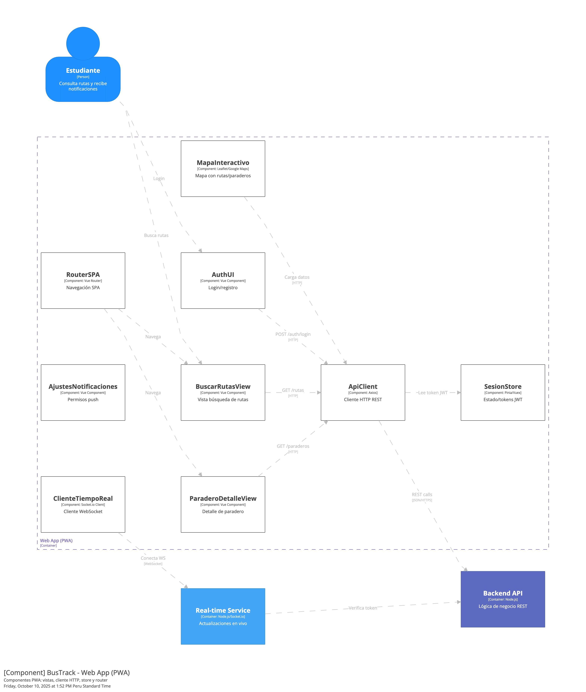

_**Figura 108.** Componentes de la Aplicación Web (PWA) de BusTrack._   _**Fuente:** elaboración propia._

**Leyenda**

Descripción: La leyenda explica los colores y formas utilizados para representar componentes, servicios y relaciones internas de la PWA.

_**Figura 109.** Leyenda de Componentes de la PWA._   _**Fuente:** elaboración propia._

**Backend API**

La API central implementa la lógica de negocio siguiendo una arquitectura por capas:

- Controladores (Controller): gestionan endpoints REST (AuthController, BuscarRutasController, ParaderosController, AlertasController).
- Servicios (Service): encapsulan la lógica (RutasService, ParaderosService, AuthService, AlertasService).
-Repositorios (Repository): abstraen el acceso a datos (RutasRepository, ParaderosRepository, UsuariosRepository).
-Infraestructura (Infrastructure): integraciones externas (MapsGateway, ATUGateway, PushGateway, CacheAdapter, ORMAdapter).

Los controladores reciben solicitudes HTTP, delegan en los servicios y retornan respuestas JSON. Los servicios pueden consultar APIs externas, cachear resultados o emitir eventos.

Descripción: El diagrama muestra los componentes de la API Backend, organizados en controladores, servicios, repositorios e infraestructura.

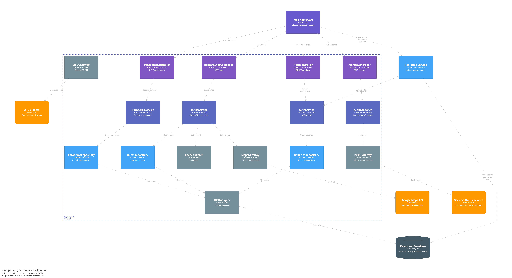

_**Figura 110.** Componentes del Backend API de BusTrack._   _**Fuente:** elaboración propia._

**Leyenda**

Descripción: La leyenda detalla el significado de los colores y categorías para controladores, servicios, repositorios y adaptadores.

_**Figura 111.** Leyenda de los Componentes del Backend API._   _**Fuente:** elaboración propia._

**Real-time Service**

Este servicio maneja la comunicación asincrónica con los clientes mediante WebSockets.

- GatewayWebSocket: gestiona las conexiones y salas de suscripción por ruta.
- AuthWSMiddleware: valida tokens JWT antes de permitir conexión.
- SuscriptorEventos: consume eventos de posición desde el sistema de ingesta.
- PublicadorActualizaciones: difunde mensajes bus:update a los clientes conectados.

Se comunica de manera asincrónica (MQ) con la ingesta y bidireccional (WebSocket) con la PWA.

Descripción: El diagrama presenta los componentes del Servicio en Tiempo Real, incluyendo el gateway WebSocket, middleware de autenticación y publicadores de eventos.

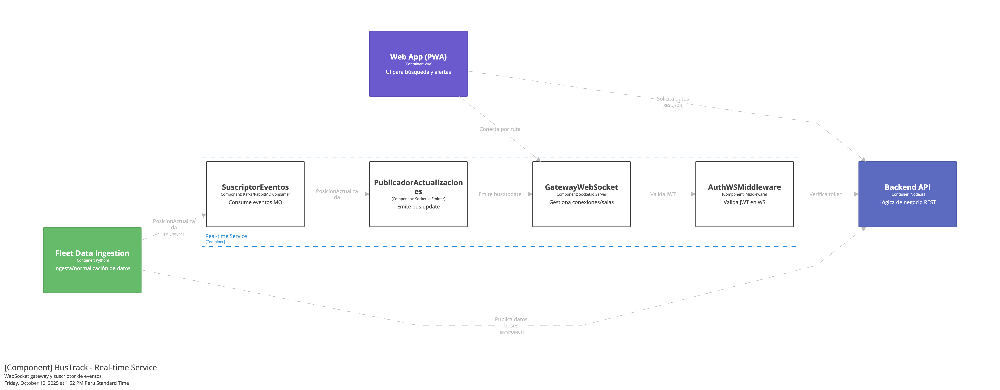

_**Figura 112.** Componentes del Servicio en Tiempo Real de BusTrack._   _**Fuente:** elaboración propia._

**Leyenda**

Descripción: La leyenda describe los tipos de componentes relacionados con procesamiento de eventos, conectividad WebSocket y middleware.

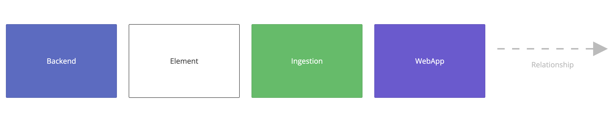

_**Figura 113.** Leyenda del Servicio en Tiempo Real._   _**Fuente:** elaboración propia._

**Fleet Data Ingestion**

Este módulo procesa y normaliza la telemetría proveniente de distintas empresas de transporte.

- ConectorProveedorA/B: adaptadores específicos para cada fuente de datos.
- NormalizadorPosiciones: unifica formatos de GPS.
- ValidadorTelemetria: filtra datos inválidos.
- PublicadorEventos: emite eventos PosicionActualizada hacia el sistema de tiempo real.

Descripción: Componentes que procesan telemetría de proveedores, normalizan datos GPS y generan eventos para el sistema en tiempo real.

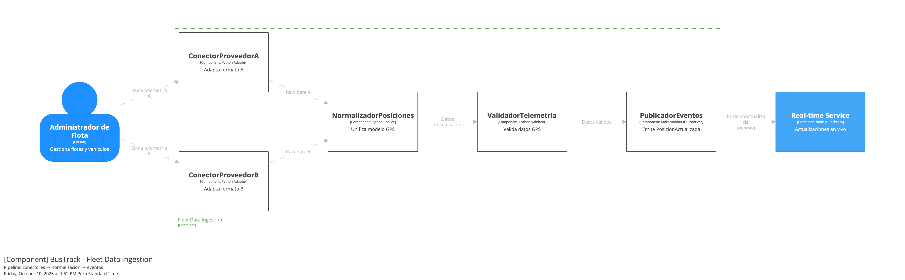

_**Figura 114.** Componentes del Contenedor Fleet Data Ingestion._   _**Fuente:** elaboración propia._

**Leyenda**

Descripción: La leyenda detalla los iconos y categorías utilizados para representar adaptadores de proveedores, normalizadores y publicadores de eventos.

_**Figura 115.** Leyenda del Módulo de Ingesta de Datos de Flota._   _**Fuente:** elaboración propia._

 

## 4.9. Software Object-Oriented Design.

El diseño orientado a objetos de BusTrack define la estructura interna del sistema mediante clases, atributos, métodos y relaciones esenciales para representar usuarios, rutas, buses, viajes, notificaciones y entidades operativas del transporte público. Este diseño permite mantener un modelo extensible, modular y alineado con patrones como encapsulación, asociación, composición y herencia, facilitando la implementación en el código final.

### 4.9.1. Class Diagrams.

El siguiente diagrama de clases representa los principales objetos del dominio de BusTrack y sus interacciones. Incluye entidades como User, Passenger, Driver, Bus, Route, Stop, Travel y Notification, junto a sus atributos, métodos y relaciones (asociaciones, composiciones y herencia).
Este modelo sirve como base para la implementación de los módulos funcionales del sistema.

Descripción: El diagrama muestra la estructura del dominio de BusTrack, detallando las clases principales, sus atributos, métodos clave y la forma en que se relacionan entre sí mediante asociaciones y composiciones.

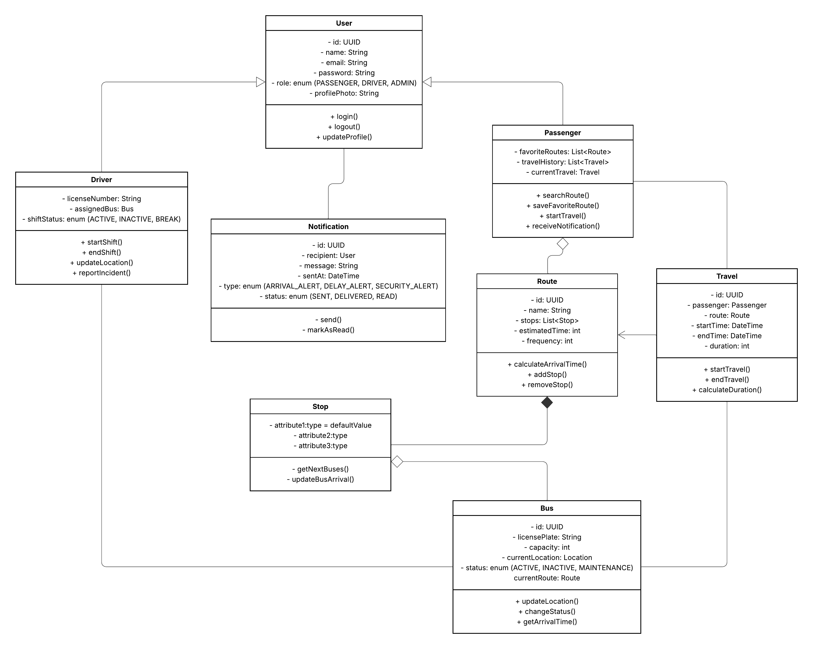

_**Figura 116.** Diagrama de clases del sistema BusTrack._   _**Fuente:** elaboración propia._

### 4.9.2. Class Dictionary.

A continuación se presenta el diccionario de clases correspondiente al modelo orientado a objetos de BusTrack. Se detallan atributos, descripciones, tipos de datos y métodos principales para cada entidad definida en el diagrama de clases.

## Clase: **User** *(Abstracta)*  
**Descripción:** Representa al usuario base del sistema.

| Nombre de Atributo | Descripción                  | Tipo de Dato     |
|--------------------|------------------------------|------------------|
| id                 | Identificador único          | UUID             |
| name               | Nombre completo              | String           |
| email              | Correo electrónico           | String           |
| password           | Contraseña encriptada        | String           |
| role               | Tipo de usuario              | enum (UserRole)  |
| profilePhoto       | Foto de perfil               | String (URL)     |

**Métodos**  
- `login()` — Autentica al usuario en el sistema  
- `logout()` — Cierra la sesión del usuario  
- `updateProfile()` — Actualiza información del perfil  

---

## Clase: **Passenger** *(Hereda de User)*  
**Descripción:** Usuario que utiliza el transporte público  

| Nombre de Atributo | Descripción                   | Tipo de Dato     |
|--------------------|-------------------------------|------------------|
| favoriteRoutes     | Rutas guardadas como favoritas | List<Route>      |
| travelHistory      | Historial de viajes realizados | List<Travel>     |
| currentTravel      | Viaje en curso                 | Travel           |

**Métodos**  
- `searchRoute(origin, destination)` — Busca rutas disponibles  
- `saveFavoriteRoute(route)` — Guarda una ruta como favorita  
- `startTravel(route)` — Inicia un viaje  
- `receiveNotification()` — Recibe notificaciones  

---

## Clase: **Driver** *(Hereda de User)*  
**Descripción:** Conductor asignado a un bus dentro del sistema.

| Nombre de Atributo | Descripción                  | Tipo de Dato       |
|--------------------|------------------------------|--------------------|
| licenseNumber      | Número de licencia de conducir | String            |
| assignedBus        | Bus asignado                 | Bus                |
| shiftStatus        | Estado del turno laboral     | enum (ShiftStatus) |

**Métodos**  
- `startShift()` — Inicia turno de trabajo  
- `endShift()` — Finaliza turno de trabajo  
- `updateLocation()` — Actualiza ubicación en tiempo real  
- `reportIncident()` — Reporta incidentes en la ruta  

---

## Clase: **Bus**  
**Descripción:** Vehículo de transporte público registrado en el sistema.

| Nombre de Atributo | Descripción                  | Tipo de Dato      |
|--------------------|------------------------------|-------------------|
| id                 | Identificador único          | UUID              |
| licensePlate       | Placa del vehículo           | String            |
| capacity           | Capacidad de pasajeros       | int               |
| currentLocation    | Ubicación actual             | Location          |
| status             | Estado operativo             | enum (BusStatus)  |
| currentRoute       | Ruta actual                  | Route             |

**Métodos**  
- `updateLocation()` — Actualiza posición GPS  
- `changeStatus()` — Cambia estado del bus  
- `getArrivalTime(stop)` — Calcula tiempo de llegada  

---

## Clase: **Route**  
**Descripción:** Ruta de transporte con paradas definidas  

| Nombre de Atributo | Descripción                  | Tipo de Dato   |
|--------------------|------------------------------|----------------|
| id                 | Identificador único          | UUID           |
| name               | Nombre de la ruta            | String         |
| stops              | Lista de paradas             | List<Stop>     |
| estimatedTime      | Tiempo estimado de recorrido | int            |
| frequency          | Frecuencia de paso           | int            |

**Métodos**  
- `calculateArrivalTime()` — Calcula tiempo de llegada  
- `addStop()` — Agrega nueva parada  
- `removeStop()` — Elimina parada  

---

## Clase: **Stop**  
**Descripción:** Paradero o punto de parada  

| Nombre de Atributo | Descripción                  | Tipo de Dato   |
|--------------------|------------------------------|----------------|
| id                 | Identificador único          | UUID           |
| name               | Nombre del paradero          | String         |
| location           | Coordenadas GPS              | Location       |
| buses              | Buses que pasan por aquí     | List<Bus>      |

**Métodos**  
- `getNextBuses()` — Obtiene próximos buses  
- `updateBusArrival()` — Actualiza llegada de buses  

---

## Clase: **Travel**  
**Descripción:** Registro de un viaje realizado  

| Nombre de Atributo | Descripción                  | Tipo de Dato   |
|--------------------|------------------------------|----------------|
| id                 | Identificador único          | UUID           |
| passenger          | Pasajero que realiza el viaje | Passenger      |
| route              | Ruta utilizada               | Route          |
| startTime          | Hora de inicio               | DateTime       |
| endTime            | Hora de fin                  | DateTime       |
| duration           | Duración del viaje           | int            |

**Métodos**  
- `startTravel()` — Inicia el viaje  
- `endTravel()` — Finaliza el viaje  
- `calculateDuration()` — Calcula duración  

---

## Clase: **Notification**  
**Descripción:** Sistema de notificaciones  

| Nombre de Atributo | Descripción                     | Tipo de Dato                    |
|--------------------|---------------------------------|---------------------------------|
| id                 | Identificador único             | UUID                            |
| recipient          | Usuario destinatario            | User                            |
| message            | Contenido del mensaje           | String                          |
| sentAt             | Fecha y hora de envío           | DateTime                        |
| type               | Tipo de notificación            | enum (NotificationType)         |
| status             | Estado de la notificación       | enum (NotificationStatus)       |
F
**Métodos**  
- `send()` — Envía la notificación  
- `markAsRead()` — Marca como leída

 

## 4.10. Database Design.

En esta sección se presenta el diseño e implementación de la base de datos de BusTrack, la cual gestiona la información esencial de los usuarios, rutas, buses, paraderos y notificaciones. Este diseño garantiza el correcto funcionamiento de los módulos de la aplicación y su integración con las funcionalidades ya definidas en el modelo orientado a objetos.

### 4.10.1. Relational/Non-Relational Database Diagram.

En primer lugar, se diseñó la base de datos mediante un diagrama Entidad–Relación (ER) utilizando la herramienta Lucidchart, seleccionada por su facilidad de uso y la disponibilidad de plantillas especializadas para modelado de bases de datos.

Descripción: El diagrama ER representa las entidades principales del sistema BusTrack, sus atributos y las relaciones entre usuarios, pasajeros, rutas, buses, paraderos, notificaciones y viajes.

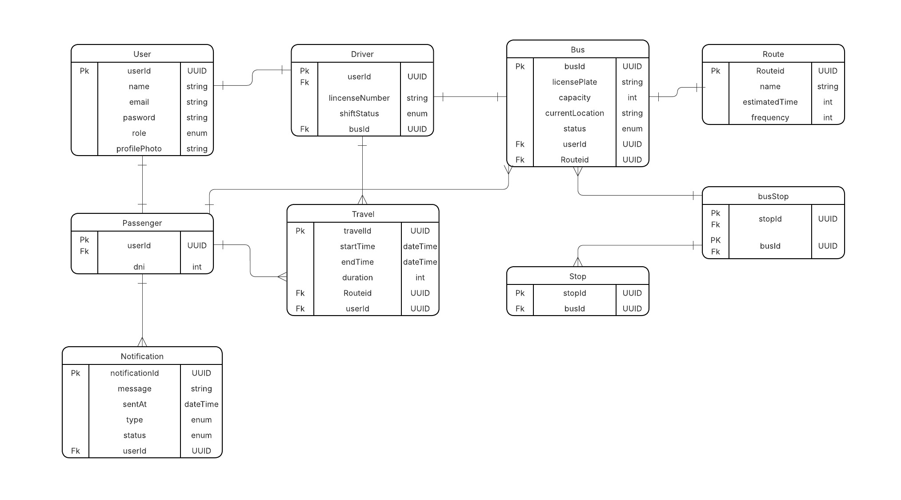

_**Figura 117.** Diagrama Entidad–Relación del sistema BusTrack._   _**Fuente:** elaboración propia._

link: https://lucid.app/lucidchart/7b7fbca6-a61b-4653-8ea2-b8b1985b5e9f/edit?viewport_loc=-393%2C-62%2C3568%2C1532%2C0_0&invitationId=inv_7298d486-3846-4284-ac1c-f5b20085366e 

Después de realizar el diseño conceptual, se implementó la base de datos en **MySQL Workbench**, lo que permitió visualizar el modelo físico generado a partir del script de creación. Esta herramienta facilitó la validación de las claves primarias, foráneas y relaciones N:M entre entidades.

Descripción: El diagrama físico generado en MySQL Workbench muestra la estructura final de las tablas, incluyendo claves primarias, claves externas y relaciones derivadas del modelo ER inicial.

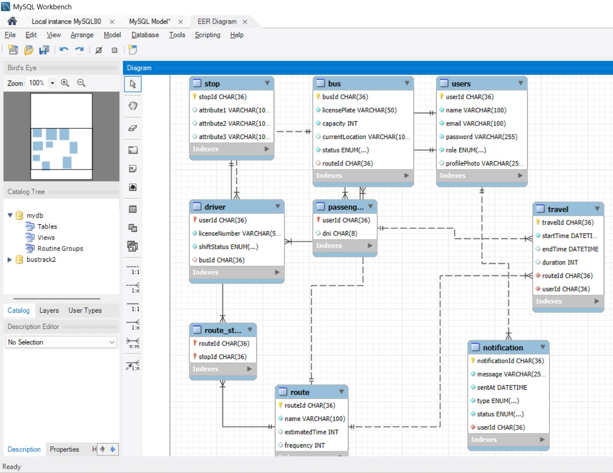

_**Figura 118.** Diagrama físico de la base de datos BusTrack en MySQL Workbench._    _**Fuente:** elaboración propia._

___

# Base de Datos: BusTrack1

A continuación, se describen las tablas implementadas en la base de datos, incluyendo sus relaciones.

## 1. Tabla: `Users`

Contiene la información principal de los usuarios del sistema.

**Campos:**  
- `userId` (PK)  
- `name`  
- `email` (único)  
- `password`  
- `role` (PASSENGER, DRIVER, ADMIN)  
- `profilePhoto`  

---

## 2. Tabla: `Passenger`

Almacena la información asociada a los pasajeros.

- Relación **1:1** con `Users` (cada pasajero es un usuario).

**Campos:**  
- `userId` (PK, FK → `Users.userId`)  
- `dni`  

---

## 3. Tabla: `Notification`
Registra las notificaciones enviadas a los usuarios.

- Relación **N:1** con `Users` (un usuario puede tener muchas notificaciones).

**Campos:**  
- `notificationId` (PK)  
- `message`  
- `sentAt`  
- `type` (ARRIVAL_ALERT, DELAY_ALERT, SECURITY_ALERT)  
- `status` (SENT, DELIVERED, READ)  
- `userId` (FK → `Users.userId`)  

---

## 4. Tabla: `Route`
Representa las rutas disponibles en el sistema.

**Campos:**  
- `routeId` (PK)  
- `name`  
- `estimatedTime`  
- `frequency`  

---

## 5. Tabla: `Stop`
Define los paraderos asociados a las rutas.

**Campos:**  
- `stopId` (PK)  
- `name`  
- `location`  
- `attribute1`  
- `attribute2`  
- `attribute3`  

---

## 6. Tabla: `Route_Stop`
Representa la relación **N:M** entre las entidades `Route` y `Stop`.

**Campos:**  
- `routeId` (PK, FK → `Route.routeId`)  
- `stopId` (PK, FK → `Stop.stopId`)  

---

## 7. Tabla: `Bus`
Almacena los datos de los buses registrados.

- Relación **N:1** con `Route` (un bus pertenece a una ruta).

**Campos:**  
- `busId` (PK)  
- `licensePlate` (único)  
- `capacity`  
- `currentLocation`  
- `status` (ACTIVE, INACTIVE, MAINTENANCE)  
- `routeId` (FK → `Route.routeId`)  

---

## 8. Tabla: `Driver`
Contiene los datos de los conductores asignados.

- Relación **1:1** con `Users`  
- Relación **N:1** con `Bus`

**Campos:**  
- `userId` (PK, FK → `Users.userId`)  
- `licenseNumber`  
- `shiftStatus` (ACTIVE, INACTIVE, BREAK)  
- `busId` (FK → `Bus.busId`)  

---

## 9. Tabla: `Travel`
Registra los viajes realizados por los pasajeros.

- Relación **N:1** con `Route`  
- Relación **N:1** con `Passenger`

**Campos:**  
- `travelId` (PK)  
- `startTime`  
- `endTime`  
- `duration`  
- `routeId` (FK → `Route.routeId`)  
- `userId` (FK → `Passenger.userId`)  

  

# Capítulo V: Product Implementation
## 5.1. Software Configuration Management.
### 5.1.1. Software Development Environment Configuration.
### 5.1.2. Source Code Management.
### 5.1.3. Source Code Style Guide & Conventions.
### 5.1.4. Software Deployment Configuration.
## 5.2. Product Implementation & Deployment.
### 5.2.1. Sprint Backlogs.
### 5.2.2. Implemented Landing Page Evidence
### 5.2.3. Implemented Frontend-Web Application Evidence
### 5.2.4. Acuerdo de Servicio - SaaS
### 5.2.5. Implemented Native-Mobile Application Evidence
### 5.2.6. Implemented RESTful API and/or Serverless Backend Evidence
### 5.2.7. RESTful API documentation
### 5.2.8. Team Collaboration Insights
## 5.3. Video About-the-Product.

# Part II: Verification, Validation & Pipeline
# Capítulo VI: Product Verification & Validation
## 6.1. Testing Suites & Validation
### 6.1.1. Core Entities Unit Tests.
### 6.1.2. Core Integration Tests.
### 6.1.3. Core Behavior-Driven Development
### 6.1.4. Core System Tests.
## 6.2. Static testing & Verification
### 6.2.1. Static Code Analysis
#### 6.2.1.1. Coding standard & Code conventions.
#### 6.2.1.2. Code Quality & Code Security.
### 6.2.2. Reviews
## 6.3. Validation Interviews.
### 6.3.1. Diseño de Entrevistas.
### 6.3.2. Registro de Entrevistas.
### 6.3.3. Evaluaciones según heurísticas.
## 6.4. Auditoría de Experiencias de Usuario
### 6.4.1. Auditoría realizada.
#### 6.4.1.1. Información del grupo auditado.
#### 6.4.1.2. Cronograma de auditoría realizada.
#### 6.4.1.3. Contenido de auditoría realizada.
### 6.4.2. Auditoría recibida.
#### 6.4.2.1. Información del grupo auditor.
#### 6.4.2.2. Cronograma de auditoría recibida.
#### 6.4.2.3. Contenido de auditoría recibida.
#### 6.4.2.4. Resumen de modificaciones para subsanar hallazgos.

# Capítulo VII: DevOps Practices
## 7.1. Continuous Integration
### 7.1.1. Tools and Practices.
### 7.1.2. Build & Test Suite Pipeline Components.
## 7.2. Continuous Delivery
### 7.2.1. Tools and Practices.
### 7.2.2. Stages Deployment Pipeline Components.
## 7.3. Continuous deployment
### 7.3.1. Tools and Practices.
### 7.3.2. Production Deployment Pipeline Components.
## 7.4. Continuous Monitoring
### 7.4.1. Tools and Practices
### 7.4.2. Monitoring Pipeline Components
### 7.4.3. Alerting Pipeline Components
### 7.4.4. Notification Pipeline Components.

# Part III: Experiment-Driven Lifecycle
# Capítulo VIII: Experiment-Driven Development
## 8.1. Experiment Planning
### 8.1.1. As-Is Summary.
### 8.1.2. Raw Material: Assumptions, Knowledge Gaps, Ideas, Claims.
### 8.1.3. Experiment-Ready Questions.
### 8.1.4. Question Backlog.
### 8.1.5. Experiment Cards.
## 8.2. Experiment Design
### 8.2.1. Hypotheses.
### 8.2.2. Domain Business Metrics
### 8.2.3. Measures.
### 8.2.4. Conditions.
### 8.2.5. Scale Calculations and Decisions.
### 8.2.6. Methods Selection.
### 8.2.7. Data Analytics: Goals, KPIs and Metrics Selection.
### 8.2.8. Web and Mobile Tracking Plan.
## 8.3. Experimentation
### 8.3.1. To-Be User Stories.
### 8.3.2. To-Be Product Backlog
### 8.3.3. Pipeline-supported, Experiment-Driven To-Be Software Platform Lifecycle
#### 8.3.3.1. To-Be Sprint Backlogs
#### 8.3.3.2. Implemented To-Be Landing Page Evidence
#### 8.3.3.3. Implemented To-Be Frontend-Web Application Evidence
#### 8.3.3.4. Implemented To-Be Native-Mobile Application Evidence
#### 8.3.3.5. Implemented To-Be RESTful API and/or Serverless Backend Evidence
#### 8.3.3.6. Team Collaboration Insights
### 8.3.4. To-Be Validation Interviews
#### 8.3.4.1. Diseño de Entrevistas.
#### 8.3.4.2. Registro de Entrevistas.
## 8.4. Experiment Aftermath & Analysis
### 8.4.1. Analysis and Interpretation of Results
### 8.4.2. Re-scored and Re-prioritized Question Backlog
## 8.5. Continuous Learning
### 8.5.1. Shareback Session Artifacts: Learning Workflow
## 8.6. To-Be Software Platform Pre-launch
### 8.6.1. About-the-Product Intro Video
