<div align="center">
  
 

</div>

<h1 align="center"> Universidad Peruana de Ciencias Aplicadas <h1 align="center">

<h1 align="center"> Carrera: Ingeniería de Software </h1>

<h1 align="center"> Periodo 2026 - 1 </h1>

<h1 align="center"> Código de curso: 1ASI0732</h1>

<h1 align="center"> Nombre del curso: Diseño de Experimentos de Ingeniería de Software</h1>

<h1 align="center"> NRC: 12316  </h1>

<h1 align="center"> Docente: Noriega Melendez, Julio Manuel </h1>

<h1 align="center"> Informe del Trabajo (TB2) </h1>

<h3 align="center"> Product: BusTrack </h3>

<h3 align="center"> Relación de integrantes: </h3>
<div align="center">

| Member                           |    Code    |
| :------------------------------- | :--------: |
| Lynn Jeeferzon Meza Camayo | U20201C320 |
| Walter Luis Fajardo Monrroy | U202221632 |
| Andrea Elizabeth Santur Tello | U202310988  |
| Joaquin Alberto Cuentas Peña | U20201F788 |

</div>

<h3 align="center">Mayo, 2026</h3>

<br><br>

<h3 align="center">Registro de Versiones del Informe</h3>

<div align="center">

| Versión | Fecha | Autor | Descripción de modificación |
| :-----: | :---: | :---: | :-------------------------- |
|  |  |  |  |
| TB1 | 28/04 | Lynn Meza - Walter Fajardo  - Joaquin Cuentas - Andrea Santur | Desarrollo del capitulo 1 - 5 | 
| TP | 12/05 | Lynn Meza - Walter Fajardo  - Joaquin Cuentas - Andrea Santur | Desarrollo del capitulo 5 - 7 |
| TB2 | 16/06 | Lynn Meza - Walter Fajardo  - Joaquin Cuentas - Andrea Santur | Desarrollo del capitulo 6 - 8 |

</div>


<br><br>

<div align="center">

# Project Report Collaboration Insights

</div>

| URL de la organización del proyecto |
| ----------------------------------- |
| <https://github.com/2025-2-AplicacionesWeb-DalComp> |

| URL del repositorio del reporte |
| ------------------------------- |
| <https://github.com/2025-2-AplicacionesWeb-DalComp/Project-report-BusTrack-> |

| URL del repositorio de la landing page |
| -------------------------------------- |
| <https://github.com/2025-2-AplicacionesWeb-DalComp/Landing-page> |

| URL del repositorio del Frontend |
| -------------------------------------- |
| <https://github.com/JoaCUPE/UltimoFront.git> |

| URL del repositorio del Backend |
| -------------------------------------- |
| <https://github.com/JoaCUPE/Ultimo-Back.git> |

| URL del figma wireframes |
| -------------------------------------- |
| <https://www.figma.com/design/gfihE4UEnoiFtzf54xXuL8/Untitled?node-id=0-1&t=drwWMkwR0WqztaeY-1>|


| URL del despliegue de la landing page |
| -------------------------------------- |
| <https://2025-2-aplicacionesweb-dalcomp.github.io/Landing-page/> |

| URL del despliegue de la página web |
| -------------------------------------- |
| <https://ultimo-front.vercel.app/>   |

| URL del despliegue del backend |
| -------------------------------------- |
| <https://ultimo-back-c3lo.onrender.com/>   |


--TB1--

|Integrante| Desarrollo|
|--------|----|
|Walter Fajardo| Chapter 1 -2 |
|Joaquin Cuentas | Chapter 3|
|Lynn Meza| Chapter 4 |
|Andrea Santur | Chapter 5|

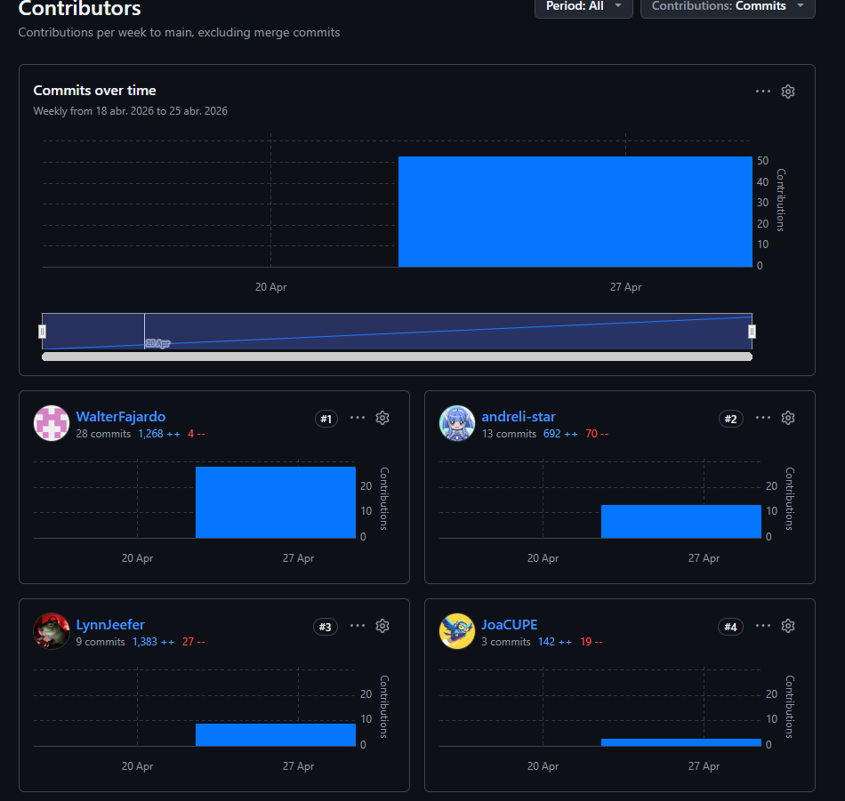


<br><br>

--TP--

|Integrante| Desarrollo|
|--------|----|
|Walter Fajardo| Chapter 6-5 |
|Joaquin Cuentas | Chapter 6-5|
|Lynn Meza| Chapter 7 |
|Andrea Santur | Chapter 7|


<br><br>

--TB2--

|Integrante| Desarrollo|
|--------|----|
|Walter Fajardo| Chapter 8 |
|Joaquin Cuentas | Chapter 8|
|Lynn Meza| Chapter 7 |
|Andrea Santur | Chapter 6|

# Contenido

## Tabla de Contenidos

### [Registro de versiones del informe](#registro-de-versiones-del-informe)

### [Project Report Collaboration Insights](#project-report-collaboration-insights)

### [Contenido](#contenido)

### [Student Outcome](#student-outcome-1)

### [Capítulo I: Introducción](#capítulo-i-introducción-1)

- [1.1. Startup Profile](#11-startup-profile)
  - [1.1.1. Descripción de la Startup](#111-description-de-la-startup)
  - [1.1.2. Perfiles de integrantes del equipo](#112-perfiles-de-integrantes-del-equipo)
- [1.2. Solution Profile](#12-solution-profile)
  - [1.2.1 Antecedentes y problemática](#121-antecedentes-y-problemática)
  - [1.2.2 Lean UX Process](#122-lean-ux-process)
    - [1.2.2.1. Lean UX Problem Statements](#1221-lean-ux-problem-statements)
    - [1.2.2.2. Lean UX Assumptions](#1222-lean-ux-assumptions)
    - [1.2.2.3. Lean UX Hypothesis Statements](#1223-lean-ux-hypothesis-statements)
    - [1.2.2.4. Lean UX Canvas](#1224-lean-ux-canvas)
- [1.3. Segmentos objetivo](#13-segmentos-objetivo)

### [Capítulo II: Requirements Elicitation & Analysis](#capítulo-ii-requirements-elicitation--analysis-1)

- [2.1. Competidores](#21-competidores)
  - [2.1.1. Análisis competitivo](#211-análisis-competitivo)
  - [2.1.2. Estrategias y tácticas frente a competidores](#212-estrategias-y-tácticas-frente-a-competidores)
- [2.2. Entrevistas](#22-entrevistas)
  - [2.2.1. Diseño de entrevistas](#221-diseño-de-entrevistas)
  - [2.2.2. Registro de entrevistas](#222-registro-de-entrevistas)
  - [2.2.3. Análisis de entrevistas](#223-análisis-de-entrevistas)
- [2.3. Needfinding](#23-needfinding)
  - [2.3.1. User Personas](#231-user-personas)
  - [2.3.2. User Task Matrix](#232-user-task-matrix)
  - [2.3.3. User Journey Mapping](#233-user-journey-mapping)
  - [2.3.4. Empathy Mapping](#234-empathy-mapping)
- [2.4. Big Picture Event Storning](#24-big-picture-event-storning)
- [2.5. Ubiquitous Language](#25-ubiquitous-language)
 
### [Capítulo III: Requirements Specification](#capítulo-iii-requirements-specification-1)

- [3.1. To-Be Scenario Mapping](#31-to-be-scenario-mapping)
- [3.1. User Stories](#32-user-stories)
- [3.2. Impact Mapping](#33-impact-mapping)
- [3.3. Product Backlog](#34-product-backlog)

### [Capítulo IV: Product Design](#capítulo-iv-product-design-1)

- [4.1. Style Guidelines](#41-style-guidelines)
  - [4.1.1. General Style Guidelines](#411-general-style-guidelines)
  - [4.1.2. Web Style Guidelines](#412-web-style-guidelines)
- [4.2. Information Architecture](#42-information-architecture)
  - [4.2.1. Organization Systems](#421-organization-systems)
  - [4.2.2. Labeling Systems](#422-labeling-systems)
  - [4.2.3. SEO Tags and Meta Tags](#423-seo-tags-and-meta-tags)
  - [4.2.4. Searching Systems](#424-searching-systems)
  - [4.2.5. Navigation Systems](#425-navigation-systems)
- [4.3. Landing Page UI Design](#43-landing-page-ui-design)
  - [4.3.1. Landing Page Wireframe](#431-landing-page-wireframe)
  - [4.3.2. Landing Page Mock-up](#432-landing-page-mock-up)
- [4.4. Web Applications UX/UI Design](#44-web-applications-uxui-design)
  - [4.4.1. Web Applications Wireframes](#441-web-applications-wireframes)
  - [4.4.2. Web Applications Wireflow Diagrams](#442-web-applications-wireflow-diagrams)
  - [4.4.3. Web Applications Mock-ups](#443-web-applications-mock-ups)
  - [4.4.4. Web Applications User Flow Diagrams](#444-web-applications-user-flow-diagrams)
- [4.5. Web Applications Prototyping](#45-web-applications-prototyping)
- [4.6. Domain-Driven Software Architecture](#46-domain-driven-software-architecture)
  - [4.6.1. Design-Level Event Storming](#461-design-level-event-storming)
  - [4.6.2. Software Architecture Context Diagram](#462-software-architecture-context-diagram)
  - [4.6.3. Software Architecture Container Diagrams](#463-software-architecture-container-diagrams)
  - [4.6.4. Software Architecture Components Diagrams](#464-software-architecture-components-diagrams)
- [4.7. Software Object-Oriented Design](#47-software-object-oriented-design)
  - [4.7.1. Class Diagrams](#471-class-diagrams)
- [4.8. Database Design](#48-database-design)
  - [4.8.1. Database Diagram](#481-database-diagram)

### [Capítulo V: Product Implementation, Validation & Deployment](#capítulo-v-product-implementation-validation--deployment-1)

- [5.1. Software Configuration Management](#51-software-configuration-management)
  - [5.1.1. Software Development Environment Configuration](#511-software-development-environment-configuration)
  - [5.1.2. Source Code Management](#512-source-code-management)
  - [5.1.3. Source Code Style Guide & Conventions](#513-source-code-style-guide--conventions)
  - [5.1.4. Software Deployment Configuration](#514-software-deployment-configuration)
- [5.2. Landing Page, Services & Applications Implementation](#52-landing-page-services--applications-implementation)
  - [5.2.1. Sprint 1](#521-sprint-1)
    - [5.2.1.1. Sprint Planning 1](#5211-sprint-planning-1)
    - [5.2.1.2. Aspect Leaders and Collaborators](#5212-aspect-leaders-and-collaborators)
    - [5.2.1.3. Sprint Backlog 1](#5213-sprint-backlog-1)
    - [5.2.1.4. Development Evidence for Sprint Review](#5214-development-evidence-for-sprint-review)
    - [5.2.1.5. Execution Evidence for Sprint Review](#5215-execution-evidence-for-sprint-review)
    - [5.2.1.6. Services Documentation Evidence for Sprint Review](#5216-services-documentation-evidence-for-sprint-review)
    - [5.2.1.7. Software Deployment Evidence for Sprint Review](#5217-software-deployment-evidence-for-sprint-review)
    - [5.2.1.8. Team Collaboration Insights during Sprint](#5218-team-collaboration-insights-during-sprint)
  - [5.2.2. Sprint 2](#522-sprint-2)
    - [5.2.2.1. Sprint Planning 2](#5221-sprint-planning-2)
    - [5.2.2.2. Aspect Leaders and Collaborators](#5212-aspect-leaders-and-collaborators)
    - [5.2.2.3. Sprint Backlog 2](#5223-sprint-backlog-2)
    - [5.2.2.4. Development Evidence for Sprint Review](#5224-development-evidence-for-sprint-review)
    - [5.2.2.5. Execution Evidence for Sprint Review](#5225-execution-evidence-for-sprint-review)
    - [5.2.2.6. Services Documentation Evidence for Sprint Review](#5226-services-documentation-evidence-for-sprint-review)
    - [5.2.2.7. Software Deployment Evidence for Sprint Review](#5227-software-deployment-evidence-for-sprint-review)
    - [5.2.2.8. Team Collaboration Insights during Sprint](#5228-team-collaboration-insights-during-sprint)
  - [5.2.3. Sprint 3](#523-sprint-3)
    - [5.2.3.1. Sprint Planning 3](#5231-sprint-planning-3)
    - [5.2.3.2. Aspect Leaders and Collaborators.](#5232-aspect-leaders-and-collaborators)
    - [5.2.3.3. Sprint Backlog 3](#5233-sprint-backlog-3)
    - [5.2.3.4. Development Evidence for Sprint Review](#5234-development-evidence-for-sprint-review)
    - [5.2.3.5. Execution Evidence for Sprint Review](#5235-execution-evidence-for-sprint-review)
    - [5.2.3.6. Services Documentation Evidence for Sprint Review](#5236-services-documentation-evidence-for-sprint-review)
    - [5.2.3.7. Software Deployment Evidence for Sprint Review](#5237-software-deployment-evidence-for-sprint-review)
    - [5.2.3.8. Team Collaboration Insights during Sprint](#5238-team-collaboration-insights-during-sprint)
  - [5.2.4. Sprint 4](#524-sprint-4)
    - [5.2.4.1. Sprint Planning 4](#5241-sprint-planning-4)
    - [5.2.4.2. Aspect Leaders and Collaborators.](#5242-aspect-leaders-and-collaborators)
    - [5.2.4.3. Sprint Backlog 4](#5243-sprint-backlog-3)
    - [5.2.4.4. Development Evidence for Sprint Review](#5244-development-evidence-for-sprint-review)
    - [5.2.4.5. Execution Evidence for Sprint Review](#5245-execution-evidence-for-sprint-review)
    - [5.2.4.6. Services Documentation Evidence for Sprint Review](#5246-services-documentation-evidence-for-sprint-review)
    - [5.2.4.7. Software Deployment Evidence for Sprint Review](#5247-software-deployment-evidence-for-sprint-review)
    - [5.2.4.8. Team Collaboration Insights during Sprint](#5248-team-collaboration-insights-during-sprint)
- [5.3. Validation Interviews](#53-validation-interviews)
  - [5.3.1. Diseño de entrevistas](#531-diseño-de-entrevistas)
  - [5.3.2. Registro de entrevistas](#532-registro-de-entrevistas)
  - [5.3.3. Evaluaciones según heurísticas](#533-evaluaciones-según-heurísticas)
- [5.4. Video About-The-Product](#54-video-about-the-product)
<br><br>

### *ABET – EAC - Student Outcome 5*

| Criterio específico | Acciones realizadas | Conclusiones |
| :--- | :--- | :--- |
| **Reconoce responsabilidad ética y profesional en situaciones de ingeniería desoftware** |   **TB1**<br>  **Walter Fajardo** <br> Durante el trabajo realiza el planteamiento del problema junto con el resto de apartados del capitulo 1 que permiten contextualizar el como abordaremos grupalmente el proyecto  <br>  **Andrea Santur**  <br>  Demostré aprendizaje ágil aplicando buenas prácticas, generando documentación clara. Participé en el Capítulo 5, abordando la gestión del software, despliegue y evidencias del producto (landing, frontend, backend y API). Finalmente, trabajé con mejora continua, corrigiendo errores. <br> **Lynn Meza** <br> En el Capítulo IV, diseñé BusTrack asegurando accesibilidad, claridad y coherencia en la interfaz. Organicé la estructura de información y desarrollé wireframes, mock-ups y flujos para una experiencia de usuario intuitiva. También participé en el diseño técnico, garantizando una solución ordenada y centrada en las necesidades de los usuarios. <br> **Joaquin Cuentas** <br> Demostré aprendizaje ágil aplicando buenas prácticas, describiendo un buen entendimiento sobre el usuario. Participé en el Capítulo 3, definiendo los user stories y tecnhical stories así como planteando su orden de prioridad en  un product backlog <br> **TP** <br> **Walter Fajardo** <br> Asumí mi responsabilidad profesional mediante la implementación de Core Entities Unit Tests, asegurando que la lógica fundamental del negocio fuera correcta y robusta desde su origen. Al desarrollar también las Core Integration Tests, cumplí con el deber ético de garantizar que los distintos módulos del sistema interactúen sin errores críticos, priorizando la entrega de un software confiable y seguro que proteja la integridad de los datos y la experiencia del usuario final.<br> **Andrea Santur**<br> Asumí mi responsabilidad profesional mediante la aplicación de técnicas de Behavior-Driven Development (BDD), utilizando el lenguaje Gherkin para definir con precisión el comportamiento esperado de BusTrack. Al automatizar estos escenarios con Cucumber.js y Cypress, <br> **Lynn Meza** <br> En el proceso de integración y entrega continua, he aplicado responsabilidad ética al garantizar que cada cambio en el código pase por pruebas exhaustivas, asegurando su calidad y minimizando riesgos. Esto asegura que las soluciones entregadas sean confiables y seguras para los usuarios. <br> **Joaquin Cuentas** <br> Asumí mi responsabilidad profesional mediante la implementación pruebas funcionales con el IDE de Selenium. Al ejercer estas pruebas cumplí éticamente en evaluar un proyecto propio que estará en producción abierto al público y merece las validaciones necesarias. <br> **TB2**<br>  **Walter Fajardo** <br> Se actuó con responsabilidad ética y profesional durante la fase de experimentación, garantizando que el planteamiento de las nuevas hipótesis y la selección de métricas de negocio se basaran en una comprensión profunda y honesta de las necesidades del usuario, evitando sesgos que pudieran comprometer la integridad de la solución de software. <br> **Andrea Santur** <br> Se actuó con responsabilidad ética y profesional durante las entrevistas, auditorías y evaluaciones realizadas en BusTrack, considerando la opinión de los usuarios para mejorar la calidad y usabilidad de la plataforma. <br> **Lynn Meza** <br> Desarrollé una estrategia de monitoreo continuo en Monster ASP.NET con alertas para garantizar la confiabilidad del servicio, reflejando responsabilidad ética hacia los usuarios finales y asegurando altos estándares de calidad operacional del software. <br> **Joaquin Cuentas** <br> Se actuó con responsabilidad ética y profesional durante el resumen y aplicación de hipótesis y questions acerca del usuario  | **TB1** <br> Como equipo, trabajamos con responsabilidad ética y profesional al diseñar BusTrack, asegurando que la solución fuera accesible, intuitiva y respetuosa con los usuarios. Aplicamos buenas prácticas de ingeniería de software, manteniendo un enfoque en la calidad, la seguridad y la facilidad de mantenimiento del sistema. Además, nos aseguramos de cumplir con los estándares profesionales en cada etapa del proyecto, promoviendo la transparencia, la equidad y la inclusión. <br> **TP** <br> Implementamos una landing page, una aplicación frontend web y una API RESTful, asegurando la calidad del código mediante pruebas automatizadas con Selenium. Al aplicar prácticas de integración y entrega continua, reconocimos nuestra responsabilidad ética y profesional al garantizar soluciones de software seguras, confiables y de alta calidad, minimizando riesgos y mejorando la experiencia del usuario en un entorno global. <br> **TB2** <br> Como equipo, al implementar Static Code Analysis con estándares de codificación, realizar Validation Interviews con evaluaciones heurísticas, y establecer Continuous Monitoring con alertas y notificaciones, demostramos responsabilidad ética y profesional garantizando que BusTrack API sea confiable, segura y mantenga altos estándares de calidad desde el desarrollo hasta la producción. |
| **Emite juicios informados considerando el impacto de las soluciones de ingeniería de software en contextos globales, económicos, ambientales y sociales** | **TB1**<br>  **Walter Fajardo** <br> Se realizo la recolección de entrevistas junto con  su análisis y demás partes del capitulo 2 con el fin de llegar al objetivo del proyecto <br>  **Andrea Santur** <br> Analicé las decisiones de despliegue, priorizando la estabilidad y accesibilidad del sistema, evaluando su impacto en los usuarios finales y en el entorno de uso real. <br> **Lynn Meza**   <br> En el Capítulo IV, diseñé BusTrack considerando su impacto en contextos globales y sociales, buscando una solución accesible y sostenible para usuarios y empresas de transporte. Evalué cómo el diseño de la interfaz podría mejorar la eficiencia operativa y reducir la huella ambiental, fomentando el uso de transporte público y contribuyendo al bienestar social. <br> **Joaquin Cuentas** <br>  Analicé las funcionalidades necesarias para la aplicación bus track y definí su alcance <br> **TP** <br> **Walter Fajardo** <br> A través de las pruebas integrales y unitarias, emití juicios técnicos para validar la viabilidad de la solución, considerando que un fallo en el núcleo del sistema podría tener impactos económicos negativos para los interesados y sociales para los usuarios. Al asegurar la estabilidad de las entidades core, garantizo que la solución de ingeniería sea sostenible y funcional en contextos reales, minimizando riesgos técnicos que pudieran comprometer el valor de la herramienta en un entorno global y competitivo. <br> **Andrea Santur** <br> A través de la ejecución de pruebas de comportamiento integrales, emití juicios técnicos para validar la viabilidad funcional de la solución en escenarios de uso real. Consideré que una falla en los flujos críticos de BusTrack (como la geolocalización o la actualización de rutas) podría tener un impacto social negativo al afectar la movilidad de los usuarios y un impacto económico para los operadores. <br> **Lynn Meza** <br> Al implementar la integración y entrega continua, emito juicios informados al considerar cómo las soluciones de ingeniería de software impactan globalmente, tanto en términos económicos como sociales y ambientales. A través de pruebas y despliegues automáticos, se optimiza la eficiencia y se promueve un desarrollo más sostenible y accesible, minimizando riesgos y mejorando la experiencia del usuario. <br> **Joaquin Cuentas** <br> Apoyándome en las pruebas funcionales, formulé evaluaciones técnicas para confirmar la viabilidad del producto, teniendo presente que cualquier vulnerabilidad influiría negativamente en la experiencia de usuario. De esta manera busco asegurar el estandar técnico <br> **TB2** <br> **Walter Fajardo** <br> Se evaluó el impacto económico y social de BusTrack al diseñar experimentos basados en métricas de negocio concretas, vinculando funcionalididades proyectadas (como el panel de analítica avanzada para empresas y las notificaciones predictivas para pasajeros) con cambios medibles en el comportamiento del usuario y la eficiencia operativa del sistema. <br> **Andrea Santur** <br> Se evaluó el impacto social de BusTrack al ofrecer información en tiempo real que ayuda a estudiantes, trabajadores y empresas a optimizar sus desplazamientos y reducir tiempos de espera.</br> **Lynn Meza** <br> Implementé monitoreo continuo en Monster ASP.NET que optimiza recursos y reduce inactividad del servicio, beneficiando a usuarios con una plataforma confiable para la movilidad urbana y acceso equitativo a información de transporte en Lima. <br> **Joaquin Cuentas** <br> Se evaluó el impacto social de BusTrack al reseñar los assumptions de los usuarios y con ellos generar nuevos questions backlogs para el desarrollo de la aplicación| **TB1** <br>  Al desarrollar BusTrack, emitimos juicios informados considerando no solo la viabilidad técnica del sistema, sino también su impacto global, económico, ambiental y social. Buscamos crear una solución que no solo fuera eficiente desde el punto de vista económico, sino también sostenible, favoreciendo el uso del transporte público y contribuyendo a la reducción de la huella de carbono. Además, evaluamos cómo el sistema podría mejorar la calidad de vida de los usuarios y apoyar la transición hacia ciudades más sostenibles y conectadas. <br> **TP** <br> Como equipo, implementamos una landing page y una aplicación frontend web, junto con una API RESTful y su documentación. Usamos Selenium para pruebas automatizadas, cubriendo pruebas de unidad, integración y comportamiento. Aplicamos prácticas de CI/CD para garantizar soluciones de calidad, considerando su impacto global, económico y social. <br> **TB2** <br> Como equipo, si aplicamos Static Testing & Verification, Auditorías de Experiencias de Usuario, Continuous Monitoring, y Experiment Planning basado en métricas de negocio, entonces generaremos una solución de software que mejora la movilidad urbana en Lima, optimiza recursos operacionales, proporciona acceso equitativo a información de transporte, y crea impacto positivo en contextos económicos y sociales diversos. |
# Capítulo I: Introducción

## 1.1. Startup Profile

### 1.1.1. Descripción de la Startup

Descripción del producto: BusTrack es una plataforma web que ofrece información confiable y actualizada sobre rutas, horarios y tiempos de llegada de buses y transporte público en áreas urbanas de Lima Metropolitana. Los usuarios pueden buscar rutas, guardar trayectos frecuentes y recibir notificaciones en tiempo real sobre la llegada de los buses. Además, la aplicación incorpora servicios de mapas y APIs externas para brindar estimaciones más precisas de los tiempos de viaje, mejorando la planificación diaria de movilidad. Está especialmente diseñada para estudiantes y trabajadores que dependen del transporte público en zonas urbanas, facilitando sus viajes diarios y ofreciéndoles una experiencia más eficiente y agradable.

- Misión: Nuestra misión es desarrollar una plataforma web que optimice la experiencia del transporte público urbano, ofreciendo información precisa, en tiempo real y adaptada a las necesidades de estudiantes y trabajadores.

- Visión: Nuestra visión es contribuir a que el transporte público en el Perú sea más eficaz, seguro y accesible, reduciendo los tiempos de espera en zonas urbanas y mejorando la calidad de vida de los ciudadanos que dependen de este servicio.

### 1.1.2. Perfiles de integrantes del equipo

| Perfil | Alumno |
|--------|-------------|
|  <br><br> _**Figura 1.** Fotografía del integrante Walter Luis Fajardo Monrroy. <br> _**Fuente:** elaboración propia._ |  **Nombre:** Walter Luis Fajardo Monrroy <br><br> **Código:** U202221632 <br><br> **Descripción:** Soy un estudiante de la carrera de Ingeniería de Software. Considero que mis habilidades de trabajo en equipo y mi puntualidad serán importantes para el desarrollo del trabajo. Asimismo, cuento con conocimientos en C++, Python, HTML y SQL. |
|  <br><br> _**Figura 2.** Fotografía de la integrante Lynn Meza._ <br> _**Fuente:** elaboración propia._ | **Nombre:** Lynn Meza <br><br> **Código:** u20201c320 <br><br> **Descripción:** Soy estudiante de la carrera de Ingeniería de Software, tengo 19 años y me defino como una persona responsable, organizada y con facilidad para colaborar con los demás. Disfruto mucho del trabajo en equipo porque me permite intercambiar ideas y seguir aprendiendo de mi carrera. Me interesa desarrollar constantemente nuevas habilidades y busco aportar siempre con una comunicación clara y efectiva en cada proyecto. Mi objetivo es fortalecer mi formación académica y aprovechar cada experiencia para crecer tanto en lo profesional como en lo personal. |
|  <br><br> _**Figura 3.** Fotografía de la integrante Andrea Santur._  <br> _**Fuente:** elaboración propia._| **Nombre:** Andrea Santur <br><br>  **Código:** u202310988 <br><br> **Descripción:** Soy estudiante de la carrera de Ingeniería de Software en la UPC y actualmente curso el sexto ciclo. Me apasiona el campo de la ciberseguridad y mi objetivo es especializarme en esta área para convertirme en un profesional capaz de aportar soluciones innovadoras en la protección de la información. Tengo conocimientos en C++, JavaScript, HTML y Python, y me encuentro en constante aprendizaje de nuevos lenguajes y tecnologías que fortalezcan mis habilidades técnicas. Además, me interesa participar en proyectos que me permitan crecer tanto a nivel académico como profesional, desarrollando experiencia práctica y aportando valor en el ámbito tecnológico.|
|  <br><br> _**Figura 4.** Fotografía del integrante Joaquín Alberto Cuentas Peña._  <br> _**Fuente:** elaboración propia._| **Nombre:** Joaquin Alberto Cuentas Peña <br><br> **Código:** U20201f788 <br><br> **Descripción:** Soy estudiante de la UPC de la carrera de Ingeniería de Software y me encuentro cursando el sexto ciclo. Cuento con habilidades de programación en C++ y Python, así como aptitudes para el desarrollo en UX y UI. Asimismo, en cuanto a habilidades extracurriculares, he contribuido en proyectos con edición de video y fomentando una actitud colaborativa en el equipo. |

## 1.2. Solution Profile

La solución propuesta busca responder de manera directa y efectiva a la problemática identificada en el transporte urbano. Este apartado presenta una visión general del enfoque de la solución, partiendo del análisis de los antecedentes y de las necesidades reales de los segmentos objetivo. Además, establece las bases conceptuales que guiarán la construcción del producto digital.

### 1.2.1. Antecedentes y problemática

El transporte urbano en Lima Metropolitana se ha convertido, en los últimos años, en uno de los problemas más críticos de la ciudad, evidenciando deficiencias tanto en seguridad vial como en eficiencia del servicio. En 2023 se registraron 41 627 accidentes de tránsito, lo que representó un aumento del 10,2% respecto al año anterior (ComexPerú, 2024). Además, Lima se ubica en el puesto 7 a nivel mundial en el ranking de congestión vehicular, según el TomTom Traffic Index 2024, un estudio internacional que analiza las condiciones del tráfico en más de 500 ciudades del mundo. Esta situación tiene un impacto significativo en la calidad de vida de los limeños, que en su mayoría dependen de un transporte poco confiable: el 34,4% se moviliza en coasters o combis y el 42,2% de los usuarios se siente insatisfecho con el servicio (ComexPerú, 2024).

Por otro lado, la magnitud del sistema de transporte en la capital evidencia la complejidad del problema. Según la ATU, en Lima y Callao se realizan diariamente 24 millones de viajes, de los cuales el 87% es cubierto por el transporte público convencional, que opera mediante 507 rutas y una flota de 22 000 vehículos. En contraste, solo el 12,1% corresponde a sistemas formales como los corredores complementarios, el Metro de Lima y el Metropolitano (Gob.pe, 2024). Para afrontar esta situación, la ATU ha iniciado un proceso de reorganización de rutas y renovación gradual de la flota, promoviendo el uso de buses híbridos, eléctricos y a gas natural. Sin embargo, estos avances resultan insuficientes frente a la creciente demanda y el predominio del transporte informal, lo que mantiene el descontento ciudadano y refuerza la urgencia de implementar soluciones tecnológicas innovadoras que permitan mejorar la movilidad urbana. 

En este contexto, surge BusTrack como una propuesta tecnológica orientada a optimizar la planificación y la experiencia de viaje de los usuarios, respondiendo a la urgencia de contar con soluciones innovadoras y confiables.

Para la elaboración de la descripción de los antecedentes y la problemática, hemos aplicado la técnica **5W+2H (Who, What, Where, When, Why, How & How Much)**: 

- **What (Qué):** El problema principal es la ineficiencia del sistema de transporte urbano en Lima Metropolitana, reflejada en altos índices de accidentes de tránsito, congestión vehicular e insatisfacción ciudadana. La mayoría de los viajes se realizan en sistemas convencionales con baja regulación, lo que genera inseguridad, informalidad y demoras constantes.

- **When (Cuándo):** El problema se presenta a diario, especialmente en horas punta, cuando la congestión vehicular alcanza niveles críticos y los limeños enfrentan largas esperas para llegar a sus destinos.

- **Where (Dónde):** La problemática se concentra en Lima Metropolitana y el Callao, zonas con alta densidad poblacional y más de 507 rutas de transporte convencional. La infraestructura vial es insuficiente y los sistemas formales, como el Metropolitano, los corredores complementarios y el Metro, solo cubren el 12,1% de la demanda.

- **Who (Quién):** El problema afecta principalmente a estudiantes y trabajadores que dependen de combis, coasters y buses convencionales, así como a la ciudadanía en general, que sufre las consecuencias en términos de tiempo perdido, inseguridad y menor productividad.

- **Why (Por qué):** Este problema ocurre debido a la dependencia excesiva del transporte convencional, la superposición de rutas y la incapacidad de los sistemas formales de cubrir la demanda existente.

- **How (Cómo):** Los usuarios enfrentan largas esperas, vehículos inseguros y viajes en condiciones de exceso de pasajeros, donde los buses circulan sobrecargados y sin garantizar comodidad ni seguridad. La congestión incrementa los tiempos de desplazamiento y provoca un mayor número de accidentes. La falta de fiscalización permite que colectivos y unidades informales circulen sin controles técnicos ni seguros, elevando el riesgo para los pasajeros.

- **How Much (¿Cuánto impacta?):** El impacto es considerable, debido a que cada limeño pierde en promedio 157 horas al año en congestión vehicular y la ciudad registra más de 41 000 accidentes de tránsito anuales. Además, estos problemas generan costos económicos, sociales y ambientales que afectan directamente la calidad de vida de los ciudadanos.

### 1.2.2. Lean UX Process.

Los pasajeros de transporte público en Lima enfrentan incertidumbre diaria: no saben con precisión cuánto demorará en llegar un bus ni cuánto tiempo tomará el viaje. Esta falta de información genera estrés, pérdida de productividad y, en muchos casos, el uso de alternativas más costosas o inseguras.

Asimismo, las empresas de transporte carecen de herramientas para monitorear sus unidades en tiempo real, lo que impide mejorar el servicio y reduce la confianza de los usuarios.

BusTrack propone una solución que centraliza información en tiempo real sobre la ubicación de los buses, estimaciones precisas de llegada, rutas actualizadas y notificaciones de seguridad. A diferencia de las redes sociales o aplicaciones genéricas de mapas, nuestra plataforma está diseñada específicamente para las condiciones del transporte urbano local, generando confianza y seguridad en los usuarios.

**Pregunta clave de diseño:**

¿Cómo podemos desarrollar una plataforma que no solo brinde datos en tiempo real sobre el transporte público, sino que también aumente la confianza y reduzca la incertidumbre en los desplazamientos diarios?

#### 1.2.2.1. Lean UX Problem Statements.

Los pasajeros que viajan con frecuencia en Lima, especialmente estudiantes y trabajadores, enfrentan una constante incertidumbre al no saber con exactitud cuándo llegará su autobús ni cuánto tiempo tomará el trayecto. Esta falta de información genera estrés, pérdida de tiempo y exposición a paraderos inseguros.

Por otro lado, los administradores y supervisores de flota carecen de herramientas digitales eficaces para supervisar unidades, coordinar incidentes y prever demoras, lo que afecta la puntualidad del servicio y el nivel de satisfacción de los pasajeros.

BusTrack tiene como objetivo conectar a ambos grupos a través de una plataforma que proporcione información en tiempo real, paneles de gestión y notificaciones inteligentes, promoviendo así viajes más seguros, eficientes y puntuales.

#### 1.2.2.2. Lean UX Assumptions.

#### Supuestos principales para BusTrack

- Creemos que los pasajeros usarán la app de manera recurrente si la información de tiempos y rutas es precisa y confiable.

- Creemos que los operadores de transporte adoptarán la plataforma si esta les permite monitorear flotas y mejorar la satisfacción del cliente.

- Creemos que la confianza de los usuarios se fortalecerá mediante transparencia en los datos y notificaciones claras sobre retrasos o cambios de ruta.

- Suponemos que la falta de información confiable es la principal causa de insatisfacción con el transporte público.

- Asumimos que la implementación de herramientas tecnológicas puede contribuir a reducir la percepción de inseguridad al brindar alternativas claras y ordenadas de movilidad.

---

#### ¿Quién es el usuario?

**Primarios:**  
Pasajeros frecuentes (estudiantes, trabajadores).  

**Secundarios:**  
Empresas de transporte que necesitan gestionar sus unidades.

---

#### Business Outcomes esperados

- Conseguir **50 000 usuarios activos** en el primer año.

- Reducir en un **30% la percepción de incertidumbre** en los tiempos de espera.

- Lograr que el **70% de las rutas principales** estén integradas en la app.

- Aumentar en un **20% la satisfacción general de los pasajeros** en encuestas de movilidad urbana.

---

#### User Outcomes esperados

- Los pasajeros planifican sus viajes con mayor confianza y menos estrés.

- Los operadores optimizan el control de sus flotas y mejoran su reputación.

#### 1.2.2.3. Lean UX Hypothesis Statements.

#### Hipótesis y criterios de validación para BusTrack

#### 1. Geolocalización en tiempo real
- **Hipótesis:** Creemos que implementar un sistema de geolocalización en tiempo real de las unidades de transporte aumentará la confianza de los usuarios (estudiantes y trabajadores) al reducir la incertidumbre en los tiempos de espera.
- **Validación:** Sabremos que esto es cierto cuando observemos un incremento en el uso recurrente de la aplicación dentro del primer mes de lanzamiento.

---

#### 2. Notificaciones de llegada
- **Hipótesis:** Creemos que ofrecer notificaciones sobre la llegada de los buses reducirá el tiempo de espera percibido por los pasajeros y disminuirá su frustración.
- **Validación:** Sabremos que esto es cierto cuando al menos el 60% de los usuarios reporten una disminución en su frustración relacionada con los tiempos de espera.  

---

#### 3. Interfaz intuitiva y accesible
- **Hipótesis:** Creemos que una interfaz intuitiva, simple y accesible facilitará la adopción tecnológica en distintos grupos de edad y niveles de experiencia digital.
- **Validación:** Sabremos que esto es cierto cuando el 70% de los usuarios, independientemente de su rango etario, puedan completar las funciones principales sin necesidad de soporte.

---

#### 4. Calificaciones de rutas y unidades
- **Hipótesis:** Creemos que permitir a los usuarios calificar rutas y unidades fomentará la mejora del servicio por parte de las empresas de transporte.
- **Validación:** Sabremos que esto es cierto cuando se registren al menos 200 calificaciones en el primer trimestre y las empresas implementen mejoras a partir de esos datos.  

---

#### 5. Historial de rutas frecuentes
- **Hipótesis:** Creemos que integrar un sistema de historial de rutas frecuentes aumentará la retención de usuarios, especialmente pasajeros frecuentes que repiten trayectos.
- **Validación:** Sabremos que esto es cierto cuando el 50% de los usuarios registrados utilicen esta funcionalidad al menos una vez por semana.

---

#### 6. Panel de monitoreo en tiempo real
- **Hipótesis:** Creemos que si los supervisores tienen acceso a un panel de monitoreo en tiempo real, se reducirá el número de incidentes no atendidos y aumentará la puntualidad de las unidades.
- **Validación:** Sabremos que esto es cierto cuando el 70% de los supervisores reporten una disminución en los tiempos de respuesta ante retrasos o fallas.

---

#### 7. Información operativa básica
- **Hipótesis:** Creemos que proporcionar información operativa básica (como la ubicación del bus en tiempo real) ayudará a mejorar la toma de decisiones de los administradores.
- **Validación:** Sabremos que esto es cierto cuando al menos el 60% de supervisores y administradores utilicen de forma recurrente el módulo básico de monitoreo.

---

#### 1.2.2.4. Lean UX Canvas.

| **Sección** | **Contenido** |
|-------------|---------------|
| **Business Problem** | Los usuarios del transporte público en Lima Metropolitana enfrentan largos tiempos de espera, desinformación sobre los horarios y baja confianza en la puntualidad de las unidades. Esto genera frustración, pérdida de tiempo y afecta la percepción de seguridad en el servicio. Al mismo tiempo, las empresas de transporte carecen de herramientas digitales básicas para visualizar la posición de sus unidades y coordinar incidencias de manera eficiente. |
| **Business Outcomes** | - Conseguir **50 000 usuarios activos** en el primer año.<br>- Reducir en un **30% la percepción de incertidumbre** en los tiempos de espera.<br>- Lograr que el **70% de las rutas principales** estén integradas en la app.<br>- Aumentar en un **20% la satisfacción general** de los pasajeros en encuestas de movilidad urbana. |
| **Users and Customers** | **Primarios:** Estudiantes y trabajadores que dependen del transporte público para asistir a clases o llegar puntualmente al trabajo.<br><br>**Secundarios:** Supervisores y administradores de flota que necesitan controlar y optimizar la operación en tiempo real. |
| **User Benefits** | - **Estudiantes y trabajadores:** Obtienen certeza en los horarios, reducen tiempos de espera, planifican mejor sus viajes y se sienten más seguros gracias a notificaciones inteligentes en tiempo real.<br><br>- **Supervisores y administradores:** Visualizan la ubicación de sus unidades y reciben alertas simples que permiten reaccionar con mayor rapidez ante incidencias habituales.|
| **Solution Ideas** | - Geolocalización en tiempo real de buses.<br>- Estimaciones precisas de llegada.<br>- Mapas interactivos. <br>- Notificaciones sobre retrasos y cambios.<br>- Panel básico de monitoreo para empresas. |
| **Hypotheses** | - Creemos que mostrar buses en tiempo real aumentará la confianza de los pasajeros.<br>- Creemos que enviar notificaciones sobre retrasos mejorará la satisfacción de los usuarios.<br>- Creemos que un panel básico de monitoreo permitirá a supervisores y administradores tomar decisiones operativas con mayor rapidez. |
| **What's the most important thing we need to learn first?** | ¿Los pasajeros confían y usan de forma recurrente la información en tiempo real para planificar sus viajes? |
| **What’s the least amount of work we need to do to learn the next most important thing?** | MVP: Una app funcional con mapa de rutas principales, localización en tiempo real en una zona piloto y sistema básico de notificaciones. Validar si los usuarios utilizan la app en sus trayectos diarios. |

## 1.3. Segmentos objetivo.

### Segmento objetivo Nº 1: Pasajeros de transporte público (estudiantes y trabajadores)

### Aspectos demográficos
- Sexo: masculino y femenino.  
- Edad: jóvenes y adultos entre 18 y 50 años.  

### Aspectos geográficos
- Nacionalidad: peruana.  
- Zona geográfica: principalmente Lima Metropolitana y Callao, donde se concentra el 87% de los viajes en transporte convencional.  
- También tienen potencial en ciudades intermedias como Arequipa, Trujillo y Chiclayo.  

### Aspectos psicográficos
- Personas que dependen del transporte público como su principal medio de movilidad.  
- Buscan reducir la incertidumbre, los tiempos de espera y la inseguridad en sus trayectos diarios.  
- Valoran aplicaciones fáciles de usar, con información confiable y en tiempo real.  
- Su motivación principal es la puntualidad y la eficiencia para llegar a sus destinos, ya sea a clases o a centros laborales.  

---

### Segmento objetivo Nº 2: Empresas de transporte urbano (operadores y administradores de flota)

### Aspectos demográficos
- Tipo de entidad: empresas medianas y grandes que operan buses, coasters o combis.  
- Personal involucrado: administradores de rutas, supervisores y propietarios de líneas.  

### Aspectos geográficos
- Ubicación: Lima Metropolitana y Callao, con posibilidad de expansión a otras ciudades de alta demanda.  

### Aspectos psicográficos
- Buscan herramientas tecnológicas que permitan optimizar la gestión de flotas y mejorar la eficiencia operativa.  
- Necesitan fortalecer la confianza de los pasajeros mediante transparencia en horarios, puntualidad y seguridad.  
- Están interesados en soluciones que integren datos de movilidad y faciliten la toma de decisiones.  
- Su motivación principal es mejorar la reputación, competitividad y rentabilidad en un mercado dominado por el transporte informal.  

# Capítulo II: Requirements Elicitation & Analysis
## 2.1. Competidores.

El mercado de aplicaciones de transporte en Lima Metropolitana está en proceso de crecimiento, con actores internacionales y locales que buscan resolver los problemas de movilidad de los ciudadanos. Algunos priorizan la geolocalización, otros la venta de pasajes o la planificación de rutas, pero en conjunto conforman un ecosistema en el que **BusTrack** debe posicionarse con un enfoque diferencial en buses y transporte urbano en tiempo real.

## Principales Competidores

#### Moovit (Internacional)

Moovit es una de las aplicaciones de movilidad urbana más reconocidas a nivel mundial. En Lima ofrece información sobre rutas de buses, trenes, corredores y otros medios de transporte público. Es una aplicación con presencia global y disponible en la ciudad, que permite planificar viajes en transporte público y muestra opciones intermodales (bus, tren, bicicleta, etc.). Además, usa datos compartidos por la comunidad para estimar tiempos de llegada.

- **Fortaleza:** escala internacional e integración con múltiples ciudades.

#### Google Maps (Internacional)

Google Maps es un servicio masivo y gratuito utilizado en todo el mundo. Ofrece mapas, rutas y tráfico en tiempo real. Integra opciones de transporte público, aunque en Lima su nivel de detalle en buses y colectivos es limitado.

- **Fortaleza:** precisión cartográfica.  
- **Debilidad:** falta de especialización en transporte urbano limeño.

#### TuRuta (Perú)

TuRuta es una aplicación peruana creada para ayudar a los limeños a encontrar rutas de transporte público. Es un competidor directo al enfocarse en la experiencia de buses y colectivos. Se trata de un proyecto local pensado específicamente para Lima Metropolitana, que se alimenta en gran medida de la colaboración de la comunidad.

- **Fortaleza:** cercanía al público limeño.  
- **Debilidad:** dificultad para mantener datos actualizados y confiables.

#### RedBus (Perú – Interprovincial)

RedBus está enfocado principalmente en la venta de pasajes interprovinciales. Es un competidor indirecto, ya que digitaliza el acceso a información y reservas de transporte. No compite en transporte urbano, pero es un referente en movilidad digitalizada en el país.

- **Fortalezas:** confianza en métodos de pago y amplia cobertura en el país.  
- **Debilidad:** orientado a viajes de larga distancia, no a transporte urbano.

### 2.1.1. Análisis competitivo.

El análisis competitivo permite comparar a **BusTrack** con los principales actores del mercado de movilidad urbana en Lima Metropolitana. Esta comparación facilita identificar ventajas diferenciales, brechas del mercado y oportunidades para fortalecer la propuesta de valor.

<table>
<thead>
  <tr>
    <th colspan="6">Competitive Analysis Landscape</th>
  </tr>
</thead>
<tbody>
  <tr>
    <td colspan="2"><strong>¿Por qué realizar este análisis?</strong></td>
    <td colspan="4">
      Este análisis permite investigar, evaluar y comparar el comportamiento de los competidores directos e indirectos en el mercado de movilidad urbana, con el fin de identificar oportunidades estratégicas para el posicionamiento de BusTrack
    </td>
  </tr>
  <tr>
    <td colspan="2"><div align="center"><strong>Nombre</strong></div></td>
    <td align="center"><strong>Moovit</strong></td>
    <td align="center"><strong>Google Maps</strong></td>
    <td align="center"><strong>TuRuta</strong></td>
    <td align="center"><strong>RedBus</strong></td>
  </tr>
  <tr>
    <td colspan="2"><div align="center"><strong>Logo</strong></div></td>
    <td align="center"></td>
    <td align="center"></td>
    <td align="center">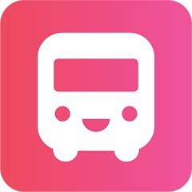</td>
    <td align="center">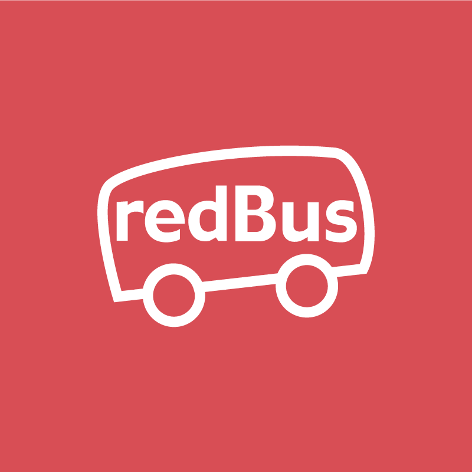</td>
  </tr>
  <tr>
    <td rowspan="2"><strong>Perfil</strong></td>
    <td><strong>Overview</strong></td>
    <td>
      Aplicación internacional de movilidad urbana con cobertura global. Ofrece rutas, horarios y planificación multimodal (bus, tren, bicicleta). Opera en Lima con datos colaborativos
    </td>
    <td>
      Servicio global de mapas y tráfico en tiempo real. Incluye opciones de transporte público, aunque con detalle limitado para buses limeños
    </td>
    <td>
      App peruana enfocada en transporte público limeño, basada en información colaborativa sobre rutas de buses y colectivos
    </td>
    <td>
      Plataforma especializada en venta de pasajes interprovinciales. No opera rutas urbanas, pero es referente en digitalización del transporte
    </td>
  </tr>
  <tr>
    <td><strong>Ventaja Competitiva<br>¿Qué valor ofrece?</strong></td>
    <td>
      Precisión global, experiencia en movilidad urbana y amplia integración multimodal
    </td>
    <td>
      Cartografía precisa, navegación confiable y datos de tráfico actualizados
    </td>
    <td>
      Conocimiento local del transporte limeño y fácil uso para usuarios cotidianos
    </td>
    <td>
      Compra segura de pasajes, métodos de pago confiables y reputación consolidada
    </td>
  </tr>
  <tr>
    <td rowspan="2"><strong>Perfiles de Marketing</strong></td>
    <td><strong>Mercado objetivo</strong></td>
    <td>Usuarios urbanos que buscan planificar rutas multimodales</td>
    <td>Usuarios globales que necesitan mapas, navegación y tráfico</td>
    <td>Pasajeros limeños frecuentes que usan buses o colectivos</td>
    <td>Viajeros que realizan desplazamientos interprovinciales</td>
  </tr>
  <tr>
    <td><strong>Estrategias de marketing</strong></td>
    <td>Publicidad global, alianzas con gobiernos y operadores</td>
    <td>Integración con Android y ecosistema Google; marketing masivo</td>
    <td>Redes sociales, enfoque local y participación comunitaria</td>
    <td>Marketing digital, alianzas con empresas de transporte</td>
  </tr>
  <tr>
    <td rowspan="3"><strong>Perfil de Producto</strong></td>
    <td><strong>Productos y Servicios</strong></td>
    <td>Rutas, horarios, planificación multimodal, notificaciones básicas</td>
    <td>Mapas, tráfico, transporte público, navegación y GPS</td>
    <td>Rutas de buses y colectivos en Lima; colaboración ciudadana</td>
    <td>Venta de pasajes, reservas y métodos de pago seguros</td>
  </tr>
  <tr>
    <td><strong>Precios y Costos</strong></td>
    <td>Gratuito</td>
    <td>Gratuito</td>
    <td>Gratuito</td>
    <td>Comisiones y precios de pasajes</td>
  </tr>
  <tr>
    <td><strong>Canales de Distribución</strong><br>(Web y/o Móvil)</td>
    <td>Web y móvil</td>
    <td>Web y móvil</td>
    <td>Móvil</td>
    <td>Web y móvil</td>
  </tr>
  <tr>
    <td rowspan="4"><strong>Análisis SWOT</strong></td>
    <td><strong>Fortalezas</strong></td>
    <td>- Amplia cobertura global <br><br> - Integración multimodal <br><br> - Datos colaborativos amplios</td>
    <td>- Cartografía precisa <br><br> - Tráfico en tiempo real <br><br> - Ecosistema digital fuerte</td>
    <td>- Conocimiento local <br><br> - Interfaz sencilla <br><br> - Enfoque en transporte limeño</td>
    <td>- Confianza en pagos <br><br> - Amplia cobertura interprovincial <br><br> -Marca consolidada</td>
  </tr>
  <tr>
    <td><strong>Debilidades</strong></td>
    <td>- Datos poco precisos en Lima <br><br> -Baja personalización local</td>
    <td>- No especializado en transporte urbano limeño</td>
    <td>- Datos desactualizados <br><br> - Dependencia de la comunidad <br><br> -Sin tiempo real</td>
    <td>- No cubre transporte urbano <br><br> - Funcionalidad limitada para rutas limeñas</td>
  </tr>
  <tr>
    <td><strong>Oportunidades</strong></td>
    <td>Integrarse con operadores locales y mejorar datos en tiempo real</td>
    <td>Expandir detalle de transporte urbano en ciudades emergentes</td>
    <td>Incorporar APIs oficiales y mayor precisión en rutas y horarios</td>
    <td>Ampliar servicios hacia transporte urbano</td>
  </tr>
  <tr>
    <td><strong>Amenazas</strong></td>
    <td>Mejoras locales podrían desplazar a apps especializadas</td>
    <td>Regulaciones de datos y competencia global</td>
    <td>Competidores con información más precisa y tiempo real</td>
    <td>Competidores con ecosistemas más robustos</td>
  </tr>
</tbody>
</table>

_**Figura 6.** Logotipos de los principales competidores analizados: Moovit, Google Maps, TuRuta y RedBus._ <br> _**Fuente:** elaboración propia a partir de material público de cada marca._

<br>


BusTrack puede diferenciarse mediante información confiable en tiempo real, un enfoque exclusivamente local y la integración de APIs oficiales para ofrecer datos verificados sobre buses y rutas urbanas. Esto cubre vacíos que los competidores actuales aún no resuelven completamente.

<br>

### 2.1.2. Estrategias y tácticas frente a competidores.

Para destacar frente a las aplicaciones presentes en el mercado, **BusTrack** aplicará una estrategia basada en la personalización local y la diferenciación tecnológica, con un enfoque progresivo en innovación y calidad de datos.

### 1. Enfoque en la realidad limeña
- Integrar información de buses y paraderos tanto formales como informales.  
- Incorporar APIs y datos oficiales de municipalidades para aumentar la confiabilidad del servicio.  

### 2. Alianzas estratégicas
- Establecer colaboración con operadores de transporte urbano y universidades para captar usuarios frecuentes.  
- Explorar acuerdos con entidades públicas de transporte para mejorar la base de datos y validar rutas en tiempo real.  

### 3. Valor agregado para el usuario
- Ofrecer notificaciones en tiempo real sobre la llegada de buses.  
- Permitir guardar rutas frecuentes y mostrar estimaciones basadas en el tráfico local.  
- Incluir alertas de seguridad, como sugerencias de paraderos recomendados o zonas de riesgo.  

### 4. Campañas de posicionamiento digital
- Mantener una presencia activa en redes sociales para atraer principalmente a estudiantes y trabajadores.  
- Desarrollar estrategias de marketing enfocadas en el ahorro de tiempo, la seguridad y la eficiencia del transporte urbano.  
- Fomentar la construcción de una comunidad de usuarios que compartan información dentro de la plataforma.  

### 5. Innovación tecnológica gradual
- Desarrollar una futura aplicación móvil con geolocalización más precisa.  
- Implementar funciones predictivas que estimen tiempos de llegada basados en patrones históricos de tráfico.  

Con estas estrategias, **BusTrack** busca convertirse en una opción confiable y útil para los ciudadanos de Lima Metropolitana, apostando por la innovación tecnológica y por brindar información clara y en tiempo real que facilite la movilidad diaria de estudiantes, trabajadores y usuarios frecuentes del transporte público.

## 2.2. Entrevistas.

Como parte del proceso de validación del modelo de negocio de BusTrack, se plantean entrevistas semiestructuradas dirigidas a los dos segmentos objetivos: pasajeros de transporte público y empresas de transporte urbano. El propósito es identificar sus motivaciones, comportamientos, expectativas y principales frustraciones en relación con la movilidad urbana, así como validar la propuesta de valor de la plataforma.

### 2.2.1. Diseño de entrevistas.

## Segmento 1: Pasajeros de Transporte Público

**Objetivo:** Entender las frustraciones en el uso del transporte diario

### Datos generales
- Nombre  
- Edad  
- Distrito de residencia  
- Ocupación (estudiante, trabajador, etc.)  
- Frecuencia de uso del transporte público (diaria, varias veces por semana, esporádica)  

### Motivaciones y comportamientos
- ¿Qué medio de transporte público usas con más frecuencia (bus, coaster, combi, Metropolitano, Metro)?  
- ¿Qué situaciones específicas te generan más preocupación al viajar?
- ¿Qué pasos sigues normalmente antes de salir de casa para tomar el bus?
- ¿Has usado alguna aplicación para movilizarte en la ciudad (Waze, Google Maps, Moovit, etc.)? ¿Cómo fue tu experiencia?  
- ¿Qué importancia le das a recibir información en tiempo real sobre la llegada de buses?  

### Miedos, expectativas y canales
- ¿Qué problemas enfrentas con mayor frecuencia en tus traslados (tiempo de espera, congestión, inseguridad, falta de información)?  
- ¿Qué haría que confíes en una aplicación como BusTrack para planificar tus viajes?  
- ¿Te gustaría recibir notificaciones sobre la llegada del bus, retrasos o desvíos de ruta? 
- ¿Qué redes sociales o aplicaciones móviles usas más para informarte en tu día a día?  
- ¿Cómo medirías que una aplicación realmente mejora tu experiencia de viaje?  

---

## Segmento 2: Empresas de Transporte Urbano

**Objetivo:** Comprender los procesos operativos de las empresas de transporte urbano

### Datos generales
- Nombre del entrevistado  
- Cargo (administrador, supervisor de rutas, propietario)  
- Empresa / línea de transporte  
- Número de unidades en operación  
- Zonas o rutas que cubren  

### Operaciones y herramientas
- ¿Cómo gestionan actualmente la ubicación y monitoreo de sus buses?  
- ¿Qué herramientas usan para controlar sus buses y qué limitaciones encuentran en ellas?
- ¿Qué información reciben de los conductores y cómo la gestionan?  
- ¿Han utilizado aplicaciones para comunicarse con pasajeros? Si ese es el caso, ¿les fue útil? y qué problemas encontraron?
- ¿Cuáles son los mayores retos para mantener la puntualidad y la seguridad de los viajes?  

### Expectativas y valor esperado
- ¿Qué tipo de datos o reportes serían más valiosos para su gestión diaria (tiempos de llegada, cantidad de pasajeros, retrasos)?  
- ¿Qué funcionalidades de una aplicación como BusTrack les motivarían a adoptarla?  
- ¿Cómo creen que una plataforma de información en tiempo real podría mejorar la confianza de los pasajeros?  
- ¿Qué beneficios esperan obtener al implementar una solución tecnológica (mayor satisfacción, competitividad, reducción de costos)?  
- ¿Qué barreras internas o externas ven para adoptar una aplicación digital de gestión de transporte?

### 2.2.2. Registro de entrevistas.

### Segmento 1: Pasajeros de Transporte Público (Estudiantes y Trabajadores)  


| **Entrevista 1** |
|--------|
| **Entrevistado:** Mariana Rafael |
| **Sexo:** Femenino |
| **Edad:** 20 |
| **Ocupación:** Estudiante universitario |
| **Medio utilizado:** Zoom |
| **Evidencia:**   <br> _**Figura 7.** Evidencia de entrevista 1 - Segmento 1._ <br> _**Fuente:** elaboración propia._|
| **Link de entrevista:** <https://youtu.be/fcO25GbbaRY> |
| **Resumen de entrevista:** La entrevistada utiliza principalmente corredores de la ATU y el Metropolitano para ir a la universidad o salir con amigos. Sus principales preocupaciones son la inseguridad, los desvíos inesperados y los costos del transporte. Considera esencial contar con información en tiempo real y notificaciones confiables para optimizar su tiempo y aumentar la confianza en el transporte público. |


| **Entrevista 2** |
|-----------|
| **Entrevistado:** Alessandro Bravo |
| **Sexo:** Masculino |
| **Edad:** 20 |
| **Ocupación:** Estudiante universitario |
| **Medio utilizado:** Zoom |
| **Evidencia:**   <br> _**Figura 8.** Evidencia de entrevista 2 - Segmento 1._ <br> _**Fuente:** elaboración propia._|
| **Link de entrevista:** <https://www.youtube.com/watch?v=5rFwJUM-JS4> | 
| **Resumen de entrevista:** El entrevistado viaja diariamente en buses y combis, tomando hasta tres por día desde San Martín de Porres. Sus principales preocupaciones son el tiempo de espera, la inseguridad y la falta de información confiable. Usa aplicaciones como Moovit, aunque señala que no siempre están actualizadas. Valora recibir notificaciones en tiempo real sobre ubicación, desvíos y precios para llegar a tiempo a clases y optimizar sus traslados. |

| **Entrevista 3** |
|-----------|
| **Entrevistado:**  Melisa Sulca  |
| **Sexo:** Femenino |
| **Edad:** 23 |
| **Ocupación:** Estudiante universitario |
| **Medio utilizado:** Zoom |
| **Evidencia:**  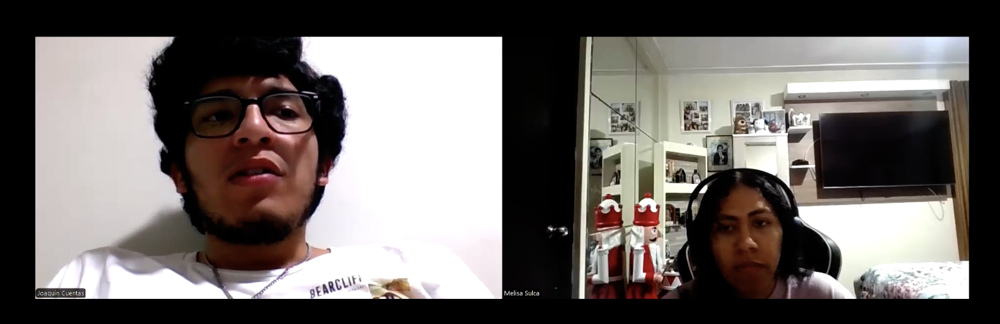 <br> _**Figura 9.** Evidencia de entrevista 3 - Segmento 1._ <br> _**Fuente:** elaboración propia._|
| **Link de entrevista:** <https://upcedupe-my.sharepoint.com/:v:/g/personal/u20201f788_upc_edu_pe/IQAizEwhwgVIRoDGZdlA-3UtAZTDcAPxf_lPHyIuvhfMD2w?e=b4WJu9> | 
| **Resumen de entrevista:** La entrevistada suele tomar buses de transporte público rutinariamente para movilizarse a la universidad o a algún otro punto de la ciudad. Ella explica que no tiene mucho conocimiento acerca de rutas de transporte, por lo que siempre suele consultar con su mamá que está más informada del tema. Este es motivo por el cual una aplicación como BusTrack sería de gran ayuda para ella, por la información en tiempo real de los buses que toma que podrían estar al alcance de su mano.  |
 
<br>

### Segmento 2: Empresas de Transporte Urbano

| **Entrevista 4** |
|-----------|
| **Entrevistado:** Octavio |
| **Sexo:** Masculino |
| **Edad:** 35 |
| **Ocupación:** Supervisor de rutas |
| **Medio utilizado:** Zoom |
| **Evidencia:**   <br> _**Figura 10.** Evidencia de entrevista 4 - Segmento 2._ <br> _**Fuente:** elaboración propia._|
| **Link de entrevista:** <https://youtu.be/MOjHcLv6YDY> |
| **Resumen de entrevista:** El entrevistado gestiona la flota mediante llamadas a los choferes y el uso de Excel y hojas de ruta, recibiendo solo información básica sobre tráfico y fallas mecánicas. Considera valiosos los reportes automáticos y la ubicación exacta de buses para mejorar la operación. Reconoce que una plataforma como BusTrack podría incrementar la confianza de los pasajeros, aunque identifica barreras como el costo y la resistencia de algunos conductores a adoptar tecnología. |


| **Entrevista 5** |
|-----------|
| **Entrevistado:** Jean Paul Condori |
| **Sexo:** Masculino |
| **Edad:** 40 |
| **Ocupación:** Administrador de flota |
| **Medio utilizado:** Zoom |
| **Evidencia:**   <br> _**Figura 11.** Evidencia de entrevista 5 - Segmento 2._ <br> _**Fuente:** elaboración propia._|
| **Link de entrevista:** <https://youtu.be/JAEwGB9mBGk> |
| **Resumen de entrevista:** El entrevistado gestiona las unidades mediante grupos de WhatsApp y cuadernos físicos, recibiendo información de los conductores sobre retrasos, cambios de ruta y controles policiales. Identifica retos como tráfico, bloqueos y falta de procesos modernos. Considera útil contar con reportes sobre rutas, horarios y cantidad de pasajeros. Percibe a BusTrack como una oportunidad para implementar monitoreo en tiempo real, aunque también identifica barreras relacionadas con la confianza y la adaptación tecnológica de los conductores. |


| **Entrevista 6** |
|-----------|
| **Entrevistado:** Walter Fajardo |
| **Sexo:** Masculino |
| **Edad:** 30 |
| **Ocupación:** Gerente de empresa de transportes |
| **Medio utilizado:** Zoom |
| **Evidencia:**  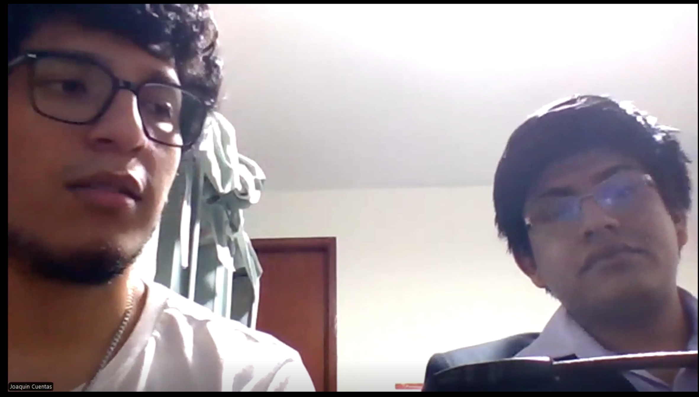 <br> _**Figura 12.** Evidencia de entrevista 6 - Segmento 2._ <br> _**Fuente:** elaboración propia._|
| **Link de entrevista:** <https://upcedupe-my.sharepoint.com/personal/u20201f788_upc_edu_pe/_layouts/15/stream.aspx?id=%2Fpersonal%2Fu20201f788%5Fupc%5Fedu%5Fpe%2FDocuments%2FSegemento%20objetivo%202%20%2D%20Walter%2Emp4&nav=eyJyZWZlcnJhbEluZm8iOnsicmVmZXJyYWxBcHAiOiJPbmVEcml2ZUZvckJ1c2luZXNzIiwicmVmZXJyYWxBcHBQbGF0Zm9ybSI6IldlYiIsInJlZmVycmFsTW9kZSI6InZpZXciLCJyZWZlcnJhbFZpZXciOiJNeUZpbGVzTGlua0NvcHkifX0&ga=1&referrer=StreamWebApp%2EWeb&referrerScenario=AddressBarCopied%2Eview%2E271d57e2%2D0088%2D4def%2Da3c3%2D2723d93114b8> | 
| **Resumen de entrevista:**  El entrevistado muestra atracción por una aplicación que ayude a mejorar la supervisición sobre los conductores de la empresa, ya que por el momento, solo tienen un control al incio y final de iniciada una ruta. Considera que una supervisión en tiempo real podría mejorar la confianza generada en los pasajeros y muestra su interes porque BusTrack sea una aplicación sencialla de uso para agilizar tiempos. |

<br>

### 2.2.3. Análisis de entrevistas.

A partir de las entrevistas realizadas, se agruparon las respuestas más representativas de cada segmento para identificar patrones comunes, necesidades y oportunidades de mejora.

### Segmento 1: Pasajeros de Transporte Público (Estudiantes y Trabajadores)  

| **Preguntas** | **Respuestas Generales** |
|---|---|
| ¿Qué medio de transporte público usas con más frecuencia (bus, coaster, combi, Metropolitano, Metro)? | Los más utilizados son buses y combis para recorridos diarios, además de corredores de la ATU y el Metropolitano para trayectos largos o frecuentes. |
| ¿Qué situaciones específicas te generan más preocupación al viajar? | Principalmente la inseguridad (robos durante los trayectos) y la incertidumbre por desvíos de ruta o cambios inesperados. |
| ¿Qué pasos sigues normalmente antes de salir de casa para tomar el bus? | Consultan previamente rutas y paraderos en el celular, investigan precios y tiempos estimados. Algunos usan apps como “TuRuta” o Moovit, aunque no siempre confían en su precisión. |
| ¿Has usado alguna aplicación para movilizarte en la ciudad (Waze, Google Maps, Moovit, etc.)? ¿Cómo fue tu experiencia? | Sí, principalmente Moovit. Sin embargo, señalan que no siempre está actualizada, lo que genera retrasos y confusión en la planificación de viajes. |
| ¿Qué importancia le das a recibir información en tiempo real sobre la llegada de buses? | Se considera muy importante, ya que permite organizar mejor el tiempo y evitar esperas innecesarias. |
| ¿Qué problemas enfrentas con mayor frecuencia en tus traslados (tiempo de espera, congestión, inseguridad, falta de información)? | Las largas esperas sin información, congestión en horas punta e inseguridad dentro de buses y paraderos. |
| ¿Qué haría que confíes en una aplicación como BusTrack para planificar tus viajes? | Que muestre información actualizada y verificada sobre ubicación de buses, precios y posibles desvíos. También que garantice seguridad validando a los conductores. |
| ¿Te gustaría recibir notificaciones sobre la llegada del bus, retrasos o desvíos de ruta? | Sí, especialmente sobre retrasos y desvíos, ya que afectan la puntualidad en clases y el trabajo. |
| ¿Qué redes sociales o aplicaciones móviles usas más para informarte en tu día a día? | Principalmente TikTok, Instagram, X (Twitter) y canales de noticias digitales. |
| ¿Cómo medirías que una aplicación realmente mejora tu experiencia de viaje? | En la práctica, comprobando que reduce tiempos de espera, brinda información confiable y hace el viaje más seguro y eficiente. |

**Insights:**

Se identificó una fuerte necesidad de control en los pasajeros, quienes experimentan ansiedad e inseguridad ante la falta de información sobre los tiempos de llegada de los buses. La inmediatez es un valor clave, ya que los usuarios prefieren aplicaciones que proporcionen datos actualizados en tiempo real sobre rutas y horarios.

La confianza está estrechamente relacionada con la seguridad, por lo que esperan validación de conductores, monitoreo de unidades y rutas verificadas. Finalmente, su motivación principal es de carácter práctico, pues buscan optimizar el tiempo de viaje y reducir la incertidumbre más que explorar aplicaciones por simple novedad. 

<br>

### Segmento 2: Empresas de Transporte Urbano
| **Preguntas** | **Respuestas Generales** |
|---|---|
| ¿Cómo gestionan actualmente la ubicación y monitoreo de sus buses? | No cuentan con un sistema especializado, dependen de llamadas rápidas a los choferes y grupos de WhatsApp para reportar ubicación en ruta. |
| ¿Qué herramientas usan para controlar sus buses y qué limitaciones encuentran en ellas? | Usan cuadernos, hojas de ruta y, en algunos casos, Excel para registrar salidas, llegadas y control básico de operaciones. |
| ¿Qué información reciben de los conductores y cómo la gestionan? | Se reportan retrasos, tráfico, problemas mecánicos e incidentes en ruta (como policías o semáforos dañados) mediante mensajes o llamadas, y se gestionan manualmente. |
| ⁠¿Han utilizado aplicaciones para comunicarse con pasajeros? Si ese es el caso, ¿les fue útil y qué problemas encontraron? | No cuentan con un canal digital para pasajeros; algunos han considerado apps, pero aún no las aplican. |
| ¿Cuáles son los mayores retos para mantener la puntualidad y la seguridad de los viajes? | El tráfico, bloqueos, obras en las vías y la falta de información en tiempo real. Además, la limpieza de buses y la coordinación con choferes a distancia dificultan la operación. |
| ¿Qué tipo de datos o reportes serían más valiosos para su gestión diaria (tiempos de llegada, cantidad de pasajeros, retrasos)? | Horarios exactos de salida y llegada, ubicación en tiempo real, retrasos por incidentes y cantidad de pasajeros transportados por vuelta. |
| ¿Qué funcionalidades de una aplicación como BusTrack les motivarían a adoptarla? | Monitoreo en tiempo real de las unidades, reportes automáticos y alertas inmediatas de incidencias o desvíos. |
| ¿Cómo creen que una plataforma de información en tiempo real podría mejorar la confianza de los pasajeros? | Brindando horarios verificados de salida y llegada para que los pasajeros planifiquen mejor su tiempo y perciban mayor confiabilidad. |
| ¿Qué beneficios esperan obtener al implementar una solución tecnológica (mayor satisfacción, competitividad, reducción de costos)? | Mayor satisfacción de los pasajeros, incremento de usuarios, reducción de quejas y mayor control interno de la operación. |
| ¿Qué barreras internas o externas ven para adoptar una aplicación digital de gestión de transporte? | Los costos de implementación, la resistencia de los choferes a adaptarse y la desconfianza inicial hacia nuevas tecnologías. |

**Insights:**

Las empresas de transporte urbano presentan una gestión operativa manual y poco eficiente, sustentada en llamadas telefónicas, registros en papel o en hojas de cálculo, lo que limita la trazabilidad y control de la flota. La falta de visibilidad en tiempo real impide tomar decisiones oportunas y afecta la puntualidad de los servicios.

Se observó además una resistencia cultural hacia la adopción tecnológica, especialmente entre conductores con menor experiencia digital. Aun así, los entrevistados expresaron alto interés en obtener reportes automáticos y datos analíticos para mejorar la gestión. Las barreras económicas y de capacitación continúan siendo los principales obstáculos para la implementación de soluciones tecnológicas como BusTrack.

<br>

## 2.3. Needfinding.

En esta etapa se identifican y analizan las necesidades reales de los usuarios para asegurar que BusTrack responda a las expectativas y problemas detectados durante la investigación. Para ello, se desarrollan los User Personas, el User Task Matrix, los User Journey Maps y los Empathy Maps, permitiendo comprender profundamente los comportamientos, motivaciones y frustraciones de cada segmento objetivo.

### 2.3.1. User Personas.

### Segmento Objetivo 1: Pasajeros de Transporte Público

### Estudiante universitario

| **Atributo**     | **Valor** |
|------------------|-----------|
| **Name**         | Manuel Suarez |
| **Age**          | 24 años |
| **Occupation**   | Estudiante universitario |
| **Status**       | Soltero |
| **Location**     | Lima, Perú |
| **Tier**         | Pasajero frecuente |
| **Archetype**    | Usuario Pragmático |
| **Image**        |  <br><br> _**Figura 13.** Imagen representativa del User Persona “Manuel Suárez”, estudiante universitario usuario frecuente de transporte público._ <br> _**Fuente:** elaboración propia._ |
| **Quote**        | "Lo que más necesito es saber con certeza cuándo llegará el bus para no perder tiempo ni arriesgarme en el paradero." |
| **Motivations**  | Incentive: 80/100<br>Fear: 75/100<br>Achievement: 80/100<br>Growth: 65/100<br>Power: 40/100<br>Social: 85/100 |
| **Goals**        | - Llegar puntual a clases sin depender de información incierta.<br>- Optimizar su tiempo para estudiar y evitar esperas innecesarias.<br>- Sentirse seguro en trayectos diarios, especialmente en paraderos con poca iluminación o vigilancia. |
| **Frustrations** | - No saber con exactitud cuándo pasará el bus.<br>- Perder tiempo en paraderos inseguros o llenos.<br>- Apps como Moovit no siempre muestran retrasos reales ni desvíos de ruta.<br> - Estrés cuando llega tarde por demoras inesperadas.|
| **Biography**    | Manuel estudia en una universidad en el centro de Lima y vive en un distrito alejado. Sale temprano todos los días y realiza entre dos y tres transbordos para llegar a clases. Antes de salir, revisa aplicaciones como Moovit o Google Maps para planificar su ruta, pero muchas veces la información no es confiable, ya que los buses se retrasan, no aparecen en el mapa o toman desvíos sin aviso. Esto lo obliga a esperar largos minutos en paraderos inseguros, lo que le genera ansiedad y pérdida de tiempo valioso. En días de evaluación, su principal preocupación es llegar puntual. Usa activamente redes sociales y confía en aplicaciones cuando le brindan datos claros y en tiempo real.|
| **Personality**  | Extrovert: 60/100<br>Thinking: 80/100<br>Judging: 70/100 |
| **Technology**   | IT and Internet: 85/100<br>Software: 70/100<br>Mobile Apps: 90/100<br>Social Networks: 95/100 |
| **Brands**       | WhatsApp, Google Maps, TikTok, Moovit, TuRuta |

<br>

## Trabajador

| **Atributo**     | **Valor** |
|------------------|-----------|
| **Name**         | Alejandro Medina |
| **Age**          | 32 años |
| **Occupation**   | Empleado administrativo |
| **Status**       | Soltero |
| **Location**     | Lima, Perú |
| **Tier**         | Pasajero frecuente |
| **Archetype**    | Viajero Organizado |
| **Image**        |  <br><br> _**Figura 14.** Imagen representativa del User Persona “Alejandro Medina”, trabajador administrativo que usa transporte público a diario._  <br> _**Fuente:** elaboración propia._ |
| **Quote**        | "Necesito que el transporte sea puntual porque llegar tarde al trabajo no es una opción." |
| **Motivations**  | Incentive: 80/100<br>Fear: 75/100<br>Achievement: 85/100<br>Growth: 65/100<br>Power: 50/100<br>Social: 70/100 |
| **Goals**        | - Llegar puntual al trabajo evitando esperas innecesarias.<br>- Optimizar su tiempo de traslado para tener más tiempo libre al final del día.<br>- Usar una app confiable que proporcione información precisa sobre buses y tráfico en tiempo real.<br> - Reducir el estrés diario asociado al transporte público. |
| **Frustrations** | - Largas esperas sin información clara sobre la llegada del bus.<br>- Aplicaciones desactualizadas que no muestran desvíos o retrasos reales.<br>- Perder tiempo en trayectos mal planificados.<br> - Inseguridad en paraderos, sobre todo en horarios nocturnos. |
| **Biography**    | Alejandro trabaja en una oficina en el centro de Lima y vive en un distrito periférico. Sale muy temprano todos los días para evitar el tráfico, pero aun así pasa más de dos horas en transporte público entre ida y vuelta. Usa Moovit para revisar rutas antes de salir, aunque con frecuencia se frustra cuando los buses no llegan a la hora estimada o toman desvíos sin aviso. La puntualidad es crucial en su trabajo, por lo que la falta de información confiable le genera ansiedad. Una aplicación que le brinde datos en tiempo real y alertas claras significaría más control sobre su tiempo y menos estrés.|
| **Personality**  | Extrovert: 55/100<br>Thinking: 85/100<br>Judging: 70/100 |
| **Technology**   | IT and Internet: 85/100<br>Software: 65/100<br>Mobile Apps: 80/100<br>Social Networks: 85/100 |
| **Brands**       | WhatsApp, Moovit, Facebook, TikTok |

<br>

## Segmento Objetivo 2: Empresas de Transporte Urbano

##  Administrador de flota

| **Atributo**     | **Valor** |
|------------------|-----------|
| **Name**         | Luis Palacios |
| **Age**          | 38 años |
| **Occupation**   | Administrador de flota en empresa de transporte urbano |
| **Status**       | Soltero |
| **Location**     | Lima, Perú |
| **Tier**         | Empresa de transporte urbano |
| **Archetype**    | Gestor Eficiente |
| **Image**        |  <br><br> _**Figura 15.** Imagen representativa del User Persona “Luis Palacios”, administrador de flota en una empresa de transporte urbano._  <br> _**Fuente:** elaboración propia._|
| **Quote**        | "Si puedo monitorear mis buses en tiempo real, puedo ofrecer un mejor servicio y ganar más pasajeros." |
| **Motivations**  | Incentive: 85/100<br>Fear: 65/100<br>Achievement: 90/100<br>Growth: 70/100<br>Power: 75/100<br>Social: 70/100 |
| **Goals**        | - Monitorear en tiempo real la ubicación y estado de todas las unidades.<br>- Detectar y resolver incidencias operativas rápidamente.<br>- Mejorar la puntualidad general y reducir reclamos de usuarios.<br>- Digitalizar procesos manuales para optimizar tiempos y costos.<br>- Usar herramientas que faciliten decisiones estratégicas. |
| **Frustrations** | - Depender de llamadas, WhatsApp y cuadernos para coordinar.<br>- No tener visibilidad clara del estado de las rutas en tiempo real.<br>- Dificultad para anticipar retrasos o desvíos.<br>- Perder tiempo consolidando datos manualmente en Excel. |
| **Biography**    | Luis es administrador en una empresa de transporte urbano que opera 18 buses en Lima Metropolitana. Su día comienza muy temprano revisando reportes manuales y coordinando con supervisores mediante llamadas y mensajes. Debe responder rápidamente a incidencias como desvíos o congestión, pero la falta de información centralizada dificulta la toma de decisiones oportunas. Además, debe presentar reportes detallados a la gerencia, lo que implica un gran esfuerzo manual. Busca una plataforma que brinde control total en tiempo real, reduzca errores y modernice la gestión de flota para competir con el transporte informal. |
| **Personality**  | Extrovert: 65/100<br>Thinking: 85/100<br>Judging: 70/100 |
| **Technology**   | IT and Internet: 75/100<br>Software: 60/100<br>Mobile Apps: 65/100<br>Social Networks: 60/100 |
| **Brands**       | WhatsApp, Excel, Facebook |

<br>

##  Supervisor de Rutas

| **Atributo**     | **Valor** |
|------------------|-----------|
| **Name**         | José Ramírez |
| **Age**          | 40 años |
| **Occupation**   | Supervisor de rutas en empresa de transporte urbano |
| **Status**       | Soltero |
| **Location**     | Lima, Perú |
| **Tier**         | Empresa de transporte urbano |
| **Archetype**    | Supervisor Operativo |
| **Image**        |  <br><br> _**Figura 16.** Imagen representativa del User Persona “José Ramírez”, supervisor de rutas en una empresa de transporte urbano._  <br> _**Fuente:** elaboración propia._ |
| **Quote**        | "Lo más difícil es coordinar con los choferes en medio del tráfico y asegurar que los buses lleguen a tiempo." |
| **Motivations**  | Incentive: 70/100<br>Fear: 60/100<br>Achievement: 80/100<br>Growth: 60/100<br>Power: 65/100<br>Social: 70/100 |
| **Goals**        | - Coordinar eficientemente la operación diaria de múltiples rutas.<br>- Anticipar problemas de tráfico o desvíos antes de que afecten a los pasajeros.<br>- Reducir reclamos por incumplimiento de horarios.<br>- Estandarizar reportes e incidencias.<br>- Recibir alertas automáticas para actuar más rápido. |
| **Frustrations** | - Depender de WhatsApp y llamadas individuales.<br>- No contar con un panel centralizado para incidencias en tiempo real.<br>- Perder tiempo obteniendo información fragmentada.<br>- No poder anticipar bloqueos o retrasos.<br>- Dificultad para demostrar su desempeño ante la administración. |
| **Biography**    | José supervisa varias rutas de transporte urbano en Lima Metropolitana. Su jornada comienza antes de las seis de la mañana y consiste en coordinar con conductores, verificar operaciones y reaccionar rápidamente a incidencias en el tránsito. Su principal herramienta son grupos de WhatsApp, llamadas y cuadernos físicos, lo que ocasiona retrasos y decisiones tardías. A menudo se entera tarde de bloqueos o accidentes, generando retrasos acumulados. Además, debe entregar reportes diarios elaborados manualmente. Una plataforma que centralice la información, envíe alertas automáticas y permita monitoreo en tiempo real transformaría su trabajo y reduciría la presión operativa. |
| **Personality**  | Extrovert: 65/100<br>Thinking: 75/100<br>Judging: 80/100 |
| **Technology**   | IT and Internet: 65/100<br>Software: 50/100<br>Mobile Apps: 75/100<br>Social Networks: 60/100 |
| **Brands**       | WhatsApp, Excel, Facebook |

<br>

### 2.3.2. User Task Matrix.

### Segmento Objetivo 1
      
| Tarea / Funcionalidad                | Manuel Suarez (Estudiante Universitario) | Alejandro Medina (Trabajador) | Adulto mayor | Turista |
|--------------------------------------|------------|------------|--------------|---------|
| Consultar rutas y horarios           | Alta       | Alta       | Alta         | Alta    |
| Recibir notificaciones en tiempo real| Alta       | Alta       | Media        | Media   |
| Guardar trayectos frecuentes         | Alta       | Alta       | Media        | Baja    |
| Revisar estimaciones según tráfico   | Media      | Alta       | Baja         | Media   |
| Identificar paraderos cercanos       | Media      | Media      | Alta         | Alta    |
| Alertas de seguridad en paraderos    | Media      | Media      | Alta         | Media   |
| Consultar rutas hacia puntos turísticos | Baja    | Baja       | Baja         | Alta    |
| Administración de datos (rol admin)  | Baja       | Baja       | Baja         | Baja    |

En el User Task Matrix del Segmento 1 se observa que cada grupo de usuarios tiene prioridades distintas: los estudiantes y trabajadores buscan principalmente rapidez e información en tiempo real; los adultos mayores se enfocan en la seguridad y en identificar paraderos cercanos; y los turistas necesitan rutas claras hacia lugares de interés. Aunque las tareas administrativas no se perciben directamente, son clave para mantener la información confiable. En general, BusTrack debe centrarse en ofrecer datos precisos, opciones personalizadas y una experiencia segura para todos.

<br>

### Segmento Objetivo 2

| Tarea / Funcionalidad                | Luis Palacios (Administrador de Flota) | José Ramírez (Supervisor de Rutas) | Propietario |
|--------------------------------------|------------|------------|--------------|
| Monitorear buses en tiempo real      | Alta       | Alta       | Media        |
| Generar reportes automáticos         | Alta       | Media      | Alta         |
| Gestionar incidencias y alertas en ruta  | Alta       | Alta       | Media        |
| Comunicar cambios de ruta a choferes | Alta       | Alta       | Baja         |
| Analizar costos operativos y optimizarlos | Media    | Baja      | Alta         |
| Mejorar puntualidad y satisfacción del pasajero | Alta | Alta | Alta |
| Planificar mantenimiento preventivo de buses | Media | Alta | Media |
| Decidir adopción de nuevas tecnologías | Media | Baja | Alta |
| Administrar permisos y accesos en la plataforma | Alta | Media | Baja |

En el User Task Matrix del Segmento 2 se observa que el supervisor de rutas y el administrador de flota priorizan tareas operativas como el monitoreo en tiempo real, la generación de reportes y la gestión de incidencias, mientras que los propietarios se enfocan en aspectos estratégicos como la reducción de costos y la adopción de nuevas tecnologías. Esto evidencia que las empresas necesitan una solución que combine eficiencia operativa y capacidad estratégica, garantizando puntualidad, satisfacción del pasajero y modernización de procesos.

<br>

### 2.3.3. User Journey Mapping.

A continuación se presentan los User Journey Maps desarrollados para los dos segmentos objetivo de BusTrack: Pasajeros y Empresas de transporte. Cada mapa describe el flujo actual del usuario, destacando acciones, emociones, problemas y oportunidades de mejora que BusTrack busca resolver.

### Segmento 1: Pasajeros

#### User Persona 1 – Manuel Suárez (Estudiante Universitario)

**Descripción breve:** Este mapa muestra cómo un estudiante organiza su viaje diario utilizando BusTrack, centrado en la precisión del tiempo estimado de llegada, la ansiedad por retrasos y la necesidad de información confiable en tiempo real.

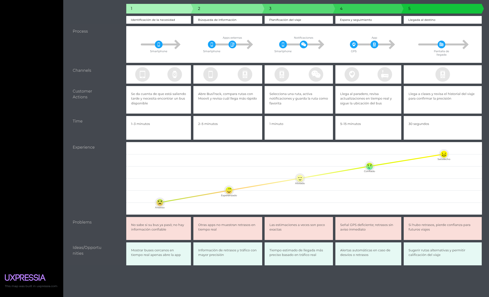

<br>

_**Figura 17.** User Journey Map de Manuel Suárez (estudiante universitario), que muestra su flujo de viaje diario y las oportunidades de mejora que aborda BusTrack._  <br> _**Fuente:** elaboración propia._


___

#### User Persona 2 – Alejandro Medina (Trabajador)

**Descripción breve:** Este mapa visualiza cómo un trabajador depende de la aplicación para adaptarse a condiciones de tráfico variables y evitar retrasos, destacando su necesidad de alertas inmediatas y estimaciones precisas.

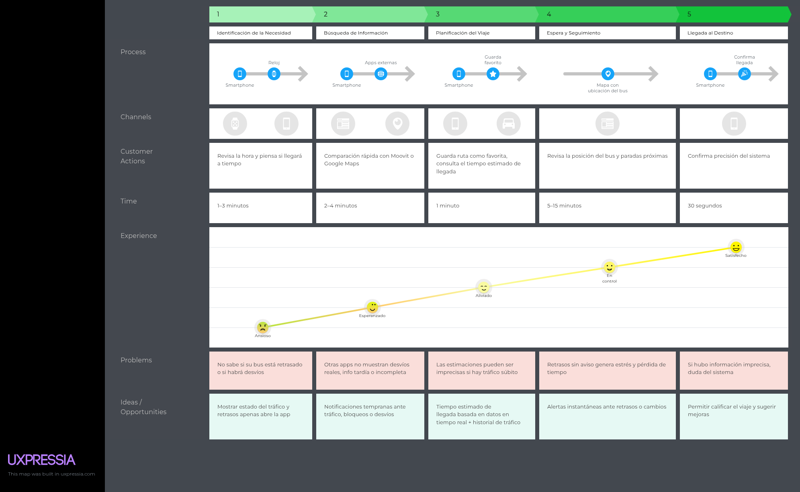

<br> _**Figura 18.** User Journey Map de Alejandro Medina (trabajador administrativo), ilustrando sus interacciones con el transporte público y el uso de BusTrack para reducir retrasos._ <br> _**Fuente:** elaboración propia._

<br>

___

<br>

### Segmento 2: Empresas de transporte

#### User Persona 3 – Luis Palacios (Administrador de Flota)

**Descripción breve:** El mapa muestra cómo el administrador enfrenta procesos manuales, comunicación dispersa y falta de datos centralizados para la toma de decisiones, resaltando la oportunidad de automatización y monitoreo en tiempo real que ofrece BusTrack.

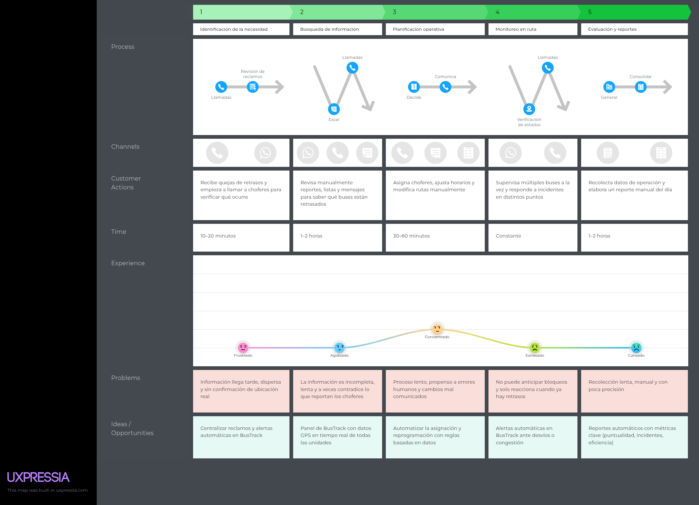

<br> _**Figura 19.** User Journey Map de Luis Palacios (administrador de flota), que detalla sus tareas operativas y cómo BusTrack mejora el monitoreo de buses._  <br> _**Fuente:** elaboración propia._

___

#### User Persona 4 – José Ramírez (Supervisor de Rutas)

**Descripción breve:** Este Journey Map refleja la complejidad del monitoreo de múltiples unidades en tiempo real, la presión operativa y los errores causados por la comunicación manual, destacando la necesidad de alertas automáticas y paneles centralizados.

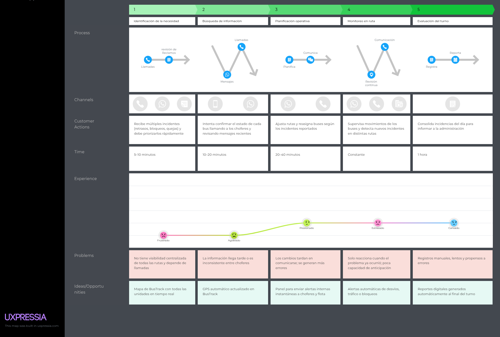

<br> _**Figura 20.** User Journey Map de José Ramírez (supervisor de rutas), representando la coordinación de unidades y la necesidad de alertas en tiempo real._  <br> _**Fuente:** elaboración propia._

<br>

### 2.3.4. Empathy Mapping.

A continuación se presentan los mapas de empatía elaborados para cada uno de los perfiles de usuario identificados. Cada imagen incluye su respectiva descripción, tal como fue solicitado.

<br>

**Segmento 1: Estudiante universitario (Ejemplo: Manuel Suárez)**

**Descripción:** Mapa de empatía del estudiante universitario Manuel Suárez, donde se detallan sus emociones, pensamientos, dolores, motivaciones y percepciones relacionadas con su experiencia usando el transporte público en Lima.


<br> _**Figura 21.** Mapa de empatía del estudiante universitario Manuel Suárez, donde se resumen lo que ve, piensa, siente y hace en relación con su experiencia usando el transporte público en Lima._  <br> _**Fuente:** elaboración propia._


---

**Segmento 1: Empleado administrativo (Ejemplo: Alejandro Medina)**

**Descripción:** Mapa de empatía del trabajador administrativo Alejandro Medina, mostrando su comportamiento, frustraciones, expectativas y necesidades al movilizarse diariamente hacia su centro laboral.

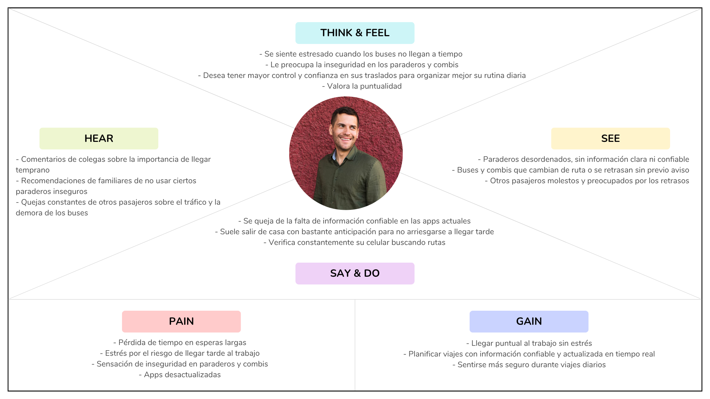

<br> _**Figura 22.** Mapa de empatía de Alejandro Medina, trabajador administrativo, que refleja sus frustraciones, expectativas y necesidades frente a los retrasos y la inseguridad en el transporte urbano._ <br> _**Fuente:** elaboración propia._

---

**Segmento 2: Administrador de flota en empresa de transporte urbano (Ejemplo: Luis Palacios)**

**Descripción:** Mapa de empatía del administrador de flota Luis Palacios, donde se analizan sus preocupaciones, necesidades operativas, puntos de dolor y objetivos relacionados con la gestión de buses y supervisión de rutas.


<br> _**Figura 23.** Mapa de empatía de Luis Palacios, administrador de flota, donde se analizan sus preocupaciones operativas, puntos de dolor y objetivos de gestión de buses._  <br> _**Fuente:** elaboración propia._

---

**Segmento 2: Supervisor de rutas en empresa de transporte urbano (Ejemplo: José Ramírez)**

**Descripción:** Mapa de empatía del supervisor de rutas José Ramírez, que refleja sus dificultades diarias, retos operativos, motivaciones y oportunidades de mejora en la coordinación del transporte urbano.


<br> _**Figura 24.** Mapa de empatía de José Ramírez, supervisor de rutas, que muestra sus retos diarios en la coordinación de unidades y su percepción sobre soluciones tecnológicas como BusTrack._  <br> _**Fuente:** elaboración propia._

<br>

### 2.3.5. As-is Scenario Mapping.

El As-Is Scenario Mapping nos permite visualizar el flujo de trabajo y la experiencia actual de nuestros usuarios antes de la implementación de BusTrack. A partir del análisis de las entrevistas y los Journey Maps previos, se han mapeado los escenarios actuales para ambos segmentos objetivo, evidenciando los puntos críticos donde la experiencia se degrada.

#### Segmento 1: Pasajeros de Transporte Público (Estudiante / Trabajador)
Escenario: El usuario necesita viajar desde su casa hacia la universidad o el trabajo en hora punta, utilizando rutas de buses urbanos.


#### Segmento 2: Empresas de Transporte Urbano (Administrador / Supervisor)
Escenario: El supervisor necesita monitorear que todas las unidades cumplan con su ruta y horario establecido durante la jornada operativa.


## 2.4. Ubiquitous Language.

| **Término**                          | **Definición**                                                                                       |
| ------------------------------------ | ---------------------------------------------------------------------------------------------------- |
| **Pasajero**                         | Usuario final de BusTrack que consulta rutas, horarios y viaja en transporte público.                |
| **Empresa de transporte**            | Entidad que gestiona los buses, rutas y horarios registrados en la aplicación.                       |
| **Ruta**                             | Trayecto definido entre un origen y un destino que sigue un bus.                                     |
| **Horario**                          | Horas establecidas para salidas y llegadas de buses en una ruta.                                     |
| **Bus**                              | Vehículo de transporte público registrado en BusTrack con identificación y ubicación GPS.            |
| **Notificación**                     | Alerta enviada al pasajero sobre retrasos, desvíos o llegada próxima del bus.                        |
| **Reporte**                          | Resumen básico de alertas o estados operativos visibles en el panel web, limitado a la información disponible en el monitoreo de buses y en la gestión simple de alertas. En la versión actual del proyecto, no incluye reportes automáticos ni análisis avanzados; dichos elementos corresponden a funcionalidades previstas como trabajo futuro. |
| **Favoritos**                        | Rutas que el pasajero guarda para consultarlas rápidamente en futuros viajes.                        |
| **Panel de control**                 | Interfaz usada por la empresa de transporte para monitorear la flota y generar reportes.             |
| **Tiempo estimado de llegada (ETA)** | Predicción calculada por el sistema sobre el tiempo que falta para que un bus llegue a la parada.    |


<br><br>

# Capítulo III: Requirements Specification
## 3.1. To-Be Scenario Mapping.

### To-Be Scenario Map – Pasajeros

**Descripción:**  
El mapa muestra la experiencia futura del pasajero al utilizar BusTrack. Se observa cómo, en cada fase (abrir la app, buscar ruta, revisar ubicación, monitorear el viaje), el usuario realiza acciones guiadas por la información en tiempo real, reduciendo incertidumbre y mejorando su percepción de control. A nivel emocional, el usuario pasa de la ansiedad típica del transporte público a la tranquilidad, confianza y satisfacción gracias a las funcionalidades de la aplicación.

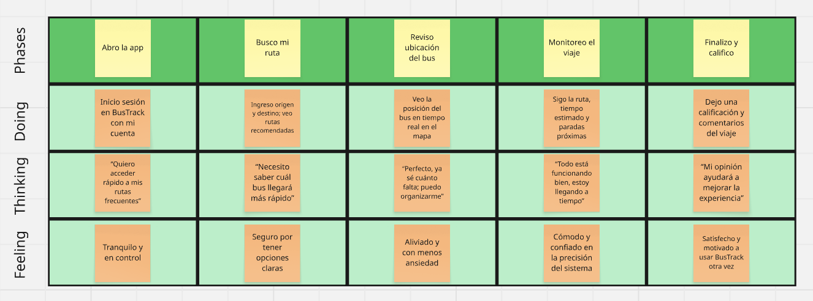

<br> _**Figura 26.** To-Be Scenario Map del pasajero de BusTrack, que muestra la experiencia futura deseada desde la planificación del viaje hasta la calificación del servicio, reduciendo la ansiedad y aumentando la confianza gracias a la información en tiempo real._ <br>  _**Fuente:** elaboración propia._


---

### To-Be Scenario Map – Empresa de Transporte

**Descripción:**  
El mapa presenta la experiencia futura de una empresa de transporte utilizando el panel web de BusTrack. A lo largo de las fases (ingreso al panel, revisión de buses y gestión de alertas), se observa un flujo operativo más eficiente, basado en datos en tiempo real y reportes automáticos. Emocionalmente, el usuario empresarial pasa de la incertidumbre operativa a una sensación de control, seguridad y optimización continua.

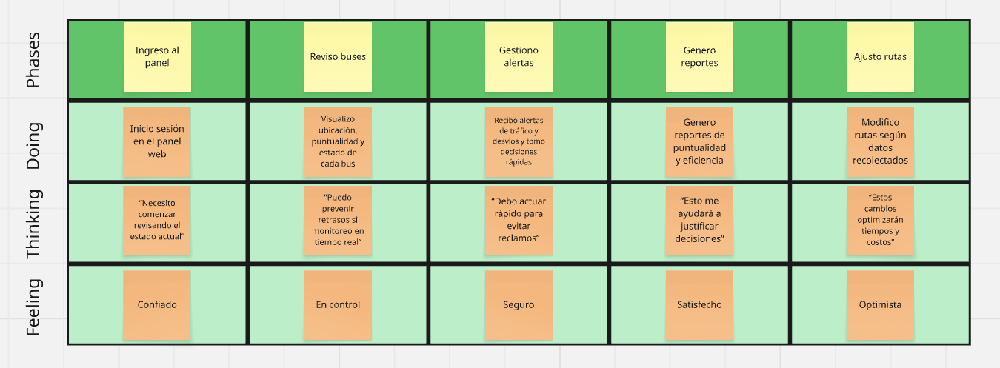

<br> _**Figura 27.** To-Be Scenario Map de la empresa de transporte, donde se representa el uso del panel web de BusTrack._  <br> _**Fuente:** elaboración propia._

<br>

Enlace de miro: https://miro.com/app/board/uXjVJhIqCHk=/?share_link_id=990352521858

## 3.2. User Stories.

Para el caso de BusTrack, se han definido un total de cinco épicas, las cuales representan los bloques funcionales principales de la solución: gestión de rutas y horarios, monitoreo en tiempo real, administración de flota, experiencia del usuario en la aplicación y desarrollo de la Landing Page. 

A partir de estas épicas se han identificado un conjunto de **15 User Stories funcionales**, asociadas a los usuarios principales del sistema. Estas historias describen las interacciones clave que los usuarios deberán realizar dentro de la aplicación y permiten establecer el alcance funcional del producto.

Adicionalmente, se han incluido **Technical Stories** orientadas al desarrollo del backend y del RESTful API. Dichas historias están definidas desde el rol de *Developer* y permiten garantizar la integración entre el frontend, la Landing Page y los servicios internos de la plataforma.

### Épicas del Sistema

Las siguientes épicas representan los bloques funcionales principales del producto BusTrack. Cada épica agrupa un conjunto de User Stories que definen las funcionalidades asociadas tanto al pasajero como a las empresas de transporte, así como los componentes de interfaz y backend necesarios para soportar dichas capacidades.

| Código | Nombre de la Épica | Descripción |
|--------|---------------------|-------------|
| **E01** | **Gestión de rutas y horarios** | Incluye todas las funcionalidades que permiten a los pasajeros buscar rutas, visualizar horarios, consultar alternativas y guardar rutas frecuentes para optimizar su planificación diaria. |
| **E02** | **Monitoreo en tiempo real** | Agrupa las capacidades relacionadas con la visualización de ubicación del bus, seguimiento del trayecto, notificaciones de retrasos y alertas por desvíos. Estas funcionalidades reducen la incertidumbre del usuario durante el viaje. |
| **E03** | **Administración de flota** | Reúne las herramientas dirigidas a las empresas de transporte: monitoreo del estado de los buses, gestión de alertas, generación de reportes automáticos y toma de decisiones basadas en datos. |
| **E04** | **Experiencia del usuario en la app** | Contiene funcionalidades orientadas al pasajero final: registro, login, edición de perfil, calificación del servicio y personalización de rutas. |
| **E05** | **Landing Page y presencia digital** | Incluye los elementos informativos de la plataforma: presentación de la solución, beneficios, misión y visión del proyecto, y acceso a los módulos principales. |

<br>

### Historias de Usuario
| ID   | Epic ID | Épica                        | Nombre | Historia                                                                                                                         | Criterios de Aceptación |
|------|---------|------------------------------|--------|----------------------------------------------------------------------------------------------------------------------------------|--------------------------|
| US01 | E01     | Gestión de rutas   | Guardar rutas  | Como pasajero, quiero guardar mis rutas para acceder a ellas .                                             | **Positivo:** Dado que selecciono una ruta, cuando presiono “Guardar como favorita”, entonces la ruta se guarda. <br> **Negativo:** Dado que la ruta ya está guardada, cuando intento guardarla otra vez, entonces aparece “Esta ruta ya está guardada”. |
| US02 | E02     | Monitoreo de ruta     | Ver ruta en Google Maps | Como pasajero, quiero abrir la ruta en Google Maps para visualizar el recorrido y las opciones de transporte disponibles.        | **Positivo:** Dado que ingreso un origen y un destino válidos, cuando presiono el botón “Ver en Google Maps”, entonces se abre Google Maps mostrando la ruta correspondiente. <br> **Negativo:** Dado que ingreso un origen o destino que no corresponde a una dirección real, cuando presiono el botón “Ver en Google Maps”, entonces la aplicación igual abre Google Maps y muestra sugerencias para el origen y destino. |
| US03 | E03     | Administración de flota      | Configurar alertas internas | Como administrador, quiero configurar alertas para incidentes de tráfico.                                                        | **Positivo:** Dado que completo los campos del formulario de “Agregar bus”, cuando presiono el botón “Guardar”, entonces el nuevo bus se agrega a la tabla de flota con un ID generado automáticamente.   <br> **Negativo:** Dado que estoy editando la información de un bus, cuando cierro el modal o presiono “Cancelar” sin guardar, entonces los cambios no se aplican y la información del bus se mantiene igual en la tabla. |
| US04 | E04     | Experiencia del usuario      | Registro de pasajero | Como nuevo pasajero, quiero registrarme para personalizar mis rutas.                                                             | **Positivo:** Dado que completo los campos, cuando presiono “Registrarse”, entonces se crea la cuenta. <br> **Negativo:** Dado campos vacíos, cuando intento registrarme, entonces aparece “Complete todos los campos”. |
| US05 | E04     | Experiencia del usuario      | Editar perfil | Como pasajero, quiero editar mis datos personales.                                                                               | **Positivo:** Dado datos válidos, cuando guardo cambios, entonces el perfil se actualiza. <br> **Negativo:** Dado correo inválido, cuando guardo, entonces aparece “Correo no válido”. |
| US06 | E05     | Landing Page                 | Información de la solución | Como visitante, quiero ver información de la solución para entender su utilidad.                                                 | **Positivo:** Dado que ingreso al home, cuando reviso el bloque principal y la sección “What Does BusTrack Offer?”, entonces veo un resumen claro de qué es BusTrack y qué funcionalidades ofrece. <br> **Negativo:** Dado que la página no carga correctamente (por ejemplo, fallo de internet), cuando ingreso al home, entonces no puedo ver el texto que describe la solución. |
| US07 | E03     | Administración de flota| Registrar bus | Como administrador de compañía, quiero registrar un bus en la plataforma, para asociarlo a mi empresa y poder gestionarlo dentro del sistema de monitoreo de transporte.| **Positivo:** Dado que el administrador está autenticado y ha accedido a la página de registro de buses, cuando ingresa todos los datos obligatorios correctamente y presiona Registrar bus, entonces el sistema debe guardar el bus y mostrar un mensaje de confirmación. <br> **Negativo:**  Dado que el administrador está en la página de registro de buses, cuando intenta registrar el bus sin completar todos los campos obligatorios, entonces el sistema debe mostrar un mensaje indicando qué campos faltan completar|
| US08 | E04   | Experiencia del usuario en la app | Notificación de creación de ruta | Como pasajero, quiero que se me notifique cuando cree una ruta, para estar informado de que la ruta se ha guardado y está disponible para su uso.| **Positivo:** Dado que el pasajero ha creado una nueva ruta en la aplicación, cuando el sistema guarde correctamente la ruta, entonces el pasajero recibirá una notificación confirmando que la ruta se ha creado con éxito y está disponible. <br> **Negativo:**  Dado que el pasajero ha intentado crear una ruta pero se ha producido un error (por ejemplo, datos incompletos o formato incorrecto), cuando el sistema no pueda guardar la ruta, entonces el pasajero recibirá una notificación informando sobre el error y que la ruta no se ha creado.|
| US09 | E04     | Experiencia del usuario      | Acceso diferenciado | Como usuario, quiero elegir si ingreso como pasajero o empresa.| **Positivo:** Dado selección del tipo de usuario, cuando continúo, entonces accedo al módulo correspondiente. <br> **Negativo:** Dado que no selecciono ningún tipo de usuario, cuando intento continuar, entonces el botón “Continuar” permanece deshabilitado.|
| US10 | E03     | Administración de flota      | Acceso para empresas | Como empresa, quiero acceder al segmento de monitoreo de flota para ver el estado de mis buses y gestionar alertas.                | **Positivo:** Dado que inicio sesión como empresa y el módulo de monitoreo carga correctamente, cuando abro “Monitoreo”, entonces veo el mapa y la lista de buses con su estado (a tiempo, con retraso o fuera de servicio). <br> **Negativo:** Dado un error de conexión con el servidor, cuando abro “Monitoreo”, entonces se muestra un aviso de “Error de conexión” con la opción de “Reintentar”. |
| US11 | E05     | Landing Page                 | Beneficios de la aplicación | Como visitante, quiero conocer los beneficios de la aplicación. **Positivo:** Dado que accedo a la sección “Benefits of Using BusTrack”, cuando la reviso, entonces veo al menos tres beneficios explicados. <br> **Negativo:** Dado que por un problema de carga la sección de beneficios no se muestra, cuando navego por la landing, entonces no logro ver los beneficios de la aplicación. |
| US12 | E05     | Landing Page                 | Misión y visión | Como visitante, quiero conocer la misión y visión de la empresa.| **Positivo:** Dado que ingreso a la sección “About Us”, cuando la reviso, entonces veo claramente la misión y la visión de BusTrack. <br> **Negativo:** Dado que la sección “About Us” no carga correctamente, cuando intento verla, entonces no puedo ver la misión ni la visión. |

<br>

### Technical Stories (RESTful API)

Las siguientes Technical Stories describen los endpoints mínimos del RESTful API necesarios para soportar los flujos implementados en BusTrack para pasajeros y empresas de transporte, sin incluir funcionalidades de dashboard ni reportes.

| ID   | Epic ID | Nombre                                      | Historia (Technical Story)                                                                                                                                                                 | Criterios de Aceptación |
|------|---------|---------------------------------------------|--------------------------------------------------------------------------------------------------------------------------------------------------------------------------------------------|--------------------------|
| TS01 | E01     | Endpoint: Rutas favoritas del pasajero      | Como **Developer**, quiero implementar los endpoints `GET /api/users/{userId}/favorites` y `POST /api/users/{userId}/favorites` para que la vista de “Rutas favoritas” pueda listar y guardar rutas frecuentes. | **Positivo (listar):** Dado que el usuario tiene rutas favoritas guardadas, cuando el frontend realiza un `GET /api/users/{userId}/favorites`, entonces la API retorna código **200** y un JSON con la lista de rutas. <br><br> **Positivo (agregar):** Dado que se envía una ruta que aún no está en favoritos, cuando el frontend ejecuta un `POST` con los datos de la ruta, entonces la API retorna código **201** y la ruta queda registrada. <br><br> **Negativo (duplicado):** Dado que la ruta ya existe en favoritos, cuando se intenta registrar nuevamente con `POST`, entonces la API retorna código **409** y el mensaje `"Ruta ya registrada en favoritos"`. |
| TS02 | E03     | Endpoint: Alertas internas de la empresa    | Como **Developer**, quiero implementar los endpoints `GET /api/companies/{companyId}/alerts` y `POST /api/companies/{companyId}/alerts` para que la vista de “Alertas internas” pueda listar y registrar incidentes. | **Positivo (listar):** Dado que existen alertas registradas, cuando el frontend ejecuta `GET /api/companies/{companyId}/alerts`, entonces la API retorna código **200** y un JSON con la lista de alertas (tipo, hora, estado). <br><br> **Positivo (registrar):** Dado que se envía una alerta válida, cuando el frontend realiza un `POST` con los datos de la alerta, entonces la API retorna código **201** y la alerta queda registrada. <br><br> **Negativo (datos inválidos):** Dado que el cuerpo del `POST` está incompleto, cuando se intenta registrar la alerta, entonces la API retorna código **400** con el mensaje `"Datos de alerta inválidos"`. |

<br>


## 3.3. Product Backlog.

| # Orden | ID   | Título                                      | Descripción                                                                                                                                                                                | Story Points |
| ------- | ---- | ------------------------------------------- | ------------------------------------------------------------------------------------------------------------------------------------------------------------------------------------------ | ------------ |
| 1       | US01 | Guardar rutas                    | Como pasajero, quiero guardar mis rutas para acceder a ellas.                                                                                                        | 3            |
| 2       | US02 | Ver ruta en Google Maps                     | Como pasajero, quiero abrir la ruta en Google Maps para visualizar el recorrido y las opciones de transporte disponibles.                                                                  | 3            |
| 3       | US03 | Configurar alertas internas                 | Como administrador, quiero configurar alertas para incidentes de tráfico y gestionar mejor las incidencias.                                                                                | 5            |
| 4       | US04 | Registro de pasajero                        | Como nuevo pasajero, quiero registrarme en la aplicación para personalizar mis rutas.                                                                                                      | 3            |
| 5       | US05 | Editar perfil                               | Como pasajero, quiero editar mis datos personales para mantener mi información actualizada.                                                                                                | 3            |
| 6       | US06 | Información de la solución                  | Como visitante de la web, quiero ver información concisa de la solución para entender su utilidad.                                                                                         | 2            |
| 7       | US07 | Registrar bus                               | Como administrador de compañía, quiero registrar un bus en la plataforma para asociarlo a mi empresa y gestionarlo dentro del sistema de monitoreo.                                        | 5            |
| 8       | US08 | Notificación de creación de ruta            | Como pasajero, quiero que se me notifique cuando cree una ruta para estar informado de que se ha guardado correctamente y está disponible.                                                 | 2            |
| 9       | US09 | Acceso diferenciado                         | Como usuario, quiero elegir si ingreso como pasajero o empresa para ver solo las opciones que me corresponden.                                                                             | 3            |
| 10      | US10 | Acceso para empresas                        | Como empresa, quiero acceder a un módulo exclusivo con las funciones disponibles para la gestión de flota.                                                                                 | 5            |
| 11      | US11 | Beneficios de la aplicación                 | Como visitante de la web, quiero conocer los beneficios de la aplicación para entender cómo puede ayudarme.                                                                                | 2            |
| 12      | US12 | Misión y visión                             | Como visitante, quiero conocer la misión y visión de la empresa para entender su propósito y enfoque.                                                                                      | 1            |
| 12      | TS01 | Endpoint: Alertas internas de la empresa    | Como **Developer**, quiero implementar los endpoints `GET /api/companies/{companyId}/alerts` y `POST /api/companies/{companyId}/alerts` para que la vista de “Alertas internas” pueda listar y registrar incidentes. | 5            |

La imagen muestra el tablero de Trello utilizado para la planificación y seguimiento del Sprint 4 del proyecto BusTrack. En este tablero se organizaron las User Stories (US) y Technical Stories (TS) según las buenas prácticas de Scrum, distribuyéndolas en listas de Backlog, Technical Stories, Sprint Backlog y Done. Durante el sprint, las tareas fueron monitoreadas y actualizadas continuamente, moviéndose a la columna Done una vez completadas según la Definición de Terminado. Este tablero permitió mantener una visión clara del progreso del equipo, facilitando la priorización, asignación y control del avance de cada historia.

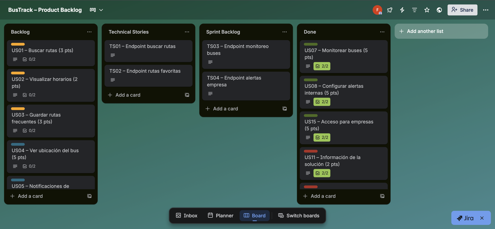

_**Figura 30.** Product Backlog y Sprint Backlog gestionados en Trello_  <br> _**Fuente:** elaboración propia._

Enlace de Trello: <https://trello.com/b/MhxlfsAK>
<br><br>


## 3.4. Impact Mapping.

El Impact Mapping permite conectar los objetivos del negocio con los actores principales, los cambios esperados en su comportamiento y los entregables del sistema que harán posible esos impactos. A continuación, se presentan los mapas desarrollados para los dos segmentos principales: pasajeros y empresas de transporte.

### Segmento Pasajeros

**Descripción:** Este mapa muestra cómo los objetivos de negocio orientados a reducir el tiempo de espera y aumentar el uso activo de la aplicación se conectan con los dos principales perfiles de pasajeros. El impacto esperado es que los usuarios consulten BusTrack antes de salir de casa para elegir su ruta y horario. Para lograrlo, los deliverables clave son el *buscador de rutas* y el *gestor de rutas favoritas*, de los cuales se derivan las User Stories asociadas a la búsqueda de rutas, visualización de horarios y guardado de rutas frecuentes.

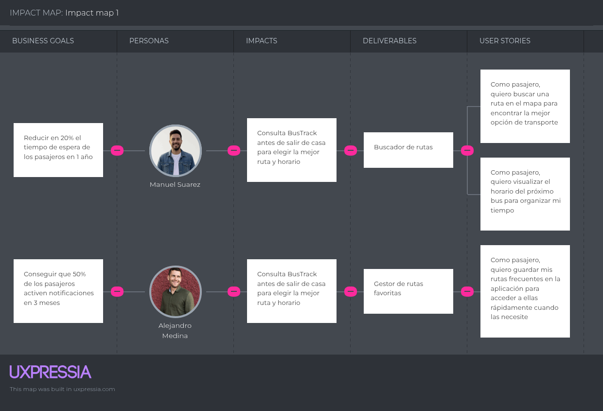

<br> _**Figura 28.** Impact Map del segmento de pasajeros, que conecta los objetivos de negocio de BusTrack con los cambios de comportamiento esperados en estudiantes y trabajadores, y los deliverables asociados (buscador de rutas, rutas favoritas)._  <br> _**Fuente:** elaboración propia._


___

### Segmento Empresas de transporte

**Descripción:** Este mapa relaciona los objetivos de negocio orientados a la adopción del sistema por empresas de transporte y la reducción de quejas operativas. Los actores principales son el administrador de flota y el supervisor de rutas, cuyo impacto deseado es que monitoreen buses en tiempo real y ajusten rutas usando datos de operación. 


<br> _**Figura 29.** Impact Map del segmento de empresas de transporte, que relaciona los objetivos de adopción del sistema con los impactos deseados en administradores y supervisores de flota._  _**Fuente:** elaboración propia._


# Capítulo IV: Product Design
## 4.1. Style Guidelines.

La presente sección define las pautas visuales y de identidad gráfica empleadas en BusTrack. Su objetivo es garantizar coherencia, claridad y accesibilidad en todos los elementos de la interfaz, alineando la experiencia del usuario con la propuesta de valor y el enfoque profesional de la plataforma web.

### 4.1.1. General Style Guidelines.

- **Branding**  
  Las directrices generales de estilo de BusTrack se definen a partir de la identidad visual reflejada en la landing page desarrollada. El objetivo es asegurar coherencia, legibilidad y accesibilidad en todas las plataformas. La marca está representada por un logo que combina un ícono de bus y un marcador de ubicación, acompañado por el nombre de la startup en tipografía sans-serif bold. Este diseño transmite movilidad, confianza y simplicidad.
<p align="center">
  
</p>

 -**Figura 31.** Logo de BusTrack, que combina un ícono de bus y un marcador de ubicación para representar el transporte urbano geolocalizado._  
<br>
 _**Fuente:** elaboración propia._

<br>

- **Paleta de colores**  
  La paleta refuerza valores de sostenibilidad, frescura y accesibilidad.  <br><br>
  * **Verde principal** (#4D7B2D aprox.): utilizado en encabezados, títulos, botones y barra de navegación. Representa sostenibilidad, confianza y movilidad. <br>
    
    
  * **Verde claro** (#EAF4E0 aprox.): empleado en fondos de secciones secundarias (Beneficios, Misión, Visión). Aporta frescura y ligereza.  <br>
    
    
  * **Blanco** (#FFFFFF): color de fondo predominante para dar limpieza y contraste.  <br>
  
    
    
  * **Gris oscuro / Negro** (#212121 aprox.): utilizado en textos secundarios y párrafos para la legibilidad.<br>
    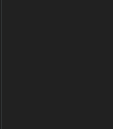

  * **Rojo de alerta** `#D90000`: reservado para acciones destructivas o críticas, como botones de “Cerrar sesión” en la página de empresas y “Borrar historial” en la página de pasajeros.<br>
  

  * **Amarillo de advertencia** `#F9FAB6`: se usa en la página de empresa para resaltar buses en **mantenimiento**, buses con **retraso de X minutos**, alertas de **gravedad media** y problemas **pendientes** aún no resueltos.<br>
  

  * **Rojo suave de error** `#FFC9C9`: empleado para indicar estados críticos en la página de empresa, como buses **inactivos** o **fuera de servicio**, así como alertas de **gravedad alta**.<br>
  

  * **Verde de estado OK** `#EBFAB6`: se utiliza para señalar buses **activos** y **en horario**, así como alertas de **gravedad baja** en la página de empresa.<br>
  

  * **Azul de acción para pasajeros** `#2479E8`: color principal de botones en las pantallas de pasajeros (por ejemplo, “Buscar ruta” o “Guardar ruta”), asociado a acciones de exploración y planificación del viaje.<br>
  

  * **Verde corporativo oscuro** `#255000`: aplicado a botones y elementos de acción en la página de empresas, otorgando un tono más serio y profesional para operaciones de gestión de flota.<br>
  

- **Tipografía**  
  Se utiliza una tipografía sans-serif, principalmente **Montserrat** en sus variantes regular y bold. La combinación busca transmitir modernidad, claridad y confianza, manteniendo legibilidad en distintos tamaños y dispositivos.
<p align="center">
  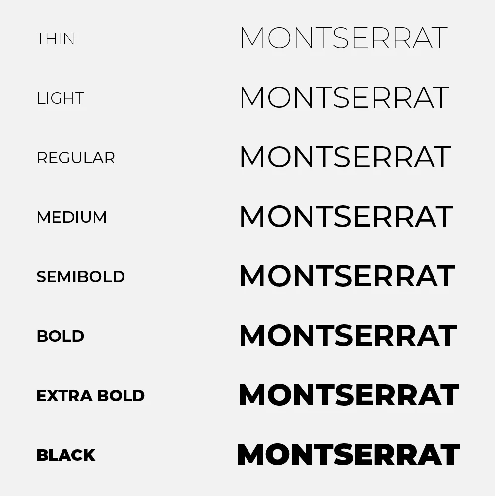
</p>

_**Figura 32.** Muestra de la tipografía Montserrat utilizada como base para los textos de BusTrack._  <br> _**Fuente:** elaboración propia._

- **Spacing**  
  * Alrededor del logo: dejar un margen libre equivalente al alto de la letra **B** de “BusTrack”.  
  * Botones: padding interno mínimo de 12–16 px para asegurar comodidad en la interacción.  
  * Textos: interlineado de 1.5 para mejorar la lectura en pantallas.  
  * Secciones web: separar bloques de contenido con márgenes verticales de 48–64 px para evitar saturación visual y garantizar orden.

### 4.1.2. Web Style Guidelines.

Las directrices específicas para la versión web de BusTrack buscan garantizar consistencia visual, accesibilidad y adaptabilidad en distintos dispositivos.

* **Diseño responsive**
  - Estructura modular con secciones claramente diferenciadas (Hero, Cómo usar, Beneficios, Sobre Nosotros).  
  - Uso de grillas en desktop (por ejemplo, tres columnas en Beneficios y Cómo usar) y reordenamiento en formato vertical en mobile.

* **Botones y elementos interactivos**
  - Botón primario (ejemplo: “Iniciar Sesión”) en fondo blanco con borde verde, que se rellena en verde al pasar el cursor (*hover*).  
  - Tamaño mínimo de 44 px para accesibilidad en pantallas táctiles.  
  - Estados definidos: normal, hover, activo y deshabilitado.

* **Jerarquía de textos**
  - Encabezados en tipografía sans-serif (Montserrat) en negrita (H1 y H2) para lograr impacto visual.  
  - Párrafos y descripciones en sans-serif regular para asegurar legibilidad en pantalla.  
  - Colores de texto adaptados al fondo: verde sobre blanco y negro/gris sobre verde claro.

* **Imágenes y multimedia**
  - Iconografía simple en formato SVG para garantizar escalabilidad.  
  - Imágenes optimizadas con bordes redondeados para mantener coherencia visual.

<br>

### 4.1.3. Mobile Style Guidelines.

Las directrices de estilo móvil de BusTrack buscan asegurar una experiencia clara, rápida y accesible desde smartphones, enfocándose en usuarios que necesitan consultar rutas, ubicación de buses, paraderos cercanos y recibir notificaciones relevantes.

El diseño móvil debe mantener la identidad visual de la marca. Esto incluye el uso del verde principal como color representativo, el verde claro para fondos suaves, el blanco para mantener limpieza visual, y el azul de acción para botones dirigidos a los pasajeros. La tipografía utilizada será Montserrat, garantizando legibilidad en pantallas pequeñas. Además, la estructura debe organizarse en una sola columna, con tarjetas verticales, botones amplios y navegación simple para evitar saturación visual.

**Características generales del diseño móvil:**
- **Tamaño mínimo adecuado para elementos interactivos**: especialmente botones como “Buscar ruta”, “Guardar ruta”, “Ver en Google Maps”, “Notificar llegada” y “Guardar cambios”.
- **Estados de alerta**: deben diferenciarse por color (verde para correcto, amarillo para advertencias y rojo para situaciones críticas).

#### 4.1.3.1. iOS Mobile Style Guidelines.

Para la versión iOS, el objetivo es mantener una interfaz limpia, ordenada y visualmente ligera, respetando la navegación natural del sistema operativo.

- Las pantallas deben **priorizar el contenido principal** en la parte superior, utilizando un **desplazamiento vertical fluido** para revisar rutas, paraderos y notificaciones.
- **Botones principales** deben ubicarse en zonas de fácil alcance, preferentemente en la parte inferior o central de la pantalla. Estos botones deben tener **alto contraste** y un **tamaño adecuado** para facilitar la interacción táctil, como “Buscar ruta” o “Guardar cambios”.
- La navegación debe ser **sencilla y directa**. Es recomendable usar un **botón de retorno visible** para secciones como perfil, historial, rutas favoritas o configuración.

En cuanto al **diseño visual**, la estética debe ser **minimalista**, con **fondos claros**, **tarjetas suaves** y **textos breves**. La jerarquía tipográfica debe ser clara, usando **tipografía sans-serif** en negrita para los títulos y un estilo regular para las descripciones.

#### 4.1.3.2. Android Mobile Style Guidelines.

La versión de Android se enfoca en una **estructura visual práctica y funcional**.

- Se pueden utilizar **tarjetas**, **botones flotantes** y **barras de navegación simples** para proporcionar una experiencia de usuario fluida.
- La **navegación debe ser sencilla**, con opciones como **barra inferior** o **menú hamburguesa** para acceder a secciones como Inicio, Rutas, Paraderos, Notificaciones y Perfil.
- Los **botones** deben tener **alto contraste** y sus estados (normal, presionado, deshabilitado, activo) deben ser visualmente diferenciados para mayor claridad.

Las **tarjetas** deben mostrar información **resumida** y **organizada**. Por ejemplo, una tarjeta de paradero puede incluir el nombre, la dirección, la distancia y las rutas disponibles. Las tarjetas de notificación deben mostrar el tipo de alerta, el mensaje y la hora.

En cuanto al **diseño visual**, la versión Android debe seguir la misma **identidad visual** de BusTrack, respetando los colores, la tipografía Montserrat y el diseño responsive.

## 4.2. Information Architecture.

Esta sección describe la arquitectura de información de BusTrack, detallando la organización, etiquetado, navegación y sistemas de búsqueda utilizados. Su propósito es asegurar que los usuarios puedan acceder de manera rápida e intuitiva a las funcionalidades principales de la plataforma.

### 4.2.1. Organization Systems.

La información en BusTrack se organiza en una estructura jerárquica y modular que facilita la navegación del usuario, tanto en la landing page como en la aplicación web.

El siguiente organigrama de contenidos representa visualmente la estructura jerárquica del sitio. El diagrama inicia con la sección principal **Hero Section**, que agrupa el mensaje introductorio y el botón de acceso. Luego se despliega en tres bloques informativos: **“Cómo usar BusTrack”**, **“Beneficios”** y **“Sobre Nosotros”**. Cada bloque se descompone en subapartados que detallan las funciones básicas del sistema, tales como buscar rutas, recibir alertas, consultar información en tiempo real, guardar rutas favoritas y acceder a la misión y visión de la startup.


<p align="center">
  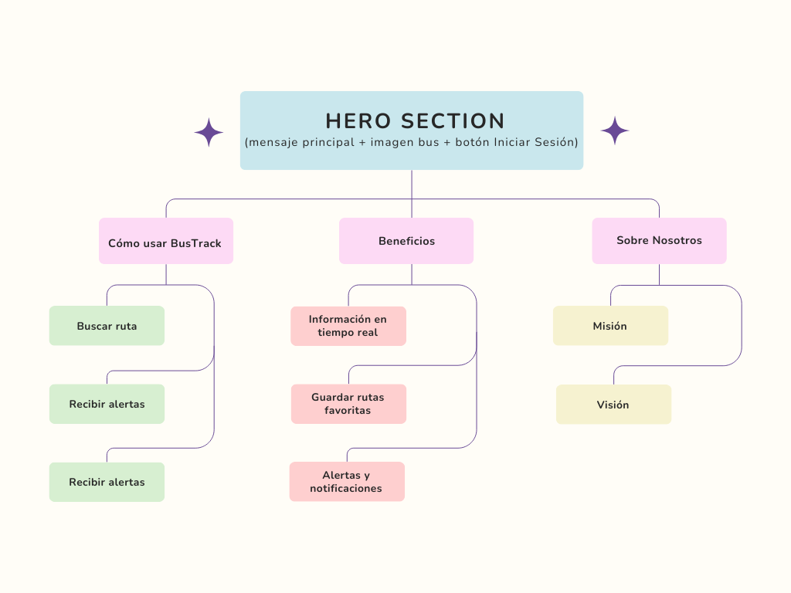
</p>

_**Figura 33.** Árbol de contenidos de BusTrack utilizado para representar la organización jerárquica de la información en la landing page._   <br> _**Fuente:** elaboración propia._

### 4.2.2. Labeling Systems.

Los sistemas de etiquetado emplean un lenguaje claro, breve y orientado a la acción:

* Menú de navegación: “Cómo usar”, “Beneficios”, “Sobre Nosotros”.  
* Botón principal: “Iniciar Sesión”.  
* Secciones informativas: “Misión”, “Visión”.  
* Mensajes claros que transmiten utilidad inmediata, evitando tecnicismos.

### 4.2.3. SEO Tags and Meta Tags

Se emplearán etiquetas optimizadas para mejorar el posicionamiento en buscadores:

* **Meta Title:** *BusTrack – Encuentra tu bus en tiempo real*.  
* **Meta Description:** Aplicación web que muestra ubicación de buses, horarios en vivo y alertas para viajar más seguro y sin esperas innecesarias.  
* **Keywords:** transporte público, buses en tiempo real, rutas de bus, movilidad urbana, BusTrack Perú.  
* **Etiquetas alt en imágenes:** descripciones breves y precisas que indiquen el contenido visual y su propósito.

### 4.2.4. Searching Systems.

BusTrack incorporará un sistema de búsqueda interno enfocado en la funcionalidad clave:

* **Búsqueda de rutas:** el usuario podrá ingresar su punto de origen y destino para obtener información de buses disponibles.  
* **Acceso a rutas favoritas:** opción para guardar y consultar rápidamente rutas frecuentes.  
* **Resultados en tiempo real:** tiempos estimados de llegada (ETA) y alertas sobre tráfico o desvíos en las rutas seleccionadas.

### 4.2.5. Navigation Systems.

El sistema de navegación busca ser intuitivo y accesible:

* **Navegación principal (top bar):** Inicio, Cómo usar, Beneficios, Sobre Nosotros, Iniciar Sesión.  
* **Navegación secundaria:** botones de acción dentro de cada sección (por ejemplo, “Guardar rutas favoritas”).  
* **Estructura responsive:** en dispositivos móviles, el menú se transforma en un ícono de hamburguesa para ahorrar espacio.  
* **Flujo del usuario:** el recorrido esperado es Inicio → Conocer cómo funciona → Revisar beneficios → Iniciar sesión → Usar BusTrack.

## 4.3. Landing Page UI Design.

En esta sección se presentan los wireframes y mockups de la landing page de BusTrack. El diseño visual propuesto busca comunicar de forma clara el valor de la solución, facilitando que los visitantes comprendan sus beneficios y accedan a las principales funcionalidades del sistema.

### 4.3.1. Landing Page Wireframe.

Las siguientes imágenes presentan los wireframes de alta fidelidad de la landing page de BusTrack en su versión para navegador web. Cada wireframe ilustra la organización preliminar de los elementos visuales y de contenido para comunicar de forma clara qué ofrece la plataforma, a quién está dirigida y cómo se utiliza.

**Desktop Web Browser**

**Wireframe 1**

_Descripción:_ Este wireframe corresponde a la sección inicial de la landing page. Presenta el menú de navegación superior con enlaces a “Qué ofrece”, “Para quién es”, “Cómo usar” y “Beneficios”, además del selector de idioma y el botón de “Iniciar Sesión”. En el cuerpo principal se incluye un encabezado destacado acompañado de texto introductorio y una imagen representativa del uso de la plataforma, buscando captar la atención del usuario desde el primer momento.

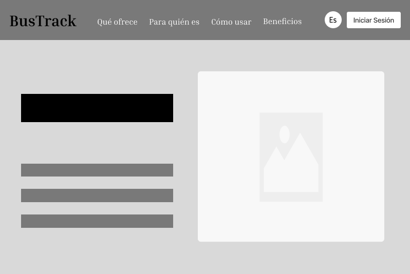


<br>

_**Figura 34.** Wireframe de la sección principal (Hero Section) de la landing page de BusTrack._ <br> _**Fuente:** elaboración propia._


**Wireframe 2**

_Descripción:_ Este wireframe muestra la sección donde se describen las funcionalidades clave de BusTrack. Incluye un título central y un conjunto de tarjetas con texto descriptivo que representan los principales servicios del sistema, tales como búsqueda de rutas, visualización de buses en tiempo real y alertas. Cada tarjeta se presenta como un bloque compacto para facilitar la lectura y la comparación entre características.

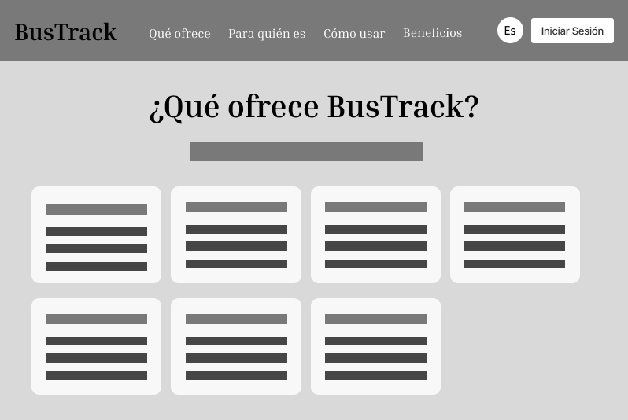

<br>

_**Figura 35.** Wireframe de la sección “Qué ofrece BusTrack”, con tarjetas que organizan las funciones principales del sistema._ <br> _**Fuente:** elaboración propia._


**Wireframe 3**

_Descripción:_ Este wireframe presenta los segmentos objetivo de BusTrack. La sección destaca con un título claro y tarjetas individuales que representan a los públicos principales: estudiantes, trabajadores y empresas de transporte. Cada tarjeta está diseñada para incluir íconos o imágenes representativas y un breve resumen del problema que cada grupo enfrenta y cómo BusTrack puede ayudarle.

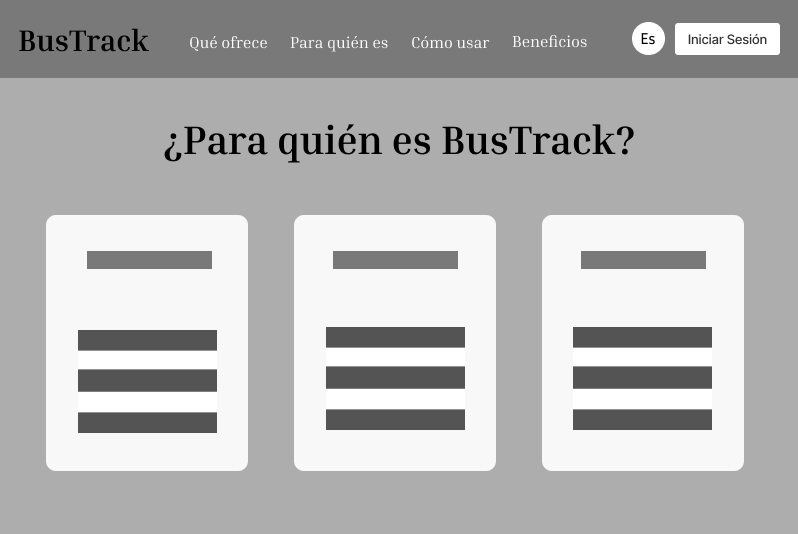

<br>

_**Figura 36.** Wireframe de la sección “Para quién es BusTrack”, orientada a describir los segmentos de usuario._ <br> _**Fuente:** elaboración propia._


**Wireframe 4**

_Descripción:_ Este wireframe muestra la guía visual de cómo funciona BusTrack en tres pasos. Cada tarjeta incluye un área para una imagen representativa, un título de paso y una breve descripción. El diseño está centrado en ofrecer una explicación simple, visual y secuencial, ideal para captar la atención de nuevos usuarios que desean entender cómo utilizar la plataforma rápidamente.

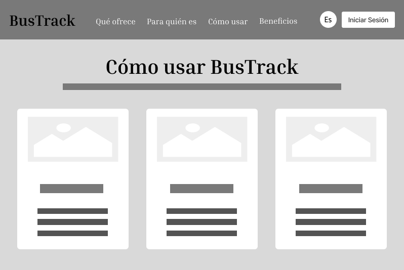

<br>

_**Figura 37.** Wireframe de la sección “Cómo usar BusTrack”, estructurada en tres pasos ilustrativos._ <br> _**Fuente:** elaboración propia._


**Wireframe 5**

_Descripción:_ Este wireframe representa el apartado donde se comunican los beneficios más importantes de la plataforma. Cada tarjeta resume un beneficio clave, como la información en tiempo real, la reducción de tiempos de espera o la posibilidad de recibir alertas sobre cambios en la ruta. Se emplea una estructura de tres columnas para presentar la información de forma concisa y ordenada.

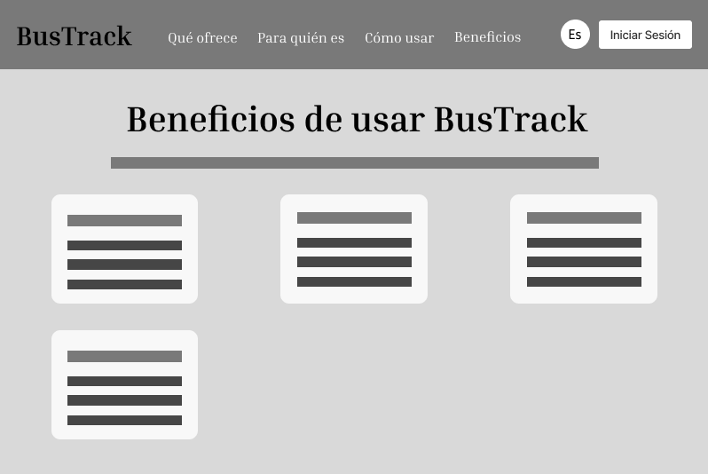

<br>

_**Figura 38.** Wireframe de la sección “Beneficios de usar BusTrack”, que resume las ventajas principales para el usuario._ <br> _**Fuente:** elaboración propia._

**Wireframe 6**

_Descripción:_ Este wireframe corresponde a la sección institucional que presenta la misión y visión de BusTrack. Cada recuadro contiene el espacio destinado a describir los principios y objetivos de la startup. El diseño busca transmitir profesionalismo y claridad mediante bloques bien definidos y de fácil lectura. 

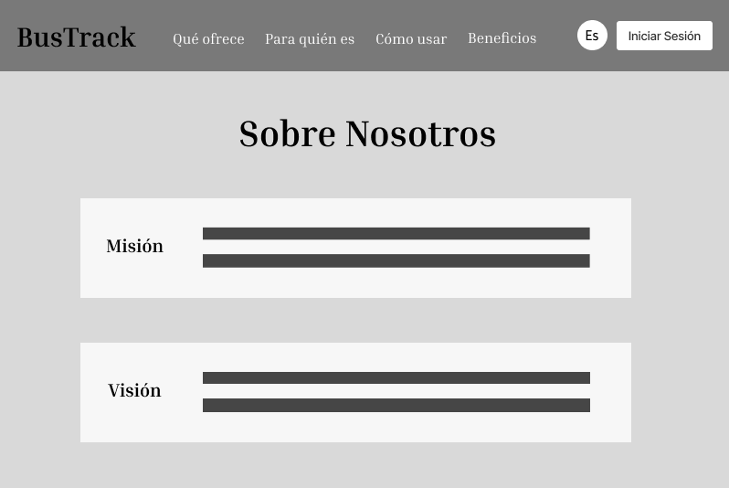

<br>

_**Figura 39.** Wireframe de la sección “Sobre Nosotros”, con énfasis en misión y visión de BusTrack._ <br> _**Fuente:** elaboración propia._

**Wireframe 7**

_Descripción:_ Este wireframe muestra la última sección de la landing page, destinada a presentar contenido audiovisual. Incluye dos tarjetas amplias diseñadas para alojar videos informativos: uno sobre el producto BusTrack y otro relacionado al tiempo o funcionamiento general. Cada tarjeta dispone de un área de imagen superior para miniaturas y un espacio inferior para descripciones complementarias.

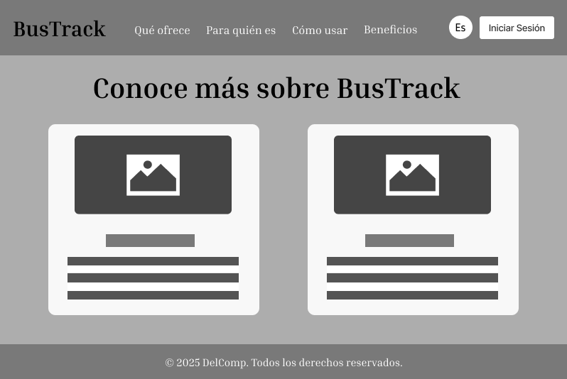

<br>

_**Figura 40.** Wireframe de la sección “Conoce más sobre BusTrack”, compuesta por dos tarjetas para la presentación de videos informativos._ <br> _**Fuente:** elaboración propia._

___

**Mobile Web Browser**

Para la versión móvil, los wireframes muestran cómo la landing page de BusTrack se adapta mediante un diseño responsivo. Los elementos se reorganizan en un formato vertical, priorizando la legibilidad, la jerarquía visual y la accesibilidad en pantallas pequeñas. Las secciones mantienen su estructura conceptual, pero se presentan de manera simplificada para facilitar la navegación desde dispositivos móviles.

**Wireframe 1**

_Descripción:_ Este wireframe muestra la versión móvil de la sección principal. Incluye el encabezado superior con el nombre de BusTrack, selector de idioma y botón de “Iniciar Sesión”. A continuación, se dispone un bloque de título destacado, texto introductorio y un espacio para una imagen representativa. La distribución vertical permite que el contenido principal sea visible inmediatamente al ingresar al sitio.

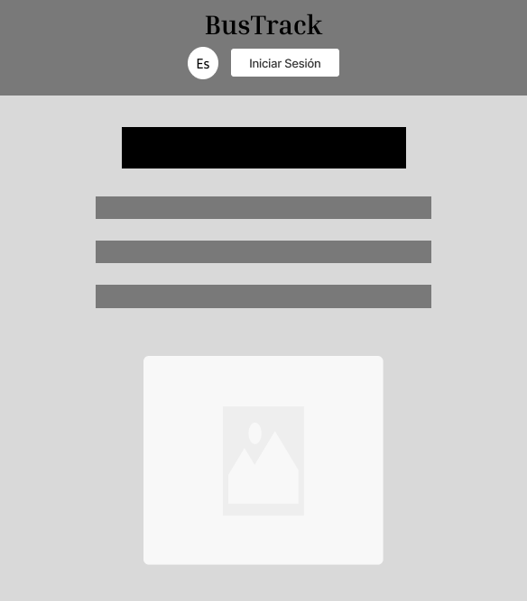
<br>

_**Figura 41.** Wireframe móvil de la sección principal (Hero Section) de BusTrack._ <br> _**Fuente:** elaboración propia._

**Wireframe 2**

_Descripción:_ Este wireframe presenta la sección donde se describen las funcionalidades principales de BusTrack en formato móvil. Las tarjetas informativas se apilan verticalmente, permitiendo una lectura fluida y evitando desplazamientos laterales. Cada tarjeta incluye espacio para título, descripción y posible iconografía.

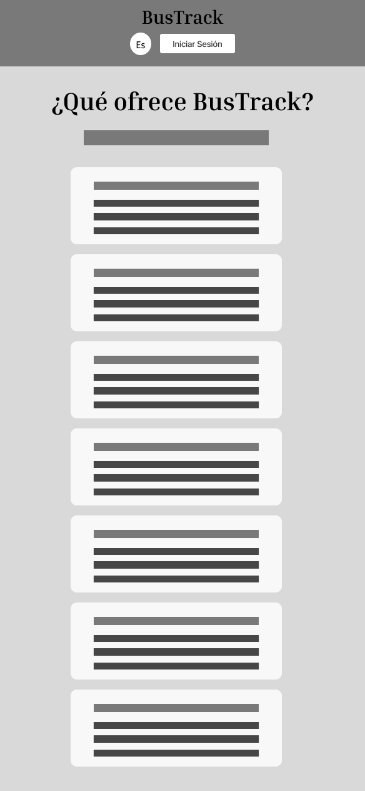
<br>

_**Figura 42.** Wireframe móvil de la sección “Qué ofrece BusTrack”, con tarjetas organizadas en formato vertical._ <br> _**Fuente:** elaboración propia._

**Wireframe 3**

_Descripción:_ Este wireframe se enfoca en los segmentos objetivo. En la versión móvil, cada categoría (estudiantes, trabajadores y empresas de transporte) se presenta como tarjetas independientes que se muestran una debajo de la otra. Esto facilita que el usuario identifique rápidamente el grupo al que pertenece y cómo la plataforma puede ayudarlo.

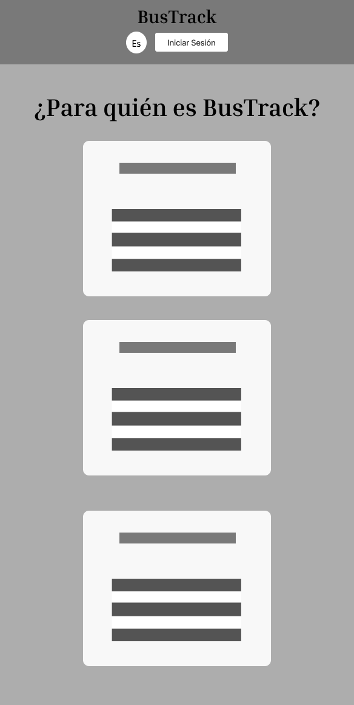
<br>

_**Figura 43.** Wireframe móvil de la sección “Para quién es BusTrack”, con tarjetas segmentadas individualmente._ <br> _**Fuente:** elaboración propia._

**Wireframe 4**

_Descripción:_ Este wireframe describe el flujo de uso de BusTrack en tres pasos. Cada paso se representa con una imagen, un título y texto explicativo. El diseño vertical permite una presentación secuencial clara y adecuada para pantallas pequeñas, facilitando que los usuarios entiendan rápidamente cómo interactuar con la plataforma.

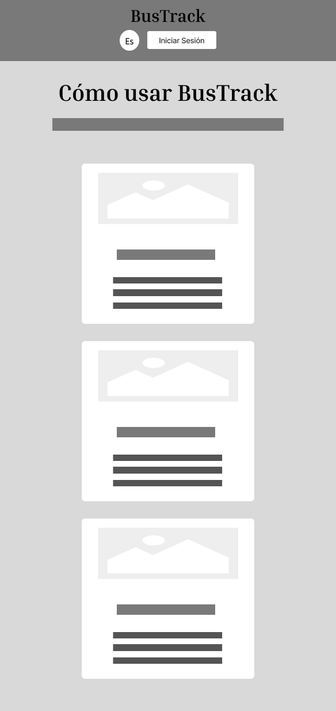
<br>

_**Figura 44.** Wireframe móvil de la sección “Cómo usar BusTrack”, estructurada en tres pasos explicativos._ <br> _**Fuente:** elaboración propia._

**Wireframe 5**

_Descripción:_ Este wireframe muestra una serie de tarjetas que explican los principales beneficios de la plataforma. En su formato móvil, cada beneficio ocupa un bloque independiente, con título y texto informativo. La distribución busca asegurar una lectura cómoda y una jerarquía adecuada de contenido.

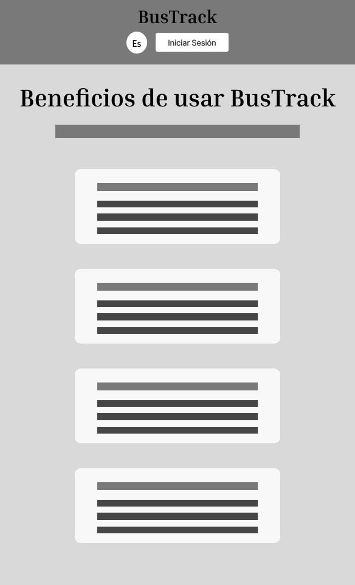
<br>

_**Figura 45.** Wireframe móvil de la sección “Beneficios de usar BusTrack”, con tarjetas apiladas para facilitar la lectura._ <br> _**Fuente:** elaboración propia._

**Wireframe 6**

_Descripción:_ Este wireframe representa la versión móvil de la sección institucional que presenta la misión y visión de la startup. Cada bloque está claramente delimitado, con encabezados y espacio para texto explicativo. El diseño asegura una lectura clara y ordenada en dispositivos móviles.

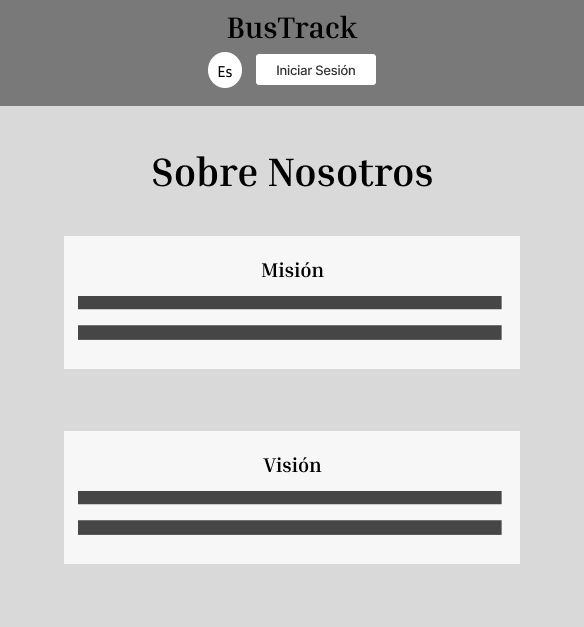
<br>

_**Figura 46.** Wireframe móvil de la sección “Sobre Nosotros”, con presentación vertical de misión y visión._ <br> _**Fuente:** elaboración propia._

**Wireframe 7**

_Descripción:_ Este wireframe corresponde a la última sección de la landing page, destinada a mostrar contenido audiovisual. Incluye dos tarjetas amplias donde se colocarán videos informativos. Cada tarjeta cuenta con un espacio para miniatura, título y texto complementario, adaptados completamente al formato vertical móvil. 

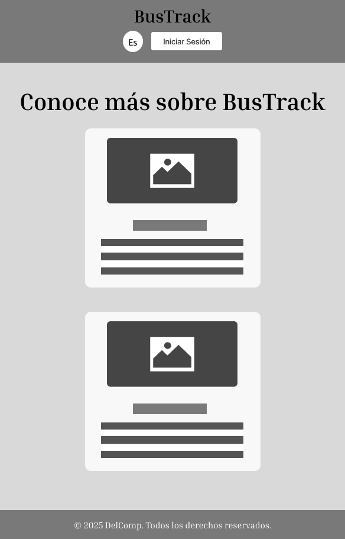
<br>

_**Figura 47.** Wireframe móvil de la sección “Conoce más sobre BusTrack”, con dos tarjetas para videos informativos._ <br> _**Fuente:** elaboración propia._


### 4.3.2. Landing Page Mock-up.

En esta sección se presentan los mockups finales del Landing Page de BusTrack, desarrollados a partir de los wireframes previos. Estos mockups reflejan el diseño visual completo, incluyendo paleta de colores, tipografías, distribución de contenido y elementos de interacción tanto para usuarios pasajeros como para empresas. 

### Desktop Web Browser

**Mock-up 1**

_Descripción:_ Este mock-up corresponde al Hero Section de la landing page. Presenta el título principal y un mensaje introductorio que explica que BusTrack permite encontrar buses en tiempo real y viajar sin esperas innecesarias. A la izquierda se ubica el texto explicativo sobre la plataforma y su propósito; a la derecha, una imagen representativa de un bus en ruta. También se observa la barra de navegación superior con las secciones principales y el selector de idioma.

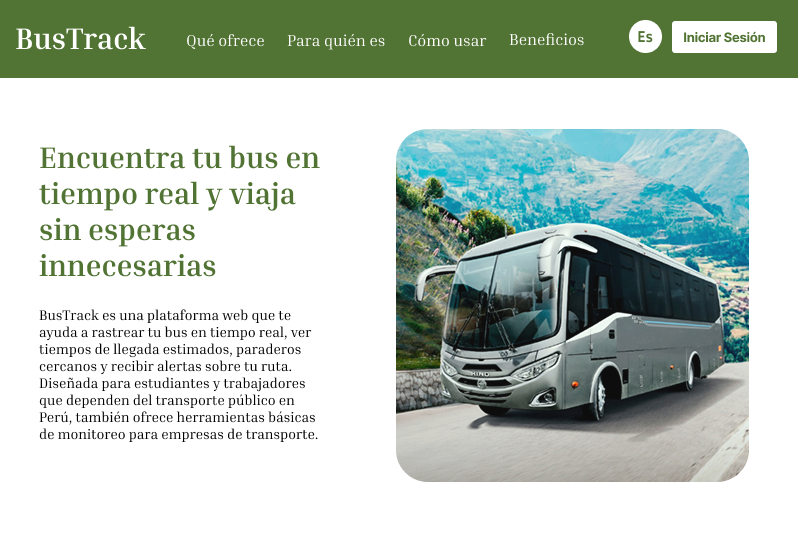

<br>

_**Figura 48.** Hero Section del landing page de BusTrack._ <br> _**Fuente:** elaboración propia._

**Mock-up 2**

_Descripción:_ Este mock-up muestra la sección “¿Qué ofrece BusTrack?”, donde se detallan las funcionalidades principales del MVP. Incluye módulos con iconos y descripciones breves: búsqueda de rutas, ubicación en tiempo real, tiempos estimados de llegada (ETA), paraderos cercanos, alertas, rutas favoritas y un panel básico de monitoreo para empresas. Esta sección resume claramente el valor de la plataforma.

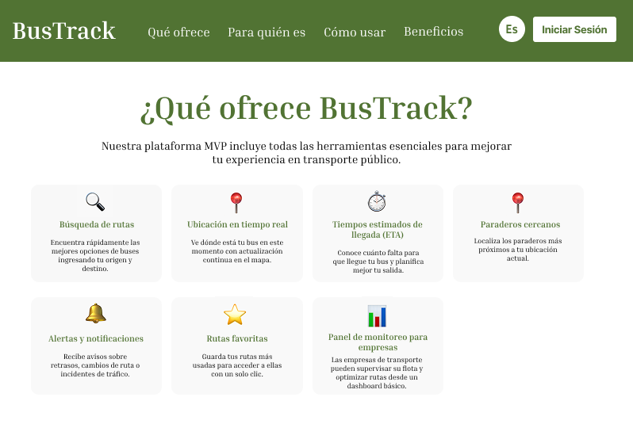

<br>

_**Figura 49.** Funcionalidades principales del MVP de BusTrack._ <br> _**Fuente:** elaboración propia._

**Mock-up 3**

_Descripción:_ En este mock-up se presenta la sección “¿Para quién es BusTrack?”, compuesta por tres bloques dirigidos a los distintos públicos objetivo: estudiantes, trabajadores y empresas de transporte. Cada tarjeta incluye un icono representativo y un texto explicando los beneficios específicos para cada tipo de usuario.

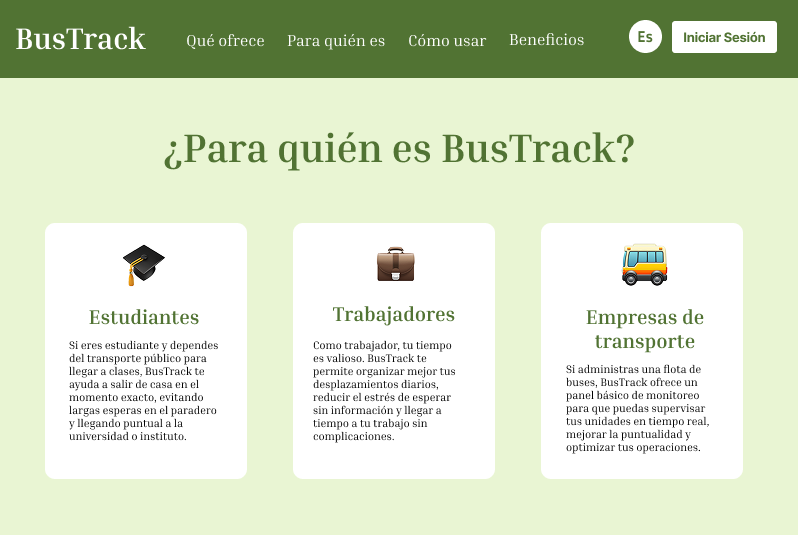

<br>

_**Figura 50.** Públicos objetivo de BusTrack._ <br> _**Fuente:** elaboración propia._

**Mock-up 4**

_Descripción:_ Este mock-up desarrolla la sección “Cómo usar BusTrack”, explicada en tres pasos: buscar la ruta, ver buses en tiempo real y recibir alertas. Cada paso incluye una imagen ilustrativa, un título numerado y una descripción breve que orienta al usuario en el uso básico de la plataforma.

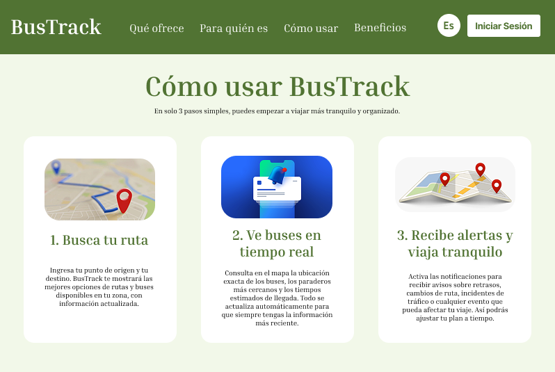

<br>

_**Figura 51.** Pasos para utilizar BusTrack._ <br> _**Fuente:** elaboración propia._

**Mock-up 5**

_Descripción:_ En este mock-up se muestra la sección “Beneficios de usar BusTrack”. Incluye tarjetas explicativas sobre cómo la plataforma mejora la experiencia del usuario: información en tiempo real, ahorro de tiempo, mayor seguridad al viajar y mejora operativa para empresas. Esta sección destaca el impacto positivo del servicio.

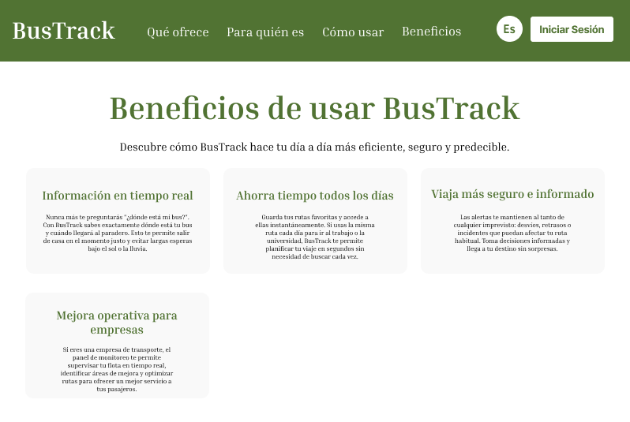

<br>

_**Figura 52.** Beneficios principales para usuarios y empresas._ <br> _**Fuente:** elaboración propia._

**Mock-up 6**

_Descripción:_ Este mock-up corresponde a la sección “Sobre Nosotros”, donde se presenta la misión y visión de BusTrack. Cada elemento está organizado en tarjetas horizontales con títulos destacados y descripciones que explican el propósito y aspiración de la plataforma en el contexto del transporte público peruano.

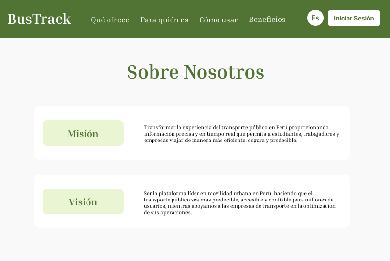

<br>

_**Figura 53.** Misión y visión de BusTrack._ <br> _**Fuente:** elaboración propia._

**Mock-up 7**

_Descripción:_ El mock-up final muestra la sección “Conoce más sobre BusTrack”, la cual incorpora dos videos: uno sobre el funcionamiento del producto y otro presentando al equipo detrás del proyecto. Cada video cuenta con un título y un breve texto descriptivo que permiten comprender el contenido antes de reproducirlo. También se observa el footer corporativo de la página.

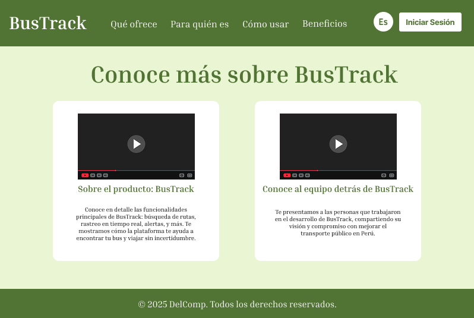

<br>

_**Figura 54.** ección informativa con videos sobre el producto y el equipo._ <br> _**Fuente:** elaboración propia._

___

## Mobile Web Browser

**Mock-up 1**

_Descripción:_ Este mockup corresponde a la sección Hero en su versión móvil. Incluye el título principal de la landing page, un texto descriptivo breve sobre BusTrack y una imagen ilustrativa central. El diseño prioriza el contenido textual en la parte superior y coloca la imagen del bus más abajo, siguiendo la lógica de desplazamiento natural en dispositivos móviles.

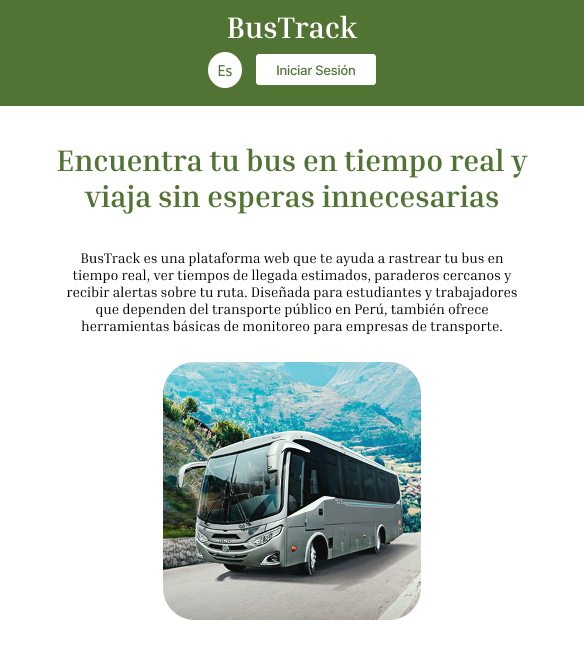

<br>

_**Figura 55.** Mockup móvil de la sección Hero de BusTrack._ <br> _**Fuente:** elaboración propia._

**Mock-up 2**

_Descripción:_ Este mockup muestra la sección ¿Qué ofrece BusTrack?, adaptada al formato vertical. Cada funcionalidad se presenta como una tarjeta independiente apilada una debajo de otra, con su icono correspondiente, título y descripción. Este formato garantiza una lectura clara y fluida desde el móvil.

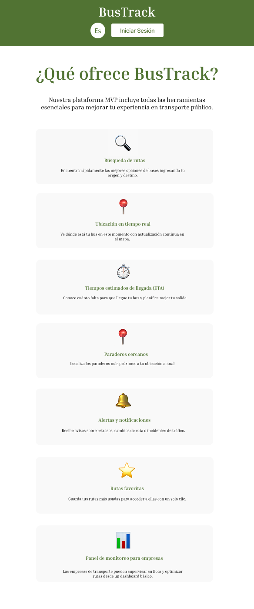

<br>

_**Figura 56.** Mockup móvil de la sección de funcionalidades de BusTrack._ <br> _**Fuente:** elaboración propia._

**Mock-up 3**

_Descripción:_ Este mockup presenta la sección ¿Para quién es BusTrack? en vista móvil. Cada perfil de usuario (estudiantes, trabajadores y empresas de transporte) se muestra en una tarjeta individual, en formato vertical, con su respectivo ícono y descripción detallada.

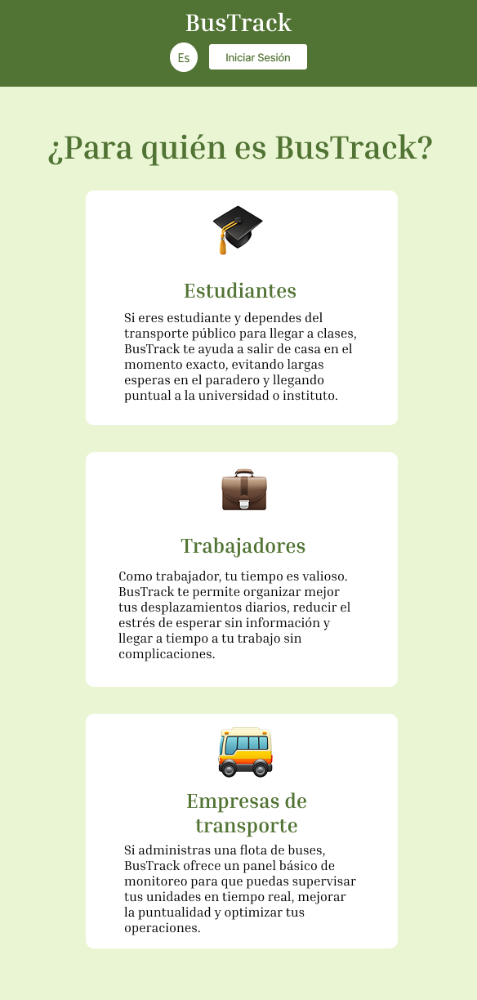

<br>

_**Figura 57.** Mockup móvil de los segmentos de usuarios de BusTrack._ <br> _**Fuente:** elaboración propia._

**Mock-up 4**

_Descripción:_ Este mockup muestra la sección Cómo usar BusTrack, que en versión móvil organiza los tres pasos del proceso en bloques verticales claramente diferenciados. Cada paso incluye una imagen, un título y un texto explicativo para guiar al usuario.

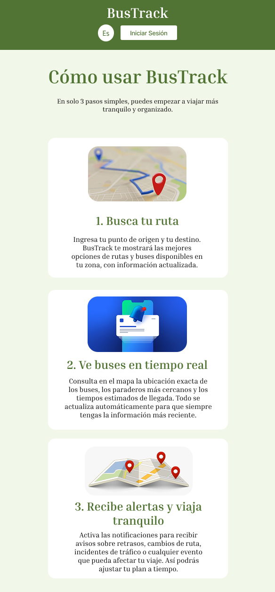

<br>

_**Figura 58.** Mockup móvil del apartado “Cómo usar BusTrack”._ <br> _**Fuente:** elaboración propia._

**Mock-up 5**

_Descripción:_ Este mockup corresponde a la sección Beneficios de usar BusTrack, diseñada para móviles. Las tarjetas de beneficios se apilan verticalmente, cada una con un título destacado y un texto explicativo detallado que mejora la comprensión de las ventajas ofrecidas.

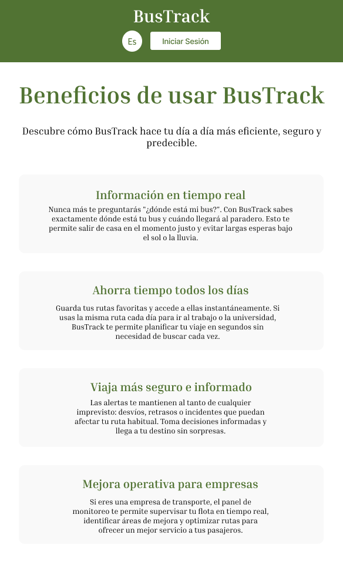

<br>

_**Figura 59.** Mockup móvil de la sección de beneficios de BusTrack._ <br> _**Fuente:** elaboración propia._

**Mock-up 6**

_Descripción:_ Este mockup presenta la sección Sobre Nosotros en formato móvil. Incluye la misión y visión de BusTrack dentro de tarjetas amplias y centradas, priorizando la lectura cómoda y la jerarquía del contenido institucional.

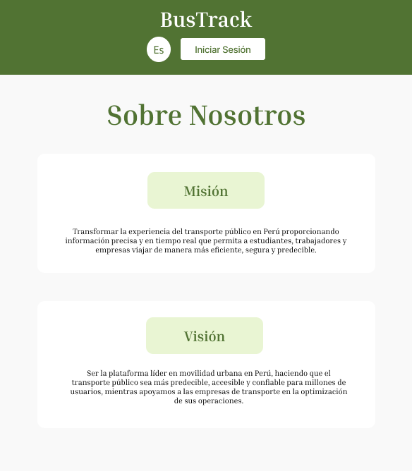

<br>

_**Figura 60.** Mockup móvil de la sección institucional “Sobre Nosotros”._ <br> _**Fuente:** elaboración propia._

**Mock-up 7**

_Descripción:_ Este mockup corresponde a la sección final Conoce más sobre BusTrack, donde se presentan los videos informativos del producto y del equipo. En la versión móvil, cada video se organiza en tarjetas verticales independientes con su título y descripción, manteniendo una estructura clara y accesible.

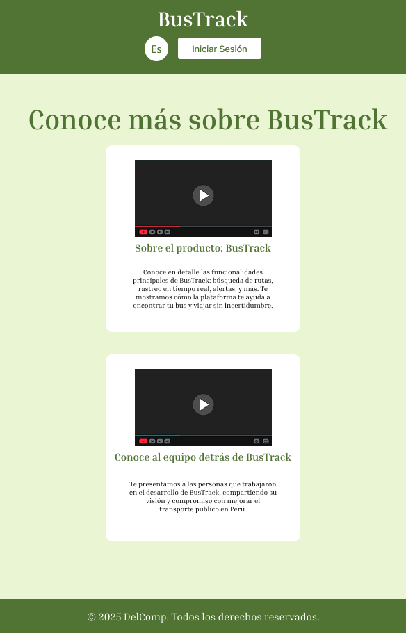

<br>

_**Figura 61.** Mockup móvil de la sección con videos informativos de BusTrack._ <br> _**Fuente:** elaboración propia._


Link del figma: https://www.figma.com/design/gfihE4UEnoiFtzf54xXuL8/BusTrack-wireframes-y-mockups?node-id=0-1&t=vbZPvREtMGxi30PI-1 

## 4.4. Mobile Applications UX/UI Design.
### 4.4.1. Mobile Applications Wireframes.
### 4.4.2. Mobile Applications Wireflow Diagrams.
### 4.4.3. Mobile Applications Mock-ups.
### 4.4.4. Mobile Applications User Flow Diagrams.
## 4.5. Mobile Applications Prototyping.
### 4.5.1. Android Mobile Applications Prototyping.
### 4.5.2. iOS Mobile Applications Prototyping.
## 4.6. Web Applications UX/UI Design.

Los wireframes y mockups aquí presentados muestran la estructura inicial de las vistas principales, priorizando la jerarquía visual, la simplicidad de navegación, la accesibilidad, la escalabilidad futura y la claridad en la presentación de información crítica como rutas, paraderos, notificaciones y configuraciones del usuario.

### 4.6.1. Web Applications Wireframes.

En esta sección se presentan los wireframes de la aplicación web.

**Wireframe 1**

_Descripción:_ Este wireframe corresponde a la pantalla inicial de selección de tipo de usuario. La interfaz presenta dos rutas principales: Pasajero y Empresa, cada una representada mediante botones con alto contraste para facilitar su identificación. En la parte superior derecha se incorpora el selector de idioma, alineado con la estrategia de internacionalización (i18n). El diseño mantiene una estructura centrada, con una tarjeta principal que agrupa el contenido, asegurando un primer contacto claro y simple.


<br>

_**Figura 62.** Wireframe de pantalla inicial de selección de tipo de usuario._ <br> _**Fuente:** elaboración propia._

**Wireframe 2**

_Descripción:_ La segunda pantalla está orientada al inicio de sesión para pasajeros. El diseño divide el espacio en dos secciones: una ilustración a la izquierda que sirve como componente visual de apoyo y un módulo de autenticación a la derecha. El formulario de Log In incorpora campos básicos junto con un botón de acción primaria. Se mantiene el selector de idioma visible, reforzando la accesibilidad lingüística. La jerarquía tipográfica resalta la sección PASAJEROS como título principal.


<br>

_**Figura 63.** Wireframe de pantalla de inicio de sesión para pasajeros._ <br> _**Fuente:** elaboración propia._

**Wireframe 3**

_Descripción:_ Este wireframe representa la vista de creación de cuenta para pasajeros. Similar al wireframe previo, se emplea una estructura de dos columnas: imagen ilustrativa y formulario de registro. El diseño incluye opción de inicio con Google, campo destacado por su accesibilidad y rapidez. Debajo, se organizan los campos requeridos para el registro tradicional. El botón principal “Crear cuenta” se sitúa al final para reforzar el flujo natural de arriba hacia abajo.


<br>

_**Figura 64.** Wireframe de pantalla de creación de cuenta para pasajeros._ <br> _**Fuente:** elaboración propia._

**Wireframe 4**

_Descripción:_ El cuarto wireframe presenta la vista principal de la web app para pasajeros, donde se accede a funciones clave como buscar rutas, revisar notificaciones o ver paraderos. La navegación superior agrupa las opciones principales mediante una barra horizontal mantenida fija. En el área central se destaca una sección de búsqueda rápida y un panel con el mapa principal, permitiendo al usuario comenzar la interacción de manera directa e intuitiva.


<br>

_**Figura 65.** Wireframe de pantalla principal del pasajero con barra de navegación._ <br> _**Fuente:** elaboración propia._

**Wireframe 5**

_Descripción:_ Este wireframe muestra los resultados de búsqueda de rutas. El mapa central continúa siendo el elemento visual predominante, mientras que al lado derecho se presenta un panel con información detallada del viaje: ruta encontrada, tiempos estimados y opciones de acción como “Guardar ruta” o “Ver rutas en Google Maps”. En la parte inferior se agrega el botón “Nueva búsqueda” facilitando la repetición del proceso.


<br>

_**Figura 66.** Wireframe de pantalla de resultados de búsqueda de rutas._ <br> _**Fuente:** elaboración propia._

**Wireframe 6**

_Descripción:_ El wireframe de la sección de Notificaciones presenta una vista simplificada donde las alertas del sistema o de rutas favoritas se muestran en tarjetas organizadas verticalmente. La jerarquía visual prioriza el título y luego la lista de alertas. Esta vista fue diseñada bajo principios de legibilidad, permitiendo identificar rápidamente actualizaciones relevantes sin elementos distractores.


<br>

_**Figura 67.** Wireframe de pantalla de notificaciones para el pasajero._ <br> _**Fuente:** elaboración propia._

**Wireframe 7**

_Descripción:_ Este diseño corresponde a la sección de Paraderos Cercanos, donde los usuarios pueden visualizar su ubicación y los paraderos más próximos. A la izquierda se muestran tarjetas con información de cada paradero, incluyendo distancia aproximada y botones de interacción (como “Cómo llegar” o “Notificar llegada”). A la derecha se presenta un mapa ampliado que funciona como referencia espacial principal.


<br>

_**Figura 68.** Wireframe de pantalla de paraderos cercanos con mapa y tarjetas informativas._ <br> _**Fuente:** elaboración propia._

**Wireframe 8**

_Descripción:_ Este wireframe corresponde a la pantalla de Perfil del usuario pasajero. A la izquierda se ubica la tarjeta del perfil, que incluye imagen del usuario, información básica y accesos a configuraciones personalizadas. A la derecha, se presenta una lista de rutas guardadas o funciones adicionales, cada una con un botón “Detalles” que permite acceder a información ampliada. El diseño refuerza la separación lógica entre identidad y actividades.


<br>

_**Figura 69.** Wireframe de pantalla de perfil del pasajero._ <br> _**Fuente:** elaboración propia._

**Wireframe 9**

_Descripción:_ Aquí se presenta la vista de Rutas Favoritas, accesible desde el perfil del usuario. En la parte superior izquierda se incluye un botón “Volver” para facilitar la navegación. En el área central se ubica el panel principal con los campos de búsqueda de rutas guardadas y el botón “Buscar rutas”. Esta vista mantiene un diseño minimalista, destacando únicamente los elementos necesarios para la acción correspondiente.


<br>

_**Figura 70.** Wireframe de pantalla de rutas favoritas del usuario._ <br> _**Fuente:** elaboración propia._

**Wireframe 10**

_Descripción:_ Este wireframe corresponde al Historial de viajes, donde el usuario puede visualizar viajes pasados en un formato de tarjetas grandes. A la izquierda se incorpora un botón “Volver” y a la derecha un botón para borrar el historial, permitiendo gestionar los registros de forma clara. La disposición en dos columnas mejora el aprovechamiento del espacio y contribuye a un escaneo visual rápido.


<br>

_**Figura 71.** Wireframe de pantalla del historial de viajes del usuario._ <br> _**Fuente:** elaboración propia._

**Wireframe 11**

_Descripción:_ Este wireframe presenta la sección de Gestión de Notificaciones del usuario pasajero. En la parte superior izquierda se incorpora el botón “Volver”, facilitando la navegación hacia la vista previa. El módulo central contiene un bloque amplio destinado a la visualización y edición de las preferencias de notificaciones, como alertas de llegada, cambios de ruta o interrupciones del servicio. En la esquina inferior derecha se ubica el botón de acción primaria “Guardar cambios”, asegurando que las modificaciones realizadas se confirmen de forma explícita. El diseño mantiene la coherencia visual con la línea minimalista de la Web App.


<br>

_**Figura 72.** Wireframe de la pantalla de configuración de notificaciones del pasajero._ <br> _**Fuente:** elaboración propia._

**Wireframe 12**

_Descripción:_ Este wireframe corresponde a la vista de Configuración de la cuenta del pasajero. El diseño organiza los elementos dentro de una tarjeta principal que contiene: una foto de perfil, el botón “Cambiar foto”, y tres campos para modificar información personal (como correo, nombre o número de contacto). En la parte inferior se ubica el botón “Guardar cambios”, reforzando el flujo lógico de edición. El diseño prioriza la simplicidad y la accesibilidad para que el usuario gestione su información sin fricción.


<br>

_**Figura 73.** Wireframe de configuración de cuenta del pasajero._ <br> _**Fuente:** elaboración propia._

**Wireframe 13**

_Descripción:_ El wireframe 13 muestra la pantalla de inicio de sesión para empresas. Al igual que en la versión para pasajeros, se utiliza un diseño en dos columnas: una imagen descriptiva a la izquierda y un formulario de Log In a la derecha. La sección está titulada como EMPRESAS, resaltando la diferenciación del flujo empresarial. El formulario incluye campos de correo y contraseña, además de un botón “Continuar”. El selector de idioma se mantiene en la esquina superior derecha.


<br>

_**Figura 74.** Wireframe de la pantalla de inicio de sesión para empresas._ <br> _**Fuente:** elaboración propia._

**Wireframe 14**

_Descripción:_ Este wireframe representa la pantalla de creación de cuenta para empresas. Incluye una estructura detallada con múltiples campos necesarios para el registro empresarial, como razón social, RUC, representante, correo corporativo, entre otros. También se incorpora la opción “Continúa con Google” en la parte superior, alineada con prácticas modernas de autenticación rápida. El formulario se extiende verticalmente para incluir toda la información necesaria, culminando en el botón de acción “Crear Cuenta”.


<br>

_**Figura 75.** Wireframe de la pantalla de registro de cuenta empresarial._ <br> _**Fuente:** elaboración propia._

**Wireframe 15**

_Descripción:_ Este wireframe corresponde a la vista principal de Monitoreo en Tiempo Real para empresas. A la izquierda se presenta un mapa de gran tamaño donde los administradores pueden visualizar la ubicación de toda la flota en tiempo real. A la derecha se muestran tarjetas con información resumida de cada bus, incluyendo estado y ruta. En la parte superior se incorporan dos botones clave: “+ Agregar bus” y “Actualizar datos”, permitiendo gestionar la flota de manera rápida y eficiente. Esta pantalla constituye uno de los módulos críticos del panel empresarial.


<br>

_**Figura 76.** Wireframe de la pantalla de monitoreo en tiempo real para empresas._ <br> _**Fuente:** elaboración propia._

**Wireframe 16**

_Descripción:_ Este wireframe corresponde a la sección de Alertas Internas dentro del panel empresarial. En la parte superior se muestra un menú horizontal para filtrar las alertas según categorías (ej. mantenimiento, incidencias, retrasos). A la derecha se incorpora el botón “+ Nueva alerta”, permitiendo a la empresa registrar incidencias operativas. En el área inferior se despliega un contenedor amplio para la visualización o edición de detalles de cada alerta. El diseño prioriza la claridad y la gestión centralizada de información crítica.


<br>

_**Figura 77.** Wireframe de la pantalla de alertas internas del panel empresarial._ <br> _**Fuente:** elaboración propia._

**Wireframe 17**

_Descripción:_ Este wireframe presenta la vista de Administración de Flota. En la parte superior se muestra una barra de búsqueda para localizar buses específicos. A la derecha se encuentra el botón “+ Agregar Bus”, que permite registrar nuevas unidades en la plataforma. Debajo, se organiza una tabla amplia donde cada fila representa un bus e incluye información como placa, ruta asignada, estado y opciones de gestión. Esta vista optimiza las tareas administrativas mediante una estructura clara y ordenable.


<br>

_**Figura 78.** Wireframe de la pantalla de administración de flota._ <br> _**Fuente:** elaboración propia._

**Wireframe 18**

_Descripción:_ Este wireframe corresponde a la pantalla de Configuración Empresarial, donde la empresa puede modificar información administrativa, activar o desactivar permisos internos y gestionar configuraciones de seguridad. La pantalla se organiza en tres bloques principales:

- Información general de la empresa con botón “Guardar Cambios”.

- Gestión de permisos internos, representada en una tabla con interruptores para habilitar funciones específicas.

- Cambiar contraseña, para reforzar la seguridad de la cuenta corporativa.
Al final se incorpora un botón destacado de “Cerrar Sesión”. El diseño mantiene simetría y modularidad para facilitar la edición independiente por secciones.


<br>

_**Figura 79.** Wireframe de la pantalla de configuración empresarial._ <br> _**Fuente:** elaboración propia._

### 4.6.2. Web Applications Wireflow Diagrams.

Los Wireflow Diagrams integran la estructura de los wireframes con los flujos de navegación del usuario, permitiendo visualizar de forma clara y secuencial cómo se desarrollan las diferentes interacciones dentro de la aplicación web de BusTrack.
A diferencia de los wireframes aislados, los wireflows muestran no solo la arquitectura visual de cada pantalla, sino también las transiciones que conectan los distintos estados de la interfaz, facilitando la comprensión del comportamiento del sistema desde una perspectiva holística.

Para este proyecto, los wireflows se organizaron en dos grandes recorridos principales:

- Flujo de Pasajero, donde se representan acciones como iniciar sesión, buscar rutas, acceder a notificaciones, visualizar paraderos cercanos, gestionar el perfil y consultar rutas favoritas o historial de viajes.

- Flujo de Empresa, que incluye procesos de autenticación empresarial, monitoreo en tiempo real, gestión de alertas internas, administración de flota y edición de configuraciones corporativas.

Cada conjunto de flechas de navegación señala la interacción esperada del usuario, mientras que los bloques visuales representan pantallas clave previamente desarrolladas en los wireframes.


_**Figura 80.** Wireflow general de las aplicaciones web de BusTrack, que integra los flujos de navegación de usuarios pasajeros y empresariales._ <br> _**Fuente:** elaboración propia._

### 4.6.3. Web Applications Mock-ups.

En esta sección se presentan los primeros mock-ups desarrollados para el flujo del usuario pasajero, mostrando pantallas clave como el acceso, creación de cuenta, búsqueda de rutas, paraderos cercanos y visualización del perfil.

**Mock-up 1**

_Descripción:_ Este mock-up corresponde a la pantalla de bienvenida de BusTrack en su versión web. Presenta el logotipo oficial al centro como elemento principal de identidad visual, acompañado de dos botones que permiten seleccionar el tipo de usuario: Pasajero o Empresa. El diseño utiliza un fondo verde suave que comunica frescura y movilidad, manteniendo una propuesta visual amigable y accesible. La composición se centra en la simplicidad y claridad para reducir fricción en la primera interacción del usuario.

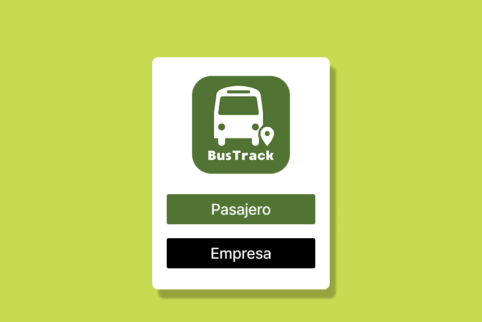

<br>

_**Figura 81.** Mock-up de la pantalla inicial de selección de tipo de usuario._ <br> _**Fuente:** elaboración propia._

**Mock-up 2**

_Descripción:_ Este mock-up muestra la pantalla de inicio de sesión para usuarios pasajeros. El diseño integra una ilustración juvenil y dinámica, reforzando la orientación del servicio a estudiantes y usuarios urbanos. Al lado derecho se presenta el formulario de acceso con campos para correo y contraseña, junto con accesos a recuperación de credenciales y registro. La composición visual asegura equilibrio entre ilustración y funcionalidad, resaltando el formulario con un fondo blanco y sombra suave.

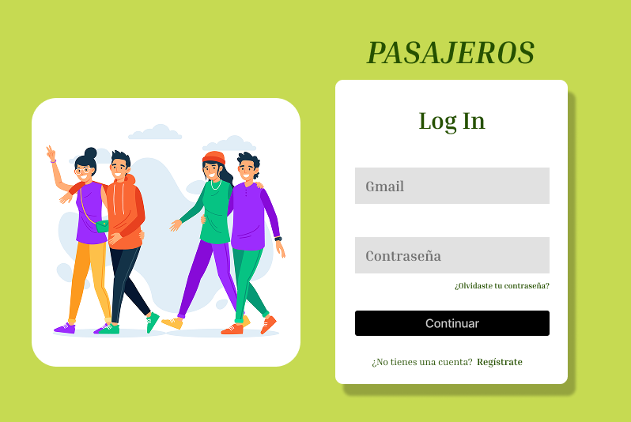

<br>

_**Figura 82.** Mock-up de la pantalla de Log In para pasajeros._ <br> _**Fuente:** elaboración propia._

**Mock-up 3**

_Descripción:_ Este mock-up corresponde al formulario de creación de cuenta para pasajeros. El diseño mantiene coherencia visual con la interfaz de Log In, incorporando elementos como el fondo verde pastel y sombras suaves. El formulario incluye opción de registro rápido mediante Google y campos tradicionales (correo, usuario y contraseña). A la izquierda, un ícono genérico de perfil funciona como elemento ilustrativo y refuerza la idea de creación de identidad digital dentro del sistema.

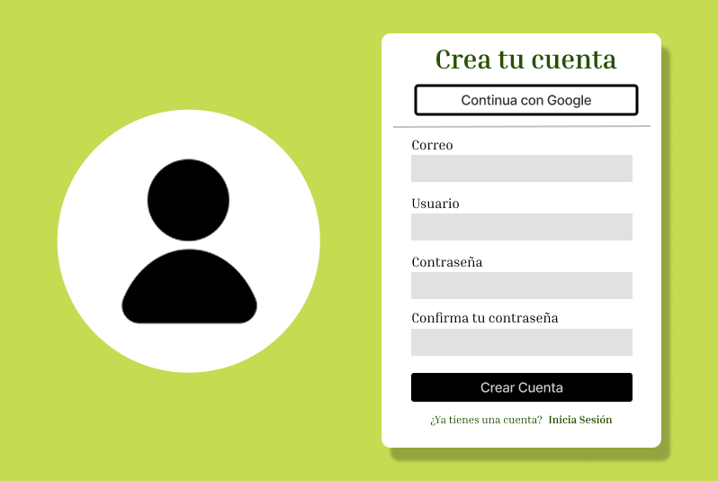

<br>

_**Figura 83.** Mock-up de la pantalla de registro de nuevos pasajeros._ <br> _**Fuente:** elaboración propia._

**Mock-up 4**

_Descripción:_ Este mock-up presenta la pantalla principal para el flujo de búsqueda de rutas del pasajero. La sección superior incorpora el header institucional con el nombre BusTrack y la barra de navegación. En el centro se muestra un mapa incrustado de Google Maps, destacando la ubicación actual del usuario. A la derecha se incluye un módulo de búsqueda con campos para origen y destino, así como un botón de acción claramente identificado. La composición busca favorecer la rapidez de interacción y la claridad en el flujo de búsqueda.

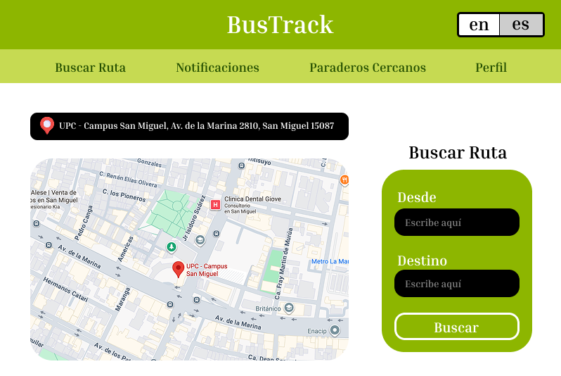

<br>

_**Figura 84.** Mock-up de búsqueda de rutas para pasajeros._ <br> _**Fuente:** elaboración propia._

**Mock-up 5**

_Descripción:_ Este mock-up muestra la pantalla donde se visualiza la ruta seleccionada, integrando un panel lateral con información del viaje. Dicho panel destaca los puntos de origen y destino mediante etiquetas de colores (A y B) que refuerzan la comprensión espacial del usuario. Además, incluye opciones adicionales como guardar la ruta o visualizarla directamente en Google Maps. En la parte inferior se incorpora un botón de “Nueva búsqueda”, permitiendo al usuario reiniciar el proceso con facilidad.

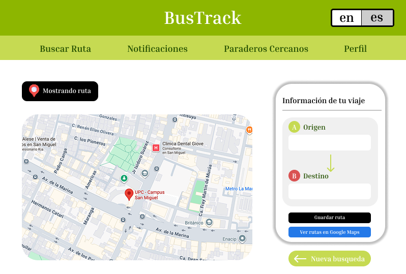

<br>

_**Figura 85.** Mock-up de la pantalla de visualización de ruta._ <br> _**Fuente:** elaboración propia._

**Mock-up 6**

_Descripción:_ Este mock-up corresponde a la sección de Notificaciones del pasajero. La pantalla utiliza un diseño minimalista con fondo verde muy claro para transmitir tranquilidad. El centro de la pantalla presenta una tarjeta que informa que no existen notificaciones disponibles, reforzando claridad y transparencia hacia el usuario. El diseño prioriza lectura rápida, accesibilidad y consistencia visual con la paleta oficial.


<br>

_**Figura 86.** Mock-up de la pantalla de notificaciones del pasajero._ <br> _**Fuente:** elaboración propia._

**Mock-up 7**

_Descripción:_ Este mock-up representa la pantalla de Paraderos Cercanos, donde el usuario visualiza información relevante de los paraderos próximos a su ubicación. Cada tarjeta incluye nombre del paradero, dirección, buses que pasan y distancia estimada. A la derecha, un mapa detallado apoya la localización espacial. Botones de acción como “Cómo llegar” y “Notificar llegada” permiten ampliar la interacción. El diseño combina información textual, visual y geográfica para una experiencia sólida y contextual.


<br>

_**Figura 87.** Mock-up de la pantalla de paraderos cercanos._ <br> _**Fuente:** elaboración propia._

**Mock-up 8**

_Descripción:_ Este mock-up muestra la interfaz de Perfil del usuario pasajero. A la izquierda se ubica la tarjeta de información personal editable, incluyendo nombre, correo y contraseña, con íconos de visibilidad. A la derecha se despliegan las distintas secciones del perfil: rutas favoritas, historial de viajes, notificaciones y configuración. Cada sección incluye el botón “Detalles”, facilitando el acceso a funciones específicas. La pantalla mantiene una estructura equilibrada entre edición y navegación interna.


<br>

_**Figura 88.** Mock-up de la pantalla de perfil del pasajero._ <br> _**Fuente:** elaboración propia._

**Mock-up 9**

_Descripción:_ Este mock-up presenta la sección de Rutas favoritas del pasajero. En caso de no existir rutas guardadas, la pantalla muestra un mensaje informativo acompañado de un ícono de pin, reforzando la metáfora visual del mapa. Un botón central “Buscar rutas” dirige nuevamente al usuario al flujo principal. El diseño busca mantener coherencia con otras pantallas de estado vacío del sistema.


<br>

_**Figura 89.** Mock-up de la pantalla de rutas favoritas (estado vacío)._ <br> _**Fuente:** elaboración propia._

**Mock-up 10**

_Descripción:_ Este mock-up corresponde a la sección de Historial de viajes, donde se muestran registros de rutas pasadas con información detallada: fecha, duración, distancia total y paraderos intermedios. Cada tarjeta usa un diseño oscuro para resaltar la jerarquía y diferenciarla del resto de la interfaz. En la parte superior derecha se incluye la opción “Borrar historial de usuario”, brindando control total al pasajero sobre sus datos.


<br>

_**Figura 90.** Mock-up del historial de viajes del pasajero._ <br> _**Fuente:** elaboración propia._

**Mock-up 11**

_Descripción:_ Este mock-up representa la pantalla de configuración de notificaciones para pasajeros. En esta vista, el usuario puede activar o desactivar distintos tipos de alertas relacionadas con su experiencia de viaje, como llegada del bus, retrasos, paraderos cercanos o inicio del recorrido. Cada opción se presenta con un interruptor visual (toggle) que indica claramente su estado. La interfaz utiliza un contenedor central en tono verde pastel que distingue la sección interactiva del resto del contenido, manteniendo una jerarquía clara y una experiencia accesible.


<br>

_**Figura 91.** Mock-up de configuración de notificaciones para pasajeros._ <br> _**Fuente:** elaboración propia._

**Mock-up 12**

_Descripción:_ Este mock-up muestra la sección de configuración de cuenta del pasajero, donde el usuario puede editar información personal como nombre, correo electrónico y contraseña. La tarjeta central presenta un diseño ordenado y jerárquico, con un ícono de perfil que permite gestionar la foto de usuario. El enfoque visual prioriza la claridad del formulario y la facilidad para realizar cambios. El botón “Guardar cambios” se ubica al final del módulo, siguiendo principios de diseño centrados en la acción principal.


<br>

_**Figura 92.** Mock-up de configuración de cuenta del pasajero._ <br> _**Fuente:** elaboración propia._

**Mock-up 13**

_Descripción:_ Este mock-up corresponde a la pantalla de inicio de sesión para empresas. El diseño incorpora una fotografía de un bus en operación, reforzando la identidad visual corporativa y diferenciando este flujo del del pasajero. Al lado derecho, se ubica el formulario de Log In con campos para correo y contraseña, así como opciones complementarias como recuperación de contraseña y acceso a registro. La composición busca transmitir profesionalismo y generar confianza en usuarios empresariales.


<br>

_**Figura 93.** Mock-up de Log In para empresas._ <br> _**Fuente:** elaboración propia._

**Mock-up 14**

_Descripción:_ Este mock-up presenta la pantalla de creación de cuenta empresarial, diseñada específicamente para organizaciones de transporte. El formulario incluye campos propios del modelo de negocio: nombre de la empresa, RUC, correo corporativo, dirección física, contraseña y tamaño de flota. El diseño mantiene coherencia con el flujo de registro del pasajero, pero incorpora un enfoque más institucional que responde a las necesidades de la gestión empresarial.


<br>

_**Figura 94.** Mock-up de registro de nuevas empresas._ <br> _**Fuente:** elaboración propia._

**Mock-up 15**

_Descripción:_ Este mock-up corresponde a la interfaz de Monitoreo en Tiempo Real para empresas. En esta pantalla, los administradores visualizan un mapa interactivo junto a un panel de estado de buses, donde se indican detalles como ruta, conductor, última actualización y estado actual (en horario, retraso, fuera de servicio, etc.). Los estados están codificados por colores siguiendo la paleta de eventos del sistema (verde, amarillo y rojo). Esta vista se convierte en el núcleo operacional para la supervisión de flota.


<br>

_**Figura 95.** Mock-up de monitoreo en tiempo real de flota empresarial._ <br> _**Fuente:** elaboración propia._

**Mock-up 16**

_Descripción:_ Este mock-up muestra la sección de Alertas Internas, donde la empresa puede revisar incidentes y notificaciones críticas ocurridas durante las operaciones. La interfaz incluye herramientas de filtrado por tipo, gravedad y estado, permitiendo priorizar la resolución de eventos. Cada alerta se presenta como una tarjeta con indicadores de gravedad mediante etiquetas codificadas por color. Además, se incorpora un botón “Marcar Resuelta” para gestionar estados operativos.


<br>

_**Figura 96.** Mock-up de gestión de alertas internas._ <br> _**Fuente:** elaboración propia._

**Mock-up 17**

_Descripción:_ Este mock-up representa la pantalla de Administración de Flota, donde la empresa puede visualizar y gestionar todos los buses registrados. El módulo superior resume las estadísticas clave: total de buses, activos, en mantenimiento e inactivos. Debajo, una tabla estructurada muestra los datos principales de cada unidad (ID, placa, ruta asignada, estado y conductor). Acciones rápidas como “Editar” y “Detalles” permiten una administración eficiente y accesible.


<br>

_**Figura 97.** Mock-up de administración de flota para empresas._ <br> _**Fuente:** elaboración propia._

**Mock-up 18**

_Descripción:_ Este mock-up corresponde a la sección de Configuración Empresarial, que centraliza la edición de información institucional, preferencias de alertas y parámetros de seguridad. La pantalla está organizada en tres bloques principales:

- Información de la Empresa (datos generales como nombre, RUC y dirección).

- Preferencias de Alertas (tipo de alertas y tiempos de tolerancia).

- Seguridad (cambio de contraseña).

Cada sección se presenta en tarjetas diferenciadas para favorecer la claridad visual y la navegación interna. Al final se incluye un botón destacado de “Cerrar Sesión”.


<br>

_**Figura 98.** Mock-up de configuración empresarial._ <br> _**Fuente:** elaboración propia._


Link del figma: https://www.figma.com/design/gfihE4UEnoiFtzf54xXuL8/BusTrack-wireframes-y-mockups?node-id=0-1&t=vbZPvREtMGxi30PI-1

### 4.6.4. Web Applications User Flow Diagrams.

Para el caso de BusTrack se desarrollaron dos flujos principales:

- Flujo del usuario pasajero, que incluye etapas como selección de tipo de usuario, autenticación, registro, búsqueda de rutas, visualización de paraderos cercanos, uso del perfil, acceso a rutas favoritas, historial de viajes y configuración de notificaciones.

- Flujo del usuario empresa, que considera procesos como autenticación empresarial, registro corporativo, monitoreo en tiempo real, gestión de alertas internas, administración de flota y edición de configuración institucional.

El diagrama permite visualizar la complejidad lógica del sistema y valida que cada pantalla cuente con una ruta clara, evitando callejones sin salida y asegurando una navegación eficiente y coherente. Asimismo, facilita la comunicación entre equipos de diseño, desarrollo y stakeholders, garantizando que la experiencia de usuario cumpla con los objetivos funcionales definidos en el proyecto.


_**Figura 99.** Diagrama general de User Flows para los usuarios Pasajero y Empresa en la aplicación web BusTrack._ <br> _**Fuente:** elaboración propia._


## 4.7. Web Applications Prototyping.

La imagen muestra una captura del prototipo navegable desarrollado para la plataforma web de BusTrack, correspondiente a la sección de Ubicación Actual dentro del flujo de búsqueda de rutas. Este prototipo permite simular la interacción real del usuario, incluyendo navegación por el menú principal, visualización de la ubicación en el mapa y respuesta del sistema según los flujos definidos previamente. La evidencia confirma la implementación funcional de los diseños de alta fidelidad elaborados en la etapa anterior.


_**Figura 100.** Vista del prototipo navegable de la aplicación web BusTrack_ <br> _**Fuente:** elaboración propia._

link del video: https://upcedupe-my.sharepoint.com/:v:/g/personal/u20201c320_upc_edu_pe/IQDEh4kh9m4GTYvmkBirzUVHAWfUxDtmc2BYFpkju5ztdkI?nav=eyJyZWZlcnJhbEluZm8iOnsicmVmZXJyYWxBcHAiOiJTdHJlYW1XZWJBcHAiLCJyZWZlcnJhbFZpZXciOiJTaGFyZURpYWxvZy1MaW5rIiwicmVmZXJyYWxBcHBQbGF0Zm9ybSI6IldlYiIsInJlZmVycmFsTW9kZSI6InZpZXcifX0%3D&e=kYehgP

## 4.8. Domain-Driven Software Architecture.

La arquitectura de software orientada al dominio (Domain-Driven Design, DDD) permite estructurar el sistema en función de los conceptos principales asociados al transporte urbano y a los distintos tipos de usuarios de la plataforma. Esta aproximación facilita que la lógica de negocio represente con precisión las necesidades reales de cada segmento y asegura que las funcionalidades clave se organicen dentro de bounded contexts bien definidos.
En BusTrack se identifican dos contextos principales según los segmentos objetivo:

- Pasajeros, orientado a movilidad y búsqueda de rutas.

- Empresas de transporte, orientado a la gestión operativa de flotillas y alertas.

### 4.8.1. Software Architecture Context Diagram.

**Elementos**

- BusTrack: Plataforma central que gestiona rutas, paraderos y notificaciones en tiempo real
- Usuario Estudiante: Consulta rutas, paraderos cercanos y recibe notificaciones sobre los buses
- Empresa de Transporte: Proporciona datos de buses y gestiona información de flotas
- Google Maps API: Servicio externo de mapas y geolocalización
- ATU / Flotas de Transporte: Fuente oficial de datos de rutas y buses
- Servicio de Notificaciones: Permite el envío de alertas en tiempo real a los usuarios

Descripción: El diagrama de contexto muestra los actores externos, sistemas vinculados y la relación de BusTrack con su entorno, incluyendo estudiantes, empresas de transporte, flotas oficiales, servicios de mapas y notificaciones.


_**Figura 104.** Diagrama de Contexto de la Arquitectura de BusTrack._ <br> _**Fuente:** elaboración propia._

**Leyenda**

Descripción: La leyenda detalla el significado de los colores y tipos de elementos utilizados en el diagrama de contexto para distinguir actores, sistemas y relaciones.


_**Figura 105.** Leyenda del Diagrama de Contexto de BusTrack._ <br> _**Fuente:** elaboración propia._

### 4.8.2. Software Architecture Container Diagrams.

La arquitectura de BusTrack adopta un estilo modular orientado a servicios, combinando una PWA en el frontend con un Backend API centralizado y un servicio de tiempo real basado en eventos. También, se emplea un enfoque event-driven para las notificaciones y actualizaciones de posición, mientras que las operaciones CRUD se gestionan mediante REST. El componente de Fleet Data Ingestion aplica un patrón de data normalization pipeline para procesar datos de GPS en distintos formatos provenientes de las empresas de transporte.

Descripción: El diagrama de contenedores representa la arquitectura de alto nivel de BusTrack, mostrando la PWA, el Servicio en Tiempo Real, el Backend API, el módulo de ingesta y los sistemas externos.


_**Figura 106.** Diagrama de Contenedores de la Arquitectura de BusTrack._ <br> _**Fuente:** elaboración propia._


**Leyenda**

Descripción: La leyenda especifica los colores y tipos de contenedores, indicando qué elementos corresponden a sistemas externos, backend, frontend o infraestructura.


_**Figura 107.** Leyenda del Diagrama de Contenedores de BusTrack._ <br> _**Fuente:** elaboración propia._ 

### 4.8.3. Software Architecture Components Diagrams.

Cada contenedor del sistema BusTrack se descompone en componentes que implementan sus principales responsabilidades internas. A continuación se presentan los diagramas de componentes correspondientes a la Aplicación Web (PWA), el Backend API, el Servicio en Tiempo Real y el módulo de Ingesta de Datos de Flota.

**Web App (PWA)**

La PWA gestiona la interfaz del usuario final y las vistas operativas para pasajeros y personal de transporte.

- BuscarRutasView: búsqueda y visualización de rutas.
- ParaderoDetalleView: muestra información de paraderos.
- MapaInteractivo: renderiza rutas y ubicaciones.
- ApiClient: comunica con el Backend API (HTTP REST).
- ClientTiempoReal: suscripción WebSocket con el Servicio en Tiempo Real.
- AuthUI y SesionStore: control de autenticación y persistencia de sesión.
- AjustesNotificaciones: permisos para recibir alertas push.
- RouterSPA: navegación interna entre vistas.

Descripción: El diagrama describe los componentes internos de la PWA, incluyendo vistas, manejo de sesión, cliente REST y cliente WebSocket.


_**Figura 108.** Componentes de la Aplicación Web (PWA) de BusTrack._ <br> _**Fuente:** elaboración propia._

**Leyenda**

Descripción: La leyenda explica los colores y formas utilizados para representar componentes, servicios y relaciones internas de la PWA.


_**Figura 109.** Leyenda de Componentes de la PWA._ <br> _**Fuente:** elaboración propia._

**Backend API**

La API central implementa la lógica de negocio siguiendo una arquitectura por capas:

- Controladores (Controller): gestionan endpoints REST (AuthController, BuscarRutasController, ParaderosController, AlertasController).
- Servicios (Service): encapsulan la lógica (RutasService, ParaderosService, AuthService, AlertasService).
-Repositorios (Repository): abstraen el acceso a datos (RutasRepository, ParaderosRepository, UsuariosRepository).
-Infraestructura (Infrastructure): integraciones externas (MapsGateway, ATUGateway, PushGateway, CacheAdapter, ORMAdapter).

Los controladores reciben solicitudes HTTP, delegan en los servicios y retornan respuestas JSON. Los servicios pueden consultar APIs externas, cachear resultados o emitir eventos.

Descripción: El diagrama muestra los componentes de la API Backend, organizados en controladores, servicios, repositorios e infraestructura.


_**Figura 110.** Componentes del Backend API de BusTrack._ <br> _**Fuente:** elaboración propia._

**Leyenda**

Descripción: La leyenda detalla el significado de los colores y categorías para controladores, servicios, repositorios y adaptadores.


_**Figura 111.** Leyenda de los Componentes del Backend API._ <br> _**Fuente:** elaboración propia._

**Real-time Service**

Este servicio maneja la comunicación asincrónica con los clientes mediante WebSockets.

- GatewayWebSocket: gestiona las conexiones y salas de suscripción por ruta.
- AuthWSMiddleware: valida tokens JWT antes de permitir conexión.
- SuscriptorEventos: consume eventos de posición desde el sistema de ingesta.
- PublicadorActualizaciones: difunde mensajes bus:update a los clientes conectados.

Se comunica de manera asincrónica (MQ) con la ingesta y bidireccional (WebSocket) con la PWA.

Descripción: El diagrama presenta los componentes del Servicio en Tiempo Real, incluyendo el gateway WebSocket, middleware de autenticación y publicadores de eventos.


_**Figura 112.** Componentes del Servicio en Tiempo Real de BusTrack._ <br> _**Fuente:** elaboración propia._


**Leyenda**

Descripción: La leyenda describe los tipos de componentes relacionados con procesamiento de eventos, conectividad WebSocket y middleware.


_**Figura 113.** Leyenda del Servicio en Tiempo Real._ <br> _**Fuente:** elaboración propia._


**Fleet Data Ingestion**

Este módulo procesa y normaliza la telemetría proveniente de distintas empresas de transporte.

- ConectorProveedorA/B: adaptadores específicos para cada fuente de datos.
- NormalizadorPosiciones: unifica formatos de GPS.
- ValidadorTelemetria: filtra datos inválidos.
- PublicadorEventos: emite eventos PosicionActualizada hacia el sistema de tiempo real.

Descripción: Componentes que procesan telemetría de proveedores, normalizan datos GPS y generan eventos para el sistema en tiempo real.


_**Figura 114.** Componentes del Contenedor Fleet Data Ingestion._ <br> _**Fuente:** elaboración propia._

**Leyenda**

Descripción: La leyenda detalla los iconos y categorías utilizados para representar adaptadores de proveedores, normalizadores y publicadores de eventos.


_**Figura 115.** Leyenda del Módulo de Ingesta de Datos de Flota._ <br> _**Fuente:** elaboración propia._

<br>

## 4.9. Software Object-Oriented Design.

El diseño orientado a objetos de BusTrack define la estructura interna del sistema mediante clases, atributos, métodos y relaciones esenciales para representar usuarios, rutas, buses, viajes, notificaciones y entidades operativas del transporte público. Este diseño permite mantener un modelo extensible, modular y alineado con patrones como encapsulación, asociación, composición y herencia, facilitando la implementación en el código final.

### 4.9.1. Class Diagrams.

El siguiente diagrama de clases representa los principales objetos del dominio de BusTrack y sus interacciones. Incluye entidades como User, Passenger, Driver, Bus, Route, Stop, Travel y Notification, junto a sus atributos, métodos y relaciones (asociaciones, composiciones y herencia).
Este modelo sirve como base para la implementación de los módulos funcionales del sistema.

Descripción: El diagrama muestra la estructura del dominio de BusTrack, detallando las clases principales, sus atributos, métodos clave y la forma en que se relacionan entre sí mediante asociaciones y composiciones.


_**Figura 116.** Diagrama de clases del sistema BusTrack._ <br> _**Fuente:** elaboración propia._

### 4.9.2. Class Dictionary.

A continuación se presenta el diccionario de clases correspondiente al modelo orientado a objetos de BusTrack. Se detallan atributos, descripciones, tipos de datos y métodos principales para cada entidad definida en el diagrama de clases.


## Clase: **User** *(Abstracta)*  
**Descripción:** Representa al usuario base del sistema.

| Nombre de Atributo | Descripción                  | Tipo de Dato     |
|--------------------|------------------------------|------------------|
| id                 | Identificador único          | UUID             |
| name               | Nombre completo              | String           |
| email              | Correo electrónico           | String           |
| password           | Contraseña encriptada        | String           |
| role               | Tipo de usuario              | enum (UserRole)  |
| profilePhoto       | Foto de perfil               | String (URL)     |

**Métodos**  
- `login()` — Autentica al usuario en el sistema  
- `logout()` — Cierra la sesión del usuario  
- `updateProfile()` — Actualiza información del perfil  

---

## Clase: **Passenger** *(Hereda de User)*  
**Descripción:** Usuario que utiliza el transporte público  

| Nombre de Atributo | Descripción                   | Tipo de Dato     |
|--------------------|-------------------------------|------------------|
| favoriteRoutes     | Rutas guardadas como favoritas | List<Route>      |
| travelHistory      | Historial de viajes realizados | List<Travel>     |
| currentTravel      | Viaje en curso                 | Travel           |

**Métodos**  
- `searchRoute(origin, destination)` — Busca rutas disponibles  
- `saveFavoriteRoute(route)` — Guarda una ruta como favorita  
- `startTravel(route)` — Inicia un viaje  
- `receiveNotification()` — Recibe notificaciones  

---

## Clase: **Driver** *(Hereda de User)*  
**Descripción:** Conductor asignado a un bus dentro del sistema.

| Nombre de Atributo | Descripción                  | Tipo de Dato       |
|--------------------|------------------------------|--------------------|
| licenseNumber      | Número de licencia de conducir | String            |
| assignedBus        | Bus asignado                 | Bus                |
| shiftStatus        | Estado del turno laboral     | enum (ShiftStatus) |

**Métodos**  
- `startShift()` — Inicia turno de trabajo  
- `endShift()` — Finaliza turno de trabajo  
- `updateLocation()` — Actualiza ubicación en tiempo real  
- `reportIncident()` — Reporta incidentes en la ruta  

---

## Clase: **Bus**  
**Descripción:** Vehículo de transporte público registrado en el sistema.

| Nombre de Atributo | Descripción                  | Tipo de Dato      |
|--------------------|------------------------------|-------------------|
| id                 | Identificador único          | UUID              |
| licensePlate       | Placa del vehículo           | String            |
| capacity           | Capacidad de pasajeros       | int               |
| currentLocation    | Ubicación actual             | Location          |
| status             | Estado operativo             | enum (BusStatus)  |
| currentRoute       | Ruta actual                  | Route             |

**Métodos**  
- `updateLocation()` — Actualiza posición GPS  
- `changeStatus()` — Cambia estado del bus  
- `getArrivalTime(stop)` — Calcula tiempo de llegada  

---

## Clase: **Route**  
**Descripción:** Ruta de transporte con paradas definidas  

| Nombre de Atributo | Descripción                  | Tipo de Dato   |
|--------------------|------------------------------|----------------|
| id                 | Identificador único          | UUID           |
| name               | Nombre de la ruta            | String         |
| stops              | Lista de paradas             | List<Stop>     |
| estimatedTime      | Tiempo estimado de recorrido | int            |
| frequency          | Frecuencia de paso           | int            |

**Métodos**  
- `calculateArrivalTime()` — Calcula tiempo de llegada  
- `addStop()` — Agrega nueva parada  
- `removeStop()` — Elimina parada  

---

## Clase: **Stop**  
**Descripción:** Paradero o punto de parada  

| Nombre de Atributo | Descripción                  | Tipo de Dato   |
|--------------------|------------------------------|----------------|
| id                 | Identificador único          | UUID           |
| name               | Nombre del paradero          | String         |
| location           | Coordenadas GPS              | Location       |
| buses              | Buses que pasan por aquí     | List<Bus>      |

**Métodos**  
- `getNextBuses()` — Obtiene próximos buses  
- `updateBusArrival()` — Actualiza llegada de buses  

---

## Clase: **Travel**  
**Descripción:** Registro de un viaje realizado  

| Nombre de Atributo | Descripción                  | Tipo de Dato   |
|--------------------|------------------------------|----------------|
| id                 | Identificador único          | UUID           |
| passenger          | Pasajero que realiza el viaje | Passenger      |
| route              | Ruta utilizada               | Route          |
| startTime          | Hora de inicio               | DateTime       |
| endTime            | Hora de fin                  | DateTime       |
| duration           | Duración del viaje           | int            |

**Métodos**  
- `startTravel()` — Inicia el viaje  
- `endTravel()` — Finaliza el viaje  
- `calculateDuration()` — Calcula duración  

---

## Clase: **Notification**  
**Descripción:** Sistema de notificaciones  

| Nombre de Atributo | Descripción                     | Tipo de Dato                    |
|--------------------|---------------------------------|---------------------------------|
| id                 | Identificador único             | UUID                            |
| recipient          | Usuario destinatario            | User                            |
| message            | Contenido del mensaje           | String                          |
| sentAt             | Fecha y hora de envío           | DateTime                        |
| type               | Tipo de notificación            | enum (NotificationType)         |
| status             | Estado de la notificación       | enum (NotificationStatus)       |
F
**Métodos**  
- `send()` — Envía la notificación  
- `markAsRead()` — Marca como leída

<br>

## 4.10. Database Design.

En esta sección se presenta el diseño e implementación de la base de datos de BusTrack, la cual gestiona la información esencial de los usuarios, rutas, buses, paraderos y notificaciones. Este diseño garantiza el correcto funcionamiento de los módulos de la aplicación y su integración con las funcionalidades ya definidas en el modelo orientado a objetos.

### 4.10.1. Relational/Non-Relational Database Diagram.

En primer lugar, se diseñó la base de datos mediante un diagrama Entidad–Relación (ER) utilizando la herramienta Lucidchart, seleccionada por su facilidad de uso y la disponibilidad de plantillas especializadas para modelado de bases de datos.

Descripción: El diagrama ER representa las entidades principales del sistema BusTrack, sus atributos y las relaciones entre usuarios, pasajeros, rutas, buses, paraderos, notificaciones y viajes.


_**Figura 117.** Diagrama Entidad–Relación del sistema BusTrack._  <br>_**Fuente:** elaboración propia._


link: https://lucid.app/lucidchart/7b7fbca6-a61b-4653-8ea2-b8b1985b5e9f/edit?viewport_loc=-393%2C-62%2C3568%2C1532%2C0_0&invitationId=inv_7298d486-3846-4284-ac1c-f5b20085366e 

Después de realizar el diseño conceptual, se implementó la base de datos en **MySQL Workbench**, lo que permitió visualizar el modelo físico generado a partir del script de creación. Esta herramienta facilitó la validación de las claves primarias, foráneas y relaciones N:M entre entidades.

Descripción: El diagrama físico generado en MySQL Workbench muestra la estructura final de las tablas, incluyendo claves primarias, claves externas y relaciones derivadas del modelo ER inicial.


_**Figura 118.** Diagrama físico de la base de datos BusTrack en MySQL Workbench._  <br> _**Fuente:** elaboración propia._

___

# Base de Datos: BusTrack1

A continuación, se describen las tablas implementadas en la base de datos, incluyendo sus relaciones.

## 1. Tabla: `Users`

Contiene la información principal de los usuarios del sistema.

**Campos:**  
- `userId` (PK)  
- `name`  
- `email` (único)  
- `password`  
- `role` (PASSENGER, DRIVER, ADMIN)  
- `profilePhoto`  

---

## 2. Tabla: `Passenger`

Almacena la información asociada a los pasajeros.

- Relación **1:1** con `Users` (cada pasajero es un usuario).

**Campos:**  
- `userId` (PK, FK → `Users.userId`)  
- `dni`  

---

## 3. Tabla: `Notification`
Registra las notificaciones enviadas a los usuarios.

- Relación **N:1** con `Users` (un usuario puede tener muchas notificaciones).

**Campos:**  
- `notificationId` (PK)  
- `message`  
- `sentAt`  
- `type` (ARRIVAL_ALERT, DELAY_ALERT, SECURITY_ALERT)  
- `status` (SENT, DELIVERED, READ)  
- `userId` (FK → `Users.userId`)  

---

## 4. Tabla: `Route`
Representa las rutas disponibles en el sistema.

**Campos:**  
- `routeId` (PK)  
- `name`  
- `estimatedTime`  
- `frequency`  

---

## 5. Tabla: `Stop`
Define los paraderos asociados a las rutas.

**Campos:**  
- `stopId` (PK)  
- `name`  
- `location`  
- `attribute1`  
- `attribute2`  
- `attribute3`  

---

## 6. Tabla: `Route_Stop`
Representa la relación **N:M** entre las entidades `Route` y `Stop`.

**Campos:**  
- `routeId` (PK, FK → `Route.routeId`)  
- `stopId` (PK, FK → `Stop.stopId`)  

---

## 7. Tabla: `Bus`
Almacena los datos de los buses registrados.

- Relación **N:1** con `Route` (un bus pertenece a una ruta).

**Campos:**  
- `busId` (PK)  
- `licensePlate` (único)  
- `capacity`  
- `currentLocation`  
- `status` (ACTIVE, INACTIVE, MAINTENANCE)  
- `routeId` (FK → `Route.routeId`)  

---

## 8. Tabla: `Driver`
Contiene los datos de los conductores asignados.

- Relación **1:1** con `Users`  
- Relación **N:1** con `Bus`

**Campos:**  
- `userId` (PK, FK → `Users.userId`)  
- `licenseNumber`  
- `shiftStatus` (ACTIVE, INACTIVE, BREAK)  
- `busId` (FK → `Bus.busId`)  

---

## 9. Tabla: `Travel`
Registra los viajes realizados por los pasajeros.

- Relación **N:1** con `Route`  
- Relación **N:1** con `Passenger`

**Campos:**  
- `travelId` (PK)  
- `startTime`  
- `endTime`  
- `duration`  
- `routeId` (FK → `Route.routeId`)  
- `userId` (FK → `Passenger.userId`)  

<br><br>

# Capítulo V: Product Implementation

## 5.1. Software Configuration Management.
A continuación, se describe el proceso mediante el cual organizamos, gestionamos y controlamos los cambios realizados en el desarrollo de BusTrack.

### 5.1.1. Software Development Environment Configuration.
En esta sección se describen las herramientas utilizadas en el desarrollo del proyecto BusTrack y su propósito dentro del ciclo de vida del software.

Para el desarrollo del sistema, se utiliza Vue.js con Vite en el frontend, .NET 8 con C# para la API REST, y HTML, CSS y JavaScript para la landing page. Además, se emplea JSON Server como Fake API para simular la comunicación con la base de datos durante las primeras etapas del desarrollo.

#### Gestión de las necesidades

| Plataforma | Descripción | Enlace |
|------------|-------------|--------|
| Trello | Plataforma de gestión de proyectos que permite realizar el seguimiento detallado del progreso (user stories) | <https://trello.com> |
| Uxpressia | Herramienta en línea para la elaboración de artefactos de UX, como User Personas y Journey Maps. | <https://uxpressia.com> |
| Canva | Aplicación web de diseño y comunicación visual utilizada para crear piezas gráficas del proyecto. | <https://www.canva.com> |
| Lucidchart | Herramienta visual para representar información estructurada, diagramas y procesos del sistema. | <https://www.lucidchart.com> |

___

#### Diseño UX/UI

| Plataforma | Descripción | Enlace |
|------------|-------------|--------|
| Figma | Herramienta para el diseño colaborativo de interfaces digitales, permitiendo prototipado y trabajo en equipo. | <https://www.figma.com> |

___

#### Desarrollo de software

| Plataforma           | Descripción                                                                                              | Link |
|----------------------|----------------------------------------------------------------------------------------------------------|------|
| HTML                 | Define la estructura y contenido de las páginas web.                                       | <https://www.w3schools.com/html/> |
| CSS                  | Se encarga del estilo y presentación visual de las interfaces.                                       | <https://www.w3schools.com/css/> |
| JS                   | Añade interactividad y dinamismo a la aplicación web.                                                        | <https://www.w3schools.com/js/> |
| Visual Studio Code   | Entorno de desarrollo para la edición, depuración y gestión de código. | <https://code.visualstudio.com/> |

____

#### Implementación de software

| Plataforma | Descripción                                                                 | Link |
|------------|-----------------------------------------------------------------------------|------|
| GitHub     | Plataforma para la gestión de repositorios y control de versiones del código del proyecto.    | <https://github.com> |
| Markdown   | Lenguaje de marcado utilizado para la documentación del informe.            | [<https://markdown.es/> |
| Git        |Sistema de control de versiones para registrar, gestionar y colaborar en el desarrollo del software. | <https://git-scm.com/> |

<br>

### 5.1.2. Source Code Management.
Usuarios de Github
<br>

<table border="1">
  <thead>
    <tr>
      <th>Integrante</th>
      <th>Usuario de GitHub</th>
    </tr>
  </thead>
  <tbody>
    <tr>
      <td>Cuentas Peña, Joaquin Alberto</td>
      <td>JoaCUPE</td>
    </tr>
    <tr>
      <td>Meza Camayo, Lynn Jeeferzon</td>
      <td>LynnJeefer</td>
    </tr>
    <tr>
      <td>Fajardo Monroy, Walter Luis</td>
      <td>WalterFajardo</td>
    </tr>
    <tr>
      <td>Santur Tello, Andrea Elizabeth</td>
      <td>andreli-star</td>
    </tr>
  </tbody>
</table>


**GitFlow Workflow y Convenciones de Commits**
Para la gestión del código fuente, el equipo implementó el modelo GitFlow, basado en la propuesta de Vincent Driessen en “A successful Git branching model”. Este enfoque permite organizar el desarrollo de manera estructurada, facilitando la colaboración y el control de versiones.

#### Flujo de trabajo y control de versiones

El proyecto sigue el flujo de trabajo GitFlow para el control de versiones, utilizando GitHub como plataforma de alojamiento y gestión del código. A continuación, se detalla la implementación de este modelo.

---

## Organización en GitHub
Se creó una organización para el equipo de trabajo:  
🔗 <https://github.com/2025-2-AplicacionesWeb-DalComp/Project-report-BusTrack->

---

## Repositorios
- **Repositorio para el informe del trabajo**:  
  🔗 <https://github.com/2025-2-AplicacionesWeb-DalComp/Project-report-BusTrack->  
- **Repositorio para la landing page**:  
  🔗 <https://github.com/2025-2-AplicacionesWeb-DalComp/Landing-page>

---

## Ramas principales

- **main (principal):**  

Contiene el código estable y listo para producción, correspondiente a las versiones oficiales de BusTrack. Cada release se marca con etiquetas semánticas (p. ej., v1.0.0) o con etiquetas referentes a cada entregable (p. ej., TB1, TP, TB2, TF), facilitando el rastreo y control de versiones.

- **develop (rama de desarrollo):**  

Contiene la versión más reciente en estado de preproducción, donde se integran todas las funcionalidades completadas. Funciona además como base para pruebas internas antes de fusionarse con la rama main.

---

## Ramas de soporte

- **feature/** → ramas para el desarrollo de nuevas funcionalidades.
- **release/** → ramas temporales para preparar una nueva versión estable.
- **hotfix/** → ramas destinadas a la corrección rápida de errores en producción.

---

## Convención de mensajes de commits

El equipo utiliza la convención Conventional Commits, para mantener claridad y trazabilidad.

### Ejemplos:
- `feat: agregar nuevo sistema de login`  
- `fix: corregir validación en formulario de registro`  
- `docs: actualizar README con instrucciones de despliegue`

Descripción: La imagen muestra el flujo de trabajo GitFlow, utilizado para organizar el proceso de desarrollo de BusTrack. En el diagrama se observan las ramas principales (main y develop), así como las ramas de soporte (feature, release, hotfix) y la forma en que interactúan entre sí para gestionar versiones y actualizaciones del proyecto.


_**Figura 119.** Flujo de trabajo GitFlow utilizado para la gestión del código fuente._ <br> _**Fuente:** elaboración propia._

<br>

### 5.1.3. Source Code Style Guide & Conventions.

#### Guía de Estilo de Desarrollo

El equipo adoptará nomenclatura en inglés para variables, funciones, clases y archivos del proyecto, con el fin de mantener coherencia, escalabilidad y buenas prácticas.

Para HTML y CSS, se sigue la guía Google HTML/CSS Style Guide. Se emplean etiquetas semánticas y nombres descriptivos para mejorar accesibilidad y mantenibilidad.

---

## Normas de Estilo

## 1. HTML - Estructura básica

```html
<!DOCTYPE html>
<html lang="es">
``` 


# Reglas de Estilo

## 1. Reglas Generales

- Todos los elementos deben estar correctamente cerrados (ej: ``, `<div></div>`).  
- Usar comillas dobles (`" "`) en atributos que contengan espacios.  
- Incluir atributos esenciales en imágenes.  

---

## 2. CSS - Formato

- Sangría: 2 espacios (sin pestañas).  
- Minúsculas en selectores, propiedades y valores.  
- Evitar espacios en blanco innecesarios y líneas vacías redundantes.  

---

## 3. Frontend en Vue.js

## Reglas clave:
- **Nombres de componentes**: `PascalCase` (Ejemplo: `UserProfile.vue`).  
- **Props**: Definir tipos y valores por defecto.  

<br>

### 5.1.4. Software Deployment Configuration.
En esta sección se presenta la implementación práctica del proyecto BusTrack, abarcando la construcción de la landing page, los servicios principales y las funcionalidades desarrolladas durante los sprints. Se detalla cómo cada entrega evoluciona desde los prototipos hasta el código final ejecutable, evidenciando el cumplimiento de los requisitos y flujos definidos previamente.
# Despliegue en GitHub Pages

Hemos seleccionado **GitHub Pages** como plataforma para alojar nuestro sitio web estático.  
A continuación, se detalla el proceso realizado:

---

## Paso 1. Creación de un repositorio
- Crear un nuevo repositorio y subir la **landing page** en él.  
- Asegurarse de que el repositorio sea **público**.  

---

## Paso 2. Actualización de archivos
- Subir todos los archivos del proyecto (HTML, CSS, JavaScript, etc.).  
- Verificar que se encuentren en la **última versión de desarrollo**.  

---

## Paso 3. Configuración de GitHub Pages
1. Dirigirse a la **configuración** del repositorio en GitHub.  
2. Ir a la sección **Settings**.  
3. Desplazarse hasta la sección **Pages**.  
4. En el menú desplegable **Source**, seleccionar la rama `gh-pages` y la carpeta raíz (`/root`) o `docs/` si los archivos están organizados en esa carpeta.  

> Una vez seleccionado, GitHub Pages generará una **URL pública** para acceder al sitio web.  

---

## Paso 4. Verificación del despliegue
Se muestra a continuación la landing page desplegada en su primera versión:  

🔗 <https://2025-2-aplicacionesweb-dalcomp.github.io/Landing-page/>

<br>

## 5.2. Product Implementation & Deployment.
### 5.2.1. Sprint Backlog 1

### Sprint Backlog 1

En esta sección se presenta el **Sprint Backlog 1**, que corresponde al primer ciclo de desarrollo del proyecto.  

Este backlog contiene las **tareas priorizadas y estimadas** que el equipo debe ejecutar para alcanzar el **objetivo principal del sprint**.  

El objetivo principal de este sprint es el **diseño y desarrollo de la landing page de BusTrack**, cuyo propósito es:

- Comunicar de manera clara y atractiva el valor de la web.  
- Generar confianza en los visitantes.  
- Explicar el funcionamiento del servicio.  
- Motivar a los usuarios a registrarse o explorar la plataforma.  

### Sprint Backlog - User Stories y Tareas

| **User Story** | **Title**                    | **Task ID** | **Task Title**                                       | **Description**                                                         | **Estimation (hours)** | **Assigned to**                         | **Status** |
|----------------|------------------------------|-------------|------------------------------------------------------|-------------------------------------------------------------------------|-------------------------|------------------------------------------|-----------|
| US01 | Buscar rutas | T09 | Diseñar interfaz de búsqueda de rutas | Crear la pantalla con los campos “Origen” y “Destino”, botón “Buscar ruta” y mensajes de ayuda para el usuario. | 3 | Joaquin Alberto Cuentas Peña | done |
| US01 | Buscar rutas | T10 | Implementar resultado de búsqueda | Simular la lista de rutas disponibles (mock) mostrando nombre y tiempo estimado. | 3 | Walter Luis Fajardo Monroy | done |
| US01 | Buscar rutas | T11 | Validar campos vacíos y deshabilitar botón | Deshabilitar botón si los campos están vacíos. | 1 | Lynn Jeeferzon Meza Camayo | done |
| US02 | Ver paraderos cercanos | T12 | Diseñar pantalla de paraderos cercanos | Lista de paraderos cercanos con datos simulados. | 3 | Andrea Elizabeth Santur Tello | done |
| US02 | Ver paraderos cercanos | T13 | Simular ubicación por defecto | Usar ubicación por defecto si no hay GPS. | 1 | Walter Luis Fajardo Monroy | done |
| US03 | Guardar rutas frecuentes | T14 | Añadir botón “Guardar como favorita” | Simular guardado de rutas favoritas. | 2 | Lynn Jeeferzon Meza Camayo | done |
| US03 | Guardar rutas frecuentes | T15 | Simular validación de ruta duplicada | Mostrar mensaje si la ruta ya existe. | 1 | Joaquin Alberto Cuentas Peña | done |
| US04 | Ver ruta en Google Maps | T16 | Agregar botón “Ver en Google Maps” | Botón en resultados de búsqueda. | 2 | Walter Luis Fajardo Monroy | done |
| US04 | Ver ruta en Google Maps | T17 | Construir URL y apertura en nueva pestaña | Abrir ruta en Google Maps. | 1 | Lynn Jeeferzon Meza Camayo | done |
| US05 | Notificaciones de retraso | T18 | Diseñar pantalla de notificaciones | Lista de notificaciones con tarjetas. | 2 | Andrea Elizabeth Santur Tello | done |
| US05 | Notificaciones de retraso | T19 | Implementar toast y estado vacío | Toast y mensaje “sin notificaciones”. | 1 | Joaquin Alberto Cuentas Peña | done |
| US06 | Alertas de desvío | T20 | Maquetar UI para alertas | Reutilizar UI con iconos diferenciados. | 2 | Lynn Jeeferzon Meza Camayo | done |
| US06 | Alertas de desvío | T21 | Eliminar alertas | Botón para eliminar alertas. | 1 | Andrea Elizabeth Santur Tello | done |
| US11 | Información de la solución | T01 | Contenido de buscar ruta | Explicación de búsqueda de rutas. | 1 | Andrea Elizabeth Santur Tello | done |
| US11 | Información de la solución | T02 | Contenido de recibir alertas | Explicación de alertas. | 1 | Lynn Jeeferzon Meza Camayo | done |
| US11 | Información de la solución | T03 | Contenido de viajar más seguro | Explicación de seguridad. | 1 | Walter Luis Fajardo Monroy | done |
| US12 | Beneficios de la aplicación | T04 | Información en tiempo real | Explicación de datos en tiempo real. | 1 | Joaquin Alberto Cuentas Peña | done |
| US12 | Beneficios de la aplicación | T05 | Guardar rutas favoritas | Explicación de favoritos. | 1 | Andrea Elizabeth Santur Tello | done |
| US12 | Beneficios de la aplicación | T06 | Alertas y notificaciones | Explicación de notificaciones. | 1 | Lynn Jeeferzon Meza Camayo | done |
| US13 | Misión y visión | T07 | Desarrollar misión | Definición de misión. | 1 | Joaquin Alberto Cuentas Peña | done |
| US13 | Misión y visión | T08 | Desarrollar visión | Definición de visión. | 1 | Walter Luis Fajardo Monroy | done |


### 5.2.2. Implemented Landing Page Evidence

En esta sección se presenta la evidencia de ejecución del Sprint 1 mediante capturas de la **landing page** de BusTrack desplegada.  
Las imágenes muestran el estado real del producto al cierre del sprint y permiten validar que las historias de usuario priorizadas se reflejan en la interfaz implementada.

### Avances en los Productos Desarrollados  

**Producto desarrollado:** Landing Page (versión estática)  

**Tecnologías utilizadas:** HTML, CSS  

- Se implementó una estructura básica de navegación con menú fijo y enlaces a las secciones: **NavBar, Hero, Cómo usar, Beneficios y Sobre nosotros**.  
- Se desarrolló una sección de **“Cómo usar”**, estructurada por pasos visuales.  
- Se diseñó la **sección introductoria**, donde se explica brevemente la finalidad de la plataforma.  
- Se creó una sección **“Beneficios de BusTrack”**, que presenta los beneficios diferenciales mediante listas e íconos decorativos.  
- Se añadió una **sección “Sobre nosotros”**, en la que se expone la misión y visión de nuestra empresa y solución.  
- Se construyó un **footer simple**, que cumple con los créditos del autor.  
- Se aplicaron **estilos CSS** para lograr un diseño limpio, responsivo en pantallas móviles y legible.  

La landing page **no incluye funcionalidades dinámicas**, ni conexión con base de datos o servicios web, ya que se trata de un desarrollo inicial con **HTML y CSS puro**, orientado a validar la estructura visual y de contenido.  

---

### Vista 1: Hero y mensaje principal  
Esta imagen muestra la sección inicial de la landing page, donde se presenta la propuesta de valor y el mensaje introductorio para el usuario.


_**Figura 120.** Sección principal (hero) de la landing page de BusTrack._  
_**Fuente:** elaboración propia._

---

### Vista 2: Sección “Cómo usar”  
Aquí se visualizan los pasos que guía a los usuarios sobre cómo utilizar la plataforma BusTrack.


_**Figura 121.** Sección “Cómo usar” con los pasos explicativos del funcionamiento de la aplicación._  
_**Fuente:** elaboración propia._

---

### Vista 3: Sección de beneficios  
Esta captura presenta los beneficios clave ofrecidos por BusTrack, acompañados de texto descriptivo e íconos.


_**Figura 122.** Sección de beneficios que describe las ventajas principales de BusTrack._  
_**Fuente:** elaboración propia._

---

### Vista 4: Sobre nosotros y footer  
La imagen muestra la sección “About Us”, donde se comunica la misión y visión, junto con el pie de página del sitio.


_**Figura 123.** Sección “Sobre nosotros” y footer de la landing page de BusTrack._  
_**Fuente:** elaboración propia._

<br>

### 5.2.1.6. Services Documentation Evidence for Sprint Review

Durante este sprint, el equipo se enfocó exclusivamente en el desarrollo de la **Landing Page de BusTrack**, por lo tanto, **no se ha implementado ni documentado ningún Web Service** hasta el momento.

La **documentación e implementación de endpoints REST** está planificada para los siguientes sprints, en los cuales se abordará la creación de los servicios **frontend y backend** necesarios para funcionalidades como:

- Login  
- Registro de pasajeros y empresas  
- Gestión de usuarios  
- Gestión de rutas y buses  
- Notificaciones y monitoreo en tiempo real  

---

### 5.2.3. Implemented Frontend-Web Application Evidence

Durante este Sprint, nos enfocamos en el desarrollo del frontend del sistema web **BusTrack** utilizando **WebStorm** y siguiendo los principios de **Domain-Driven Design (DDD)** para organizar la estructura y responsabilidades del sistema. El objetivo principal fue implementar vistas funcionales que brinden a los usuarios una experiencia clara y amigable.

---

**Crear Cuenta**


_**Figura 132.** Pantalla de creación de cuenta en BusTrack, donde el usuario registra sus datos para acceder al sistema._  
_**Fuente:** elaboración propia._  

---

**Log In**


_**Figura 133.** Pantalla de inicio de sesión de BusTrack, que permite a los usuarios autenticarse con sus credenciales._  
_**Fuente:** elaboración propia._  

---

**Buscar Ruta**


_**Figura 134.** Vista de búsqueda de ruta en BusTrack, con campos de origen y destino y resultados simulados de rutas disponibles._  
_**Fuente:** elaboración propia._  

---

**Notificaciones**


_**Figura 135.** Pantalla de notificaciones de BusTrack, donde se muestran mensajes de alerta y estados relevantes para el pasajero._  
_**Fuente:** elaboración propia._  


_**Figura 136.** Segunda vista de notificaciones en BusTrack, que muestra diferentes tipos de mensajes y su organización en la interfaz._  
_**Fuente:** elaboración propia._  

---

**Paraderos Cercanos**


_**Figura 137.** Pantalla de paraderos cercanos en BusTrack, donde se listan paraderos con nombre, dirección, distancia y rutas asociadas._  
_**Fuente:** elaboración propia._  

---

**Perfil de Usuario**


_**Figura 138.** Vista del perfil de usuario en BusTrack, donde se muestran los datos principales del pasajero._  
_**Fuente:** elaboración propia._  


_**Figura 139.** Pantalla de edición de perfil de BusTrack, que permite actualizar la información personal del usuario._  
_**Fuente:** elaboración propia._  


_**Figura 140.** Vista adicional de la sección de perfil en BusTrack, donde se gestionan datos y preferencias del usuario._  
_**Fuente:** elaboración propia._  

### 5.2.4. Acuerdo de Servicio - SaaS
<br>

El Acuerdo de Servicio SaaS define las condiciones bajo las cuales los usuarios acceden y utilizan la plataforma BusTrack, asegurando transparencia, seguridad y cumplimiento normativo.

a) Objetivo del acuerdo

Establecer un marco de uso claro para los usuarios de la plataforma BusTrack, garantizando un servicio confiable, seguro y alineado a las normativas de protección de datos.

b) Alcance

El acuerdo aplica a todos los componentes del sistema:

Landing Page: Difusión del servicio y captación de usuarios.
Frontend Web Application: Interacción del usuario con el sistema y visualización de la información.
Backend (API REST): Procesamiento de datos y lógica del sistema.

c) Principales disposiciones

Licencia de uso: El usuario accede a una licencia limitada, no exclusiva y revocable del servicio.
Propiedad intelectual: Todo el sistema pertenece al equipo desarrollador de BusTrack.
Protección de datos: Se garantiza la confidencialidad de la información conforme a la normativa vigente (Ley N.º 29733 – Perú).
Responsabilidad del usuario: El usuario debe proporcionar información verídica y proteger sus credenciales.
Disponibilidad del servicio: El sistema puede ser suspendido temporalmente por mantenimiento.
Limitación de responsabilidad: No se garantiza disponibilidad absoluta ante fallas externas.

d) Publicación

El acuerdo será publicado dentro de la landing page en la sección “Términos y Condiciones”, accesible para todos los usuarios.

### 5.2.5. Implemented RESTful API and/or Serverless Backend Evidence
### 5.2.6. RESTful API documentation

| Endpoint           | Acciones                        | Método HTTP | Sintaxis / URL                                   | Parámetros                               | Ejemplo de respuesta                                               | Documentación OpenAPI          |
|--------------------|---------------------------------|------------|--------------------------------------------------|-------------------------------------------|---------------------------------------------------------------------|--------------------------------|
| `/routes`          | Listar todas las rutas          | GET        | `/routes`                                        | Ninguno                                   | `{ "routes": [ { "id": 1, "name": "Ruta A" } ] }`                  | Sección de rutas en OpenAPI    |
| `/routes/{id}`     | Obtener detalles de una ruta    | GET        | `/routes/{id}`                                   | `id` (ID de la ruta)                      | `{ "id": 1, "name": "Ruta A", "stops": [ ... ] }`                  | Sección de rutas en OpenAPI    |
| `/notifications`   | Listar notificaciones de usuario| GET        | `/notifications?userId=1`                        | `userId` (obligatorio)                    | `[ { "id": 1, "message": "Retraso en Ruta A" } ]`                  | Sección de notificaciones      |
| `/notifications`   | Crear notificación              | POST       | `/notifications`                                 | `userId`, `message`                       | `{ "id": 2, "message": "Nueva alerta" }`                           | Sección de notificaciones      |
| `/stops/nearby`    | Obtener paraderos cercanos      | GET        | `/stops/nearby?lat=-12.0464&lng=-77.0428`        | `lat`, `lng`                              | `[ { "id": 1, "name": "Paradero A", "distance": 120 } ]`           | Sección de paraderos cercanos  |
| `/users/{id}`      | Obtener perfil de usuario       | GET        | `/users/{id}`                                    | `id` (ID del usuario)                     | `{ "id": 1, "name": "Juan Pérez", "preferences": { ... } }`        | Sección de usuarios            |
| `/users/{id}`      | Actualizar perfil de usuario    | PUT        | `/users/{id}`                                    | `id` (ID del usuario), body con campos    | `{ "id": 1, "name": "Juan Pérez Actualizado" }`                    | Sección de usuarios            |

### Evidencia visual


_**Figura 141.** Ejemplo de interacción con la API de notificaciones de BusTrack, mostrando datos de prueba y estructura de respuesta._  
_**Fuente:** elaboración propia._  


_**Figura 142.** Ejemplo de consulta al endpoint de rutas en BusTrack, donde se visualiza la lista de rutas disponibles._  
_**Fuente:** elaboración propia._  


_**Figura 143.** Ejemplo de respuesta del endpoint de usuarios en BusTrack, mostrando los datos principales de un usuario._  
_**Fuente:** elaboración propia._  

La documentación de la API se estructuró siguiendo el estándar OpenAPI 3.0 y se integró con Swagger.
Esto permite a los desarrolladores consultar y probar de forma interactiva los endpoints implementados en el backend.

##### Notifications Endpoint

###### GET `/api/v1/notifications`
Esta captura muestra la interfaz del endpoint encargado de listar las notificaciones de un usuario, permitiendo ingresar el parámetro `userId` y visualizar la estructura de la respuesta.


_**Figura 148.** Vista del endpoint GET `/api/v1/notifications`, mostrando los parámetros requeridos y el ejemplo de respuesta estructurada._  
_**Fuente:** elaboración propia._

---

###### POST `/api/v1/notifications/delays`
La imagen evidencia el formulario del endpoint para registrar notificaciones de retraso, donde se ingresan los valores `userId`, `routeId`, `delayMinutes` y `message` antes de ejecutar la solicitud.


_**Figura 149.** Endpoint POST `/api/v1/notifications/delays`, mostrando el esquema del cuerpo de la solicitud para registrar una notificación de retraso._  
_**Fuente:** elaboración propia._

---

###### PUT `/api/v1/notifications/{id}/read`
Esta captura muestra la sección del endpoint que permite marcar una notificación como leída mediante el envío del parámetro `id` en la ruta.


_**Figura 150.** Endpoint PUT `/api/v1/notifications/{id}/read`, que permite actualizar el estado de lectura de una notificación específica._  
_**Fuente:** elaboración propia._

---

###### POST `/api/v1/notifications/delays` (ejecución)
La imagen presenta la ejecución real del registro de una notificación, mostrando el cuerpo enviado y la respuesta procesada correctamente por el servidor.


_**Figura 151.** Ejecución del endpoint POST `/api/v1/notifications/delays`, evidenciando el registro exitoso de una notificación de retraso._  
_**Fuente:** elaboración propia._

---

###### GET `/api/v1/notifications` (ejecución)
La captura refleja la ejecución del listado de notificaciones filtradas por usuario, mostrando el cuerpo JSON retornado por el servidor con datos persistidos.


_**Figura 152.** Ejecución del endpoint GET `/api/v1/notifications`, mostrando la respuesta con notificaciones almacenadas en el sistema._  
_**Fuente:** elaboración propia._

---

###### PUT `/api/v1/notifications/{id}/read` (ejecución)
Finalmente, esta captura muestra la ejecución del proceso para marcar una notificación como leída, con el código de respuesta del servidor que confirma la actualización.


_**Figura 153.** Ejecución del endpoint PUT `/api/v1/notifications/{id}/read`, confirmando la actualización del estado de lectura._  
_**Fuente:** elaboración propia._

### **GET `/api/v1/notifications` – Listar notificaciones**

La siguiente captura muestra la estructura del endpoint encargado de obtener todas las notificaciones asociadas a un usuario, permitiendo ingresar el parámetro `userId` mediante query string.


_**Figura 154.** Documentación del endpoint GET `/api/v1/notifications`, mostrando los parámetros requeridos y un ejemplo de respuesta JSON._  
_**Fuente:** elaboración propia._

---

### **POST `/api/v1/notifications/delays` – Registrar notificación de retraso**

En esta evidencia se observa el formulario del cuerpo de la solicitud, donde se envían los campos necesarios para registrar una nueva notificación de retraso: `userId`, `routeId`, `delayMinutes` y `message`.


_**Figura 155.** Documentación del endpoint POST `/api/v1/notifications/delays`, mostrando el esquema del request body requerido._  
_**Fuente:** elaboración propia._

---

### **Ejecución real de POST `/api/v1/notifications/delays`**

La siguiente captura muestra la ejecución del endpoint, incluyendo el JSON enviado y la respuesta generada por el servidor, que retorna la notificación registrada correctamente.


_**Figura 156.** Ejecución del endpoint POST `/api/v1/notifications/delays`, registrando exitosamente una nueva notificación de retraso._  
_**Fuente:** elaboración propia._

---

### **Ejecución real de GET `/api/v1/notifications`**

Esta evidencia muestra la consulta real al endpoint, retornando una lista de notificaciones efectivamente almacenadas para el usuario especificado.


_**Figura 157.** Ejecución del endpoint GET `/api/v1/notifications`, mostrando la respuesta con las notificaciones persistidas para el usuario._  
_**Fuente:** elaboración propia._

---

### **PUT `/api/v1/notifications/{id}/read` – Marcar notificación como leída**

El siguiente endpoint permite actualizar el estado de lectura de una notificación específica enviando su identificador mediante la ruta.


_**Figura 158.** Documentación del endpoint PUT `/api/v1/notifications/{id}/read`, mostrando el parámetro de ruta y el código de respuesta esperado._  
_**Fuente:** elaboración propia._

---

### **Ejecución real de PUT `/api/v1/notifications/{id}/read`**

Finalmente, se presenta la ejecución real del endpoint, donde el servidor confirma la actualización del estado de la notificación mediante el código HTTP **204 – No Content**.


_**Figura 159.** Ejecución del endpoint PUT `/api/v1/notifications/{id}/read`, confirmando el cambio de estado de la notificación._  
_**Fuente:** elaboración propia._

---

### **Documentación del endpoint de empresas (POST / GET)**


_**Figura 167.** Documentación del endpoint `POST /api/v1/companies`, utilizado para registrar empresas de transporte público._  
_**Fuente:** elaboración propia._


_**Figura 168.** Documentación del endpoint `GET /api/v1/companies`, que devuelve la lista de empresas registradas en el sistema._  
_**Fuente:** elaboración propia._

---

### **Documentación del endpoint de rutas (GET)**


_**Figura 169.** Vista en Swagger del endpoint `GET /api/v1/routes`, que devuelve las rutas disponibles junto con sus paraderos asociados._  
_**Fuente:** elaboración propia._

---

### 5.2.7. Team Collaboration Insights


## 5.3. Video About-the-Product.
[Ver Landing Page](https://2025-2-aplicacionesweb-dalcomp.github.io/Landing-page/)

# Part II: Verification, Validation & Pipeline
# Capítulo VI: Product Verification & Validation
## 6.1. Testing Suites & Validation
### 6.1.1. Core Entities Unit Tests.

Las pruebas unitarias de las entidades principales son fundamentales en la ingeniería de software. Su propósito es asegurar que la lógica base del sistema opere sin fallos, lo que ayuda a evitar errores críticos y simplifica las actualizaciones futuras del código.

**Alert Domain Test:**


**Notification Domain Test:**


**Bus Domain Test:**


**SavedRoute Domain Test:**


**Trip Domain Test:**


**Company Domain Test:**


**User Domain Test:**


**Route Domain Test:**


### 6.1.2. Core Integration Tests.

Las pruebas de integración (Core Integration Tests) son clave para validar la correcta comunicación entre los controladores y elementos externos, como la base de datos o los servicios. Al simular escenarios de fallo, comprueban que el backend gestione las excepciones de forma segura y devuelva los códigos HTTP adecuados. En consecuencia, esto optimiza la experiencia del usuario, agiliza la corrección de errores y garantiza la entrega de un software robusto.

**Alert Controller Tests:**


**Notification Controller Tests:**


**Buses Controller Tests:**


**Trip Controller Tests:**


**SavedRoutes Controller Tests:**


**Companies Controller Tests:**


**Authentication Controller Tests:**


**User Controller Tests:**


**Routes Controller Tests:**


### 6.1.3. Core Behavior-Driven Development
En esta sección se aplicaron técnicas de Behavior-Driven Development (BDD) para definir y probar el comportamiento esperado del sistema BusTrack desde la perspectiva del usuario final. El objetivo es asegurar que las funcionalidades implementadas que  cumplan con los criterios de aceptación mediante un lenguaje natural y entendible

## Herramientas Integradas
- Cucumber.js / Cypress: Utilizados para la automatización y ejecución de las pruebas sobre la aplicación web.
- Gherkin Language: Empleado para la redacción de los archivos .feature, permitiendo una documentación viva y ejecutable.
  
  
  
## Escenarios de Comportamiento Definidos
A continuación, se presentan los escenarios Gherkin que cubren las funcionalidades críticas de la plataforma:

  
  

**AdministracionFlotaMonitoreo**
```
Característica: Administración de Flota y Monitoreo
  Como usuario de empresa en BusTrack
  Quiero administrar buses y supervisar su estado operativo
  Para controlar la flota y responder ante incidencias

  Escenario: Agregar un bus nuevo a la flota
    Dado que el administrador completa correctamente el formulario de "Agregar bus".
    Cuando presiona el botón "Guardar".
    Entonces el bus debe aparecer en la tabla de flota con un ID generado automáticamente.

  Escenario: Cancelar la edición de datos de un bus
    Dado que el administrador está modificando la información de un bus.
    Cuando presiona el botón "Cancelar" sin guardar.
    Entonces el sistema debe cerrar el formulario y mantener los datos originales del bus.

  Escenario: Acceso al monitoreo en tiempo real para empresas
    Dado que el usuario ha iniciado sesión con perfil de empresa.
    Cuando abre el módulo de "Monitoreo".
    Entonces el sistema debe cargar el mapa con la ubicación y el estado de los buses.

  Escenario: Reintento por fallo de conexión en monitoreo
    Dado que ocurre un error de comunicación con el servidor.
    Cuando la empresa intenta cargar el mapa de flota.
    Entonces se debe visualizar el aviso "Error de conexión" con la opción de "Reintentar".

  Escenario: Registro de alerta de incidente
    Dado que se envía un POST al endpoint /api/companies/{companyId}/alerts con datos de un incidente.
    Cuando el servidor procesa la solicitud.
    Entonces la API debe retornar un código de estado 201 y registrar el evento.
```

**ExperienciaUsuario**

```
Característica: Experiencia del Usuario
  Como usuario de BusTrack
  Quiero registrarme, administrar mi perfil y elegir mi rol de acceso
  Para utilizar la plataforma conforme a mis necesidades

  Escenario: Registro exitoso de un nuevo pasajero
    Dado que el usuario completa todos los campos del formulario de registro.
    Cuando presiona el botón "Registrarse".
    Entonces el sistema debe crear la cuenta y permitir el acceso a la plataforma.

  Escenario: Bloqueo de registro por campos vacíos
    Dado que el usuario deja campos obligatorios sin llenar.
    Cuando intenta registrarse.
    Entonces debe aparecer el mensaje de alerta: "Complete todos los campos".

  Escenario: Edición de perfil con datos válidos
    Dado que el pasajero modifica su nombre o teléfono en la sección de perfil.
    Cuando guarda los cambios.
    Entonces la información del perfil debe actualizarse correctamente.

  Escenario: Validación de formato de correo electrónico
    Dado que el usuario ingresa un correo con formato incorrecto (ej. sin el @).
    Cuando intenta guardar los cambios de perfil.
    Entonces el sistema debe mostrar el mensaje: "Correo no válido".

  Escenario: Elección de rol de usuario en el acceso
    Dado que el usuario se encuentra en la pantalla de bienvenida.
    Cuando selecciona el tipo de usuario "Empresa" y continúa.
    Entonces el sistema debe mostrar el módulo de acceso corporativo.

  Escenario: Botón de continuar deshabilitado sin selección de rol
    Dado que el usuario no ha seleccionado ninguna opción de ingreso.
    Cuando observa la pantalla de acceso.
    Entonces el botón "Continuar" debe permanecer deshabilitado.
```

**LandingPage**

```
Característica: Landing Page
  Como visitante del sistema BusTrack
  Quiero conocer la solución, sus beneficios y la identidad institucional
  Para evaluar el alcance de la plataforma antes de registrarme

  Escenario: Visualización de información de la solución
    Dado que un visitante accede a la página de inicio (Home).
    Cuando navega hasta la sección "What Does BusTrack Offer?".
    Entonces debe visualizar un resumen claro de las funcionalidades de la aplicación.

  Escenario: Verificación de beneficios clave
    Dado que el visitante revisa la sección "Benefits of Using BusTrack".
    Cuando la página carga los elementos visuales.
    Entonces debe poder leer al menos tres beneficios principales del sistema.

  Escenario: Consulta de Misión y Visión corporativa
    Dado que el visitante ingresa a la sección "About Us".
    Cuando la sección se despliega.
    Entonces deben aparecer los párrafos correspondientes a la misión y visión de BusTrack.

  Escenario: Falla de carga de contenido por falta de internet
    Dado que el dispositivo del visitante pierde la conexión a la red.
    Cuando intenta cargar el Home de la aplicación.
    Entonces el sistema no debe mostrar el texto descriptivo de la solución.
```

**RutasFavoritas**

```
Característica: Gestión de Rutas y Horarios
  Como pasajero de BusTrack
  Quiero gestionar rutas frecuentes y consultar información asociada
  Para acceder con rapidez a mis recorridos más utilizados

  Escenario: Guardar una ruta favorita exitosamente
    Dado que el pasajero ha seleccionado una ruta entre "Origen A" y "Destino B".
    Cuando presiona el botón "Guardar como favorita".
    Entonces el sistema debe registrar la ruta en la lista de favoritos del usuario.
    Y mostrar una confirmación: "Ruta guardada exitosamente".

  Escenario: Error al guardar una ruta ya existente
    Dado que el pasajero ya tiene guardada la ruta "Origen A - Destino B".
    Cuando intenta guardarla nuevamente.
    Entonces el sistema debe mostrar un mensaje de advertencia: "Esta ruta ya está guardada".

  Escenario: Visualizar ruta en Google Maps con datos válidos
    Dado que el pasajero ingresa un origen y destino reales.
    Cuando presiona el botón "Ver en Google Maps".
    Entonces la aplicación debe abrir la interfaz de Google Maps con el recorrido trazado.

  Escenario: Sugerencias de Google Maps ante direcciones ambiguas
    Dado que el pasajero ingresa una dirección que no es exacta.
    Cuando presiona "Ver en Google Maps".
    Entonces la aplicación debe abrir Google Maps y mostrar una lista de sugerencias de ubicación.

  Escenario: Listar rutas favoritas desde la API
    Dado que el frontend solicita la lista de favoritos mediante un GET al endpoint /api/users/{userId}/favorites.
    Cuando el servidor responde con éxito.
    Entonces la aplicación debe mostrar todas las rutas guardadas en la interfaz del pasajero.

```


## Implementación (Step Definitions)
Para validar la integración entre el frontend en Vue y la API RESTful, se implementaron definiciones de pasos (Step Definitions) que interceptan las peticiones de red:

```
/* global Given, When, Then, cy */

Given('que el frontend solicita la lista de favoritos mediante un GET al endpoint de favoritos del usuario.', () => {
  cy.intercept('GET', '/api/users/*/favorites', {
    statusCode: 200,
    body: [
      {
        id: 1,
        origin: 'Origen A',
        destination: 'Destino B',
        isFavorite: true,
      },
    ],
  }).as('getFavorites');
});

When('la aplicación carga la sección de favoritos.', () => {
  cy.visit('/');
  cy.wait('@getFavorites');
});

Then('la respuesta debe tener estado 200.', () => {
  cy.get('@getFavorites').its('response.statusCode').should('eq', 200);
});

Given('que se envía un POST al endpoint de alertas de empresa con datos de un incidente.', () => {
  cy.intercept('POST', '/api/companies/*/alerts', {
    statusCode: 201,
    body: {
      message: 'Alerta registrada correctamente',
    },
  }).as('postAlert');
});

When('la aplicación registra la alerta desde la interfaz corporativa.', () => {
  cy.request({
    method: 'POST',
    url: '/api/companies/10/alerts',
    body: {
      type: 'incidente',
      description: 'Unidad detenida en vía principal',
    },
  });
});

Then('la respuesta debe tener estado 201.', () => {
  cy.wait('@postAlert').its('response.statusCode').should('eq', 201);
});
```

### 6.1.4. Core System Tests.

**User Storie 01: Como pasajero, quiero guardar mis rutas frecuentes para acceder a ellas rápidamente.:**


**User Storie 02: Como pasajero, quiero abrir la ruta en Google Maps para visualizar el recorrido y las opciones de transporte disponibles.:**


**User Storie 03: Como administrador, quiero configurar alertas para incidentes de tráfico.:**


**User Storie 04: Como nuevo pasajero, quiero registrarme para personalizar mis rutas.:**


**User Storie 05: Como pasajero, quiero editar mis datos personales.:**


**User Storie 06: Como visitante, quiero ver información de la solución para entender su utilidad.:**


**User Storie 07: Como visitante, quiero conocer los beneficios de la aplicación.:**


**User Storie 08: Como visitante, quiero conocer la misión y visión de la empresa.:**


**User Storie 09: Como usuario, quiero elegir si ingreso como pasajero o empresa.:**


**User Storie 10: Como empresa, quiero acceder al módulo de monitoreo de flota para ver el estado de mis buses y gestionar alertas.:**


## 6.2. Static testing & Verification
#### Evidencia de Ejecución de Herramientas de Análisis

Con el objetivo de garantizar la calidad del software, la mantenibilidad del código y la detección temprana de defectos, se incorporaron herramientas de análisis estático durante el desarrollo del proyecto BusTrack. Estas herramientas permitieron verificar el cumplimiento de estándares de codificación, detectar errores potenciales y asegurar la consistencia de la arquitectura implementada.

**1. ESLint (Frontend Web App - Vue.js / TypeScript)**
Para el desarrollo de la aplicación web y la landing page basadas en Vue.js y Vite, se configuró y ejecutó el linter oficial. Este componente se encarga de analizar de forma estática la sintaxis de los archivos .vue y .js/.ts, asegurando el cumplimiento de la guía de estilos interna, identificando variables muertas o no utilizadas, y previniendo malas prácticas de codificación en el cliente.

_*Reporte de Ejecución:*_

```
 $ npm run lint

> BusTrack-Frontend-new-frontend@1.0.0 lint
> eslint --ext .js,.vue src

  16:3   warning  Unexpected console statement                             no-console
  8:15   error    't' is assigned a value but never used                  no-unused-vars

  14 | const selectedRole = ref(null)
  15 | const showError = ref(false)
> 16 |   console.log(`✅ Rol seleccionado: ${role}`)
     |   ^
  17 | }
  18 |
  19 | const continueToLogin = () => {
  ...
   6 | import { useI18n } from 'vue-i18n'
   7 | import LanguageSwitcher from '@/shared/presentation/components/language-switcher.vue'
>  8 | const { t } = useI18n()
     |        ^
   9 |
  10 | const selectedRole = ref(null)
  ...

✖ 2 problems (1 error, 1 warning)
```
**2. SonarLint & .NET Analyzers (Backend API - .NET 8 & C#)**
Para el núcleo de la API RESTful de la plataforma, desarrollada sobre .NET 8, se emplearon los analizadores estáticos nativos de la plataforma junto con las reglas de SonarLint. Esto permitió evaluar el acoplamiento arquitectónico, la complejidad de las estructuras algorítmicas de los servicios del dominio y la seguridad del código frente a vulnerabilidades

_*Resumen final*_

Hallazgos críticos de seguridad: ninguno en este archivo (Security Hotspots = 0).
Code Smells: 2 (ambos relacionados con complejidad y responsabilidad en los métodos UpdateProfile y ResolveCurrentUserAsync).
Prioridad de corrección: media — la funcionalidad es correcta pero la mantenibilidad y testabilidad mejorarán con las refactorizaciones propuestas.
Calificación de Mantenibilidad (simulada): A — código claro y bien organizado en general, con lugar para mejorar la separación de responsabilidades y reducir la complejidad de métodos puntuales.

### 6.2.1. Static Code Analysis

El análisis estático se enfocó en la revisión de las entidades de dominio, componentes de aplicación y servicios definidos dentro de la arquitectura del sistema BusTrack.

- Arquitectura modular basada en Vue 3.
- Separación entre Presentation, Domain, Infrastructure y Stores.
- Entidad ``Route.entity.js` .
- Normalizadores para User, Bus, Notification y Alert.
- Cohesión alta en useUserStore, useBusesStore, useNotificationsStore y useAlertsStore.
- Uso de servicios reutilizables `BaseApi` y `BaseEndpoint`.
- Consistencia semántica mediante normalización de recursos.

#### 6.2.1.1. Coding standard & Code conventions.
Se verificó el cumplimiento de estándares de codificación orientados a mejorar la legibilidad, mantenibilidad y escalabilidad del proyecto. El código emplea convenciones consistentes de nomenclatura, utilizando componentes. Asimismo, la organización modular de carpetas y archivos facilita la separación de responsabilidades y la comprensión de los distintos contextos funcionales de la aplicación.

- Uso de PascalCase en componentes.
- Uso de camelCase en métodos y variables.
- Uso de UPPER_SNAKE_CASE para constantes.
- Convención `useXStore()` para stores Pinia.
- Prefijo `normalize` para transformadores.
- Prefijo `build` para constructores de payloads.
- Prefijo `get` para métodos de acceso.
- Organización modular por dominios.
- Consistencia en nombres alineados al lenguaje de negocio.
- Uso de Composition API.
- Separación entre componentes, servicios y entidades.
- Documentación mediante comentarios descriptivos y JSDoc.
- Configuración de ESLint y Prettier.
- Estructura preparada para escalabilidad.

#### 6.2.1.2. Code Quality & Code Security.

La evaluación de calidad y seguridad permitió verificar que la aplicación presenta un adecuado nivel de modularidad, reutilización de componentes y separación de responsabilidades. Se observó el uso de mecanismos de manejo de errores, validación básica de formularios y centralización de llamadas a servicios externos mediante capas especializadas. Adicionalmente, se identificaron aspectos susceptibles de mejora relacionados con la gestión de tokens de autenticación, validación de ciertos parámetros de entrada y fortalecimiento de los controles de acceso a rutas protegidas

**Calidad**
- Alta cohesión en stores.
- Reutilización mediante BaseApi y BaseEndpoint.
- Bajo acoplamiento entre módulos.
- Modularidad de componentes.
- Separación de responsabilidades.
- Aplicación parcial de principios SOLID.
- Escalabilidad de la arquitectura.
- Manejo de errores mediante try/catch.
- Normalización consistente de recursos.

**Seguridad**
- Gestión de autenticación mediante JWT.
- Inyección automática de tokens en peticiones.
- Protección de endpoints mediante metadatos de rutas.
- Validación de formularios.
- Control de errores de autenticación.
- **Riesgos identificados:**
- JWT decodificado manualmente.
- Persistencia de token en localStorage.
- Falta de validación estricta de coordenadas.
- Ausencia de guardias globales completas.
- Protección indirecta frente a SQL Injection al consumir APIs.
- Manejo controlado de excepciones.
- Revisión de dependencias externas.

### 6.2.2. Reviews

Durante las revisiones de código realizadas en BusTrack se verificaron los siguientes aspectos:

#### Tipos de Revisiones Ejecutadas
- **Revisión por Pares (Peer Review):** Proceso cruzado en GitHub donde un desarrollador analiza el código de otro  para asegurar su legibilidad y correcto diseño.
- **Revisión Formal:**  Reuniones síncronas grupales al cierre de cada hito entre todo el equipo para evaluar los componentes críticos usando una lista de verificación unificada.
- **Revisión Automática**: Uso de SonarLint integrado en los entornos de desarrollo (IDE) para detectar malas prácticas, duplicaciones y code smells en tiempo real mientras se escribe el código.

- **Arquitectura y organización del proyecto:**
Se revisó la correcta separación entre las capas de presentación, dominio e infraestructura, manteniendo una estructura modular basada en Domain-Driven Design (DDD).

- **Reutilización de código:**
Se verificó el uso de componentes reutilizables y servicios compartidos como BaseApi y BaseEndpoint para reducir duplicidad y facilitar el mantenimiento.

- **Calidad del código:**
Se evaluó la legibilidad, organización y mantenibilidad del código, identificando oportunidades de mejora en algunas secciones con lógica repetida y validaciones adicionales.

- **Seguridad de la aplicación:**
Se revisaron los mecanismos de autenticación, validación de datos de entrada, manejo de errores y protección de sesiones para reducir riesgos de seguridad.

## 6.3. Validation Interviews.

En esta sección se presentan las entrevistas de validación realizadas para el proyecto BusTrack. El objetivo fue obtener retroalimentación directa de los usuarios objetivo para validar las hipótesis planteadas en el Lean UX Canvas y evaluar la experiencia de uso de la solución propuesta.

Durante las entrevistas, los participantes interactuaron con el landing page y la aplicación web, proporcionando comentarios sobre la facilidad de uso, claridad de la información, utilidad de las funcionalidades y confianza generada por la plataforma. Los resultados obtenidos permitieron identificar oportunidades de mejora y verificar el grado de aceptación de BusTrack como una solución para el monitoreo y seguimiento del transporte público.

### 6.3.1. Diseño de Entrevistas.

#### Preguntas Generales
- ¿Cuál es su nombre completo?
- ¿Qué edad tiene?
- ¿Cuál es su ocupación?
- ¿En qué distrito reside?

#### Preguntas Específicas

○ ***Segmento Objetivo 1: Pasajeros de Transporte Público (Estudiantes y Trabajadores)***

- 1. ¿Qué le pareció el diseño general de la landing page y de la aplicación web BusTrack?

- 2. ¿La información presentada en la landing page le permitió comprender fácilmente el propósito y las funcionalidades principales de BusTrack?

- 3. ¿Qué funcionalidad le resultó más útil o interesante dentro de la aplicación? (Seguimiento en tiempo real, búsqueda de rutas, historial de viajes, notificaciones, etc.).

- 4. ¿Considera que conocer la ubicación en tiempo real de los autobuses le ayudaría a reducir tiempos de espera? ¿Por qué?

- 5. ¿La visualización del tiempo estimado de llegada de los autobuses le parece útil para planificar sus desplazamientos diarios?

- 6. ¿La interfaz de la aplicación le pareció intuitiva y fácil de utilizar durante la navegación entre las diferentes secciones?

- 7. ¿Le gustaría recibir notificaciones sobre retrasos, desvíos de ruta o próximas llegadas de los autobuses? ¿Por qué?

- 8. ¿La aplicación le transmite confianza para registrarse y utilizarla de manera frecuente?

- 9. ¿Utilizaría BusTrack como apoyo para sus desplazamientos diarios? ¿Por qué?

- 10. ¿Recomendaría BusTrack a familiares, amigos o compañeros de trabajo? ¿Por qué?


○ ***Segmento Objetivo 2: Empresas de Transporte Urbano (Administradores y Supervisores de Flota)***

- 1. ¿Qué impresión general le generó la landing page y la aplicación web BusTrack?

- 2. ¿La información presentada en la landing page comunica adecuadamente los beneficios de la plataforma para la gestión de transporte urbano?

-  3. ¿Qué funcionalidad considera más valiosa para su organización? (Monitoreo en tiempo real, gestión de flota, alertas, reportes o análisis de operaciones).

- 4. ¿Considera que la visualización en tiempo real de las unidades podría mejorar la supervisión de la flota? ¿Por qué?

- 5. ¿La generación de alertas automáticas por retrasos o incidencias facilitaría el trabajo de supervisión y control operativo?

- 6. ¿Los reportes e información proporcionados por la plataforma le ayudarían a tomar mejores decisiones sobre la operación de las rutas?

- 7. ¿La interfaz destinada a empresas le pareció intuitiva y fácil de utilizar?

- 8. ¿Considera que BusTrack podría contribuir a mejorar la puntualidad y calidad del servicio ofrecido a los pasajeros?

- 9. ¿Su empresa estaría dispuesta a implementar una solución como BusTrack dentro de sus operaciones? ¿Por qué?

- 10. ¿Recomendaría esta solución a otras empresas de transporte urbano? ¿Por qué?

### 6.3.2. Registro de Entrevistas.
### Segmento Objetivo 1: Pasajeros de Transporte Público

<table>
<colgroup>
</colgroup>
<thead>
  <tr>
    <th colspan="2">Entrevista #1<br></th>
  </tr>
</thead>
<tbody>
  <tr>
    <td>Nombre</td>
    <td>Alessandro</td>
  </tr>
  <tr>
    <td>Apellidos</td>
    <td>Bravo</td>
  </tr>
  <tr>
    <td>Edad</td>
    <td>21 </td>
  </tr>
   <tr>
    <td>Ocupación</td>
    <td>Estudiante </td>
  </tr>
  <tr>
    <td>Distrito</td>
    <td>San Martin</td>
  </tr>
  <tr>
    <td>Aplicaciones Usadas</td>
    <td>Grabación de pantalla</td>
  </tr>
  <tr>
    <td>Evidencia</td>
    <td><div style="text-align: left;">
    
  </div> <br>
  <em> Evidencia de validación de entrevista 1 - Segmento 1.</em><br>
  </tr>
  <tr>
    <td>Link</td>
    <td>https://youtu.be/JW3Tt1gQCJo</td>
  </tr>
  <tr>
    <td>Duración<br></td>
    <td> 10:32 min </td>
  </tr>
  <tr>
    <td>Resumen</td>
    <td> El entrevistado,tuvo una percepción positiva de BusTrack, destacando que la landing page y la aplicación son fáciles de entender y navegar. Consideró que la información presentada explica claramente el propósito de la plataforma y resaltó como funcionalidad más útil el tiempo estimado de llegada de los autobuses, ya que le ayuda a organizar mejor sus desplazamientos. Además, indicó que el seguimiento en tiempo real y las notificaciones sobre incidencias mejorarían su experiencia de viaje. Finalmente, señaló que utilizaría la aplicación con frecuencia y la recomendaría a otras personas por la utilidad de la información que proporciona.
  </tr>
</tbody>
</table>

<table>
<colgroup>
</colgroup>
<thead>
  <tr>
    <th colspan="2">Entrevista #2<br></th>
  </tr>
</thead>
<tbody>
  <tr>
    <td>Nombre</td>
    <td>David</td>
  </tr>
  <tr>
    <td>Apellidos</td>
    <td>Torres</td>
  </tr>
  <tr>
    <td>Edad</td>
    <td>21 </td>
  </tr>
   <tr>
    <td>Ocupación</td>
    <td>Estudiante </td>
  </tr>
  <tr>
    <td>Distrito</td>
    <td>Los Olivos</td>
  </tr>
  <tr>
    <td>Aplicaciones Usadas</td>
    <td>Zoom</td>
  </tr>
  <tr>
    <td>Evidencia</td>
    <td><div style="text-align: left;">
    
  </div> <br>
  <em> Evidencia de validación de entrevista 2 - Segmento 1.</em><br>
  </tr>
  <tr>
    <td>Link</td>
    <td>https://youtu.be/fFs9M6ljtm0</td>
  </tr>
  <tr>
    <td>Duración<br></td>
    <td> 11:30 min </td>
  </tr>
  <tr>
    <td>Resumen</td>
    <td> El entrevistado , que es <b>estudiante universitario y usuario frecuente del transporte público</b>,valoró positivamente el diseño de BusTrack, destacando que la interfaz es moderna, organizada y fácil de utilizar. Consideró que la información presentada en la landing page permite comprender rápidamente el propósito de la plataforma y las funcionalidades que ofrece. La característica que encontró más útil fue el <b>seguimiento en tiempo real de los autobuses</b>, ya que le permitiría conocer con mayor precisión la ubicación de las unidades y reducir los tiempos de espera durante sus desplazamientos diarios
  </tr>
</tbody>
</table>

<table>
<colgroup>
</colgroup>
<thead>
  <tr>
    <th colspan="2">Entrevista #3<br></th>
  </tr>
</thead>
<tbody>
  <tr>
    <td>Nombre</td>
    <td>Melissa</td>
  </tr>
  <tr>
    <td>Apellidos</td>
    <td>Sulca</td>
  </tr>
  <tr>
    <td>Edad</td>
    <td>23 </td>
  </tr>
   <tr>
    <td>Ocupación</td>
    <td>Estudiante </td>
  </tr>
  <tr>
    <td>Distrito</td>
    <td>Magdalena</td>
  </tr>
  <tr>
    <td>Aplicaciones Usadas</td>
    <td>Grabación de pantalla</td>
  </tr>
  <tr>
    <td>Evidencia</td>
    <td><div style="text-align: left;">
    
  </div> <br>
  <em> Evidencia de validación de entrevista 3 - Segmento 1.</em><br>
  </tr>
  <tr>
    <td>Link</td>
    <td>https://upcedupe-my.sharepoint.com/:v:/g/personal/u20201f788_upc_edu_pe/IQDjD6pJvYEEQqLwUomsUt3eAQa4ppQDKFYCW7ZiCzGb3iM?nav=eyJyZWZlcnJhbEluZm8iOnsicmVmZXJyYWxBcHAiOiJTdHJlYW1XZWJBcHAiLCJyZWZlcnJhbFZpZXciOiJTaGFyZURpYWxvZy1MaW5rIiwicmVmZXJyYWxBcHBQbGF0Zm9ybSI6IldlYiIsInJlZmVycmFsTW9kZSI6InZpZXcifX0%3D&e=hRTY4f</td>
  </tr>
  <tr>
    <td>Duración<br></td>
    <td> 10:32 min </td>
  </tr>
  <tr>
    <td>Resumen</td>
    <td> La entrevistada, que es <b>estudiante universitaria</b>, valoró el diseño como "colores atractivos y acordes". Considera que la aplicación aporta confianza y utilidad por la facilidad de la información que hay en ella <b>información en tiempo real de los buses</b> esto se evidencia en que a veces cuando ella no ha sabido qué bus tomar, no ha tenido con quién consultar; sin embargo, en la aplicación lo puede observar en tiempo real. Sugirió añadir una <b>opción de internacionalización con estilo similiar en la landing y la web</b> y una vista previa del mapa integrada. Confirmó que la interfaz es intuitiva, genera confianza por el contenido que hay en ella y la coherencia de las funcionalidades.
  </tr>
</tbody>
</table>

### Segmento Objetivo 2: Empresas de Transporte Urbano

<table>
<colgroup>
</colgroup>
<thead>
  <tr>
    <th colspan="2">Entrevista #1<br></th>
  </tr>
</thead>
<tbody>
  <tr>
    <td>Nombre</td>
    <td>Piero</td>
  </tr>
  <tr>
    <td>Apellidos</td>
    <td>Ricaldi Solís</td>
  </tr>
  <tr>
    <td>Edad</td>
    <td>23</td>
  </tr>
  <tr>
    <td>Distrito</td>
    <td>San Miguel</td>
  </tr>
  <tr>
    <td>Aplicaciones Usadas</td>
    <td>Zoom</td>
  </tr>
  <tr>
    <td>Evidencia</td>
    <td><div style="text-align: left;">
    
  </div> <br>
  <em>Evidencia de validación de entrevista 3 - Piero Ricaldi.</em><br>
  </tr>
  <tr>
    <td>Duración<br></td>
    <td>7:05 min</td>
  </tr>
  <tr>
    <td>Resumen</td>
    <td>El entrevistado valoró positivamente todas las características de BusTrack, destacando que la plataforma es intuitiva, moderna y bien organizada. Le pareció excelente la funcionalidad de <b>rastreo en tiempo real de autobuses</b> y la <b>información clara sobre rutas</b>, características que considera muy útiles para optimizar sus desplazamientos diarios. Concluyó que la aplicación resuelve un problema real en el transporte urbano de Lima y <b>la recomendaría a otros usuarios</b> sin dudarlo.</td>
  </tr>
</tbody>
</table>

<table>
<colgroup>
</colgroup>
<thead>
  <tr>
    <th colspan="2">Entrevista #2<br></th>
  </tr>
</thead>
<tbody>
  <tr>
    <td>Nombre</td>
    <td>Alejandro</td>
  </tr>
  <tr>
    <td>Apellidos</td>
    <td>Barturen</td>
  </tr>
  <tr>
    <td>Edad</td>
    <td>30 </td>
  </tr>
   <tr>
    <td>Ocupación</td>
    <td>Administrador de flota </td>
  </tr>
  <tr>
    <td>Distrito</td>
    <td>San Miguel</td>
  </tr>
  <tr>
    <td>Aplicaciones Usadas</td>
    <td>Zoom</td>
  </tr>
  <tr>
    <td>Evidencia</td>
    <td><div style="text-align: left;">
    
  </div> <br>
  <em> Evidencia de validación de entrevista 2 - Segmento 2.</em><br>
  </tr>
  <tr>
    <td>Link</td>
    <td>https://upcedupe-my.sharepoint.com/:v:/g/personal/u20201f788_upc_edu_pe/IQDjD6pJvYEEQqLwUomsUt3eAQa4ppQDKFYCW7ZiCzGb3iM?nav=eyJyZWZlcnJhbEluZm8iOnsicmVmZXJyYWxBcHAiOiJTdHJlYW1XZWJBcHAiLCJyZWZlcnJhbFZpZXciOiJTaGFyZURpYWxvZy1MaW5rIiwicmVmZXJyYWxBcHBQbGF0Zm9ybSI6IldlYiIsInJlZmVycmFsTW9kZSI6InZpZXcifX0%3D&e=hRTY4f</td>
  </tr>
  <tr>
    <td>Duración<br></td>
    <td> 10:32 min </td>
  </tr>
  <tr>
    <td>Resumen</td>
    <td> El entrevistado destacó que BusTrack presenta una interfaz clara y fácil de utilizar, resaltando el monitoreo en tiempo real de las unidades como la funcionalidad más valiosa. Considera que las alertas y reportes ayudan a mejorar la supervisión de la flota y la toma de decisiones, contribuyendo a una mayor puntualidad y calidad del servicio. Además, indicó que implementaría una solución como BusTrack en su empresa y la recomendaría a otras organizaciones del sector por los beneficios que ofrece en la gestión operativa.
  </tr>
</tbody>
</table>


### 6.3.3. Evaluaciones según heurísticas.
**SITE O APP A EVALUAR:** BusTrack – Plataforma de Monitoreo de Transporte Público

**METODOLOGÍA DE MEDICIÓN:**
Para sustentar la evaluación heurística se realizaron pruebas de usabilidad con usuarios representativos del segmento objetivo. Se analizaron aspectos relacionados con la navegación, comprensión de la información, accesibilidad y facilidad de uso de la plataforma. Asimismo, se consideraron métricas de frecuencia del problema, impacto sobre la tarea y severidad según las heurísticas.

**TAREAS EVALUADAS:**
- Registro e inicio de sesión.
- Consulta de rutas disponibles.
- Visualización de buses en tiempo real.
- Consulta de tiempos estimados de llegada.
- Búsqueda de paraderos.
- Gestión de rutas favoritas.
- Visualización de notificaciones y alertas.
- Navegación entre las principales funcionalidades de la plataforma.
- Edición del perfil de usuario.
- Consulta del historial de búsquedas.

**Tabla Resumen de Hallazgos**
| # | Problema identificado                                          | Severidad | Heurística afectada                              |
| - | -------------------------------------------------------------- | --------- | ------------------------------------------------ |
| 1 | Mensajes de error poco descriptivos y sin acciones correctivas | 3         | Ayuda para reconocer y recuperarse de errores    |
| 2 | Ausencia de indicadores de carga durante operaciones críticas  | 3         | Visibilidad del estado del sistema               |
| 3 | Navegación inconsistente entre usuarios pasajeros y empresas   | 3         | Correspondencia entre el sistema y el mundo real |
| 4 | Validaciones de formularios únicamente al momento del envío    | 2         | Prevención de errores                            |
| 5 | Problemas de accesibilidad en controles e iconografía          | 3         | Inclusive Design – Experiencias comparables      |
| 6 | Falta de leyenda y contexto visual en mapas                    | 2         | Correspondencia entre el sistema y el mundo real |
| 7 | Dashboard empresarial con escasa jerarquía visual              | 2         | Reconocimiento antes que recuerdo                |

**Problema #1: Mensajes de error poco descriptivos**
**Severidad:** 3

**Heurística Violada:** Ayudar a los usuarios a reconocer, diagnosticar y recuperarse de errores.

**Descripción:** Durante procesos de autenticación, búsqueda de rutas y operaciones administrativas, se identificó el uso de mensajes genéricos como “Error al guardar” o “No se pudieron obtener datos”, sin proporcionar información suficiente para que el usuario comprenda la causa del problema o las acciones necesarias para solucionarlo.

**Recomendación:** Implementar mensajes de error específicos y orientados a la acción, proporcionando información clara sobre la causa del problema y posibles pasos de recuperación.

#### Problema #2: Ausencia de indicadores de carga

**Severidad:** 3

**Heurística Violada:** Visibilidad del estado del sistema.

**Descripción:** Durante la búsqueda de rutas y la obtención de información desde servicios externos, la interfaz no presenta indicadores visuales que informen al usuario que la operación continúa en ejecución.

**Recomendación:** Incorporar indicadores de carga, barras de progreso o mensajes informativos para mantener al usuario informado sobre el estado de la operación.

#### Problema #3: Navegación inconsistente entre roles

**Severidad:** 3

**Heurística Violada:** Correspondencia entre el sistema y el mundo real.

**Descripción:** Los flujos de navegación de pasajeros y empresas presentan diferencias significativas en estructura y organización, dificultando la comprensión de la ubicación actual del usuario dentro del sistema.

**Recomendación:** Estandarizar la navegación y mostrar claramente el rol activo y la sección actual mediante elementos visuales persistentes

#### Problema #4: Validación tardía de formularios

**Severidad:** 2

**Heurística Violada:** Prevención de errores.

**Descripción:** Los formularios de autenticación y registro muestran errores únicamente después de intentar enviar la información, obligando al usuario a corregir los datos posteriormente.

**Recomendación:** Incorporar validaciones en tiempo real y mensajes de ayuda contextual durante la introducción de datos.

#### Problema #5: Accesibilidad limitada en algunos controles

**Severidad:** 3

**Heurística Violada:** Inclusive Design – Experiencias comparables.

**Descripción:** Se identificó el uso de iconografía basada en emojis y controles con soporte limitado para lectores de pantalla, lo que afecta la experiencia de usuarios con discapacidades visuales.

**Recomendación:** Incorporar etiquetas ARIA, textos alternativos y componentes accesibles compatibles con estándares WCAG 2.1.

**Hallazgo Principal:** La principal oportunidad de mejora identificada corresponde a la comunicación del estado del sistema y la gestión de errores, ya que ambos aspectos afectan directamente la experiencia de uso y la percepción de confiabilidad de la plataforma. La incorporación de mecanismos de retroalimentación visual, mensajes descriptivos y validaciones en tiempo real contribuiría significativamente a mejorar la usabilidad general de BusTrack.

## 6.4. Auditoría de Experiencias de Usuario
### 6.4.1. Auditoría realizada.
#### 6.4.1.1. Información del grupo auditado.
#### 6.4.1.2. Cronograma de auditoría realizada.
#### 6.4.1.3. Contenido de auditoría realizada.
### 6.4.2. Auditoría recibida.

La auditoría recibida tuvo como objetivo evaluar la usabilidad, accesibilidad y experiencia de usuario de la plataforma BusTrack mediante la aplicación de principios heurísticos. El equipo auditor analizó los principales flujos de navegación tanto para pasajeros como para empresas de transporte, identificando oportunidades de mejora relacionadas con la retroalimentación del sistema, validación de formularios, accesibilidad y consistencia de la navegación.

#### 6.4.2.1. Información del grupo auditor.

La auditoría fue realizada por el equipo auditor asignado durante el proceso de evaluación cruzada del proyecto.

| Member                           |    Code    |
| :------------------------------- | :--------: |
| Lynn Jeeferzon Meza Camayo       | U20201C320 |
| Walter Luis Fajardo Monrroy      | U202221632 |
| Andrea Elizabeth Santur Tello    | U202310988 |
| Joaquin Alberto Cuentas Peña     | U20201F788 |

#### 6.4.2.2. Cronograma de auditoría recibida.

La auditoría se desarrolló siguiendo las etapas de coordinación, planificación, ejecución y elaboración del informe final.

| Fase          | Actividades                                                                                              | Fecha Inicio | Fecha Fin  |
| ------------- | -------------------------------------------------------------------------------------------------------- | ------------ | ---------- |
| Recepción     | Coordinación con el equipo BusTrack y revisión preliminar de la aplicación desplegada.                   | 15/06/2026   | 15/06/2026 |
| Planificación | Definición de escenarios de prueba, tareas críticas y heurísticas a evaluar.                             | 15/06/2026   | 15/06/2026 |
| Ejecución     | Evaluación de los flujos de autenticación, búsqueda de rutas, visualización de mapas y gestión de flota. | 14/06/2026   | 14/06/2026 |
| Reporte       | Documentación de hallazgos, asignación de severidades y formulación de recomendaciones.                  | 14/06/2026   | 14/06/2026 |

#### 6.4.2.3. Contenido de auditoría recibida.

Durante la auditoría se evaluaron las funcionalidades principales de BusTrack, incluyendo el proceso de inicio de sesión, búsqueda de rutas, visualización de mapas, consulta de notificaciones, gestión del perfil de usuario y administración de flotas para empresas de transporte.

Como resultado, se identificaron los siguientes hallazgos principales:

| # | Problema identificado                                             | Severidad | Heurística violada                                      |
| - | ----------------------------------------------------------------- | --------- | ------------------------------------------------------- |
| 1 | Ausencia de indicadores de carga durante la búsqueda de rutas.    | 3         | Visibilidad del estado del sistema                      |
| 2 | Mensajes de error poco descriptivos y sin acciones correctivas.   | 3         | Reconocimiento, diagnóstico y recuperación ante errores |
| 3 | Validación de formularios únicamente después del envío.           | 2         | Prevención de errores                                   |
| 4 | Inconsistencias de accesibilidad en algunos componentes visuales. | 2         | Diseño inclusivo                                        |
| 5 | Falta de contexto visual en algunos elementos del mapa.           | 2         | Correspondencia entre el sistema y el mundo real        |

El equipo auditor destacó que la plataforma presenta una estructura funcional adecuada y una navegación comprensible para la mayoría de las tareas principales; sin embargo, recomendó mejorar los mecanismos de retroalimentación y accesibilidad para fortalecer la experiencia de usuario.

#### 6.4.2.4. Resumen de modificaciones para subsanar hallazgos.
Tras analizar las observaciones recibidas, el equipo de desarrollo de BusTrack implementó una serie de mejoras orientadas a incrementar la usabilidad y accesibilidad de la plataforma.

Entre las principales modificaciones realizadas se encuentran la incorporación de indicadores visuales de carga durante las búsquedas de rutas y consultas al sistema, la mejora de los mensajes de error mediante descripciones más específicas y orientadas a la acción, la implementación de validaciones más claras en formularios de autenticación y registro, y la optimización de elementos visuales para favorecer la accesibilidad de los usuarios.

Asimismo, se realizaron ajustes en la interfaz de mapas para mejorar la comprensión de la información mostrada, incorporando elementos de apoyo visual que facilitan la interpretación de rutas, ubicaciones y resultados de búsqueda. Estas mejoras permitieron atender los hallazgos identificados durante la auditoría y fortalecer la experiencia general de los usuarios de BusTrack.

Lo único que tendrías que reemplazar son los **nombres/códigos del grupo auditor** y las **fechas reales** cuando las tengas. Todo lo demás queda consistente con BusTrack, el frontend que analizaste y las heurísticas que ya documentaste.

# Capítulo VII: DevOps Practices
## 7.1. Continuous Integration

La integración continua en el proyecto Bustrack se implementa mediante GitHub Actions, con el objetivo de automatizar la validación del código cada vez que se realicen cambios en el repositorio. Al tratarse de una aplicación web desarrollada en Vue, el pipeline permite instalar las dependencias del proyecto, ejecutar validaciones del código, correr pruebas si están configuradas y compilar la aplicación antes de integrar los cambios a la rama principal.

Este proceso ayuda a reducir errores manuales, detectar fallos de compilación de manera temprana y asegurar que la aplicación mantenga una versión estable durante el desarrollo. GitHub Actions permite crear flujos de integración continua para proyectos basados en Node.js, incluyendo etapas de instalación, construcción y pruebas del código.

### 7.1.1. Tools and Practices.

Para la integración continua de Bustrack, se utilizarán herramientas orientadas al control de versiones, automatización del pipeline y validación del proyecto web.


## 7.1.1. Tools and Practices

Para la integración continua de **Bustrack**, se utilizarán herramientas orientadas al control de versiones, automatización del pipeline y validación del proyecto web.

| Herramienta / práctica | Descripción aplicada a Bustrack |
|---|---|
| **Git** | Permite controlar las versiones del código fuente del proyecto. |
| **GitHub** | Repositorio principal donde se almacena el código de Bustrack. |
| **GitHub Actions** | Herramienta utilizada para automatizar el pipeline de integración continua. |
| **Node.js** | Entorno necesario para ejecutar los comandos del proyecto Vue. |
| **npm** | Gestor de paquetes utilizado para instalar dependencias y ejecutar scripts del proyecto. |
| **Vue.js** | Framework utilizado para desarrollar la interfaz web de Bustrack. |
| **Vite** | Herramienta utilizada para compilar la aplicación Vue y generar la versión de producción. |
| **Pull Request** | Práctica utilizada para revisar los cambios antes de integrarlos a la rama principal. |
| **Build automático** | Proceso que permite verificar si el proyecto puede compilar correctamente. |
| **Pruebas automatizadas** | Validaciones que permiten comprobar el funcionamiento básico de los componentes o funcionalidades del sistema. |

En el proyecto **Bustrack**, cada cambio realizado en el código deberá pasar por un proceso de validación antes de ser integrado a la rama principal. Para ello, se trabajará con ramas de desarrollo y revisiones mediante **pull requests**, de modo que el equipo pueda revisar los cambios y evitar que se integren errores que afecten el funcionamiento de la aplicación.

Para implementar la integración continua en Bustrack, se creó el archivo ci.yml en .github/workflows/. Este pipeline de GitHub Actions valida automáticamente el código fuente del proyecto Vue ubicado en la carpeta BusTrack-Frontend-new-frontend, configurada como working-directory para ejecutar las dependencias, pruebas y compilación del frontend.


En la imagen se observa el archivo `ci.yml`, donde se configuran las etapas principales del pipeline de integración continua. El flujo se activa cuando se realiza un `push` o `pull request` hacia las ramas `main` o `develop`. Asimismo, se utiliza un entorno basado en Ubuntu, se configura Node.js, se instalan las dependencias con `npm ci`, se ejecutan validaciones opcionales con `npm run lint`, pruebas automatizadas con `npm run test` y finalmente se compila la aplicación Vue mediante `npm run build`.

---

### 7.1.2. Build & Test Suite Pipeline Components.

El pipeline de integración continua de **Bustrack** estará compuesto por diferentes etapas que permiten validar el estado técnico del proyecto antes de integrar los cambios al repositorio principal.

| Componente del pipeline | Descripción |
|---|---|
| **Trigger del pipeline** | El pipeline se ejecuta automáticamente cuando se realiza un `push` o `pull request` hacia las ramas `main` o `develop`. |
| **Checkout del repositorio** | Descarga el código fuente de Bustrack desde GitHub para iniciar el proceso de validación. |
| **Configuración de Node.js** | Prepara el entorno necesario para ejecutar los comandos del proyecto Vue. |
| **Instalación de dependencias** | Ejecuta `npm ci` para instalar las dependencias definidas en el archivo `package-lock.json`. |
| **Validación del código** | Ejecuta `npm run lint --if-present` para revisar el código si el proyecto tiene configurado un linter. |
| **Ejecución de pruebas** | Ejecuta `npm run test --if-present` para correr pruebas automatizadas si están configuradas. |
| **Compilación del proyecto** | Ejecuta `npm run build` para verificar que la aplicación Vue pueda generar correctamente su versión de producción. |
| **Resultado del pipeline** | Si todas las etapas son exitosas, el cambio puede ser integrado. Si alguna etapa falla, debe corregirse antes de continuar. |

Luego de subir los cambios al repositorio, GitHub Actions ejecutó automáticamente el pipeline configurado para el proyecto **Bustrack**. En la sección **Actions** de GitHub se visualiza el resultado del proceso `build-test`, el cual representa la validación técnica del código fuente. Esta ejecución permite comprobar que el proyecto puede instalar sus dependencias, ejecutar sus validaciones y generar correctamente la versión compilada de la aplicación.


En la imagen se muestra la ejecución del job `build-test` dentro de GitHub Actions. Este resultado evidencia que el pipeline de integración continua fue ejecutado correctamente y que las etapas definidas en el archivo `ci.yml` fueron procesadas. Si el estado final aparecen checks, significa que la aplicación superó las validaciones establecidas y que el código se encuentra en condiciones de ser integrado a la rama principal o continuar hacia una etapa posterior de despliegue.

## 7.2. Continuous Delivery

La entrega continua del proyecto BusTrack permite automatizar la construcción y preparación de la plataforma web para su posterior despliegue. Este proceso asegura que los cambios realizados en el código fuente sean validados y empaquetados de forma automática mediante un pipeline configurado en GitHub Actions.

El pipeline propuesto se encarga de obtener el código fuente del repositorio, configurar el entorno de ejecución, instalar las dependencias del proyecto, compilar la plataforma web desarrollada con Vite y generar un artefacto con los archivos optimizados para despliegue.

El archivo de configuración del pipeline debe ubicarse dentro del repositorio del proyecto BusTrack, en la siguiente ruta:

```text
.github/workflows/cd.yml
```

### 7.2.1. Tools and Practices.

Para la entrega continua del proyecto BusTrack se utilizan herramientas orientadas a la automatización del pipeline, gestión de dependencias, construcción de la plataforma web y protección de variables de entorno.

| Herramienta o práctica | Aplicación en el proyecto BusTrack |
|---|---|
| **Git** | Permite controlar los cambios realizados en el código fuente del proyecto. |
| **GitHub** | Almacena el repositorio del proyecto BusTrack. |
| **GitHub Actions** | Automatiza el pipeline de entrega continua mediante el archivo `cd.yml`. |
| **Node.js** | Configura el entorno necesario para ejecutar el proyecto web. |
| **npm** | Instala las dependencias definidas en el archivo `package.json`. |
| **Vite** | Genera la versión optimizada de la plataforma web mediante el comando `npm run build`. |
| **GitHub Secrets** | Protege variables sensibles como la URL del backend y la clave de Google Maps API. |
| **Artifacts** | Guarda la carpeta `dist` generada durante el proceso de construcción. |
| **Staging Environment** | Ambiente de pruebas donde puede validarse la plataforma antes de producción. |

El siguiente archivo `.yml` representa el pipeline de entrega continua propuesto para el proyecto BusTrack:

```yaml
name: BusTrack Continuous Delivery

on:
  push:
    branches:
      - main
      - develop
      - feature/deploy

  pull_request:
    branches:
      - main
      - develop
      - feature/deploy

jobs:
  build-bustrack:
    name: Build BusTrack Project
    runs-on: ubuntu-latest

    steps:
      - name: Checkout BusTrack repository
        uses: actions/checkout@v4

      - name: Setup Node.js environment
        uses: actions/setup-node@v4
        with:
          node-version: '20'
          cache: 'npm'
          cache-dependency-path: BusTrack-Frontend-new-frontend/package-lock.json

      - name: Install project dependencies
        working-directory: BusTrack-Frontend-new-frontend
        run: npm ci

      - name: Build BusTrack platform
        working-directory: BusTrack-Frontend-new-frontend
        run: npm run build
        env:
          VITE_API_BASE_URL: ${{ secrets.VITE_API_BASE_URL }}
          VITE_GOOGLE_MAPS_API_KEY: ${{ secrets.VITE_GOOGLE_MAPS_API_KEY }}
          VITE_OVERPASS_API_URL: ${{ secrets.VITE_OVERPASS_API_URL }}

      - name: Upload BusTrack build artifact
        uses: actions/upload-artifact@v4
        with:
          name: bustrack-build
          path: BusTrack-Frontend-new-frontend/dist
```

### 7.2.2. Stages Deployment Pipeline Components.

El pipeline de despliegue del proyecto BusTrack está compuesto por etapas que permiten validar y preparar la plataforma web antes de su despliegue. Estas etapas aseguran que el código fuente se construya correctamente y que los archivos finales queden disponibles como artefacto.

**Flujo general del pipeline**

```text
Developer Push / Pull Request
        ↓
Checkout del código fuente
        ↓
Configuración de Node.js
        ↓
Instalación de dependencias
        ↓
Build del proyecto BusTrack
        ↓
Generación del artefacto
        ↓
Validación del resultado
        ↓
Preparación para despliegue
```

**Componentes del pipeline**

| Etapa | Componente | Descripción | Resultado esperado |
|---|---|---|---|
| **1. Source Code Management** | GitHub Repository | Se obtiene el código fuente actualizado del repositorio BusTrack. | Código fuente disponible para el pipeline. |
| **2. Pipeline Trigger** | GitHub Actions | El pipeline se ejecuta cuando se realiza un `push` o `pull request` hacia las ramas `main` o `develop`. | Inicio automático del workflow. |
| **3. Checkout** | `actions/checkout` | Descarga el código fuente dentro del entorno de ejecución de GitHub Actions. | Código disponible en el runner. |
| **4. Setup Node.js** | `actions/setup-node` | Configura la versión de Node.js necesaria para ejecutar el proyecto. | Entorno de Node.js preparado. |
| **5. Install Dependencies** | `npm ci` | Instala las dependencias del proyecto usando el archivo `package-lock.json`. | Dependencias instaladas correctamente. |
| **6. Build BusTrack Project** | `npm run build` | Compila la plataforma web desarrollada con Vite y genera los archivos optimizados. | Carpeta `dist` generada correctamente. |
| **7. Environment Variables** | GitHub Secrets | Carga variables como `VITE_API_BASE_URL`, `VITE_GOOGLE_MAPS_API_KEY` y `VITE_OVERPASS_API_URL`. | Configuración segura del proyecto. |
| **8. Artifact Generation** | GitHub Artifacts | Guarda la carpeta `dist` como artefacto del pipeline. | Artefacto `bustrack-build` disponible. |
| **9. Validation** | Revisión del build | Se verifica que el proceso de construcción haya finalizado sin errores. | Proyecto listo para despliegue. |

**Evidencias del pipeline**


## 7.3. Continuous deployment

El objetivo de Continuous Deployment (CD) es que los cambios aprobados en el código pasen
automáticamente desde el desarrollo hasta la producción, garantizando que cada nueva versión sea
entregada sin intervención manual, siempre y cuando pase todas las pruebas de validación.

### 7.3.1. Tools and Practices.

Para el desarrollo y despliegue continuo de BusTrack, se utilizaron distintas herramientas y prácticas de integración continua (CI) y despliegue continuo (CD), las cuales permiten automatizar procesos de validación, compilación y publicación del sistema. Estas herramientas contribuyen a mantener la estabilidad del proyecto, mejorar la colaboración entre los integrantes del equipo y reducir errores durante el desarrollo.

La integración entre GitHub, Render y Vercel permite que los cambios realizados en el sistema sean validados y desplegados automáticamente en los entornos de producción.

 **Herramientas Utilizadas**

**GitHub**

GitHub fue utilizado como plataforma principal de control de versiones y almacenamiento del código fuente del proyecto. Además, permitió la gestión colaborativa del desarrollo mediante ramas, commits y pull requests.

Repositorio del proyecto:
https://github.com/Diseno-y-experimentos

**GitHub Actions**

GitHub Actions fue utilizado para automatizar procesos de integración continua dentro del proyecto. Mediante workflows configurados en el repositorio, se ejecutan validaciones automáticas cada vez que se realizan cambios importantes en el código fuente.

La herramienta permite verificar automáticamente la estabilidad del sistema antes de integrar nuevos cambios a la rama principal.

**Render**

Render fue utilizado para el despliegue automático del backend desarrollado en ASP.NET Core. La plataforma detecta cambios en el repositorio y ejecuta automáticamente el proceso de compilación y publicación de la API en producción.

**Vercel**

Vercel fue utilizado para el despliegue del frontend desarrollado con Vue.js y Vite. Gracias a su integración con GitHub, la plataforma genera automáticamente nuevas versiones del frontend cuando se realizan cambios en el repositorio.

**MySQL**

MySQL fue utilizado como sistema gestor de base de datos para almacenar la información relacionada con usuarios, rutas y funcionalidades principales de BusTrack.

**Prácticas de Integración Continua**

**Automatización de validaciones**

Cada vez que se realiza un cambio importante en el proyecto, el pipeline ejecuta procesos automáticos de validación para verificar la estabilidad del sistema antes del despliegue.

Estas validaciones ayudan a detectar errores tempranamente y reducir problemas en producción.

**Revisión continua de código**

El equipo utilizó Pull Requests para revisar cambios antes de integrarlos a la rama principal del repositorio. Esta práctica permitió mantener consistencia en el código y mejorar la calidad general del proyecto.

**Despliegue continuo**

Las plataformas Render y Vercel se encuentran integradas con GitHub, permitiendo desplegar automáticamente nuevas versiones del backend y frontend cuando se detectan cambios aprobados en el repositorio.

**Gestión de ramas**

Para organizar el desarrollo colaborativo, se utilizaron ramas específicas para nuevas funcionalidades, correcciones y validaciones antes de fusionar cambios a la rama principal del proyecto.

**Configuración de Integración Continua**

La herramienta principal utilizada para la automatización del flujo de integración continua fue GitHub Actions, permitiendo definir workflows directamente dentro del repositorio del proyecto.

La integración fue configurada mediante triggers automáticos:

```
yaml
on:
  pull_request:
    branches: [ main ]

  push:
    branches: [ main ]
```

### 7.3.2. Production Deployment Pipeline Components.

En este apartado describe los componentes que forman parte del pipeline de despliegue a produccion y como se integra para automatizar todo el proceso

**Componentes del Pipeline del Backend (Render para ASP.NET Core)**

### 1. Integración continua

Al realizar un commit en la rama principal del repositorio de GitHub, Render detecta automáticamente los cambios realizados en el backend desarrollado en ASP.NET Core e inicia el proceso de integración continua. Esto permite mantener sincronizada la versión de producción con el código actualizado del proyecto.

### 2. Compilación del backend

Render ejecuta automáticamente el proceso de restauración de dependencias y compilación del backend, verificando que todos los paquetes y recursos necesarios para la ejecución de la API estén correctamente configurados antes del despliegue.

### 3. Despliegue automático

Una vez finalizada la compilación, Render implementa automáticamente la nueva versión del backend en el entorno de producción. Esto permite actualizar continuamente los servicios relacionados con rutas, monitoreo de buses y funcionalidades principales de BusTrack.

### 4. Gestión de variables de entorno

Las configuraciones sensibles, como cadenas de conexión y credenciales del sistema, son administradas mediante variables de entorno seguras configuradas directamente en Render. Esto evita exponer información crítica dentro del repositorio del proyecto.

### 5. Monitoreo y alertas

Después del despliegue, Render monitorea continuamente el estado de la aplicación. En caso de detectar fallos, interrupciones del servicio o problemas de rendimiento, la plataforma registra logs y permite identificar rápidamente posibles errores en producción.


**Componentes del Pipeline del Frontend (Vercel para Vue.js + Vite)**

### 1. Compilación del frontend

Al detectar un nuevo commit en el repositorio del frontend, Vercel inicia automáticamente el proceso de construcción de la aplicación desarrollada con Vue.js y Vite en modo de producción.

### 2. Ejecución de pruebas automatizadas

Durante el pipeline se ejecutan pruebas automatizadas para validar el correcto funcionamiento de la interfaz web y asegurar que las funcionalidades principales del sistema operen correctamente antes del despliegue.

### 3. Despliegue en Vercel

Si el proceso de compilación y validación finaliza correctamente, Vercel despliega automáticamente la nueva versión de la aplicación web en producción. Además, la plataforma distribuye el frontend mediante una CDN global para mejorar el rendimiento y reducir los tiempos de carga.

### 4. Actualización automática de contenido

Vercel actualiza automáticamente la versión publicada del frontend, permitiendo que los usuarios accedan inmediatamente a los cambios más recientes implementados en BusTrack.

### 5. Gestión de variables de entorno

Las configuraciones necesarias para la conexión entre el frontend y el backend son administradas mediante variables de entorno seguras configuradas dentro de Vercel.

**Componentes del Pipeline de la Base de Datos (MySQL)**

## 1. Conexión segura con el backend

La base de datos MySQL utilizada por BusTrack se encuentra conectada al backend mediante configuraciones seguras de producción, permitiendo el almacenamiento y actualización de información relacionada con usuarios, rutas y monitoreo del sistema.

## 2. Persistencia de la información

La infraestructura de la base de datos garantiza la persistencia y disponibilidad de la información, reduciendo riesgos de pérdida de datos y asegurando continuidad del servicio.

## 3. Seguridad de credenciales

Las credenciales de acceso y configuraciones sensibles de MySQL son gestionadas mediante variables de entorno para evitar la exposición de información crítica dentro del código fuente del proyecto.

## 4. Integración con el sistema

El backend se encarga de gestionar la comunicación con la base de datos, permitiendo realizar operaciones de consulta, registro y actualización de información dentro de la plataforma BusTrack.

**Automatización del Flujo de Producción**

La integración entre GitHub, Render y Vercel permite implementar un flujo de despliegue continuo automatizado para BusTrack. Gracias a este pipeline:

* Los cambios desarrollados por el equipo se despliegan rápidamente.
* Se reducen errores asociados a despliegues manuales.
* Se mantiene sincronización entre frontend, backend y base de datos.
* Se mejora la estabilidad y disponibilidad del sistema en producción.

En consecuencia, BusTrack implementa un proceso de entrega continua alineado con buenas prácticas modernas de desarrollo de software y automatización DevOps.


## 7.4. Continuous Monitoring

El monitoreo continuo de la aplicación BusTrack API se implementa a través de las herramientas nativas de Monster ASP.NET. Esta sección describe la estrategia de monitoreo, alertas y notificaciones para asegurar la disponibilidad y rendimiento del servicio en producción.

### 7.4.1. Tools and Practices


Se implementaron las siguientes herramientas y prácticas de monitoreo en Monster ASP.NET:
 
- **Panel de Control Monster ASP:** Interfaz centralizada que proporciona acceso a todos los servicios de monitoreo y configuración del hosting.
- **Event Logs (Registros de Eventos):** Captura eventos del sistema a nivel de aplicación, incluyendo arranques, paradas, fallos de proceso y reintentos automáticos.
- **ASP.NET Core Debug:** Logs detallados de la aplicación ASP.NET Core, incluyendo excepciones, traces de ejecución y errores de configuración.
- **HttpPlatform Debug:** Información sobre la capa HTTP y el servidor web IIS que aloja la aplicación.

**Prácticas implementadas:**
 
- Habilitación del logging de ASP.NET Core en modo debug para capturar excepciones detalladas durante el startup
- Revisión diaria de Event Logs para identificar patrones de fallos y anomalías
- Configuración de variables de entorno `ASPNETCORE_ENVIRONMENT=Production` para comportamiento optimizado
- Monitoreo de Application Pool para detectar crashes y reintentos automáticos
---

### 7.4.2. Monitoring Pipeline Components

El pipeline de monitoreo en Monster ASP se compone de los siguientes componentes:
 
| Componente | Responsabilidad | Fuente de Datos |
|---|---|---|
| Application Pool | Ejecución de procesos ASP.NET | IIS/Monster ASP |
| Event Logs | Registra eventos del sistema | Logs de Windows/IIS |
| ASP.NET Core Debug | Captura excepciones y traces | Stdout de la aplicación |
| Quick Statistics | Métricas en tiempo real | Dashboard Monster ASP |
| Access Logs (W3C) | Registra peticiones HTTP | IIS Logs |

**Descripción del flujo de monitoreo:**
 
- La aplicación ASP.NET Core se ejecuta dentro de un Application Pool en IIS
- Monster ASP captura eventos de lifecycle (start, stop, crash, restart) en Event Logs
- Si se habilita ASP.NET Core Debug, se capturan logs de salida stdout hacia archivos en el servidor
- El panel de Monster ASP muestra Quick Statistics: uptime del sitio, cantidad de errores 404/500, peticiones GET/POST/HEAD
- Los registros de acceso W3C registran todas las peticiones HTTP con status codes, latencia y datos de cliente
---

### 7.4.3. Alerting Pipeline Components

La estrategia de alertas en Monster ASP se basa en la detección y análisis de eventos críticos:
 
- **Alertas de Disponibilidad:** El Application Pool envía alertas cuando se produce un crash (exit code 0xffffffff), fatal communication error con Windows Process Activation Service, o reciclado inesperado
- **Alertas de Errores HTTP:** Quick Statistics muestra conteo de errores 404 (no encontrado) y 500 (error del servidor), indicadores de configuración incorrecta o fallos de lógica de negocio
- **Alertas de Conectividad:** Connection reset o timeout en Event Logs indican problemas de conexión a la base de datos MySQL
- **Condiciones monitoreadas:** Site uptime, AppPool uptime, conteo de errores HTTP, comportamiento de procesos (process exit code), salud del worker process

### 7.4.4. Notification Pipeline Components.

Monster ASP.NET ofrece múltiples canales de notificación para alertar al equipo de operaciones:
 
- **Panel de Control:** Interfaz web accesible 24/7 que muestra el estado actual del Application Pool, número de errores y estadísticas de tráfico
- **Event Logs:** Registros detallados disponibles por 7 días con timestamp, tipo de evento (SystemLog/ApplicationLog), y descripción del problema
- **ASP.NET Core Debug Output:** Archivo de log que captura stdout de la aplicación, útil para debugging de excepciones no controladas
- **Alertas automáticas:** Monster ASP puede enviar notificaciones por email cuando ocurren eventos críticos como Application Pool Restart o Fatal Communication Error
- **Integración con herramientas externas:** Webhooks y logs exportables para integración con sistemas de ticketing (Jira) o plataformas de observabilidad como Datadog


# Part III: Experiment-Driven Lifecycle
# Capítulo VIII: Experiment-Driven Development
## 8.1. Experiment Planning
### 8.1.1. As-Is Summary.

La aplicación actual de BusTrack se centra en ofrecer una plataforma para la consulta de rutas y el monitoreo de transporte público en Lima Metropolitana, proporcionando funcionalidades como la gestión de perfiles (pasajeros y empresas), visualización de paraderos y un panel de control operativo para las flotas. Sin embargo, el rendimiento en la carga del mapa interactivo y la actualización de ubicaciones en tiempo real suele ser inconsistente en dispositivos móviles con conexión inestable, lo que afecta la experiencia del usuario en movimiento. La retención de usuarios, actualmente, depende únicamente de la consulta pasiva de datos.

**Problemas identificados:**
* **Rendimiento:** La aplicación web (PWA) experimenta latencia al renderizar múltiples unidades de transporte simultáneamente en el mapa, lo que puede llevar a la frustración del pasajero que requiere información con inmediatez.
* **Usabilidad:** La falta de un modo oscuro o de alto contraste limita la comodidad visual y la legibilidad para los usuarios que interactúan con la aplicación en la calle, ya sea bajo la luz directa del sol o en paraderos con poca iluminación.
* **Experiencia del usuario (UX):** La interfaz táctil presenta inconsistencias menores en ciertos tamaños de pantalla de dispositivos móviles, dificultando la navegación rápida con una sola mano (esencial para un pasajero en tránsito).
* **Funcionalidad limitada (Engagement):** La plataforma carece de un sistema que fomente la colaboración activa de los pasajeros (por ejemplo, reportar buses llenos o tráfico), limitando el crecimiento de la comunidad y la precisión de los datos colaborativos.

**Objetivos de mejora:** Para abordar los problemas identificados y escalar la plataforma BusTrack en los próximos Sprints, se establecen los siguientes objetivos:
* **Optimización del rendimiento:** Reducir los tiempos de carga del mapa y optimizar las peticiones a la API, garantizando una actualización fluida de la ubicación de los buses.
* **Expansión de la audiencia:** Introducir soporte multilingüe (inglés) para facilitar el uso de la aplicación a turistas o extranjeros que buscan navegar por el sistema de transporte urbano limeño.
* **Implementación de gamificación:** Introducir elementos de gamificación y recompensas para incentivar a los pasajeros a reportar incidencias en tiempo real (tráfico, estado del paradero, ocupación del bus), aumentando el compromiso (engagement) y enriqueciendo los datos del sistema.

---

### 8.1.2. Raw Material: Assumptions, Knowledge Gaps, Ideas, Claims.

**Assumptions:**
* **Indicador de ocupación de unidades:** Se asume que los pasajeros cambiarían su decisión de viaje (esperar el siguiente bus o tomar una ruta alternativa) si supieran de antemano que la unidad que se aproxima está a su máxima capacidad. 
* **Traducciones:** Se asume que una parte de la audiencia potencial incluye a turistas y residentes extranjeros en Lima, por lo que disponer de la plataforma en inglés facilitaría su navegación en el complejo sistema de transporte urbano.
* **Reportes colaborativos:** Se asume que los usuarios están dispuestos a reportar incidencias en tiempo real (tráfico intenso, paraderos inseguros o buses llenos) si se les proporciona una herramienta rápida, lo que aumentaría su sentido de comunidad y participación.
* **Notificaciones predictivas:** Se asume que los usuarios desean recibir alertas automáticas basadas en sus rutinas (por ejemplo, retrasos en su ruta habitual 15 minutos antes de su hora típica de salida), mejorando la gestión de su tiempo.
* **Analítica avanzada para empresas:** Se asume que las empresas de transporte urbano tienen la necesidad de optimizar sus operaciones y estarían dispuestas a adquirir servicios premium para obtener reportes detallados sobre el rendimiento de su flota.

**Knowledge Gaps:**
* **Precisión de la ocupación:** No sabemos qué nivel de precisión técnica se requiere para que el pasajero confíe en el indicador de ocupación (bajo, medio, lleno) ni si depender de los reportes del chofer será suficiente en horas punta. 
* **Demografía de usuarios extranjeros:** Se requiere mayor investigación sobre el volumen real de turistas o extranjeros que utilizan el transporte público convencional en Lima Metropolitana para justificar el esfuerzo de internacionalización (i18n).
* **Incentivos para la colaboración:** Necesitamos datos sobre qué elementos (gamificación, puntos, insignias o simple altruismo) motivan realmente a los pasajeros limeños a reportar incidentes de tráfico o estado de los buses.
* **Frecuencia e impacto de notificaciones:** No hay suficiente información sobre cuál es el límite entre una notificación predictiva útil y una que el usuario perciba como intrusiva (spam), afectando su satisfacción.
* **Disposición de pago en el sector B2B:** Se carece de un análisis exhaustivo que confirme qué métricas operativas específicas convencerían a los administradores de flota de pagar por un panel de control avanzado.

**Ideas:**
* **Indicador de estado de capacidad:** Implementar un indicador visual dinámico (verde, amarillo, rojo) en la tarjeta de detalles del bus que muestre el nivel estimado de pasajeros a bordo en tiempo real.
* **Desarrollo de un módulo de reportes rápidos:** Crear un botón flotante y accesible en la vista del mapa que permita a los pasajeros notificar el estado del bus con un solo toque, promoviendo la recolección de datos colaborativos.
* **Análisis de competidores y casos de estudio:** Examinar a profundidad cómo aplicaciones como Waze, Moovit o TuRuta aplican la gamificación para mantener actualizados sus datos de tráfico y retener a sus usuarios.
* **Entrevistas de validación B2B:** Programar reuniones con empresas de transporte urbano para presentar mock-ups de reportes analíticos avanzados y evaluar su interés comercial y disposición de pago.

**Claims:**
* **Optimización de la planificación de viaje:** Se afirma que mostrar el nivel de ocupación reducirá drásticamente la frustración del usuario en el paradero, permitiéndole tomar decisiones informadas sobre abordar, esperar o buscar otra ruta. 
* **Aumento de precisión y participación:** Se postula que integrar reportes generados por los usuarios (crowdsourcing) no solo aumentará la participación activa en BusTrack, sino que hará que las estimaciones de llegada (ETA) sean mucho más precisas frente a imprevistos.
* **Reducción proactiva del estrés:** Se afirma que un sistema de notificaciones predictivas resultará en una mayor satisfacción del pasajero, ya que le permitirá tomar decisiones (como salir más tarde de casa) antes de llegar a enfrentarse a la espera en el paradero.
* **Sostenibilidad y escalabilidad del negocio:** Se sostiene que la creación de un módulo de analítica y reportes operativos para empresas de transporte fortalecerá el modelo B2B, generando nuevas fuentes de ingresos y fidelizando a las líneas de transporte con la plataforma.

---

### 8.1.3. Experiment-Ready Questions.

| Question | Confidence | Risk | Impact | Interest | Total Score |
| :--- | :--- | :--- | :--- | :--- | :--- |
| **¿Mejorará la planificación de viaje de los usuarios la integración de un indicador de nivel de ocupación en los buses?** | 7 - Es una función de alto valor, pero su eficacia depende de la precisión de los datos operativos. | 5 - Riesgo medio, ya que requiere sincronización de datos de capacidad desde la unidad en tiempo real. | 8 - Impacto directo en la toma de decisiones del pasajero en el paradero. | 9 - Muy alto interés para usuarios que viajan en horas punta hacia el trabajo o universidad. | **29** |
| **¿Aumentará la base de usuarios agregando la traducción al inglés de la plataforma?** | 6 - Puede atraer a turistas y expatriados, pero depende del volumen de extranjeros en buses urbanos. | 3 - Riesgo medio debido al mantenimiento continuo de los archivos de internacionalización (i18n). | 6 - Potencial moderado para expandir el mercado a usuarios no hispanohablantes. | 5 - Interesante principalmente para un nicho específico de mercado. | **20** |
| **¿Mejorará la precisión de los datos y el engagement al implementar un sistema de reportes colaborativos (crowdsourcing)?** | 8 - Modelos similares en transporte han demostrado éxito al fomentar la comunidad. | 5 - Riesgo medio por la necesidad de moderar datos falsos y la complejidad técnica en tiempo real. | 9 - Mejora drásticamente la precisión del ETA y la participación activa del usuario. | 8 - Los pasajeros suelen tener alto interés en reportar tráfico o buses demasiado llenos. | **30** |
| **¿Mejorará la retención de usuarios la integración de un sistema de notificaciones predictivas sobre retrasos?** | 9 - Alta, ya que previene la incertidumbre antes de que el pasajero salga de su casa. | 4 - Riesgo moderado por el consumo de recursos en el servidor (WebSockets/Push). | 9 - Gran impacto en la satisfacción diaria y en la fidelización a largo plazo. | 9 - Fundamental para el perfil de estudiante y trabajador que requiere puntualidad. | **31** |
| **¿Aumentaría la adopción corporativa la inclusión de un panel de analítica avanzada para empresas de transporte?** | 7 - Se basa en la necesidad real de las empresas por optimizar costos y tiempos operativos. | 4 - Riesgo medio debido a la resistencia tecnológica inicial de algunos transportistas. | 10 - Alto potencial de monetización (SaaS B2B) y retención de empresas de transporte. | 8 - Alto interés comercial por parte de administradores y supervisores de flota. | **29** |

---

### 8.1.4. Question Backlog.

| Prioridad (1,2,3,5,8) | Pregunta |
| :---: | :--- |
| **8** | ¿Mejorará la retención de usuarios la integración de un sistema de notificaciones predictivas sobre retrasos? |
| **8** | ¿Mejorará la precisión de los datos y el engagement al implementar un sistema de reportes colaborativos (crowdsourcing)? |
| **5** | ¿Aumentaría la adopción corporativa la inclusión de un panel de analítica avanzada para empresas de transporte? |
| **5** | ¿Mejorará la planificación de viaje de los usuarios la integración de un indicador de nivel de ocupación en los buses? |
| **2** | ¿Aumentará la base de usuarios agregando la traducción al inglés de la plataforma? |

---

### 8.1.5. Experiment Cards.

**Question:** ¿Mejorará la planificación de viaje de los usuarios la integración de un indicador de nivel de ocupación en los buses?
* **Why:** Si bien el ETA es vital, su relevancia disminuye cuando la unidad llega saturada. Visualizar la capacidad del bus permite al pasajero gestionar su tiempo con autonomía, decidiendo si esperar, desplazarse a otro punto o alternar su trayecto, mitigando la incertidumbre operativa y el estrés del traslado diario.
* **What:** Desplegar una escala visual de tres estados (Disponible, Moderado, Lleno) dentro del monitoreo en tiempo real y los detalles de la flota. La data se gestionará mediante actualizaciones del operador desde su terminal o a través de validaciones colaborativas de los pasajeros que ya se encuentran en tránsito.
* **Hypothesis:** Se proyecta que la adopción de rutas alternativas crezca un 20% en periodos de alta demanda y que un 70% de la muestra de usuarios catalogue la funcionalidad como un factor crítico en su experiencia de movilidad.

**Question:** ¿Mejorará la precisión de los datos y el engagement al implementar un sistema de reportes colaborativos (crowdsourcing)?
* **Why:** Fomentar la participación activa convierte al usuario de un consumidor pasivo a un generador de valor. Si los pasajeros pueden informar sobre tráfico, accidentes o buses a máxima capacidad, se ayuda a la comunidad y se ajustan dinámicamente los tiempos estimados (ETA).
* **What:** Crear un botón flotante de "Reporte Rápido" en la vista del mapa que permita enviar alertas en tiempo real. Integrar elementos de gamificación (insignias o niveles) para recompensar a los usuarios que más contribuyan con información validada.
* **Hypothesis:** Se espera que, con la implementación de reportes colaborativos, la cantidad de interacciones activas en la app aumente en un 40% y la percepción de precisión en los retrasos mejore en un 25%.

**Question:** ¿Aumentará la base de usuarios agregando la traducción al inglés de la plataforma?
* **Why:** La inclusión del idioma inglés hace la aplicación accesible para turistas o residentes extranjeros que se enfrentan a la complejidad del transporte limeño, expandiendo el mercado objetivo y mejorando la proyección internacional de la startup.
* **What:** Integrar un sistema de internacionalización (i18n) para traducir la interfaz, menús, estados del bus y alertas predictivas al idioma inglés, manteniendo un selector de idioma fácilmente accesible en la barra de navegación.
* **Hypothesis:** Se espera que, tras el despliegue del soporte multilingüe, los registros de usuarios con configuración de navegador en inglés aumenten en un 10% en los primeros tres meses.

**Question:** ¿Mejorará la retención de usuarios la integración de un sistema de notificaciones predictivas sobre retrasos?
* **Why:** Aporta un valor inmenso al prevenir al pasajero sobre problemas en su ruta antes de que salga de casa o del trabajo. Esto elimina la incertidumbre y las esperas en paraderos inseguros, generando una experiencia altamente satisfactoria y personalizada.
* **What:** Desarrollar un servicio en el backend que cruce las rutas favoritas del pasajero con incidentes en tiempo real, enviando alertas push automáticas 15 minutos antes del horario habitual de viaje registrado por el usuario.
* **Hypothesis:** Se espera que, tras la integración de estas notificaciones predictivas, la retención de usuarios diarios (DAU) incremente en un 30% y el índice de satisfacción general suba un 20%.

**Question:** ¿Aumentaría la adopción corporativa la inclusión de un panel de analítica avanzada para empresas de transporte?
* **Why:** Transformar el panel de monitoreo básico en una herramienta de inteligencia de negocios ayuda a las empresas de transporte a reducir costos operativos, controlar mejor a sus conductores y cumplir horarios, facilitando la monetización B2B del producto.
* **What:** Implementar un módulo premium en el portal de empresas que genere reportes gráficos e históricos automatizados sobre puntualidad, tiempos de ciclo, cantidad de alertas generadas y eficiencia por unidad.
* **Hypothesis:** Se espera que, con la inclusión del panel de analítica avanzada, la tasa de conversión de empresas hacia planes de pago aumente en un 25% y el uso diario del módulo administrativo crezca un 50%.

## 8.2. Experiment Design
### 8.2.1. Hypotheses.

| | Hypothesis |
| :--- | :--- |
| **Question** | ¿Mejorará la planificación de viaje de los usuarios la integración de un indicador de nivel de ocupación en los buses? |
| **Belief** | Si bien el ETA es vital, su relevancia disminuye cuando la unidad llega saturada. Visualizar la capacidad del bus permite al pasajero gestionar su tiempo con autonomía, decidiendo si esperar, desplazarse a otro punto o alternar su trayecto, mitigando la incertidumbre operativa y el estrés del traslado diario. |
| **Hypothesis** | Se proyecta que la adopción de rutas alternativas crezca un 20% en periodos de alta demanda y que un 70% de la muestra de usuarios catalogue la funcionalidad como un factor crítico en su experiencia de movilidad. |
| **Null Hypothesis** | La integración de un indicador de nivel de ocupación en los buses no tendrá un impacto significativo en la adopción de rutas alternativas ni en la percepción de la experiencia de movilidad de los usuarios. |

<br>

| | Hypothesis |
| :--- | :--- |
| **Question** | ¿Mejorará la precisión de los datos y el engagement al implementar un sistema de reportes colaborativos (crowdsourcing)? |
| **Belief** | Fomentar la participación activa convierte al usuario de un consumidor pasivo a un generador de valor. Si los pasajeros pueden informar sobre tráfico, accidentes o buses a máxima capacidad, se ayuda a la comunidad y se ajustan dinámicamente los tiempos estimados (ETA). |
| **Hypothesis** | Se espera que, con la implementación de reportes colaborativos, la cantidad de interacciones activas en la app aumente en un 40% y la percepción de precisión en los retrasos mejore en un 25%. |
| **Null Hypothesis** | La implementación de un sistema de reportes colaborativos no generará un aumento significativo en las interacciones activas de la app ni mejorará la percepción de precisión de los datos. |

<br>

| | Hypothesis |
| :--- | :--- |
| **Question** | ¿Aumentará la base de usuarios agregando la traducción al inglés de la plataforma? |
| **Belief** | La inclusión del idioma inglés hace la aplicación accesible para turistas o residentes extranjeros que se enfrentan a la complejidad del transporte limeño, expandiendo el mercado objetivo y mejorando la proyección internacional de la startup. |
| **Hypothesis** | Se espera que, tras el despliegue del soporte multilingüe, los registros de usuarios con configuración de navegador en inglés aumenten en un 10% en los primeros tres meses. |
| **Null Hypothesis** | La inclusión de la traducción al inglés en la plataforma no tendrá un impacto significativo en el incremento de registros de nuevos usuarios extranjeros o de habla inglesa. |

<br>

| | Hypothesis |
| :--- | :--- |
| **Question** | ¿Mejorará la retención de usuarios la integración de un sistema de notificaciones predictivas sobre retrasos? |
| **Belief** | Aporta un valor inmenso al prevenir al pasajero sobre problemas en su ruta antes de que salga de casa o del trabajo. Esto elimina la incertidumbre y las esperas en paraderos inseguros, generando una experiencia altamente satisfactoria y personalizada. |
| **Hypothesis** | Se espera que, tras la integración de estas notificaciones predictivas, la retención de usuarios diarios (DAU) incremente en un 30% y el índice de satisfacción general suba un 20%. |
| **Null Hypothesis** | La integración de un sistema de notificaciones predictivas sobre retrasos no incrementará de forma significativa la retención diaria de usuarios ni su índice de satisfacción general. |

<br>

| | Hypothesis |
| :--- | :--- |
| **Question** | ¿Aumentaría la adopción corporativa la inclusión de un panel de analítica avanzada para empresas de transporte? |
| **Belief** | Transformar el panel de monitoreo básico en una herramienta de inteligencia de negocios ayuda a las empresas de transporte a reducir costos operativos, controlar mejor a sus conductores y cumplir horarios, facilitando la monetización B2B del producto. |
| **Hypothesis** | Se espera que, con la inclusión del panel de analítica avanzada, la tasa de conversión de empresas hacia planes de pago aumente en un 25% y el uso diario del módulo administrativo crezca un 50%. |
| **Null Hypothesis** | La inclusión de un panel de analítica avanzada no tendrá un impacto significativo en la tasa de conversión hacia planes de pago ni en el uso diario del módulo por parte de las empresas de transporte. |

### 8.2.2. Domain Business Metrics

Esta sección sirve para alinear la medición de nuestros experimentos. Su objetivo es asegurar que todas las hipótesis de experimentación se vinculen directamente con los objetivos de negocio a través de métricas concretas, medibles y predefinidas. Esto mitiga el riesgo de tomar decisiones basadas en vanity metrics o datos irrelevantes.

El equipo a definido todas las métricas relevantes para el dominio de negocio que serán utilizadas para evaluar los experimentos. Cada métrica esta descrita con su fórmula de cálculo, técnica de recolección y meta deseada. **Todas las Experiment Cards solo podrán hacer referencia a métricas definidas en esta sección.** No se permitirán métricas ad-hoc o no definidas previamente.

---

#### 1. Daily Active Users (DAU) Retention Rate (Tasa de Retención de Usuarios Diarios)
Esta métrica evalúa el nivel de fidelización y recurrencia de los pasajeros, vinculada a los experimentos de notificaciones predictivas.
* **Fórmula de cálculo:** `(Usuarios activos diarios al final del periodo evaluado / Usuarios activos diarios al inicio del periodo) * 100`
* **Técnica de recolección:** Herramientas de analítica de producto (ej. Google Analytics 4 o Mixpanel) rastreando el evento de `login_success` o `app_open` diariamente.
* **Meta deseada:** Incrementar la retención en un **30%** tras la implementación de las notificaciones sobre retrasos.

#### 2. Crowdsourcing Engagement Rate (Tasa de Interacción Colaborativa)
Mide la disposición de los pasajeros a pasar de ser consumidores pasivos a generadores de datos dentro de la plataforma (reporte de tráfico y accidentes).
* **Fórmula de cálculo:** `(Usuarios que emiten o confirman un reporte / Total de usuarios activos diarios) * 100`
* **Técnica de recolección:** Seguimiento de eventos (*Event Tracking*) en el frontend asociados a clics en el botón "Reporte Rápido" y confirmación de recepción en la base de datos (Backend).
* **Meta deseada:** Lograr un aumento del **40%** en la cantidad de interacciones activas comunitarias.

#### 3. B2B Conversion Rate: Free to Premium (Tasa de Conversión B2B)
Métrica clave para validar la monetización de la plataforma, evaluando si el panel de analítica avanzada es lo suficientemente valioso para las empresas de transporte.
* **Fórmula de cálculo:** `(Número de empresas que adquieren el plan Premium / Total de empresas registradas en el plan de monitoreo gratuito) * 100`
* **Técnica de recolección:** Consultas a la base de datos transaccional (MySQL) filtrando por los cambios en el campo `subscription_tier` de la tabla de empresas.
* **Meta deseada:** Alcanzar un aumento del **25%** en la tasa de conversión hacia los planes de pago.

#### 4. Alternative Route Adoption Rate (Tasa de Adopción de Rutas Alternativas)
Mide el impacto en la toma de decisiones del pasajero cuando se le presenta información sobre la capacidad/aforo de un bus.
* **Fórmula de cálculo:** `(Usuarios que inician una navegación hacia una ruta B tras consultar el aforo de la ruta A / Total de usuarios que visualizan el indicador de aforo) * 100`
* **Técnica de recolección:** Análisis de flujos de navegación (*User Flows*) mediante eventos personalizados que capturen el cambio de búsqueda de ruta en la misma sesión.
* **Meta deseada:** Que la adopción de rutas alternativas crezca un **20%** durante los periodos de alta demanda (horas punta).

#### 5. Customer Satisfaction Score (CSAT)
Permite cuantificar la percepción de valor y satisfacción del usuario final respecto a nuevas funcionalidades operativas (notificaciones, aforo, reportes).
* **Fórmula de cálculo:** `(Total de valoraciones positivas [4-5 estrellas] / Total de respuestas a la encuesta) * 100`
* **Técnica de recolección:** Micro-encuestas *in-app* (pop-ups no intrusivos) disparadas tras el uso exitoso de una nueva funcionalidad.
* **Meta deseada:** Alcanzar un **70%** (o más) de respuestas que cataloguen las nuevas funcionalidades como factores críticos positivos en su experiencia de movilidad.

#### 6. Language-Specific Acquisition Rate (Tasa de Adquisición por Idioma)
Vinculada a los experimentos de internacionalización (i18n), evalúa el crecimiento de mercado entre usuarios no hispanohablantes.
* **Fórmula de cálculo:** `(Nuevos registros con configuración de navegador en inglés / Total de nuevos registros globales en el mismo periodo) * 100`
* **Técnica de recolección:** Captura del parámetro `navigator.language` desde el frontend al momento del registro y su almacenamiento en el perfil del usuario en la base de datos.
* **Meta deseada:** Aumento del **10%** en la proporción de registros de usuarios extranjeros en un lapso de 3 meses.

### 8.2.3. Measures.

| | |
| :--- | :--- |
| **Question** | ¿Mejorará la planificación de viaje de los usuarios la integración de un indicador de nivel de ocupación en los buses? |
| **Measure** | Evaluar el porcentaje de adopción de rutas alternativas en horas punta utilizando herramientas de analítica web y móvil. Complementar con encuestas de satisfacción in-app (CSAT) para medir la percepción de utilidad y reducción de estrés de los pasajeros en sus traslados. |

<br>

| | |
| :--- | :--- |
| **Question** | ¿Mejorará la precisión de los datos y el engagement al implementar un sistema de reportes colaborativos (crowdsourcing)? |
| **Measure** | Contabilizar la cantidad de reportes de incidencias generados por los usuarios diarios activos (DAU) mediante eventos de clics en el botón de "Reporte Rápido". Comparar la precisión percibida de los tiempos estimados (ETA) antes y después del lanzamiento mediante encuestas a la comunidad. |

<br>

| | |
| :--- | :--- |
| **Question** | ¿Aumentará la base de usuarios agregando la traducción al inglés de la plataforma? |
| **Measure** | Monitorear la tasa de nuevos registros y la retención de usuarios cuyos navegadores o dispositivos estén configurados en idioma inglés. Utilizar herramientas de analítica para comparar el tráfico web y móvil proveniente de turistas o residentes extranjeros antes y después de la internacionalización. |

<br>

| | |
| :--- | :--- |
| **Question** | ¿Mejorará la retención de usuarios la integración de un sistema de notificaciones predictivas sobre retrasos? |
| **Measure** | Medir la tasa de apertura (Open Rate) y la tasa de interacción (Click-Through Rate) de las notificaciones push. Analizar las métricas de retención de usuarios diarios y mensuales (DAU/MAU) para identificar si el uso de la app incrementa tras la recepción de estas alertas personalizadas. |

<br>

| | |
| :--- | :--- |
| **Question** | ¿Aumentaría la adopción corporativa la inclusión de un panel de analítica avanzada para empresas de transporte? |
| **Measure** | Rastrear la tasa de conversión (Conversion Rate) de empresas de transporte desde el plan básico gratuito hacia los planes de pago. Monitorear el tiempo de sesión promedio y la frecuencia de acceso al nuevo módulo de reportes gráficos e históricos en el portal corporativo. |

### 8.2.4. Conditions.

| | |
| :--- | :--- |
| **Question** | ¿Mejorará la planificación de viaje de los usuarios la integración de un indicador de nivel de ocupación en los buses? |
| **Condición Experimental** | La adopción de rutas alternativas aumentará en un 20% tras la implementación del indicador de nivel de ocupación, medido durante los periodos de alta demanda. |
| **Condición de Control** | No habrá un aumento significativo en la adopción de rutas alternativas tras la implementación del indicador de nivel de ocupación. |

<br>

| | |
| :--- | :--- |
| **Question** | ¿Mejorará la precisión de los datos y el engagement al implementar un sistema de reportes colaborativos (crowdsourcing)? |
| **Condición Experimental** | La cantidad de interacciones activas en la app aumentará en un 40% y la percepción de precisión de los datos en los retrasos mejorará en un 25% tras la habilitación del sistema de reportes. |
| **Condición de Control** | No habrá un aumento significativo en las interacciones activas ni en la percepción de precisión tras la implementación del sistema de reportes colaborativos. |

<br>

| | |
| :--- | :--- |
| **Question** | ¿Aumentará la base de usuarios agregando la traducción al inglés de la plataforma? |
| **Condición Experimental** | Se espera un aumento del 10% en el número de nuevos registros de usuarios con configuración de navegador en inglés durante los primeros tres meses tras implementar la traducción. |
| **Condición de Control** | No habrá un aumento significativo en el número de registros de usuarios de habla inglesa tras la implementación de la traducción. |

<br>

| | |
| :--- | :--- |
| **Question** | ¿Mejorará la retención de usuarios la integración de un sistema de notificaciones predictivas sobre retrasos? |
| **Condición Experimental** | La retención de usuarios diarios (DAU) incrementará en un 30% y la satisfacción general del usuario subirá un 20% después de implementar el sistema de notificaciones predictivas. |
| **Condición de Control** | No habrá un incremento significativo en la retención de usuarios diarios ni en el índice de satisfacción tras la implementación de las notificaciones predictivas. |

<br>

| | |
| :--- | :--- |
| **Question** | ¿Aumentaría la adopción corporativa la inclusión de un panel de analítica avanzada para empresas de transporte? |
| **Condición Experimental** | La tasa de conversión de empresas hacia planes de pago aumentará en un 25% y el uso diario del módulo administrativo crecerá un 50% tras la inclusión del panel de analítica avanzada. |
| **Condición de Control** | No habrá un aumento significativo en la tasa de conversión a planes de pago ni en el uso del módulo corporativo tras la implementación del panel de analítica avanzada. |

### 8.2.5. Scale Calculations and Decisions.

Este enfoque utiliza métricas para evaluar el cumplimiento de las hipótesis en el proyecto BusTrack. Cada hipótesis se asocia con un indicador de éxito: se considera *ideal* cuando la métrica alcanza plenamente el objetivo, *aceptable* cuando está entre el mínimo y el ideal, y *desfavorable* si queda por debajo del mínimo, requiriendo así una revisión. Un nivel *excelente* se define como cuando el valor supera el ideal en un 25% o más, indicando un éxito significativo. Este enfoque permite tomar decisiones fundamentadas en métricas para validar o ajustar las hipótesis del proyecto.

| Scale Calculation | Decision | Desfavorable | Aceptable | Ideal | Excelente |
| :--- | :--- | :---: | :---: | :---: | :---: |
| Creemos que la integración de un indicador de nivel de ocupación en los buses mejorará la planificación de viaje. Sabremos que esto es cierto cuando observemos que la adopción de rutas alternativas crezca un 20% en periodos de alta demanda. | Implementar una escala visual de tres estados (Disponible, Moderado, Lleno) dentro del monitoreo en tiempo real para que los pasajeros gestionen su tiempo con autonomía. | | | X | |
| Creemos que implementar un sistema de reportes colaborativos (crowdsourcing) mejorará la precisión de los datos y el engagement. Sabremos que esto es cierto cuando observemos un aumento del 40% en interacciones activas y un 25% de mejora en percepción de precisión. | Integrar un botón flotante de "Reporte Rápido" en el mapa que permita enviar alertas de tráfico o incidentes, fomentando la participación comunitaria. | | | | X |
| Creemos que agregar la traducción al inglés de la plataforma aumentará la base de usuarios. Sabremos que esto es cierto cuando observemos un aumento del 10% en los registros de usuarios con configuración en inglés en tres meses. | Implementar un sistema de internacionalización (i18n) para traducir la interfaz y alertas, permitiendo a turistas y residentes extranjeros acceder al contenido. | | X | | |
| Creemos que la integración de un sistema de notificaciones predictivas sobre retrasos mejorará la retención de usuarios. Sabremos que esto es cierto cuando observemos un incremento del 30% en la retención de usuarios diarios (DAU) y un 20% en satisfacción. | Desarrollar un servicio en el backend que cruce rutas favoritas con incidentes en tiempo real para enviar alertas push automáticas preventivas al usuario. | | | X | |
| Creemos que la inclusión de un panel de analítica avanzada aumentará la adopción corporativa para empresas de transporte. Sabremos que esto es cierto cuando observemos un aumento del 25% en la tasa de conversión a planes de pago y un 50% en el uso diario. | Añadir un módulo *premium* en el portal de empresas que genere reportes gráficos e históricos sobre puntualidad, tiempos de ciclo y eficiencia operativa. | | | | X |

### 8.2.6. Methods Selection.

Para llevar a cabo la validación de los experimentos en BusTrack, es fundamental seleccionar herramientas de medición y análisis que permitan recopilar datos precisos sobre el comportamiento de los pasajeros y el rendimiento de la plataforma. A continuación, se presenta una tabla comparativa con las herramientas seleccionadas para este fin:

| Criterio | Google Analytics | Catchpoint | RedLine13 | Lighthouse |
| :--- | :--- | :--- | :--- | :--- |
| **Precio** | Versión gratuita muy completa (GA4), ideal para startups. | Modelo por suscripción de pago, aunque ofrece periodos de prueba gratuitos. | Cuenta con una capa gratuita funcional, sujeta a ciertas limitaciones de escala. | Totalmente gratuito, integrado en las herramientas de desarrollo del navegador. |
| **Capacidad de Análisis** | Monitoreo profundo de la interacción, flujos de navegación y eventos específicos de los usuarios (pasajeros y empresas). | Supervisión integral del rendimiento de la plataforma y de la experiencia de usuario simulando distintos entornos y redes. | Especializado en la ejecución de pruebas de estrés y rendimiento de aplicaciones bajo alta concurrencia. | Auditoría técnica enfocada en la experiencia de usuario (UX), accesibilidad y métricas clave de carga (Core Web Vitals). |
| **Sencillez de Uso** | Curva de aprendizaje amigable, con dashboards intuitivos y métricas fáciles de interpretar. | Interfaz más avanzada y técnica, orientada a un análisis de red muy detallado y minucioso. | Provee reportes de rendimiento directos, combinando resúmenes ejecutivos con datos técnicos profundos. | Entrega resultados mediante un sistema de puntuación visual muy claro (0-100) fácil de asimilar. |
| **Ventajas Principales** | Excelente para rastrear el éxito de las hipótesis, evaluar la retención y generar reportes integrables con otras plataformas. | Análisis en tiempo real de la latencia y disponibilidad desde múltiples ubicaciones, clave para el monitoreo de flotas de buses. | Permite simular picos de tráfico masivos (ej. horas punta de transporte) para asegurar que los servidores no colapsen. | Proporciona sugerencias prácticas y directas para optimizar la interfaz y acelerar la carga de la web app en dispositivos móviles. |

### 8.2.7. Data Analytics: Goals, KPIs and Metrics Selection.


### 8.2.8. Web and Mobile Tracking Plan.

Para BusTrack, nuestro objetivo es optimizar y monitorear la aplicación web y móvil con el fin de facilitar la movilidad urbana de los pasajeros, potenciar la participación comunitaria (crowdsourcing) y aumentar la adopción de nuestros planes B2B por parte de las empresas de transporte. A medida que avancemos hacia la etapa final de los experimentos, estableceremos un plan de seguimiento exhaustivo que nos permitirá evaluar de manera efectiva las mejoras implementadas en la plataforma.

El monitoreo de las funcionalidades experimentales se llevará a cabo en dos etapas clave:

#### 1. Implementación Inicial:

Durante esta fase, nos enfocaremos en el lanzamiento de las nuevas funcionalidades (indicadores de aforo, reportes colaborativos, notificaciones predictivas, etc.) y en la recolección de datos iniciales para establecer una línea base de rendimiento.

**Recopilación de Datos:**

*   **Métricas de Uso:** Se recopilarán datos sobre el uso general de la aplicación, incluyendo el número de usuarios activos diarios (DAU), la duración de las sesiones durante las horas punta, y las tasas de conversión de empresas hacia el panel de analítica avanzada (Premium).
*   **Interacciones de los Usuarios:** Se registrarán las interacciones de los pasajeros con las nuevas características, como la cantidad de clics en el botón de "Reporte Rápido", la consulta de rutas offline, el uso del indicador de aforo, y la participación en el sistema de recompensas (gamificación).
*   **Feedback de Usuarios:** A través de encuestas in-app (CSAT) y herramientas de retroalimentación no intrusivas, se recogerán opiniones sobre la percepción de precisión en los tiempos estimados (ETA) y la utilidad de las notificaciones sobre retrasos.

**Análisis Comparativo:**

Se compararán los datos obtenidos durante esta fase de prueba con los datos históricos de la plataforma (estado *As-Is*) antes de la implementación de los experimentos, para evaluar el impacto inmediato de las mejoras en la reducción de la incertidumbre operativa.

#### 2. Seguimiento Continuo:

Después de la implementación inicial y validación de las hipótesis, se establecerá un proceso continuo de seguimiento para evaluar el rendimiento a largo plazo y realizar ajustes dinámicos según sea necesario.

**Recopilación de Datos:**

*   **Métricas en Tiempo Real:** Se utilizarán herramientas de analítica web y móvil (como Google Analytics 4) para monitorear el comportamiento de los usuarios en tiempo real, lo que permitirá identificar patrones de tráfico, horarios de mayor congestión y adopción de rutas alternativas.
*   **Segmentación de Usuarios:** Los datos se segmentarán por tipo de usuario (Pasajeros recurrentes, Turistas/Extranjeros usando la interfaz en inglés, Administradores de flota y Supervisores) para entender mejor cómo cada grupo interactúa con sus módulos específicos en la plataforma.
*   **Tasa de Retención:** Se medirá la retención de usuarios a lo largo del tiempo (a 7, 14 y 30 días) para evaluar la efectividad de las notificaciones predictivas y la gamificación en mantener a los pasajeros comprometidos y fidelizados con la aplicación.

**Evaluación y Ajustes:**

*   **Informes Periódicos:** Se generarán informes ejecutivos mensuales que resuman los hallazgos del seguimiento, comparando los resultados con las "Domain Business Metrics" definidas, e incluyendo recomendaciones para ajustes operativos.
*   **Iteración Basada en Datos:** Se realizarán ajustes en la plataforma basados en los datos recopilados y en el feedback de la comunidad, asegurando que el algoritmo de ETA y el panel de las empresas evolucionen para satisfacer mejor las necesidades reales de movilidad y gestión.

Este enfoque asegurará que BusTrack continúe evolucionando en función de datos empíricos y permita tomar decisiones informadas para transformar de manera positiva la experiencia del transporte público en Lima, tanto para los ciudadanos como para las empresas operadoras.


## 8.3. Experimentation
### 8.3.1. To-Be User Stories.

A continuación, se presentan las nuevas historias de usuario desarrolladas para implementar las funcionalidades validadas en la fase de experimentación del producto BusTrack. Estas historias adoptan el prefijo **UA** (*User Story de Ajuste/Aumento*) para distinguirse del backlog inicial del proyecto.

#### Registro de Nuevas Épicas e Historias de Usuario
| Epic ID | Epic (Épica) | User Story ID | User Story (Historia de Usuario) |
| :---: | :--- | :---: | :--- |
| **E05** | Gestión de Monitoreo y Capacidad | UA01 | Visualización del indicador de ocupación de la unidad |
| **E08** | Comunidad | UA02 | Reporte colaborativo de incidencias en tiempo real |
| **E09** | Accesibilidad e Internacionalización | UA03 | Soporte multilingüe e interfaz en idioma inglés |
| **E10** | Alertas y Notificaciones Inteligentes | UA04 | Notificaciones predictivas sobre retrasos de rutas |
| **E11** | Inteligencia de Negocios B2B | UA05 | Panel analítico avanzado para control de flotas |

#### Especificación Detallada de Historias de Usuario (Formato BDD)

| Epic / Story ID | Título / Detalles | Descripción (Format) | Criterios de Aceptación (Gherkin Scenarios) |
| :---: | :--- | :--- | :--- |
| **UA01** | **Visualización de ocupación**<br><br>*Relacionado con:* E05 | **Como** pasajero en paradero,<br>**quiero** visualizar el nivel de ocupación estimado del bus en el mapa,<br>**para** decidir autónomamente si abordarlo o seleccionar una ruta alterna. | **Escenario 1: Monitoreo de unidad con capacidad máxima**<br>**Given** que el pasajero se encuentra visualizando el mapa en tiempo real,<br>**When** seleccione un bus en movimiento próximo a su ubicación,<br>**Then** el sistema desplegará una tarjeta flotante con la etiqueta de estado "Lleno" resaltada en color rojo.<br><br>**Escenario 2: Sincronización automática de estados**<br>**Given** que un bus disminuye su flujo de pasajeros,<br>**When** el sistema actualice el backend a través de los datos del sensor/operador,<br>**Then** la interfaz de usuario cambiará dinámicamente el estado visual a "Disponible" (Verde) o "Moderado" (Amarillo). |
| **UA02** | **Reporte de incidencias**<br><br>*Relacionado con:* E08 | **Como** pasajero en tránsito,<br>**quiero** enviar alertas rápidas de congestión o paraderos saturados,<br>**para** enriquecer el mapa comunitario y acumular insignias de gamificación. | **Escenario 1: Envío de reporte rápido en ruta**<br>**Given** que el usuario está dentro de una unidad en circulación,<br>**When** presione el botón flotante de "Reporte Rápido" y marque el ícono "Tráfico Intenso",<br>**Then** el mapa actualizará una alerta de congestión para el resto de pasajeros y sumará 10 puntos de experiencia al perfil del remitente.<br><br>**Escenario 2: Validación comunitaria de alertas**<br>**Given** que una alerta fue generada hace más de 20 minutos,<br>**When** tres usuarios cercanos marquen la incidencia como "resuelta",<br>**Then** el sistema eliminará de forma automática el marcador de congestión vial. |
| **UA03** | **Soporte multilingüe**<br><br>*Relacionado con:* E09 | **Como** usuario extranjero,<br>**quiero** alternar el idioma de la aplicación al inglés,<br>**para** comprender las alertas operativas y nombres de paraderos sin barreras lingüísticas. | **Escenario 1: Cambio global de idioma en la interfaz**<br>**Given** que el usuario se encuentra en el menú de configuraciones de la PWA,<br>**When** seleccione la opción de idioma "English",<br>**Then** todas las etiquetas del menú, estados de bus y descripciones de rutas se traducirán dinámicamente utilizando el sistema i18n. |
| **UA04** | **Notificaciones predictivas**<br><br>*Relacionado con:* E10 | **Como** pasajero frecuente,<br>**quiero** recibir alertas push automáticas ante incidentes en mis rutas habituales,<br>**para** prevenir demoras antes de salir hacia mi destino. | **Escenario 1: Alerta previa a la rutina de viaje**<br>**Given** que el usuario ha guardado su ruta de lunes a viernes en un horario fijo,<br>**When** ocurra un retraso mayor a 10 minutos detectado por la API 15 minutos antes de su viaje,<br>**Then** el sistema despachará una notificación push predictiva indicando el incidente y el tiempo estimado de demora. |
| **UA05** | **Panel de analítica B2B**<br><br>*Relacionado con:* E11 | **Como** administrador de flota,<br>**quiero** acceder a reportes estadísticos gráficos sobre tiempos de ciclo y puntualidad,<br>**para** auditar el desempeño operativo y optimizar costos de la empresa. | **Escenario 1: Consulta de métricas históricas de eficiencia**<br>**Given** que el administrador ha iniciado sesión con su cuenta corporativa Premium,<br>**When** se dirija al panel de "Analítica Avanzada" y filtre los datos por rango semanal,<br>**Then** el sistema renderizará diagramas interactivos detallando el porcentaje de cumplimiento de horarios y la eficiencia por vehículo. |

---

### 8.3.2. To-Be Product Backlog

El To-Be Product Backlog consolida las nuevas historias de usuario priorizadas según el impacto estratégico determinado en el *Question Backlog* (8.1.4) y su valor de negocio para el ecosistema de BusTrack. La estimación del esfuerzo de desarrollo se ha asignado utilizando puntos de historia basados en la escala de Fibonacci (1, 2, 3, 5, 8).

| # Orden | User Story ID | Título de la Historia de Usuario | Story Points (1/2/3/5/8) |
| :---: | :---: | :--- | :---: |
| **1** | UA04 | Integrar notificaciones predictivas de retrasos basadas en rutinas | 8 |
| **2** | UA02 | Implementar sistema de reportes colaborativos  | 5 |
| **3** | UA05 | Desarrollar panel de analítica avanzada y reportes para empresas de transporte | 8 |
| **4** | UA01 | Desplegar indicador visual de los niveles de ocupación en las unidades | 5 |
| **5** | UA03 | Añadir soporte de internacionalización (i18n) para traducción al idioma inglés | 3 |

#### Justificación del Esfuerzo de Estimación (Story Points)
* **UA04 y UA05 (8 SP):** Representan el mayor esfuerzo debido a la complejidad en el backend. UA05 involucra cálculos agregados de analítica pesada y la integración de librerías de gráficos en el portal de empresas.
* **UA01 y UA02 (5 SP):** Tienen una complejidad media. UA01 demanda la estructuración de tres estados dinámicos controlados por eventos, mientras que UA02 requiere de lógica geoespacial para validar que los reportes de los pasajeros correspondan con las coordenadas reales de la ruta del bus.
* **UA03 (3 SP):** Corresponde a un esfuerzo menor, enfocado en configurar la arquitectura de diccionarios JSON dentro del frontend en Vue para mapear de forma limpia las cadenas de texto.

### 8.3.3. Pipeline-supported, Experiment-Driven To-Be Software Platform Lifecycle
#### 8.3.3.1. To-Be Sprint Backlogs
#### 8.3.3.2. Implemented To-Be Landing Page Evidence
#### 8.3.3.3. Implemented To-Be Frontend-Web Application Evidence
#### 8.3.3.4. Implemented To-Be Native-Mobile Application Evidence
#### 8.3.3.5. Implemented To-Be RESTful API and/or Serverless Backend Evidence
#### 8.3.3.6. Team Collaboration Insights
### 8.3.4. To-Be Validation Interviews
#### 8.3.4.1. Diseño de Entrevistas.
#### 8.3.4.2. Registro de Entrevistas.
## 8.4. Experiment Aftermath & Analysis
### 8.4.1. Analysis and Interpretation of Results
### 8.4.2. Re-scored and Re-prioritized Question Backlog
## 8.5. Continuous Learning
### 8.5.1. Shareback Session Artifacts: Learning Workflow
## 8.6. To-Be Software Platform Pre-launch
### 8.6.1. About-the-Product Intro Video


### Anexo
1. Objeto del Contrato
El presente contrato regula la prestación del servicio BusTrack bajo el modelo Software as a Service (SaaS), permitiendo a los usuarios acceder a la plataforma web para la gestión y consulta de rutas, horarios y notificaciones de transporte público.

2. Niveles de Servicio (SLA)

Disponibilidad: El servicio estará disponible el 99% del tiempo mensual, salvo mantenimientos programados.
Soporte: Se brindará soporte básico vía correo electrónico en horario laboral.
Tiempo de respuesta ante incidencias críticas: máximo 48 horas hábiles.
3. Protección de Datos Personales

BusTrack cumple con la Ley N.º 29733 de Protección de Datos Personales (Perú).
Los datos de los usuarios serán tratados con confidencialidad y solo para los fines del servicio.
El usuario puede ejercer sus derechos de acceso, rectificación y cancelación de datos.
4. Propiedad Intelectual

Todo el software, documentación y materiales asociados a BusTrack son propiedad exclusiva del equipo desarrollador.
El usuario no adquiere ningún derecho de propiedad intelectual sobre la plataforma.
5. Responsabilidades del Usuario

Proporcionar información verídica y mantener la confidencialidad de sus credenciales.
Usar el sistema conforme a la ley y a los términos establecidos.
6. Limitación de Responsabilidad

BusTrack no garantiza disponibilidad absoluta ante eventos de fuerza mayor o fallas externas.
No se responsabiliza por daños indirectos derivados del uso del sistema.
7. Vigencia y Terminación

El contrato entra en vigor con el primer acceso del usuario y puede ser rescindido por incumplimiento de las condiciones.

### Conclusiones

- BusTrack responde a una problemática real de movilidad urbana, aportando una solución tecnológica que mejora la experiencia de los usuarios y la gestión de empresas de transporte.
- El desarrollo del sistema se realizó aplicando buenas prácticas de ingeniería de software, asegurando calidad, seguridad y mantenibilidad.
- La integración de pruebas automatizadas, despliegue continuo y documentación clara garantiza la confiabilidad y escalabilidad del producto.
- El contrato SaaS y las políticas de protección de datos refuerzan el compromiso ético y profesional del equipo con los usuarios y clientes.

### Bibliografía

- ComexPerú. (2024). “Accidentes de tránsito y congestión vehicular en Lima Metropolitana”.
- Gob.pe. (2024). “Autoridad de Transporte Urbano para Lima y Callao (ATU)”.
- TomTom Traffic Index 2024.
- Ley N.º 29733 – Ley de Protección de Datos Personales (Perú).
- OpenAPI Specification. https://swagger.io/specification/
- Documentación oficial de Vue.js, Vite, .NET 8, C#, MySQL, GitHub, Render, Vercel, Cucumber.js, Cypress.

